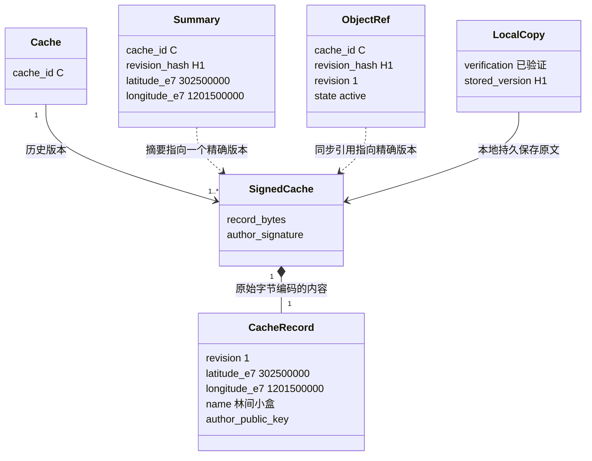
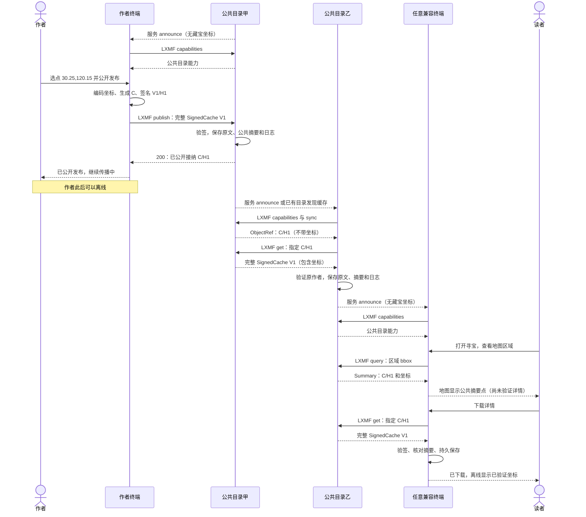
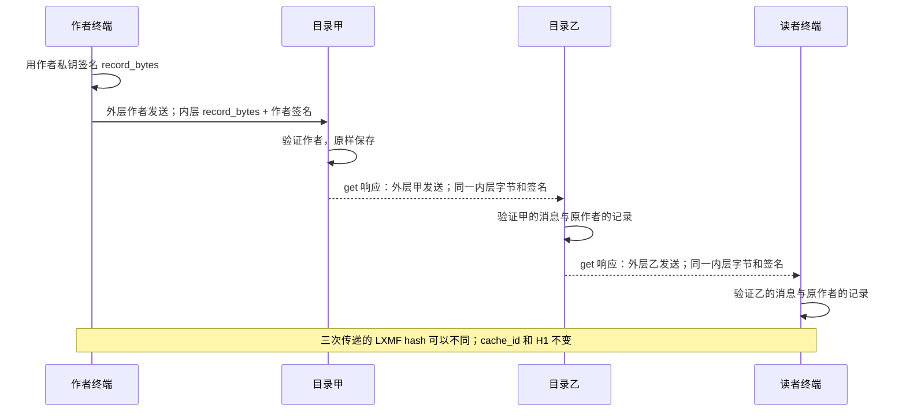
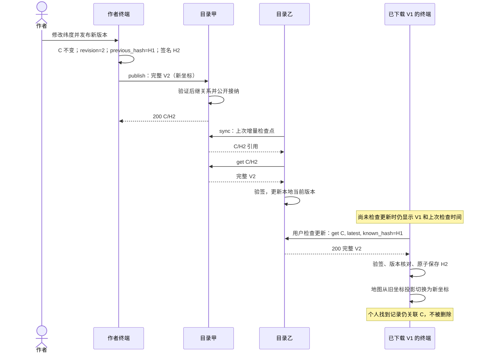
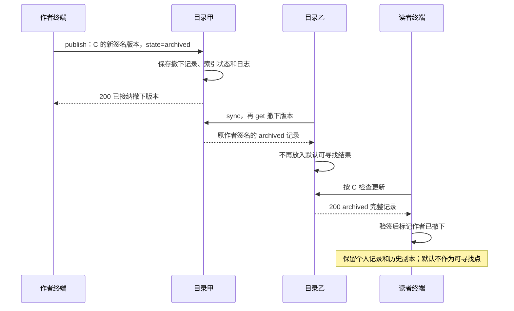
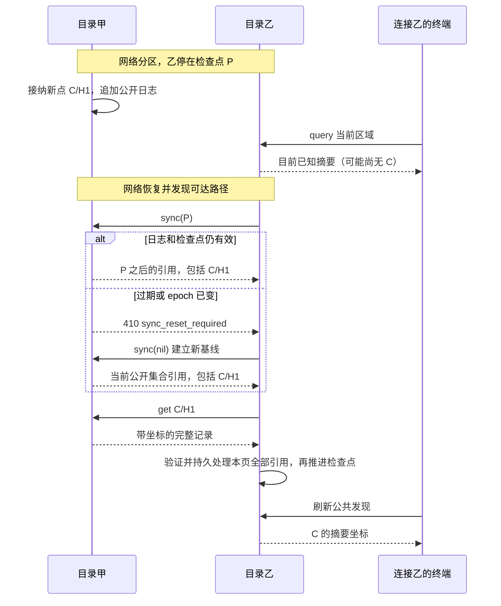
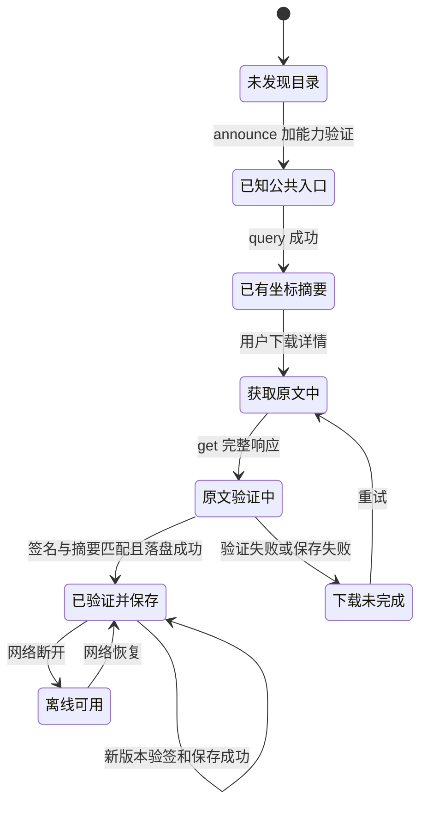
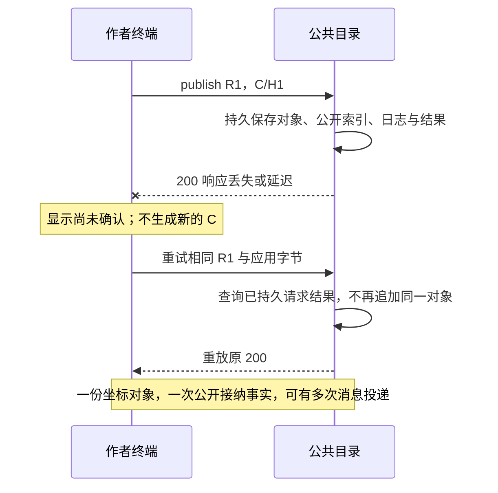

# UML 图解：一个公开坐标如何到达其他终端

状态：**待评审，仅补充设计解释，未授权开发**  
日期：2026-09-15；对应协议草案：`0.2.0-draft`，线协议版本仍为 `1`。  
关联：[协议规范](./01-协议规范.md) · [公共发现与传播](./04-公共发现与传播.md) · [交互设计](./02-交互设计.md)

## 1. 先沿着一个具体坐标看全程

作者创建“林间小盒”，位置是 **北纬 30.2500000°、东经 120.1500000°**。它在记录中表示为 `latitude_e7=302500000`、`longitude_e7=1201500000`。

本例将这个点的稳定 ID简称 **C**，第一个签名版本简称 **V1**，其版本 hash 简称 **H1**。这些是解释用符号，不是可发送的真实字节。

**作者把包含坐标的完整记录签名后公开发布；目录保存原文并生成可查询摘要；其他目录复制原文；读者终端先通过摘要看到坐标，再按需下载原作者签名的完整记录。**

下面所有图解释的是当前提出的“公共目录自动复制”方案，它仍待用户评估。补图不等于批准目录架构，也不增加新的线协议字段。

## 2. UML 对象关系：坐标究竟属于谁

这是概念类图，不是在要求开发这些类。`CacheRecord` 在传输中是 `record_bytes` 内的编码内容，并不作为额外一份对象重复发送。

| 数据 | 包含坐标吗 | 谁生成 | 谁能修改 |
| --- | --- | --- | --- |
| 作者草稿 | 是 | 作者终端 | 作者可编辑，尚未公开 |
| SignedCache 内的记录 | 是 | 作者签名 | 修改必须由作者生成新版本 |
| Summary 目录摘要 | 是 | 目录从记录提取 | 必须对应该版本；读者下载后核对 |
| ObjectRef 同步引用 | **否** | 目录同步日志 | 只能用于索取指定版本，不能当坐标记录 |
| 服务 announce | **否** | 公共目录 | 描述目录地址和日志进度，不描述藏宝点 |
| 本地已验证副本 | 是 | 终端保存下载原文 | 不能代作者改坐标；个人笔记另存 |

因此，“收到服务广播”“发现一个点”“下载一个点”是三个不同的事实。announce 只让终端知道去哪里查询，query 的摘要才让终端第一次看到坐标，get 才取得完整作者签名对象。

## 3. UML 时序总览：从选点到另一台设备的地图

为便于阅读，图中省略 Reticulum 中间路由跳数；除 announce 外，跨端点业务箭头都是标准 LXMF 消息。请求与响应可以延迟，不要求同步在线会话。

这条路径故意让读者只联系目录乙：他不认识作者，也没有作者地址；作者无需指定他为接收者。目录甲和乙是应用自动发现的公共基础设施。

实际客户端还会自动尝试第二个发布入口。总图省略那条可用性分支，只保留一条完整传播路径；目录复制并不依赖作者再次提交。

## 4. 每一跳到底传了什么

| 步骤 | 发出方 → 接收方 | 协议动作 | 坐标如何变化 | 接收后新增的事实 |
| --- | --- | --- | --- | --- |
| 1 | 作者 → 本机 | 本地编辑 | 十进制度量化为整数 | 本机草稿 |
| 2 | 作者终端 → 目录甲 | publish | 原始整数包含于签名记录，不变 | 目录公开接纳 V1 |
| 3 | 目录甲 → 目录乙 | sync 响应 | 无坐标，仅 C/H1 引用 | 乙知道有一个待取版本 |
| 4 | 目录甲 → 目录乙 | get 响应 | 原样传递 V1，整数不变 | 乙验签并拥有公共副本 |
| 5 | 目录乙 → 读者终端 | query 响应 | 从 V1 提取相同整数 | 读者看到未完成作者验证的摘要 |
| 6 | 目录乙 → 读者终端 | get 响应 | 原样传递 V1 | 读者拥有已验证完整对象 |
| 7 | 本地副本 → 地图 | 本地投影 | 整数除以 10^7，再投影屏幕位置 | 已下载点的地图显示 |

屏幕投影、距离计算与地图缩放不会回写作者记录，也不重新签名。目录转发只改变这次 LXMF 消息的外层发送方，**原始 record_bytes 和 author_signature 不变**。

## 5. UML 时序：原作者签名如何跨目录保留下来

本图只放大 get 的数据响应，相关请求见总图，不表示无请求推送。目录如果改了一个坐标字节，原作者签名验证就应失败，不能进入已验证本地副本。

## 6. UML 时序：修改坐标后，旧地图怎样更新

作者把纬度改成 30.2510000°，经度不变。新坐标整数是 302510000；稳定 ID仍为 C，但版本变为 V2/H2，前驱为 H1。

图中读者更新由“检查更新”触发，与当前 v1 交互一致；并未偷偷新增终端自动全文订阅。重新 query 新快照也可能看到 H2 摘要，但摘要不会直接覆盖已验证 V1，需要 get 并验证。

若新坐标移出原查询区域，按 C 检查仍能找到更新；只重复原 bbox 查询则可能看不到它，不能把目录缺项解释成撤下。依据：协议 §7、§10–11。

## 7. UML 时序：作者撤下，传播的是状态而非远程删除

暂时离线的读者可能仍持有旧 active 副本。目录自己移除副本得到的 404 不等于作者签名的 archived；它不能触发同样的作者状态变化。

## 8. UML 时序：网络断开后怎样补到遗漏的坐标

这解释“公开但还没传播到这里”的情况。是否能最终补到仍以至少一个目录保留对象、恢复路径可用和同步预算足够为前提；图没有画不存在的跨分区即时广播。

## 9. UML 状态图：终端知道坐标的程度

“已有坐标摘要”可以在公共发现地图画出一个候选点，但不能标成已验证原作者内容。“已验证并保存”才满足离线详情条件。维护状态与个人“已找到”独立于本图，不共用一个状态枚举。

## 10. UML 时序：确认丢失不会产生第二个藏宝点

若客户端自动换另一个公共入口，则请求 ID要换，但 C/H1 与作者签名不变。另一个目录接纳的是同一个公开对象，不是另一个宝藏。

## 11. 以图检查当前方案的产品取舍

| 从图中能直接看到的取舍 | 当前草案的答案 | 评审含义 |
| --- | --- | --- |
| 没有任何目录，仅两个普通终端相遇，能否首次公开发布？ | 当前目录方案不能完成公开接纳，只保留草稿 | 公共目录角色仍须用户评估，不能当成已确认需求 |
| 作者离线后谁提供坐标？ | 已接纳或复制内容的公共目录 | 至少一份保留副本和可达路径不可缺少 |
| 是否每个更新都推给全部手持机？ | 否；目录同步，终端 query 摘要并按需 get | 公开可访问与全文主动推送是不同体验 |
| 首次什么时候看到坐标？ | query 返回 Summary 时 | 此时尚未完成独立作者验证 |
| 谁能修改权威坐标？ | 作者签发新版本 | 目录复制不能代替作者编辑 |
| 一个目录成功是否等于全网已看到？ | 否 | 界面必须保留传播和最后同步状态 |

## 12. 图与条款的对应关系

| 图解 | 规范依据 |
| --- | --- |
| 对象关系、每跳内容、签名保留 | 协议 §4–7、§10–11 |
| 完整发布发现链路 | 公共发现 §3–7；交互 §3–6 |
| 坐标更新、撤下 | 协议 §7、§9、§11；交互 §7 |
| 分区恢复、检查点 | 公共发现 §6.4–6.5、§8 |
| 终端状态与确认丢失 | 协议 §12；交互 §4、§6、§10 |

本轮属于解释补充，不改变 0.2.0 的操作码、字段、公开性或部署候选。后续若图与正文不一致，应先修正文和图的共同基线，不能把示意箭头当成未定义的新操作。
