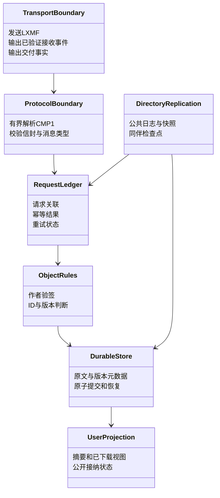
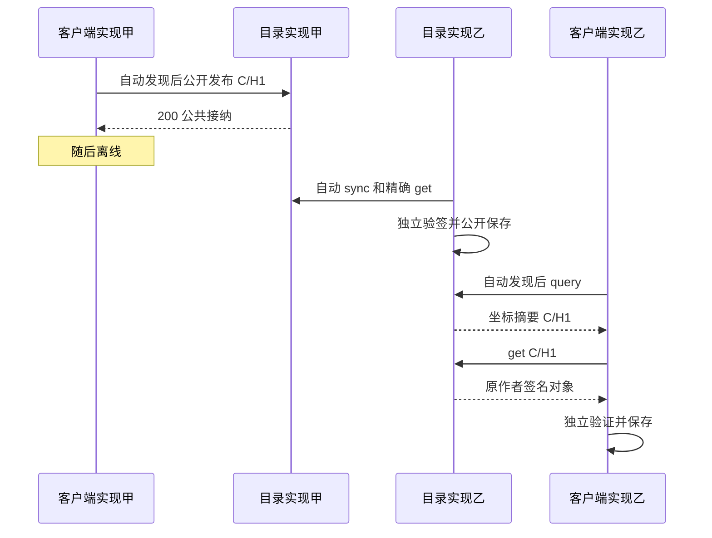

# 第三方开发者实现指南

状态：**设计配套草案，待评审；不是开发启动授权或已发布 SDK 文档**  
日期：2026-09-15；对应协议草案：`0.2.0-draft`；拟议线协议：`1`。  
适用对象：希望独立实现兼容客户端、公共目录或协议库的开发者。

## 1. 你要实现什么

这个协议让用户通过 Reticulum 上的 LXMF **公开发布藏宝点**，让其他兼容终端无需认识作者、无需好友关系即可发现和下载。它不是聊天附件格式，也不是向指定读者私发位置。

第三方实现不必依赖 Trail Mate 的界面、存储布局、C++ 类或仓库。你需要复现的是线协议与公开行为。现阶段没有发布可安装的 geocaching SDK、参考服务、公共测试目录、固定测试账号或可运行命令；不要把本文中的逻辑步骤当成已有函数名。

开发门槛仍然有效：本组设计须先经用户评估批准。本指南说明批准后如何实现与验证，不授权当前开始编程。

## 2. 文档导航与权威顺序

网页实现必须同时阅读[23：GitHub Pages浏览器寻宝板块](./23-GitHubPages浏览器寻宝板块.md)。浏览器内运行完整客户端协议，通过WSS仅转发网络包；用户按地图区域实时query/get并本地生成GPX。网页不是定时数据快照，也不是把LXMF操作外包给HTTP业务API。

| 需要完成的工作 | 阅读位置 |
| --- | --- |
| 先理解坐标流转 | [UML 与坐标流转](./05-UML与坐标流转.md) §2–4 |
| 类型、编码、LXMF 封装、签名公式 | [协议规范](./01-协议规范.md) §3–6 |
| 作者版本与冲突 | 协议规范 §7 |
| capabilities / publish / query / get | 协议规范 §8–11 |
| 幂等、错误码、大小上限 | 协议规范 §12–16 |
| 自动发现与地址绑定 | [公共发现与传播](./04-公共发现与传播.md) §3 |
| 公开接纳、复制与 sync | 公共发现与传播 §4、§6–8 |
| 客户端用户行为 | [交互设计](./02-交互设计.md) |
| 报文例子、未来测试要求 | [评审与验收](./03-评审与验收.md) §4–9 |

协议规范与公共发现文档共同定义线上契约。本指南不分配新字段或错误码，不复制一份可独立漂移的字段字典。若实现需求与规范矛盾，应提出规范修改，不在本指南中加入隐形例外。

## 3. 先选择实现角色

| 能力 | 完整客户端 | 公共目录 | 编码/验证库 |
| --- | --- | --- | --- |
| 接收目录 announce 并验证地址绑定 | 必须 | 必须，用于发现同伴 | 可提供解析辅助 |
| 发出公共目录 announce | 不发 | 必须 | 不负责运行 |
| 回应 capabilities | role=0，operations=[0] | role=1，operations=[0,1,2,3,4] | 不作为独立端点 |
| 发出 publish | 作者公开发布，自动选择入口 | 可接收公开转交；复制主要使用 sync/get | 编码支持 |
| 接收 publish | 不承担；按协议拒绝不支持操作 | 必须公开接纳或明确拒绝 | 解码/验证支持 |
| 发出 query/get | 必须 | get 用于复制；query 可用于诊断 | 编码支持 |
| 接收 query/get | 不承担 | 必须向兼容读者开放 | 解码/验证支持 |
| 发出并接收 sync | 客户端不必复制全库 | 必须 | 编码支持 |
| 对象验签、版本判断、保留原文 | 必须 | 必须 | 可实现纯规则 |
| 日志、快照和保留义务 | 请求与本地副本 | 另有公共日志、快照、证据和同步检查点 | 不承担磁盘策略 |

一个应用可以同时承担客户端与目录，但必须满足目录的全部义务。只实现消息解码的库不能宣称是完整公共客户端；只存储发布内容、不开放读取和复制的服务不能宣告 role=1。

浏览专用应用可以不提供作者编辑界面，但应明确说明它只实现浏览子集，不能声称完整实现本稿所有用户功能。兼容字段必须准确，不能自定义新的角色枚举表达产品裁剪。

## 4. 依赖与运行边界

### 4.1 接入现有栈需要的能力

你所用的 Reticulum/LXMF 实现必须支持：

- 持久身份和标准目的地派生、公共身份验证。
- 指定服务 aspect 的 announce 接收；目录还需发出发现 announce。
- 标准 LXMF delivery、发送方签名验证、原始自定义字段保留。
- MessagePack binary 与 string 的严格区分，不能丢弃未知应用字段。
- 足以承载协议上限的消息接收，以及有界的 resource/解压处理。
- 可区分排队、发送、交付与失败的事件；这些事件不是应用成功。
- 若宣称传播交付可用，必须验证请求和响应各自的传播路径、检索和重复处理。

优先接入完整的标准栈，不自行伪造看起来像 LXMF 的私有包。发现目的地与业务 delivery 地址不同，目录必须用同一 Identity 按标准分别派生，再校验绑定。

具体 SDK API、参数名和安装命令不在本稿冻结范围。实现准备时先固定版本，按该版本官方文档和源码建立适配；当前尚未提供可直接复制执行的接入示例。

### 4.2 实现准备需要记录的版本清单

| 项目 | 必须记录 |
| --- | --- |
| 本应用协议 | 批准的文档版本、线协议版本、记录模式 |
| Reticulum 与 LXMF | 精确 tag/commit，不只写 master 或 latest |
| 编码库 | 名称、版本、整数/二进制类型处理和规范编码验证方式 |
| 密码库 | Ed25519 与 SHA-256 提供者、版本及测试向量验证结果 |
| 运行平台 | 语言、整数精度、内存/磁盘预算、身份保管方案 |

这是以后互操作报告的材料，不要求使用某个语言或数据库。

## 5. 建议的职责分工

服务命名与实例寻址必须先读本文 §18。当前字符串是可审查的草案候选，尚未冻结；不能仅因本文描述接入步骤就把它们作为正式发布的公共名称。

这是职责图，不要求创建同名类。底层身份、路径与消息交付由栈负责；应用请求、作者记录和目录复制由应用负责。UI 不能解析数据包或绕过持久事务直接宣布成功。

## 6. 客户端的最小完整路径

### 6.1 启动与发现

1. 加载持久身份、本地对象和未完成请求；不能重启后随机换作者身份。
2. 接入标准 LXMF 接收路径，按 CUSTOM_TYPE 分流本协议消息。
3. 监听专用目录 announce；验证原生签名、aspect hash、同身份 delivery 地址和应用数据上限。
4. 对合法候选自动 capabilities；只有完整公共目录能力才进入目录池。
5. 可以重用此前缓存地址。冷启动没有候选时等待发现，不能假定有一个已知万能服务器。

### 6.2 公开发布

1. 在本地验证草稿，确定作者、nonce、创建时间，构造规范记录字节。
2. 按规范计算稳定 ID、版本 hash 和作者签名，保存签名原文。
3. 建立一个用户级“公开发布任务”，按公共发现 §4 自动选择入口，每个入口独立 request_id。
4. 先持久保存请求原字节和目标，再提交给 LXMF；重试原入口必须保持应用字节不变。
5. 只有有效 publish 200 才记录该入口公开接纳。至少一个入口成功即可表示最低公开接纳，再按策略继续冗余入口。
6. 没有入口成功时保持待确认/待发布；不能因为 LXMF Delivered 就宣告公开完成。

### 6.3 浏览和下载

1. 自动 query 用户区域，按来源分别管理快照游标。
2. 合并摘要时保留 ID、精确版本和提供者；同 ID 的不同摘要不能直接当成已证实冲突。
3. 选中下载时 get 精确 hash，自动尝试提供同一版本的可达目录。
4. 验证外层、内层作者、ID/hash、记录字段与摘要一致性。
5. 设备端按14/17生成、校验并耐久安装GPX主文件，之后才更新界面；只写完私有账本不算保存完成。外部编辑文件不得被后台更新覆盖。第三方公共目录的内部数据库可自选，但设备用户文件要求不可由此省略。
6. 检查更新使用 latest 与 known_hash；旧目录版本不能回退已知新版本。

普通客户端不需要下载完整公共库。摘要可画在发现地图上，但应保持“未取得并验证详情”的区别。

设备文件兼容契约见[17](./17-GPX字段与外部编辑契约.md)，静态GPX样例与实际schema验证见[18](./18-GPX样例与兼容验证记录.md)。普通GPX无签名扩展不自动获得公共作者身份，导入不自动发布。

## 7. 公共目录的最小完整路径

### 7.1 服务启动

加载同一个持久 Identity，注册发现目的地和 LXMF delivery，恢复 catalog_epoch、序号、对象、日志与请求结果。只有恢复到能够履行服务承诺后才宣告公共能力。正常重启不任意更换 epoch；日志连续性丢失按规范重建。

### 7.2 接纳发布

验证外层与对象 → 检查反滥用和容量 → 判断版本 → 原子写入原文、版本事实、公共索引、同步日志及请求结果 → 发送结果。

公共接纳不是私人收件箱。返回 200 后任何兼容读者都应能按协议读取，满足过滤条件时可查询；不能增加好友/邀请门槛。有效冲突记录的 409 仍可能要求持久保存证明与隔离状态，见协议 §9。

### 7.3 提供 query/get

query 从固定快照返回摘要，按完整编码响应大小分页，不能先取固定条数再截断字节。get 精确模式返回指定版本原文；latest 只表示本目录已知当前。缺少某个副本不等于作者撤下。

query 游标、sync 游标和用户请求 ID不是同一个东西。游标必须绑定请求者及查询约束，不能仅用全局数组下标允许读者串读别人的快照。

### 7.4 自动复制

发现同伴 → capabilities → sync 基线/增量 → 按引用 get 缺失原文 → 作者验证与版本处理 → 公开持久接纳 → 处理完本页后提交下一检查点。

同 hash 不重新追加日志。不要对每个已见记录循环 publish。同步失败不能先推进游标；日志过期或 epoch 改变按 410 重建基线，原本地对象保留。archived 和冲突签名证明必须参与复制。

同步调度遵循公平轮换、字节预算和退避，不能让公共复制阻塞所有聊天或把手持设备变成无界缓存。

## 8. 接收处理契约

以下是语言无关的处理顺序，不是可执行伪 SDK：

| 阶段 | 检查 | 不满足时 |
| --- | --- | --- |
| 传输边界 | LXMF 外层验证与接收资源预算 | 不执行应用操作 |
| 协议分流 | CUSTOM_TYPE 精确匹配，CUSTOM_DATA 是 bin | 非本协议交回宿主原有处理，不假解析 |
| 有界解析 | 长度、CMP1 最短编码、固定数组、类型、深度 | 按安全可关联程度回复错误或丢弃 |
| 请求或响应分类 | kind、版本、操作与结构 | 不对错误响应再回复 |
| 请求关联 | 请求账本作用域与原字节指纹 | 重放结果或拒绝 ID复用 |
| 响应关联 | 预期来源、接收方、请求 ID、版本、预算 | 不更新任务、不自动导入 |
| 对象处理 | 内层公钥、作者签名、派生 ID/hash、版本 | 拒绝无效对象或保存合法冲突证据 |
| 持久提交 | 结果与对象事实可恢复一致 | 不提前发成功或显示已下载 |
| 界面投影 | 只读已提交事实 | 不从标题、提示文字猜测结果 |

为已接受请求保留结果需要容量预留。没有能力持久记录拒绝时不能一边执行操作一边丢弃结果；细节以协议 §12 为准。

## 9. 持久化设计需要保存的事实

本文不指定表名或文件路径。采用事务数据库、写前日志或可恢复文件协议均可，只要满足以下不变量。

| 事实集合 | 关键内容 | 恢复要求 |
| --- | --- | --- |
| 身份 | 稳定公共/私有身份 | 不随重启改变作者和地址；不记录私钥到日志 |
| 签名对象 | 精确 record_bytes、签名、派生 hash | 读取后仍可原样验签与转发 |
| 版本事实 | 当前版本、历史元数据、冲突证明 | 旧消息不回退，冲突不因重启解除 |
| 出站请求 | 目标、ID、完整应用字节、预算、结果 | 同一逻辑重试不改内容 |
| 入站请求结果 | 作用域、指纹、原终态响应、保留期限 | 窗口内重复执行变为结果重放 |
| 目录公开索引 | 可从有效对象重建的摘要 | 不能成为修改作者原文的权威 |
| 目录日志 | epoch、序号、对象引用及保留期限 | 基线到增量不漏对象，引用正文可取 |
| 快照/游标 | 绑定约束、位置、截止点、期限 | 重启恢复或明确失效，不能另解释旧游标 |
| 同伴检查点 | 已完成的远端页和位置 | 只在本页处理完成后推进 |
| 个人日志 | cache_id、参考版本、个人笔记 | 正文更新或目录失效不删除个人记录 |

最低事务边界分别是“公开接纳及结果”“本地下载及结果”“同步本页处理与检查点”。不要依赖几个文件恰好连续写成功来获得一致性。

## 10. 跨语言互操作易错项

- **binary 不等于文本。** 公钥、ID、签名、record_bytes 使用原始字节；hex 只是日志显示，不是线上字段值。
- **MessagePack 能解码不代表满足 CMP1。** 一些库接受冗余整数宽度；必须额外验证规范编码。
- **nil 保留数组位置。** 不能删除字段导致后续位置移动。
- **枚举是整数。** 例如 0/1 标记不能编码为布尔值。
- **大整数不能损失精度。** 目录 sequence 是 uint64；使用双精度 Number 的语言必须采用可靠的 64 位表示或等价方案。
- **UTF-8 上限按字节。** 不按 Unicode 字符数；不得在验签前替换非法字节或归一化文本。
- **坐标量化遵守指定舍入。** 不依赖各语言默认 round 行为；正负半单位按规范处理。
- **签名使用精确原字节。** 普通 Ed25519、正确域分离常量和真实 NUL；不是将文本反斜杠零当成两个字符，也不是自行 SHA-256 后代替原消息签名。
- **公共身份是完整布局。** 作者 ID派生使用规定公钥输入，不能只换成签名公钥或昵称 hash。
- **不要用时间戳解决版本冲突。** 作者时间可未知或回退，版本判定按规范。
- **消息 hash、标点 ID、版本 hash、请求 ID、游标各司其职。** 不能为了少一个字段把它们合并。

编码结构与密码公式直接引用协议规范；不要依据本节简述另造一种编码。

## 11. 语言与设备无关的资源要求

接收 8192 字节应用数据的能力不意味着必须分配 8192 字节任务栈数组。可以使用有界池、成员缓冲、流式解析或临时文件，所有权和生命周期需明确。

在 LXMF resource 接收和解压阶段也要设限，不能等解压成巨大对象后才检查 CUSTOM_DATA。控制磁盘配额、待处理消息、快照数、签名验证成本与同步并发。保持正常业务调度资源。

不能承受 v1 上限时不要宣告完整兼容后静默截断。应报告平台限制，并回到规范评审决定是否需要未来的其他 profile；本稿没有授权自行新增同名小包版本。

## 12. 实现阶段建议与交付物

以下阶段只在设计批准后启动。每阶段完成的是互操作行为，不要求某种代码目录结构。

| 阶段 | 交付内容 | 退出条件 |
| --- | --- | --- |
| A：冻结参考 | 协议版本、栈版本、角色与预算清单 | 能准确说明实现目标和未覆盖项 |
| B：对象与编码 | CMP1、记录验证、ID/hash/签名规则 | 跨实现字节向量一致，非法输入被拒绝 |
| C：LXMF 接入 | 发现绑定、能力、消息分流与请求账本 | 不靠聊天文本执行，重试不重复副作用 |
| D：单入口闭环 | 公开发布、query、精确 get、离线保存 | 无作者好友关系的读者可取得有效对象 |
| E：跨目录传播 | 自动发现、sync 基线和增量、恢复 | 作者离线后第二目录仍能提供内容 |
| F：故障与资源 | 掉电、重复、分区、限额、冲突 | 对应 N/F/P 验收场景通过 |
| G：发布材料 | 精确版本、向量、互操作报告、平台限制 | 不把尚未实测能力标成支持 |

单入口闭环只是中间阶段，不是公共网络完整交付。实现客户端的团队仍须与实现目录的团队完成跨端点验证。

## 13. 第三方互操作测试布置

测试应再交换实现角色/方向，避免同一编码缺陷在同一个实现的发送和接收端互相掩盖。至少涵盖：

1. 两种独立语言/库实现对同一记录得到同样编码、ID、hash 和签名验证结果。
2. 作者不认识读者，读者没有导入作者地址，也能公共发现。
3. direct 与宣称支持的 propagated 路径分别测试；不能以 direct 成功代替传播验证。
4. 响应丢失、重复消息和进程重启不创建第二个点。
5. 坐标更新、archived 和冲突证明跨目录传播。
6. 基线期间新增、日志过期和分区恢复不静默漏掉对象。
7. 非规范编码、超限、错误来源响应不会进入可信存储。

完整验收编号以[评审与验收](./03-评审与验收.md)的 N/F/P 矩阵为准。本节的拓扑是未来测试设计，目前没有已运行端点。

## 14. 测试向量与诊断报告格式

未来 golden vectors 至少包括：公开测试公钥、固定 nonce、完整逻辑记录、规范 record_bytes 十六进制、cache_id、revision_hash、作者签名、完整 CUSTOM_DATA，以及可复核的外层 LXMF 示例。测试密钥必须专用且公开标记，不能使用真实用户私钥。

每份向量还应给出预期结果及拒绝原因；例如改变一个坐标字节、冗余整数宽度、错误数组长度和额外尾随字节。当前评审文档只有最小信封字节示例和符号报文，不是完整密码学向量包。

互操作故障报告建议包含：

- 各端实现名称、精确版本、角色、支持的操作。
- 协议版本、交付方式、请求操作和状态码。
- 脱敏后的请求关联、cache_id/hash、目录 epoch/sequence。
- 期望状态、实际状态、是否重启/重试/分区，以及最小复现步骤。
- 对应规范条款、可公开的测试向量或错误字节位置。

不得记录真实私钥。公共坐标仍可能涉及未正式发布的位置；默认诊断记录 hash/长度，正文和位置只在明确适合公开的测试样本中附带。

## 15. 兼容性声明与升级

发布实现时写明“针对已批准的哪一版协议、实现哪个角色、验证了哪些交付方式和平台”。尚处草案时只能称实验实现或设计目标，不能称 LXMF 官方标准兼容。

协议标识相同不允许字段含义随实现变化。记录模式、线协议版本和发现 schema 分开处理；额外数组项、未知枚举、不同签名字节不能静默接受。扩展先提出新规范，不能通过 CUSTOM_META 偷渡必须理解的新语义。

不支持的功能应清晰报告，不回退到 HTTP 下载或把 JSON 聊天消息称作同一协议。普通 LXMF 客户端能显示文本，不等于已支持藏宝点交互。

## 16. 当前尚未提供的开发材料

| 材料 | 当前状态 | 对开发者的影响 |
| --- | --- | --- |
| 用户批准的正式协议版本 | 未批准 | 不能视为稳定发行契约 |
| 固定上游版本清单 | 13已记录精确候选提交并核对部分文件，未批准冻结 | 还需完成字段、身份、消息实现的逐项参考核对 |
| 可安装 SDK / 参考客户端 / 参考目录 | 未开发 | 本文没有真实库名、命令或现成服务地址 |
| 密码学静态向量 | 已有SIGNED-VECTOR有效记录与GPX，尚非完整向量集 | 可复算121字节记录/ID/hash/签名；全消息信封和负例仍需补 |
| 第三方公开测试网络与种子列表 | 未部署 | 不能假设现成目录可连接 |
| 设备资源与故障恢复测量 | 未执行 | 不能据字段上限宣称 ESP 已满足预算 |
| 多实现互操作报告 | 未执行 | 验收矩阵是计划，不是通过证明 |

这些材料应在设计批准后的相应实施阶段产出。本文已经描述实现职责、顺序和验收方式，但不会为了补齐开发文档而提前编写 SDK、建立目录或运行协议原型。

## 17. 第三方接手检查表

- [ ] 明确实现角色，没有把公开发布做成私人消息。
- [ ] 阅读并遵守协议规范和公共发现两份共同契约。
- [ ] 正确保留 binary、整数精度、规范记录原字节与作者签名。
- [ ] 自动发现、入口选择和公共读访问无需好友关系。
- [ ] 分离 LXMF 交付、应用结果、对象版本和 UI 状态。
- [ ] 目录角色实现自动复制、保留和基线到增量恢复。
- [ ] 重启和重复请求保持对象、日志、结果的一致性。
- [ ] 按未来 N/F/P 矩阵与另一实现互验并报告限制。
- [ ] 如需改变线上含义，先提交规范评审，而不是私下兼容分支。

本轮是文档受众与实现说明的补充，未改变协议 0.2.0 的线格式或公共架构候选，也不构成开发授权。

## 18. 服务命名、实例寻址与名称冻结

### 18.1 四种名称不能混用

Reticulum 的应用名与 aspects 用于派生目的地并识别服务类别，不是 DNS 域名解析。相同服务类别可以由多个独立身份提供，每个实例有自己的目的地地址。不要把点分隔的名称当成网站域名，也不要假设一个服务名解析到全网唯一服务器。

| 项目 | 0.2.0 草案候选 | 负责什么 | 不负责什么 |
| --- | --- | --- | --- |
| 公共目录发现服务 | app_name=`trailmate`；aspects=`geocache`,`directory` | 所有兼容实现约定的发现类别 | 唯一服务器、DNS 名称或运营者身份 |
| 发现目的地 hash | 按上述类别和每个目录的身份标准派生 | 某个目录实例的发现地址 | 藏宝点 ID或 LXMF 收件地址 |
| 业务交付目的地 | 标准 `lxmf.delivery`，同一目录身份派生 | publish/query/get/sync 等 LXMF 消息的收件地址 | 不改名成私有 geocaching delivery 协议 |
| LXMF CUSTOM_TYPE | `trailmate.geocache` | 已接收消息中的应用协议分流 | Reticulum 路由或实例发现 |
| 目录显示名 | 运营者自定，遵守发现数据长度约束 | 用户和诊断辨认实例 | 地址、唯一标识或可信身份 |

例如甲、乙都使用相同发现类别，但身份不同，因此发现 hash 和 delivery hash 各自不同。客户端无需知道作者身份或运营者名称，就可以识别公共目录类别并核查实例绑定。

### 18.2 实现接入顺序

1. 从最终批准的协议配置取得 app_name、aspects 与 CUSTOM_TYPE，不从界面翻译文本拼接。
2. 目录使用自己的持久 Identity，分别派生发现目的地与标准 LXMF delivery 目的地。
3. 目录在专用发现目的地发 announce，携带其 delivery hash；具体字节格式以公共发现文档 §3 为准。
4. 客户端验证原生 announce、专用类别目的地派生和同身份 delivery 绑定，再发 capabilities。
5. 后续请求全部投递到该实例的 LXMF delivery 地址；消息内 CUSTOM_TYPE 交给本协议处理。
6. 来源显示名只更新展示信息。名称变更不能改变作者对象或冒充另一个目录身份。

发现目的地不提供第二套业务请求协议。两个地址都必须使用 Reticulum 标准派生方式，不能把字符串本身当收件地址，也不能自己发明 hash 拼接算法。

### 18.3 版本与冷启动

当前候选服务类别和 CUSTOM_TYPE 不包含版本号。发现 schema、应用 wire_version、记录 schema 分别在其载荷中表示；capabilities 用于协商能力。未经重新评审不得在服务名后自行加 v1、按固件版本改名或同时接受未定义别名。

冷启动不依赖域名：接收合法公共目录 announce，或使用持久缓存/部署提供的可替换种子地址。没有目录可达时保持等待，不能假装“服务名已解析成功”。种子是具体实例入口，不是协议权威或读者许可。

### 18.4 尚未冻结的决定

当前调查与具体推荐已补入[命名候选与上游参考基线](./13-命名候选与上游参考基线.md)：推荐保持现有技术前缀等待用户整体裁决，记录有限搜索范围与官方HEAD提交。该推荐不等于名称已注册或协议已经批准。

| 决定 | 当前状态 | 冻结前必须完成 |
| --- | --- | --- |
| 公共命名空间用 Trail Mate 产品名还是中立名称 | 待用户裁决 | 确认对外协议定位；不能擅自选择新名字 |
| app_name/aspects 的正式字面值 | 当前只有草案候选 | 检查相关公开实现的潜在命名碰撞，并记录批准值 |
| CUSTOM_TYPE 正式字面值 | 当前只有草案候选 | 与服务发现类别一起审查，避免不同文档各自命名 |
| 协议/目录的用户可见名称 | 待界面命名确认 | 与机器标识分开，可本地化 |
| 旧候选名称是否需要兼容 | 当前没有获准发行的实现 | 根据实际部署事实决定；不预先造双名称机制 |

目前完成一轮有限生态检索，范围和局限见13 §3；未发现冲突证据不等于全网唯一或获上游认可。第三方正式发行前必须取得批准名称清单，否则各端独立猜测会导致无法互相发现，即使消息体编码完全一致。

### 18.5 名称变更的影响清单

若未来批准中立名称，应同步修改协议规范、发现文档、开发指南、UML 标注、报文示例和测试向量。app_name/aspects 改变会改变发现目的地 hash，CUSTOM_TYPE 改变会改变消息分流；两者不等价。

作者对象 ID和签名域目前也含 `trailmate.geocache/...` 常量，但它们是独立的密码学契约。不得因为换服务名字而搜索替换这些常量；是否改动必须单独裁决，修改会改变 ID/hash 或签名输入并要求重建向量。标准 `lxmf.delivery` 不随产品名称改变。

本节补齐此前开发指南的命名决策缺口，没有冻结或修改现有候选值。后续开发前的必备输入应包括：正式名称清单、版本策略、实例地址绑定和冷启动策略。
