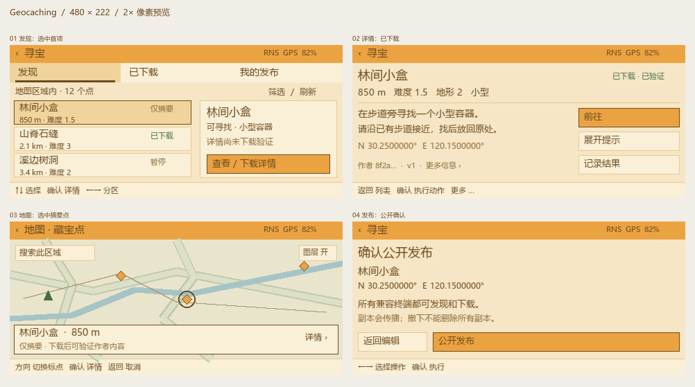
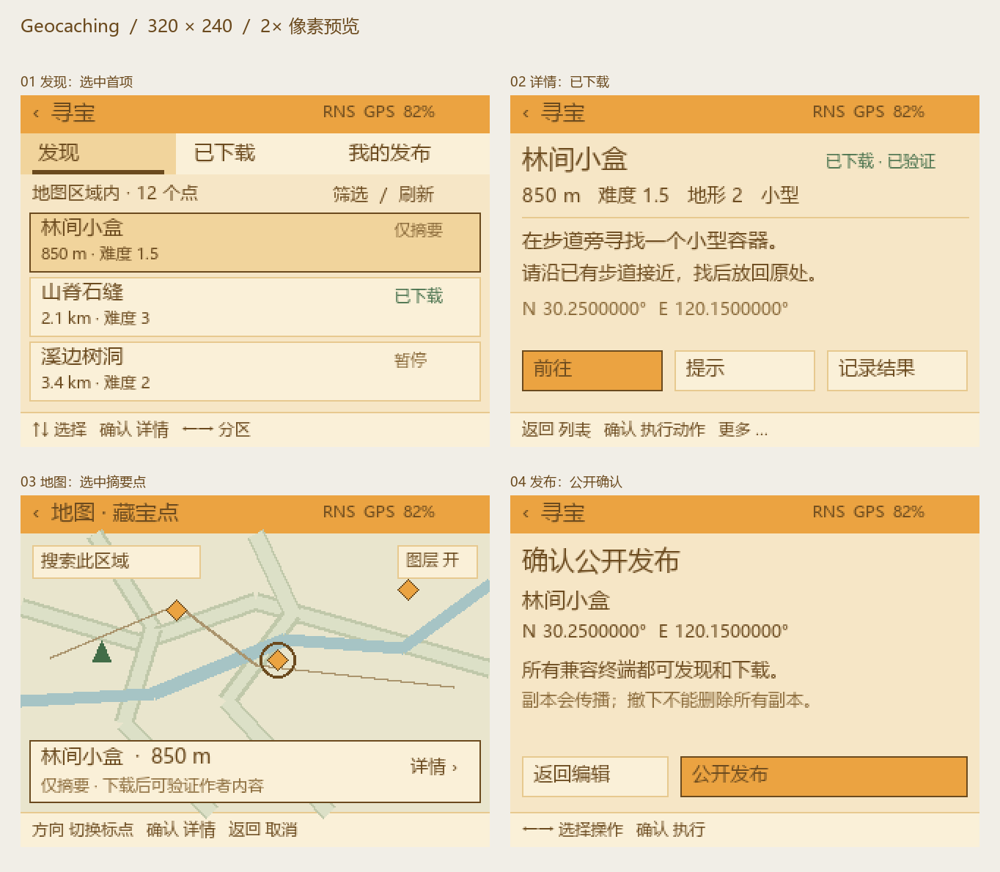

# Geocaching 设备界面与像素布局

状态：待评审的静态界面稿，未开发固件页面。日期：2026-09-15。对应协议草案 0.2.0，不修改协议。

本稿按用户指定的横屏 **480×222、320×240** 分别绘制，采用项目 Firmware Visual Style 中的 WarmBG、PanelBG、Amber、Text、TextDim 和 Line。假定以方向键、确认、返回为基础输入；具体设备是否触屏仍须按目标 UX Profile 适配。

## 1. 渲染稿

下列拼板按最近邻放大两倍，便于检查。assets 内另有原始 1:1 PNG；像素稿使用微软雅黑模拟中文呈现，实际 LVGL 字体度量尚未验证。地图为绘制的示意底图，不是真实地图瓦片或导航结果。状态栏数据与点数量是样例数据。

### 480×222

### 320×240

四张图是独立状态，不是连续截图：发现列表选择了“仅摘要”点；详情页展示该点完成下载后的状态；地图展示尚未下载时的选点；发布图展示作者最终确认。

## 2. 固定区域预算

坐标从左上角开始，表中 y 区间包含起点、不含终点。

| 区域 | 480×222 | 320×240 |
| --- | --- | --- |
| 顶部共享栏 | y=0..26，高 26 | y=0..26，高 26 |
| 底部按键说明 | y=198..222，高 24 | y=216..240，高 24 |
| 发现页分区 | y=26..54，高 28 | y=26..54，高 28 |
| 发现页区域/操作说明 | y=54..80，高 26 | y=54..80，高 26 |
| 列表可用区 | y=80..194，三行，每行步进 38 | y=80..212，三行，每行步进 44 |
| 发现页列结构 | 左区宽 268，右摘要 x=274、宽 198 | 单列，不挤入右侧预览 |
| 详情主要动作 | x=326、宽146，三颗纵向按钮 | y=174、三颗宽96的横向按钮 |
| 地图画布 | y=26..198 | y=26..216 |
| 地图选点卡 | x=6、y=149、468×43 | x=6、y=167、308×43 |

标题约 18 px，正文 13–14 px，辅助说明 11–12 px。正文需要完整滚动或分页，不能为了塞进一屏把全部文字缩至 9 px。11 px 辅助文字的真实设备可读性还需上屏评估。

## 3. 页面职责

- 寻宝页：发现、已下载、我的发布，管理内容。
- 地图页：藏宝点图层、区域搜索、选中点位置，负责寻找。
- 详情：列表与地图共用；根据已下载状态改变操作。
- 发布确认：编辑器后的最终公开确认，无接收者列表。

此次渲染优先覆盖四个核心状态；已下载/我的发布沿用列表骨架，但条目元信息分别是个人记录、发布接纳状态。编辑器、筛选弹层、个人日志输入、传输异常弹层尚未逐屏绘制，不表示全部 UI 已完成。

## 4. 方向键与焦点规则

### 发现列表

- 左右切换发现/已下载/我的发布；上下选择条目，屏幕不足时滚动。
- 确认打开同一个详情页；宽屏右侧摘要随选中行变化，不产生第二套选择状态。
- 筛选与刷新进入页面操作菜单；用菜单键或页面操作入口打开。不依赖长按作为唯一入口，具体按键映射随设备确定。
- 宽屏“查看/下载详情”是选中项动作的视觉提示；确认先打开详情，不隐式发下载。触控点击该按钮也进入详情。
- 切换分区返回后保留各自的滚动位置、筛选条件和选中项。

### 详情

- 进入时主操作获得焦点；宽屏上下切换三颗纵向按钮，窄屏左右切换底部按钮。
- 正文超过空间时通过内容阅读入口进入滚动区，返回回到操作区；不能让同一按键既滚正文又切按钮。
- 仅摘要状态：主操作“下载详情”，不能显示为已经可验证导航的点。
- 下载并保存完成后：主操作“前往”，另外提供提示、记录结果。
- 提示打开独立阅读层，返回保持原选中点；个人记录独立保存，不改作者状态。
- 更多信息提供作者指纹、版本、最后检查时间、来源和检查更新。

### 地图

- 普通模式方向键移动地图；通过选点动作进入点选择模式。
- 点选择模式方向键切换附近候选，确认打开详情，返回取消选点并恢复平移。底栏必须随模式显示“移动地图”或“切换标点”，不能同时混用。
- 图中绘制的是选中点卡片示意；实际选点模式底栏应使用上述“切换标点”文案。
- 搜索此区域是明确操作；拖图、缩放不自动不停发 query。
- 进入导航后复用现有地图目标能力，返回详情时保持点和地图视野。

### 发布确认

- 左右切换返回编辑/公开发布；确认才提交。图中的强调色表示主操作，实际首次焦点建议停在返回编辑，防止连按确认误发布。
- 不选择好友或公共目录，入口自动发现。
- 提交后进入发布状态页：等待公共入口、正在发布、至少一个公共接纳、继续传播，按实际结果显示。

## 5. 触控与小屏限制

本稿 28 px 按钮主要用于实体键导航和视觉布局，不声称符合舒适手指触控。若目标设备以触控为主，使用约 40–44 px 的点击区域，320×240 详情改成一颗主按钮加“更多”操作页，不能直接把三个小按钮原样上线。

不预设两种屏幕对应哪款硬件；屏幕尺寸不等于输入能力。发布文本编辑在有键盘设备完成，无键盘设备需要既有输入方案，不能靠本次图稿假定已经可用。

## 6. 图稿验证与实施边界

原始 PNG 严格为 480×222 或 320×240，拼板是展示用 2 倍像素放大。已人工查看两种拼板，修正了字体不支持的状态符号。未在 LVGL、实际设备、真实字体包或真实地图数据上测试。

本轮只生成静态 PNG 和文档。绘图脚本仅离线生成设计资产，不是可执行 UI 原型，不注册固件页面、协议处理器或模拟网络服务。后续应先评估信息密度、可读性和按键模式，再决定真实实现。
