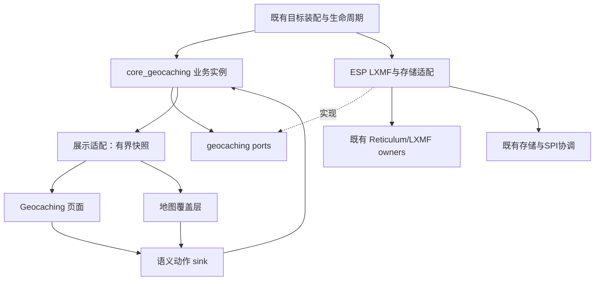

# 设备端架构核查与目录规划

状态：**源码核查后的设计建议，待评审，未开发**。日期：2026-09-15。

本稿补充设备实现归属，不改变协议 0.2.0。读取了现有目录、架构约束和关键头文件/部分实现；没有运行固件验证或完成全调用图审计。当前会话没有 GitNexus MCP，后续修改符号前仍必须补齐仓库要求的 impact，不能把本文当作影响分析结果。

## 1. 核查结论

当前工程已分为 modules、platform、apps，且 UI 进一步分成 presentation、map runtime、LVGL UX packs 和共享 LVGL 页面。旧的 ARCHITECTURE.md 部分内容描述迁移方向，不能按其中早期 src 布局直接安排新代码。

建议新增一个跨平台 `core_geocaching` 业务模块，接入现有 UI presentation、地图覆盖层及目标装配；ESP 的协议连接和磁盘 IO 留在平台侧。手持设备默认只做公共客户端，不同时托管公共目录数据库与 sync 服务。

## 2. 已读证据与实际限制

下列链接均指向现有文件；后文标为“拟新增”的名称才是规划。

| 已有文件 | 观察事实 | 对本功能的影响 |
| --- | --- | --- |
| [Reticulum 架构](../../../reticulum_client_architecture.md) | 客户端定位；身份、路径、Link、消息与传播各有 owner | 不在新功能中重建协议栈；目录服务另行批准 |
| [LXMF wire](../../../../modules/core_chat/include/chat/infra/lxmf/lxmf_wire.h) | DecodedField 保存 key 与 encoded_value；DecodedTextPayload 保存 fields | 有字段编码基础，但不等于已经有通用应用投递接口 |
| [IMeshAdapter](../../../../modules/core_chat/include/chat/ports/i_mesh_adapter.h) | sendText / sendAppData 既有接口；存在 NodeId、portnum 语义 | 不把新协议塞进 32 位 NodeId/portnum 假装完整目的地投递 |
| [LxmfAdapter 实现](../../../../platform/esp/arduino_common/src/chat/infra/lxmf/lxmf_adapter.cpp) | sendAppData 使用 encodeAppDataPayload、portnum、NodeId；收包有 telemetry 和 fields_only 路径 | 新 CUSTOM_TYPE/CUSTOM_DATA 路径需要接入点设计，不能简单调用原 sendAppData |
| [MapOverlaySnapshot](../../../../modules/ui_presentation/include/ui_presentation/map/map_overlay_snapshot.h) | 固定 32 项，stable_id 为 uint32；没有 Geocache kind | 需扩展覆盖层语义和点选择身份，不可截断 32 字节 cache_id |
| [地图覆盖源](../../../../modules/ui_map_runtime/include/ui_map_runtime/map_overlay_snapshot_source.h) | 构造参数是 GPS 和 Team 来源 | 不是现成任意 provider 插槽；需显式规划扩展 |
| [地图动作接口](../../../../modules/ui_presentation/include/ui_presentation/map/map_action_sink.h) | 只有居中、视口、图层、工具和测距清理 | 没有已验证的通用 setNavigationTarget 接口，需进一步追踪导航路径 |
| [地图工作区](../../../../modules/ui_presentation/include/ui_presentation/map/map_workspace_snapshot.h) | MapLayerKind 表达 Osm/Terrain/Satellite/Contour | 藏宝点是覆盖层，不应直接混成一种底图源 |
| [地图 LVGL 组件](../../../../modules/ui_shared/include/ui/widgets/map/map_viewport.h) | 既有 viewport Runtime 与渲染接口 | 复用现有地图组件，不另写地图瓦片系统 |
| [PageManifest](../../../../modules/ui_presentation/include/ui_presentation/page/page_manifest.h) | PageId 尚无 Geocaching | 新页面必须进入正式页面清单 |
| [ScreenRegistry](../../../../modules/ui_lvgl_ux_packs/include/ui_lvgl_ux_packs/ux/screen_registry.h) | ScreenId 尚无 Geocaching，容量16 | 新增需核查完整 registry/binding 映射，不能只加菜单图片 |
| [Deck UX Pack](../../../../modules/ui_lvgl_ux_packs/src/packs/deck_touch_ux_pack.cpp) | 从 PageManifest 映射到 ScreenId 和 features | 目标 manifest、枚举映射、能力和菜单需同步 |
| [TargetProfile](../../../../modules/product_composition/include/product_composition/target_profile.h) | 分离 platform、renderer、UX/layout/manifest 与输入能力 | 480×222 和320×240 不等于具体硬件能力 |
| [PresentationBundle](../../../../modules/product_composition/include/product_composition/presentation_bundle.h) | source/sink/model 生命周期归 target composition root | 页面不拥有服务生命周期 |
| [AppServicesBundle](../../../../modules/product_composition/include/product_composition/app_services_bundle.h) | 当前仅 chat/contacts，注释禁止变成新 AppContext | 不为方便无限扩展全局服务容器 |
| [ESP storage runtime](../../../../platform/esp/arduino_common/include/platform/esp/arduino_common/storage/storage_runtime.h) | hydration 期间有独占与维护 owner 状态 | 新存储必须参与生命周期协调，不能页面直接 SD 读写 |
| [Route storage](../../../../modules/core_sys/include/platform/ui/route_storage.h) | 有路线和 HTTP 图片下载语义 | 不能拿它作为 LXMF 藏宝点下载器 |
| [ESP app shell 构建](../../../../apps/esp32_lvgl/CMakeLists.txt) | 应用壳装配与 UX CMake 集成 | 新模块需显式加入实际构建路径，不能只建立目录 |

仓库还有 `modules/ui_shared/src/ui/assets/geocaching.c` 图标资源，但这不能证明已经有页面、业务或协议实现。

## 3. 源码目录规划

以下是拟议最终归属，不是本次创建的代码文件。头文件与 src 镜像遵循现有模块风格；不为了目录完整而提前创建空壳。

```text
modules/
  core_geocaching/                         # 拟新增：跨平台业务和应用协议
    include/geocaching/
      domain/                             # CacheId、签名版本、版本规则、个人记录
      protocol/                           # CMP1、应用信封、对象编解码
      ports/                              # 传输、签名、存储、时钟/随机源契约
      usecase/                            # 公开发布、发现、下载、个人记录
    src/                                  # 与上述职责对应
    tests/                                # 编码、版本、事务契约、请求恢复
    library.json

  ui_presentation/
    include/ui_presentation/geocaching/    # 拟新增 snapshot / source / action_sink / model
    src/geocaching/                       # 本地筛选、选择与视图状态
    include/ui_presentation/map/           # 修改覆盖层身份与可选业务动作契约
    src/page/                             # 修改 PageManifest

  ui_map_runtime/                          # 修改覆盖源组合、选择和有界投影
  ui_shared/
    include/ui/screens/geocaching/         # 拟新增 LVGL 页面声明
    src/ui/screens/geocaching/
      geocaching_page_shell.cpp           # 页面创建、销毁、返回
      geocaching_page_runtime.cpp         # source/sink 绑定、刷新，不持有协议状态
      geocaching_page_layout.cpp          # 480×222 / 320×240 布局数据
      geocaching_page_input.cpp           # 焦点与按键意图
      geocaching_page_components.cpp      # 列表、详情、编辑/状态组件
    include/ui/presentation_sources/       # 拟新增业务到 UI/地图的适配声明
    src/ui/presentation_sources/           # 对应适配器

  ui_lvgl_ux_packs/                        # 修改页面映射、输入绑定和目标可用性
  product_composition/                    # 修改已装配服务/展示图的必要连接

platform/esp/arduino_common/
  include/platform/esp/arduino_common/geocaching/
  src/geocaching/                          # 拟新增 ESP 传输与存储适配
  src/chat/infra/lxmf/                     # 修改现有栈内通用应用投递/发现接入
  src/app_context*.cpp                     # 现有平台装配入口，按实际 owner 接线

platform/linux/common/                    # 后续按需提供相同 ports 的 Linux 实现
platform/esp/idf_common/                   # 仅能力核查通过后接入，不假定 Arduino 同源可用
apps/esp32_lvgl/                           # 启停、调度和目标生命周期装配
cmake/                                    # 修改源清单/目标依赖
tests/                                    # 跨模块、栈与页面集成测试
```

第一版不建议新增 `ui_geocaching_runtime` 和多个零散 adapter 模块：业务复杂性首先落在 core_geocaching，已有 ui_presentation 足以放展示契约，LVGL 页面落在现有 ui_shared。出现可复用且独立的跨 renderer 调度职责时再论证新模块。

不把通用 Reticulum 栈搬进 core_geocaching，也不借本功能发起全仓库重构。平台适配器可以使用当前平台 LXMF owner，但核心不能 include Arduino、FreeRTOS 或 LVGL。

## 4. 运行时依赖与数据流



依赖箭头表示职责连接，不表示 UI 直接读取核心内部容器。具体执行链：

1. 页面发出“下载 C/H1”意图。
2. 核心维护请求、目录选择和持久状态，通过 transport port 提交完整目的地与应用字段。
3. 适配器使用既有 LXMF identity/path/link/resource/delivery，不重做底层重试账本。
4. 完整外层已验证消息进入统一应用分流，再交给 geocaching；未知类型保留宿主原有处理。
5. 核心验签、判断版本并持久提交；source 输出新 snapshot。
6. 列表与地图读取同一对象事实，刷新显示，不互相写数据。

通用 LXMF 应用入口需要实现前专项设计：完整 16 字节目的地、0xFB/0xFC、验证身份元数据、载荷生命周期、持久接收确认。现有 sendAppData 的 portnum/NodeId API 不能原样当成这个契约。

## 5. 地图接入的三个实际改造点

### 覆盖层而非底图

藏宝点开关属于业务覆盖层。保留现有瓦片、地形、卫星等来源。组合 GPS、队伍与藏宝点时要定义显示优先级、选中点保留和截断状态，不能让藏宝点挤掉定位或导航目标。

### 完整 ID与有界快照

不把cache_id前四字节塞入stable_id当权威身份。现进一步选择带snapshot generation的本地选择句柄，由32项有界映射解析回完整ID/hash，契约见[设备接口 §8](./11-设备接口与缓冲所有权契约.md)。这是待评审的具体候选；真实选择回调改造仍需impact。失效句柄必须拒绝，不能误开另一点。

当前 32 项上限是渲染快照容量，不是数据库容量。按视口/优先级输出有界项，显示 truncated；需要更多点时筛选或重新投影，不把上限直接扩到全库。

### 前往不等于已有完整导航接口

已读IMapActionSink没有设置目标的方法。后续核查发现仓库已有导航领域缺失问题，现已在[20](./20-地图目标与覆盖层接入契约.md)提出core_gps单点目标会话、直线距离/方位与地图打开契约；它是需新增的owner职责，不是已有setTarget调用。不会凭空承诺路线规划或逐路口导航。

## 6. 页面注册与两种布局

现有 PageId → manifest → UX pack 的 ScreenId/features → menu/bindings → renderer 链路都要核查，不是添加一个 geocaching.c 图标就完成入口。

已有 ui_shared 的 Tracker 页面采用 shell/runtime/layout/input/components 分工，新页面可沿用组织方式，但业务状态留在 core_geocaching，避免复制 Tracker 中不相关的持久状态。

两种布局使用同一 source/sink/model：480×222 可增加右侧摘要，320×240 使用单列和独立详情。输入绑定依据 TargetProfile 的 touch/keyboard/trackball 与 UX Pack，不用屏幕宽度猜输入方式。

此前静态稿 26 px 顶栏只是拟议稿；现有 menu_profile.cpp 的 T-Deck 配置包含30 px 顶栏，不能把静态图尺寸原样盖到所有目标。真实布局要先读取该页面共享 chrome 的实际内容矩形，再分配列表和按钮；主题和字体也用现有资源能力。

启动条件分开：设备支持并装配功能决定页面入口；当前网络不可用只禁用在线操作，仍允许看已下载内容；存储 hydration 显示加载状态，不能显示成空库。

## 7. 持久目录建议与所有权

以下为当前用户文件布局，挂载根由平台配置；精确事务包装和恢复规则统一见14，不在本节重复定义：

```text
<data-volume>/trailmate/geocaching/
  caches/         # 用户可直接使用的GPX主文件
  imports/        # 外部GPX原文件
  exports/        # 用户明确生成的批量GPX
  .state/         # 请求、索引、事务、检查点和保留的历史GPX
```

该树只表达逻辑职责。实际存储现按用户要求改为[14的GPX主文件布局](./14-设备存储格式与恢复布局.md)：caches供外部软件读取，.state仅放辅助事务、恢复和历史GPX；不再生成.gco主内容。实际耐久刷新仍须介质验证。身份继续归既有owner，不复制第二份私钥。

8 KiB 载荷不能变成页面回调的栈变量或随意广播的大事件对象。采用可控所有权的缓冲/句柄，后台处理与小快照刷新分离。存储适配遵守 hydration 与维护生命周期，不从 LVGL tick 阻塞读盘。

纯客户端不建立公共目录全量 sync 日志。未来若批准设备托管目录，再增加目录角色所需日志/快照/同伴状态，不能默认为每台手持机开启。

## 8. 建议实施顺序（须先批准）

1. 对通用 LXMF 应用入口做影响分析，确认字段双向保留、完整地址和非聊天持久分流；验证预算。
2. 建立核心对象、请求与持久事务规则，使用平台无关测试验证编码和恢复。
3. 接通一个真实公共入口的发布/query/get，再验证与另一实现互操作；手持端不开发目录服务。
4. 接入 presentation 和独立页面，页面只读快照发动作。
5. 按20建立单点目标owner并接入地图；按11/20改造代际选择引用和覆盖优先级。
6. 按目标 manifest、UX Pack、app shell 和实际构建路径启用两种布局。
7. 验证链路中断、SD异常、UI切页/重启、身份验证、普通聊天不回归，再按需要做正式固件构建。

新模块需要 library.json，并核查 `scripts/platformio-pre.py`、`cmake/TrailMateLinuxSources.cmake`、`cmake/TrailMateUxPacks.cmake` 和目标实际源清单。没有证据证明一个位置加文件会自动覆盖 Arduino、IDF、Linux 三个平台。

## 9. 本次仍未解决、不能伪称已核查完成的点

- GitNexus 调用图、调用方 blast radius 和风险等级；当前工具不可用，未编辑符号。
- 接收字段从 LXMF 验证到持久提交的完整所有权链，尤其非聊天消息不能制造未读或被聊天消费掉。
- 通用应用发送的实际消息长度/缓冲预算与 propagated 双向路径。
- 单点目标逻辑契约已在20提出；具体C++声明与装配挂点须实施前impact确认。
- 两个指定尺寸对应哪些真实目标及其已实现 Reticulum 能力。
- IDF/Linux 具体协议和存储适配的可复用程度。
- 14/17/19已经提出GPX安装、恢复与预算候选；介质实际耐久和峰值仍未验证。

这些需要实现前继续调查；本文给出的是有源码证据的归属规划，不是“现有接口全部能直接复用”的承诺。本轮只新增本文并更新文档入口，没有修改产品代码或提交。
