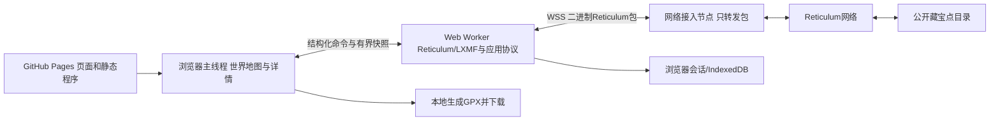
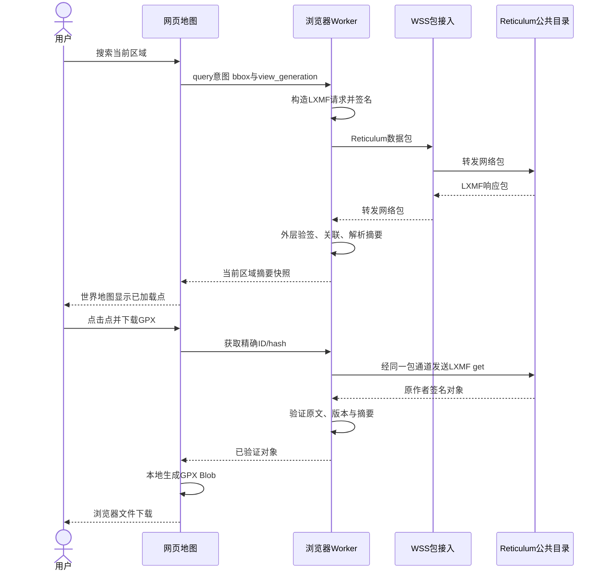

# GitHub Pages Geocaching板块：浏览器内实时Reticulum客户端

状态：新增需求设计，待用户评审，未授权编码或部署。基于0.2.0应用协议，本文不新增线上消息字段。

## 1. 用户确认的目标

项目现有GitHub Pages增加Geocaching板块，展示可缩放、平移的世界地图。访客在地图上查看其他用户公开分享的标点，打开详情并下载标点GPX。Reticulum与LXMF真正运行在浏览器中，查询由当前访客操作当场触发。

明确排除：定期收集成站点JSON数据库作为主要数据源；服务器接收“查询区域”API再代浏览器执行LXMF；GitHub Actions每有新标点就重建网站。Pages只提供客户端程序与静态展示资源，不决定公共内容的权威版本。

地图底图通过HTTPS地图服务或随站点提供的地理资源加载，与藏宝点的Reticulum数据通道分开。HTTP下载底图不等于用HTTP代替LXMF下载藏宝点。

## 2. 系统边界



WSS接入节点是物理网络入口，不是目录或查询代理；可以与目录共机部署，但角色不能混淆。浏览器持有自身身份、构造LXMF请求、处理Link/Resource、验签与解码。接入端无需浏览器私钥，不接收bbox/get业务API，不维护网页专用标点数据库。

浏览器无法使用普通Node TCP接口；第一版采用远程WSS接入。公开服务发现名属于Reticulum层；WSS URL属于浏览器网络承载，可以有域名，两者不矛盾。HTTPS页面默认不使用远程ws://，接入端需有效TLS及允许该站点Origin的配置。不能把任意rnsd TCP端口当成WSS端点。

## 3. 页面与交互

建议页面入口为项目站点导航中的Geocaching，实际路由候选为`geocaching/`。静态项目子路径必须兼容，资源URL不硬编码到域名根。

桌面布局：世界地图占主要区域，左侧可收起筛选/结果栏，右侧或浮层显示详情。手机布局：全屏地图加底部结果/详情面板。网站不照搬480×222设备像素稿，但复用作者、摘要、下载与状态语义。

基本控件：缩放、平移、搜索此区域、连接状态、筛选、结果计数、详情、下载GPX。地图初始为世界范围，不自动索取定位权限；“定位到我”是可选明确动作。

首次进入先加载地图外壳，创建/恢复浏览器身份并连接WSS，验证公共目录announce及capabilities。状态区依次显示连接中、已接入、发现目录中、可查询；连接失败仍可看已保存缓存并标时间，不宣称实时结果。

### 查询规则

1. 首次连接且有目录后查询当前可见区域；用户拖动/缩放只改变视口，不在每帧发包。
2. 移动结束显示“搜索此区域”，用户点击后建立新view_generation，自动向有限公共目录逐个query。
3. 世界范围允许查询，但仍按来源分页和预算。用户可先浏览首批结果或缩小区域，不承诺一次拉完整地球的全部点。
4. “加载更多”继续对应来源快照；聚合标记只统计已加载结果，必须标“已加载N个”，不假装全球总数。
5. 跨日期线视口拆为两个bbox，重复世界副本只显示同ID一次；极区超出底图投影能力时保留列表和坐标，不修改原始WGS84值。
6. 浏览器本地聚合随缩放拆分；聚合圆点点击缩放查看，不请求服务器预先算好的业务聚合。
7. 旧generation响应不覆盖新区域列表；可存入有界缓存，不抢回地图或继续旧分页。

## 4. 点击标点与下载

query摘要可以立即显示点、名称、状态和难度，明确“详情尚未验证”。点击后浏览器发精确get，验签并核对摘要，显示完整介绍、提示、作者指纹、版本和最后查询时间。

“下载GPX”行为：若只有摘要，先get完整对象并验证；成功后按17/21在浏览器生成标准GPX，通过Blob下载。下载文件含原作者记录和签名扩展，不请求GitHub或WSS节点预先生成文件。

文件名候选为完整cache_id加.gpx，内容包含用户可读名称。批量下载最多20个已选择点，逐个取得与验证，生成多wpt GPX；存在失败时显示成功/失败明细，由用户选择只下载成功项，不能把摘要冒充完整对象混入。

生成浏览器下载只证明文件已准备并交给浏览器保存流程，不声称已经写入用户磁盘或SD。保存目录由浏览器/用户选择。每次生成后释放Blob URL，避免持续浏览造成内存泄漏。

disabled/archived可通过筛选查看并按原状态下载；冲突或外部编辑对象不得标成已验证当前版本。提示默认折叠，点击展开，不把折叠当加密。

## 5. 数据流时序



图中W与D的后两条箭头省略同一WSS承载，不代表另开HTTP查询API。

## 6. 浏览器身份、缓存与生命周期

第一版浏览器板块以浏览/下载为范围，不开放网页作者发布入口；底层仍需要身份来接收LXMF回复。默认临时会话身份，可由用户明确选择持久保存到IndexedDB。是否开启长期传播收件能力须验证后声明，不能复制设备的持续在线假设。

关闭页面或浏览器冻结时Worker可能停止，不能保证后台在线。重开只有恢复同一持久身份及请求账本才可关联旧响应；临时身份消失后旧结果不能恢复。保留缓存必须显示缓存时间；清除站点数据会丢失浏览器身份和缓存，GPX下载文件不因此删除。

同源脚本具有敏感权限，浏览器包应固定版本随站点构建，不在运行时加载任意第三方协议脚本；私钥不传给WSS，不进入URL、日志、分析统计或错误报告。多标签页使用单身份单活动连接的协调机制，其他标签页只提交意图或使用独立临时身份，防止相同账本双写。

网页访客查询区域对最终目录可见，WSS接入端仍可观察连接与路由元数据。默认不上传个人位置、私有笔记或设备文件。公开标点可能被互联网访客读取，应把这一可访问范围同步到公开发布说明。

## 7. 库与网络接入选择

优先验证[reticulum-js / @reticulum/core](https://github.com/bergie/reticulum-js)：其[核心说明](https://github.com/bergie/reticulum-js/blob/main/packages/core/README.md)列出浏览器安全核心、LXMF、Links、Resources与WebSocket接口，但仍处早期阶段，不等于本项目已验证可直接采用。

[reticulum-webclient](https://github.com/thatSFguy/reticulum-webclient)提供GitHub Pages浏览器客户端先例，可参考浏览器身份、网络接入和互操作经验；它不是我们的geocaching协议实现。较早[rns.js](https://github.com/liamcottle/rns.js)仍列出签名验证/Resource等缺项，不作为本需求默认完整基础。

选库验证必须覆盖：整数fields键0xFB/0xFC、binary原字节、完整来源目的地、外层和作者双重验签、最大8192字节应用响应、Resource/压缩支持、断线重连和静态向量。候选库如需外部bz2实现，要在构建中固定并有界解压；不能因不支持压缩默默丢掉合法响应。

接入端与浏览器统一raw包或KISS帧模式，版本固定；不得只凭WebSocket握手成功就宣布Reticulum接入成功。接入端只转发包的性质也必须通过抓包/接口审查证明。库许可证和发布义务需在采用时核对，不将第三方源码无说明复制进项目。

## 8. 当前项目目录与发布规划

现有site/package.json已有React/esbuild构建，pages.yml把site作为完整发布artifact；本功能作为该站点新增板块。候选源码归属：

```text
site/
  geocaching/index.html                  # 静态入口
  geocaching/src/page.*                  # 地图/列表/详情交互
  geocaching/src/map-view.*              # 渲染与本地聚合
  geocaching/src/reticulum-worker.*      # 浏览器协议执行上下文
  geocaching/src/protocol-client.*       # 01/04应用请求和验签适配
  geocaching/src/browser-store.*         # IndexedDB/会话状态
  geocaching/src/gpx-download.*          # 17/21映射和Blob下载
  geocaching/dist/                       # 构建产物；具体与现有构建输出对齐
tests/site/                             # 后续浏览器与静态向量测试
```

这些文件尚未创建；具体扩展名/打包入口在获准后与现有site构建统一。协议字段不能在网页另写一套不兼容版本，可先共享文档向量验证，不假定ESP C++可以无成本编译到浏览器。

Pages工作流只随程序资源更新构建，不因新宝藏重建，也不从Actions运行定时数据抓取作为主查询链。WSS接入服务需另行部署、证书和运维，GitHub Pages不托管它。可以配置多个入口做故障转移，但不把未验证的公共节点地址写成永久可用默认值。

地图渲染库、底图服务、署名和用量政策必须在实现前明确选定；默认不假定公共OSM瓦片可无限批量抓取。世界地图的底图可用性与Reticulum查询状态分别显示。

## 9. 验收与未批准项

| ID | 验收 |
| --- | --- |
| WEB01 | 从项目Pages子路径打开，程序与地图资源正确加载 |
| WEB02 | 浏览器持有身份与协议栈，接入端只有包转发，无bbox业务API |
| WEB03 | 用户查询触发真正LXMF query，关闭目录后能显示查询失败而不是静态镜像结果 |
| WEB04 | 地图缩放/平移不产生无界请求，旧区域响应不污染新视图 |
| WEB05 | 多目录相同ID合并，聚合数量只对应已加载内容 |
| WEB06 | 点击详情执行精确get，篡改签名或版本被拒绝 |
| WEB07 | 仅摘要点击下载先取得完整对象，GPX符合17/21，文件无需服务器生成 |
| WEB08 | 最大响应/压缩Resource可处理，Worker不阻塞地图且内存有界 |
| WEB09 | 断线、刷新、临时/持久身份和多标签页状态符合第6节 |
| WEB10 | 不通过GitHub提交或Actions更新数据，新发布点可在下次网络查询显示 |

用户已确认的是板块目标与浏览器内协议路线；具体库版本、WSS运营地址、底图与地图库、连接启动策略和持久身份选项仍为设计候选。本文新增范围不自动变成此前设备文档的已批准项。当前只写文档，没有修改网页、安装协议库或部署接入服务。
