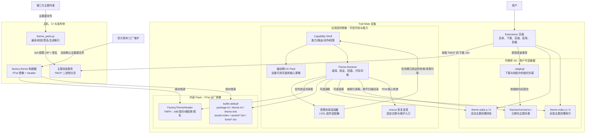
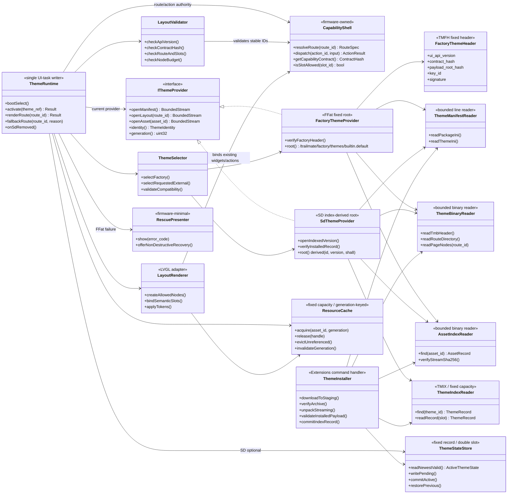
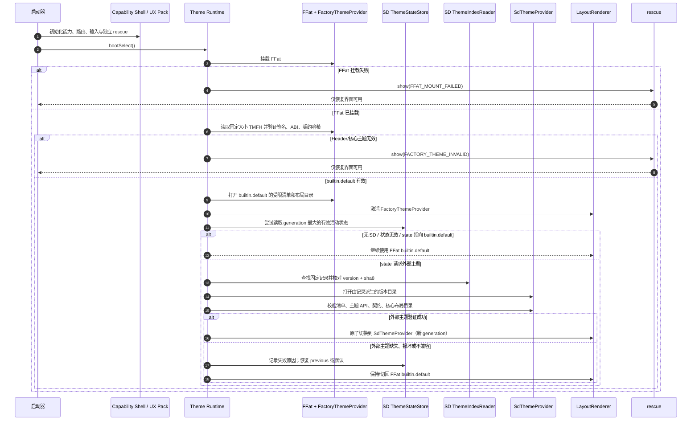
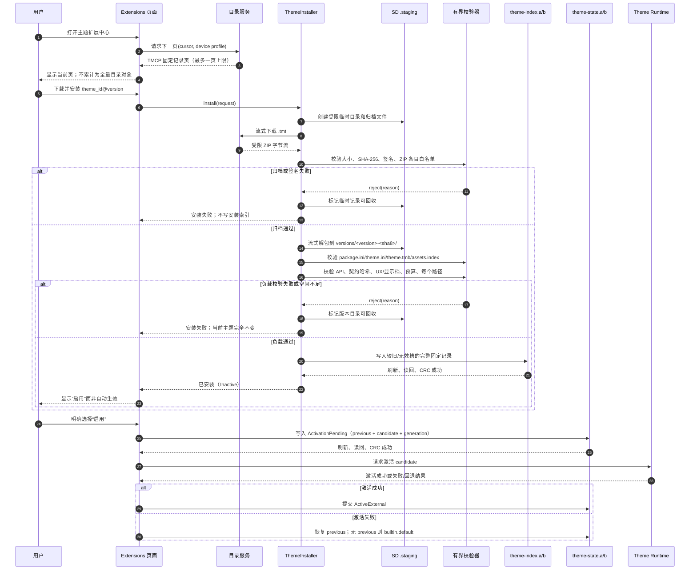
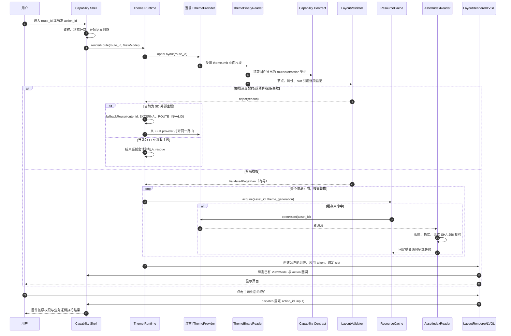
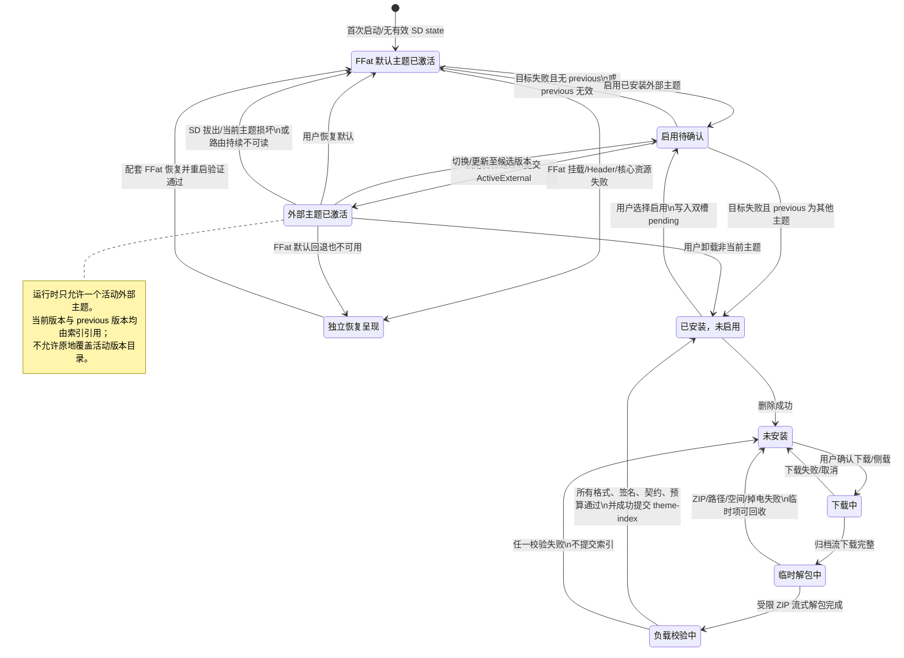
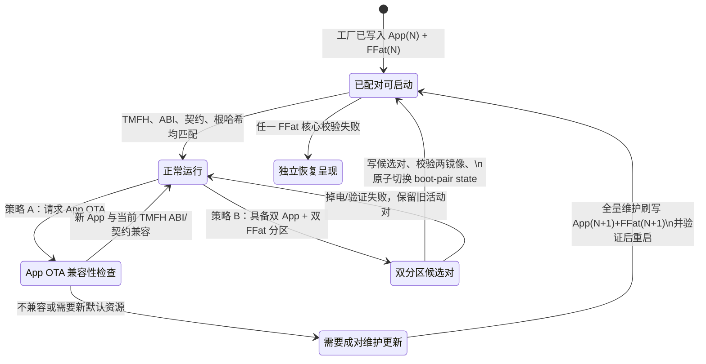
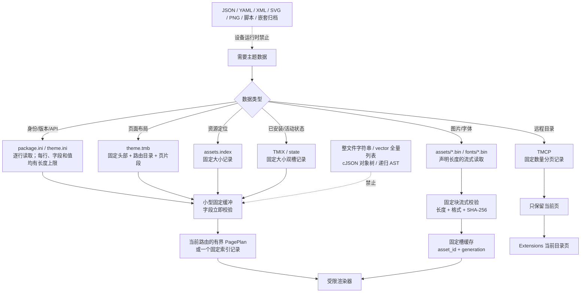
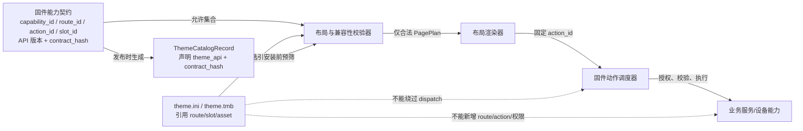
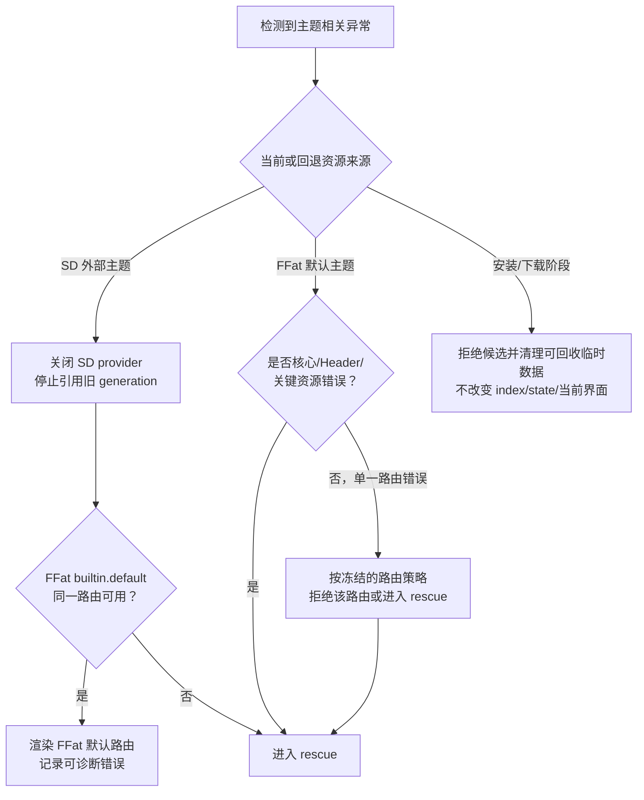

# 12：可替换主题系统的完整 UML 设计说明

## 文档目的与阅读方式

本文把前述方案中的边界、存储、加载、安装、回退和更新关系收敛为一组 UML 图。它用于**实现前的架构评审**：图中的接口、文件名、状态和消息均为拟议设计，不能据此推断已经存在对应的 C++ 类或固件功能。

阅读时请始终以以下三条不变量校验每一张图：

1. 业务能力、路由、动作、权限、设备访问和导航语义属于应用固件；主题包无权创造或改变它们。
2. 现有界面是逻辑上的出厂主题 `builtin.default`，其完整视觉资源和布局在内部 Flash 的 **FFat** 出厂镜像中，而不在应用固件镜像中；固件内保留独立的 `rescue` 恢复呈现，提供固定诊断与维护入口。
3. 所有外部主题位于 **SD**；设备端以有界、流式、二进制记录读取主题路径，不能解析 JSON 或构造不可信的大对象树。

本文件使用 Mermaid 的 UML 表达。组件图回答“谁负责什么”，类图回答“运行时对象如何协作”，时序图回答“操作按什么顺序发生”，状态机回答“掉电或失败后可进入哪些状态”，部署图回答“数据实际在哪里”。

本 UML 的设备边界是完整的 ESP32 目标矩阵：Tab5、T-Display P4 TFT、T-Display P4 AMOLED、T-LoRa Pager（SX1262/LR1121）、T-Deck、T-Watch S3 和 T-Deck Pro（A7682E/PCM512A）。每个目标都必须拥有自己的 `Esp32TargetThemeProfile`、能力目录、FFat `builtin.default` 资源变体、外部主题兼容规则和实机验证证据。Linux、nRF52、Cardputer 及其他非 ESP32 平台不在图中的部署、接口或验收范围内。完整的源码/target 证据见 [13：当前 UI 源码盘点与解耦改造地图](./13-当前UI源码盘点与解耦改造地图.md)。

## 1. 设计全景：组件与信任边界



### 图 1 的评审结论

- **应用固件不是主题包的宿主代码。** `Theme Runtime` 和 `Renderer` 是固件实现的受控解释器；它们只认主题 API 允许的令牌、布局节点和资源格式，绝不加载主题作者的二进制、脚本或动态库。
- **`builtin.default` 与外部主题使用同一主题读取协议，但存储权限不同。** 前者由 `FactoryThemeProvider` 从 FFat 固定路径读取，后者由 `SdThemeProvider` 从双槽索引推导的 SD 版本目录读取。这样默认界面可随 FFat 镜像演进，又不让 SD 成为系统的可信启动根。
- **Extensions 是管理入口，不是能力定义者。** 它只能请求固件安装/启用主题；能显示哪些页面、某个动作是否可点、实际如何执行，始终由 `Capability Shell` 决定。
- `.tmt` 只存在于下载/侧载和安装阶段。渲染路径只能读取已经校验并解包的 `theme.ini`、`theme.tmb`、`assets.index` 和 `.bin` 资源，不能直接打开 ZIP。

## 2. 逻辑类图：运行时职责、所有权和读取上限



### 图 2 的实现约束

1. `ThemeRuntime` 是主题状态的唯一写者，并只能在 UI 任务中切换主题、释放 LVGL 对象和失效缓存。网络下载、ZIP 解压或 SD 文件读取可以由受控工作流完成，但不能跨任务直接修改当前 provider 或 LVGL 对象。
2. `IThemeProvider` 是 FFat 和 SD 资源的唯一差异点。`LayoutRenderer`、`LayoutValidator` 和 `AssetIndexReader` 不应知道资源来自哪里，因而可保证默认主题与外部主题遵循同一个格式和验证模型。
3. 四类 Reader 都必须是**有界读取器**：固定大小头部、固定长度记录、受限行缓冲或受限资源块。它们的返回值应是小型值对象、固定数组或调用方提供的缓冲区，而不是把整文件、整页或整棵布局树放入 `std::string`、`std::vector`、cJSON 或递归 AST。
4. `CapabilityShell` 是唯一的语义权威。布局校验只接受它导出的 `route_id`、`slot_id`、`action_id`；渲染器只能把现有固件组件绑定到这些位置，不能通过主题清单开新路由或赋予新动作。
5. `ResourceCache` 的键必须至少包含 `asset_id + theme_generation`。主题代际切换、SD 拔出或回退时，旧 generation 的资源只可等待引用归零后释放，不能让新页面继续引用旧 SD 文件句柄。

## 3. 部署图：应用、FFat、SD 与发布系统

```mermaid
flowchart LR
    subgraph ReleasePC[构建机 / CI]
        SourceDefault[默认主题源文件]
        SourceThird[第三方主题源文件]
        PackTool[theme_pack.py]
        FfatTool[build-ffat-image]
        Key[发布 CI 签名私钥\n仅受保护发布环境]
    end

    subgraph DeviceFlash[设备内部 Flash]
        subgraph AppPartition[App 分区]
            Firmware[应用固件\n能力壳 + Theme Runtime + 渲染器 + rescue]
        end
        subgraph FfatPartition[FFat 分区]
            FHeader[/trailmate/factory/factory-theme.header/]
            FSig[/trailmate/factory/factory-theme.signature/]
            FTheme[/trailmate/factory/themes/builtin.default/]
        end
    end

    subgraph UserSD[用户 SD 卡]
        SIndex[/trailmate/packs/index/theme-index.a,b/]
        SState[/trailmate/packs/index/theme-state.a,b/]
        SPack[/trailmate/packs/themes/<id>/versions/<version>-<sha8>/]
        SStage[/trailmate/packs/.staging/]
    end

    subgraph Distribution[发行服务]
        CatalogPage[ThemeCatalogPage\nTMCP，分页二进制]
        Archive[.tmt\n受限 ZIP 传输归档]
    end

    SourceDefault --> PackTool
    PackTool --> FfatTool
    Key --> FfatTool
    FfatTool -->|工厂/全量维护烧录| FfatPartition
    FfatTool -->|ABI 配对| Firmware

    SourceThird --> PackTool
    Key --> PackTool
    PackTool --> Archive
    PackTool --> CatalogPage
    Archive -->|下载/侧载| SStage
    SStage -->|流式解压与验证后| SPack
    SPack --> SIndex
    SIndex --> SState

    Firmware -->|固定路径验证| FHeader
    Firmware -->|完整默认资源读取| FTheme
    Firmware -->|可选主题选择| SState
    Firmware -->|已安装主题查找| SIndex
    Firmware -->|按索引派生路径读取| SPack
    Firmware -. 不读取 .tmt 进行渲染 .-> Archive
```

### 存储与可信度结论

| 存储对象 | 归属 | 是否可由用户修改 | 是否可作为启动根 | 读取策略 |
| --- | --- | --- | --- | --- |
| App 分区 | 固件发布 | 否（正常使用路径） | 否；提供代码和 `rescue` | 编译期可信代码。 |
| FFat 出厂主题 | 官方发布/工厂镜像 | 不应由主题安装流程写入 | 是，唯一完整默认 UI 根 | 固定路径、`TMFH` 配对验证、按需流式资源校验。 |
| SD 主题状态/索引 | 设备安装器 | 是，可损坏 | 否 | 双槽、代数、CRC、固定容量；不扫描目录。 |
| SD 解包主题 | 用户/第三方包 | 是，可被拔出或替换 | 否 | 仅由已验证索引指向；每次按需验证格式/哈希。 |
| `.tmt` 归档 | 传输介质 | 是 | 否 | 仅在安装阶段流式处理；不能成为运行时资源根。 |

这里的关键判定是：**SD 错误只能让设备失去外部主题，不能让设备失去完整的默认界面；FFat 错误才进入 `rescue`。**

## 4. 启动时序图：先 FFat，后 SD，最后回退



### 启动算法必须满足的细节

- 固件在读 SD 之前，必须已经成功验证 FFat 的 `FactoryThemeHeader`、主题 API 和能力契约哈希；禁止把 SD 主题提升为 FFat 故障时的“默认根”。
- `theme-state.a/b` 或 `theme-index.a/b` 两个槽都无效时，行为是“外部主题不可用”，不是递归扫描 SD 找候选包。默认选择就是 `builtin.default`。
- 外部主题的启动验证只预读必要的固定头部、清单和路由目录。大资源应在首用时按 `assets.index` 流式校验，不能为启动速度把所有图片、字体或布局页读入 RAM。
- `ActivationPending` 或启动验证失败时，恢复顺序必须固定：同主题的 previous 已验证版本 → FFat `builtin.default` → `rescue`（仅当 FFat 也不可用）。

## 5. 目录浏览与安装时序图：下载不是安装，安装不是启用



### 安装事务的不可跳过步骤

1. 主题目录只使用二进制 `ThemeCatalogPage`（`TMCP`）分页；UI 一次保留一页而不是把 JSON 或无限列表存入内存。
2. 解压前、解压中和解压后均有限额：压缩包大小、总解压大小、文件数、单文件大小、路径长度、压缩比、布局节点数、字体/图片像素与 RAM 预算。超限即拒绝。
3. 主题版本目录在校验完成前不得写入 `theme-index.a/b`；索引提交成功前不得视作“已安装”。这是把“半解压主题”与“可用主题”隔离开的关键。
4. 安装成功只产生 `InstalledInactive`。是否启用是单独的、可回滚的 `theme-state.a/b` 事务，不能因下载完成或更新成功而自动改变当前 UI。
5. 每次写双槽记录都执行：选择较旧/无效槽 → 写完整记录 → 刷新 → 读回 → 校验 CRC → 以新 `generation` 生效。不能假设 FAT 的 rename 或部分写入具有原子性。

## 6. 主题激活与页面渲染时序图：视觉可换，能力不可换



### 图 6 证明的能力隔离

- 主题只能决定“允许的节点如何摆放、使用哪个图标、哪个颜色/字体令牌”；它看不到也不能直接调用业务服务。
- `action_id` 不从主题包执行，而由 `CapabilityShell` 的已注册回调解释。即使主题把按钮放在不同位置，`chat.send`、`settings.apply` 等动作的校验、参数范围和副作用保持不变。
- 外部主题某一路由的布局或资产读取失败时，回退粒度是**该路由回退 FFat 默认主题**，不能继续渲染部分错误的外部页面；若 FFat 同一路由或核心资源错误，则进入 `rescue`，而不是从固件中找一套重复默认资源。
- 最终渲染前的 `ValidatedPagePlan` 是有界中间表示：只保存当前路由的节点、属性和资源 ID，不缓存整个主题的所有页面。

## 7. 主题生命周期状态机



### 掉电恢复规则

| 断电观察到的持久状态 | 启动恢复动作 | 允许的最终可见界面 |
| --- | --- | --- |
| 只有 `.staging` 中的归档或目录 | 视为未安装；不扫描并启用 | FFat `builtin.default` 或原来已提交的活动主题。 |
| 版本目录存在，但 `theme-index` 未提交 | 忽略该目录；由清理任务按固定策略回收 | 当前已提交主题或 FFat 默认。 |
| `theme-index` 新槽损坏、旧槽有效 | 选择旧槽的最大有效代数 | 旧已安装集合，不丢失当前主题。 |
| `theme-state` 为 `ActivationPending` | 验证 candidate；失败则恢复 `previous`，再退 FFat | 不展示半切换主题。 |
| SD 丢失、损坏或拔出 | 关闭 SD provider、失效旧代际缓存 | FFat `builtin.default`。 |
| FFat Header 或核心资源失效 | 不使用 SD 作为系统根 | `rescue`。 |

## 8. FFat 出厂主题的配对与更新状态机



### 为什么 FFat 更新必须单列

`builtin.default` 是完整的出厂界面，但其 ABI、能力契约哈希和资源根哈希必须与应用固件配对。若只把新应用 OTA 到旧 FFat，可能出现“代码期待新的 slot 或 layout 格式，而默认资源仍是旧格式”的不可启动组合。因此，发布 ADR 必须冻结以下其中一种策略：

- **策略 A（兼容性 OTA + 配套维护刷写）**：只接受与当前 FFat `TMFH` 明确兼容的 App OTA；若默认主题也需更新，使用配套的全量维护刷写流程。
- **策略 B（双分区成对 OTA）**：在双 App 分区、双 FFat 分区和可验证的 `boot-pair state` 全部具备时，支持可掉电回滚的成对 OTA。

任何策略都不能让下载到 SD 的第三方主题覆盖或修复缺失的 FFat 默认主题；这会破坏启动信任根和恢复路径。

## 9. 受限文件格式与读取路径图



此图把“不要读取 JSON 大对象”的要求具体化为可测试的设计约束：

- `theme.ini` 和 `package.ini` 是唯一文本清单，且每个字段都有明确字符集、长度和行数上限；读取后立即写入固定大小结构。
- `theme.tmb`、`assets.index`、`TMIX`、`TMCP` 都是版本化的二进制格式，首部包含 magic、主版本、记录/页长度和 CRC 或签名范围；长度不匹配即拒绝。
- `.tmt` 可以是受限 ZIP，原因是它只作为传输容器；设备运行时不解析它，更不把其内容转成 JSON。仅允许 Store/Deflate、扁平白名单路径、无链接、无嵌套归档。
- 主机构建工具可以使用 JSON、YAML、SVG、PNG 等作者友好格式作为输入，但必须在打包时编译为设备协议接受的 `.ini`、`.tmb`、`.index` 和 `.bin`。

## 10. 能力契约的可见性与不可变性



主题作者制作主题时所面对的是公开、版本化的能力契约；它不等同于业务 API。主题可引用的内容应分为以下四层：

| 层级 | 主题可以做的事 | 明确禁止 |
| --- | --- | --- |
| `capability_id` | 在扩展中心、主页或已允许位置使用该能力的图标/名称呈现。 | 声明新能力，隐藏已经由 UX Pack 决定必须可达的能力。 |
| `route_id` | 为固件已有页面提供受限布局片段。 | 新增页面路由、改变导航守卫或绕过权限。 |
| `slot_id` | 调整允许组件的位置、尺寸、顺序、样式与资源绑定。 | 将任意业务数据绑定到未声明槽位，移除无障碍或安全确认槽位。 |
| `action_id` | 将固件已有动作绑定到允许的交互组件。 | 传入未声明参数、执行脚本、直接调用服务或改变动作语义。 |

契约破坏的定义也必须清晰：删除或改义任何稳定 ID、改变既有 action 参数语义、把必需安全确认槽位变成可选，均属于破坏性变更，必须提升 `theme_api` 主版本并拒绝旧主题；新增可选 slot 或新增页面能力通常可在兼容规则允许时做小版本扩展。

## 11. 异常处理决策表



| 异常类别 | 不可接受的处理 | 正确处理 |
| --- | --- | --- |
| SD 被拔出或活动外部资源读错 | 留下已失效文件句柄继续画、卡死 UI、扫描 SD 猜测新目录。 | 失效外部 provider 的 generation，释放可释放缓存，回退 FFat 默认主题。 |
| 外部包格式/API/契约不匹配 | 宽松兼容并继续渲染未知节点。 | 拒绝安装或拒绝启用；当前主题不变。 |
| 安装掉电 | 把半解包目录写入索引或自动启用。 | 索引不存在即视为未安装；只有双槽记录校验完成才可见。 |
| FFat 不可挂载或 `TMFH` 失配 | 用 SD 的任意主题临时代替系统默认 UI。 | 进入独立 `rescue`，提供固定诊断和非破坏性恢复引导。 |
| FFat 完整资源关键读取失败 | 回退到固件中的完整旧 UI。 | 进入 `rescue`；固件不能藏有第二份完整默认主题。 |

## 12. 评审输出：在编码前必须冻结的接口清单

下表将 UML 图落到可签字的接口边界。任一项目未冻结，都应阻止对应实现开工。

| 编号 | 必须冻结的内容 | 关联 UML 图 | 需要给出的明确答案 |
| --- | --- | --- | --- |
| U-01 | ESP32 硬件目标与 memory profile | 图 1、图 2 | Tab5、两种 P4、Pager 两种变体、T-Deck、T-Watch、T-Deck Pro 两种变体各自的 UX Pack/profile、显示/输入、RAM、PSRAM、任务栈、资源缓存和页面节点精确上限。 |
| U-02 | 能力契约表 | 图 2、图 6、图 10 | 所有现有 `capability_id`、`route_id`、`action_id`、`slot_id`、必需可达性和弃用规则。 |
| U-03 | `IThemeProvider` 资源 API | 图 2、图 3 | 句柄所有权、错误码、流读取块大小、文件关闭时机和 SD 热拔插时的失效语义。 |
| U-04 | FFat `TMFH` 精确字节格式 | 图 1、图 3、图 4、图 8 | 字节序、字段长度、CRC/签名覆盖范围、key ID、公钥轮换、ABI/契约比较规则。 |
| U-05 | `.tmt` 与安装负载格式 | 图 3、图 5、图 9 | ZIP 白名单、压缩方法、路径规范、最大值、签名输入、`theme.ini`、`theme.tmb`、`assets.index` 的精确版式。 |
| U-06 | 二进制索引与状态事务 | 图 2、图 4、图 5、图 7 | `TMIX` 和 state 记录布局、槽选择、generation、CRC、写后读回、恢复顺序和回收策略。 |
| U-07 | 主题 DSL 允许集 | 图 2、图 6、图 10 | 节点类型、属性、绑定类型、布局约束、动画/字体/图片格式以及一切拒绝条件。 |
| U-08 | 路由级回退策略 | 图 4、图 6、图 11 | 外部主题单页错误是否使用 FFat 同路由；FFat 单页错误如何展示；哪些错误直接进入 rescue。 |
| U-09 | 侧载与信任策略 | 图 1、图 5 | 发布签名算法、目录签名、开发者模式打开方式、物理确认、撤销/过期处理和错误呈现。 |
| U-10 | FFat 更新路线 | 图 3、图 8 | 发布 ADR 采用策略 A 还是策略 B；分区表、工厂烧录流程、OTA 兼容判断与掉电回滚证据。 |
| U-11 | 工具链可复现性 | 图 1、图 3、图 5 | `theme_pack.py` 的输入、确定性输出、签名、主机校验器、FFat 镜像构建和 CI fixture。 |
| U-12 | 验收与故障注入 | 图 4 至图 11 | 无 SD、SD 拔出、双槽损坏、半写入、恶意归档、资源哈希错、FFat 失效、OTA 中断的自动化/实机证据。 |

## 13. 与其他设计文档的对应关系

| 本文 UML 内容 | 规范性来源 |
| --- | --- |
| 主题能力边界、现有能力目录 | [01：总体架构与边界](./01-总体架构与边界.md)、[02：界面能力目录与稳定契约](./02-界面能力目录与稳定契约.md) |
| `.tmt`、清单、布局和资源格式 | [03：主题包格式与固件接口](./03-主题包格式与固件接口.md)、[10：有界流式读取与二进制索引协议](./10-有界流式读取与二进制索引协议.md) |
| 下载、安装、启用、更新和用户体验 | [04：扩展中心与安装生命周期](./04-扩展中心与安装生命周期.md) |
| 第三方制作方式与工具行为 | [05：第三方主题开发指南](./05-第三方主题开发指南.md)、[06：主题包工具链规范](./06-主题包工具链规范.md) |
| 分阶段实施和实现前门槛 | [07：分期改造计划与评审清单](./07-分期改造计划与评审清单.md)、[09：实现前必须冻结的详细设计](./09-实现前必须冻结的详细设计.md) |
| FFat 默认主题、烧录、恢复与 OTA | [08：内置默认主题与 SD 加载协议](./08-内置默认主题与SD加载协议.md)、[11：FFat出厂默认主题与烧录更新协议](./11-FFat出厂默认主题与烧录更新协议.md) |

本文不替代这些格式和测试规范；它的作用是确保它们在同一个系统模型中没有彼此矛盾。进入任何主题运行时或包安装代码前，应按 U-01 至 U-12 逐项冻结，尤其是完整 ESP32 目标资源预算、能力契约和 FFat 更新路线。
