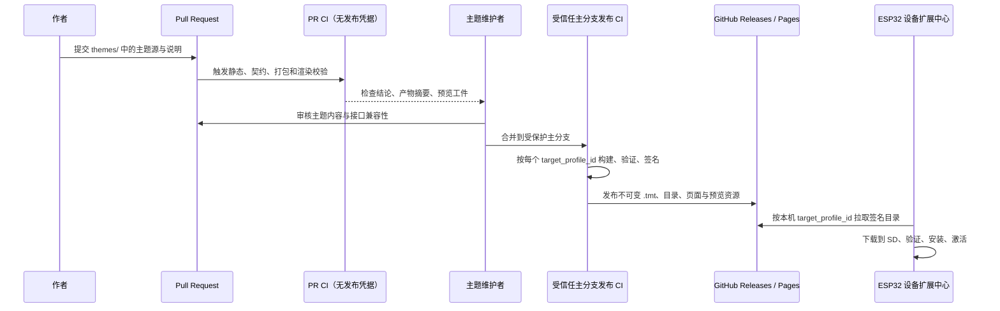
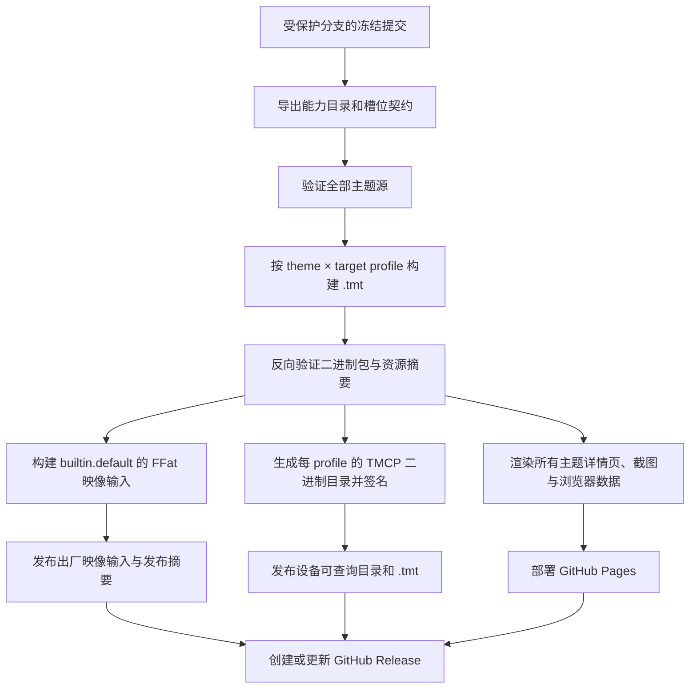
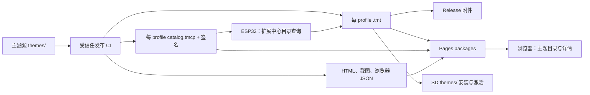

# 15：主题 PR、CI 与 GitHub Pages 发布协议

> 本文定义 Trail Mate 主题进入工程、接受审核、被持续集成构建、面向设备发布，以及在 GitHub Pages 中展示的完整链路。它是主题仓库治理和交付的契约，不是将任意网络 ZIP 直接交给设备执行的方案。

## 1. 先确定发布边界

Trail Mate 的主题是与固件接口版本绑定的产品资产。所有能够出现在设备“扩展中心”下载列表中的主题，都必须有可审计的源文件、可复现的构建记录、可验证的产物和可撤销的发布记录。因此主题作者提交的是工程中的主题源，而不是把一个不受控制的二进制文件上传到设备或临时下载地址。

设备的下载、SD 安装和激活入口只接受受保护发布 CI 签名的主题包。用户可以把同一发布包从 Release 或 Pages 复制到 SD 再安装，但这不是绕开发布链的例外：未由该 CI 发布的作者本地 `.tmt` 不会成为可安装的公开主题，也不会进入 Extensions 目录。

完整路径如下：



这里有两条不可混淆的信任边界：

1. **Pull Request CI 只验证，不发布。** 来自 fork 的 PR 绝不获得签名私钥、GitHub Pages 部署令牌、发布令牌或其他机密。
2. **合并到受保护分支后的 CI 才能发布。** 发布作业从干净检出开始，以冻结的主题源、主题 SDK、能力目录和打包工具构建可下载产物，并使用受保护环境中的签名凭据签名。

当前工程已经有 [GitHub Pages 工作流](../../../../.github/workflows/pages.yml)、[静态站点目录](../../../../site/) 和 [站点准备脚本](../../../../scripts/prepare_pages_site.py)。主题发布应扩展这些既有入口；当前的 [语言包构建脚本](../../../../scripts/build_pack_repository.py) 继续服务 `packs/`，不能被改造成 ESP32 主题运行时格式的唯一实现，因为其浏览器 JSON 产物与设备的有界二进制协议用途不同。

## 2. 主题 PR 的提交对象与所有权

主题源码的规范根目录在 [第 14 篇：工程目录与独立默认主题规划](./14-工程目录与独立默认主题规划.md) 中定义为 `themes/`。一个主题 PR 可以新增或变更下列受控文件：

```text
themes/
  factory/builtin.default/                         # 官方出厂默认主题
  official/<theme-id>/                             # 官方可下载主题
  community/<publisher-id>/<theme-id>/             # 第三方主题
  policy/                                          # 安全、签名和撤销策略
  sdk/theme-api-1.0/                               # 主题接口声明与样例
```

主题源不是只含图片的目录。每个主题版本都必须包含 `package.ini`、`DESCRIPTION.md`、`LICENSE.txt`、主题源、每个声明目标配置、预览截图、无障碍说明及测试期望。具体文件职责和禁止项以 [第 14 篇](./14-工程目录与独立默认主题规划.md#3-主题源的规范目录) 与 [第 5 篇：第三方主题开发指南](./05-第三方主题开发指南.md) 为准。

### 2.1 建议的代码所有权规则

主题目录可向第三方开放 PR，但对接口、打包器、出厂内容与发布工作流必须设定审阅者。仓库应以等价于下列规则的 `CODEOWNERS` 管理自动审核要求：

```text
/themes/factory/**                 @firmware-maintainers @theme-maintainers
/themes/official/**                @theme-maintainers @security-maintainers
/themes/community/**               @theme-maintainers
/themes/policy/**                  @firmware-maintainers @security-maintainers
/themes/sdk/**                     @firmware-maintainers @security-maintainers
/tools/theme_pack/**               @firmware-maintainers @security-maintainers
/tools/theme_pack.py               @firmware-maintainers @security-maintainers
/scripts/build_theme_repository.py @firmware-maintainers @security-maintainers
/scripts/render_theme_pages.py     @theme-maintainers
/.github/workflows/ci.yml          @firmware-maintainers @security-maintainers
/.github/workflows/pages.yml       @firmware-maintainers @security-maintainers
/.github/workflows/theme-release.yml @firmware-maintainers @security-maintainers
```

这是对文件路径的保护，不是把第三方排除在生态之外。第三方只需遵从接口、版权和安全规则，即可通过 `themes/community/<publisher-id>/<theme-id>/` 提交主题；维护者审核的是其对稳定能力契约的视觉实现、资源权属和设备可用性，而不是要求第三方修改固件能力。

### 2.2 PR 不可提交的内容

主题 PR 不得将下列内容作为主题能力的一部分：

| 禁止对象 | 原因 |
| --- | --- |
| ESP32 C/C++、Arduino、PlatformIO 或 ESP-IDF 源码 | 主题不能扩展或篡改固件能力、路由与动作语义。 |
| `#if`、`ifdef`、板型宏分支控制的坐标、布局或图标选择 | 每种设备的主题位于独立 profile 目录，布局由主题包选择，不由编译宏拼接。 |
| JavaScript、Lua、WASM、可执行文件、动态库、字体解析插件 | 设备运行时只读取受限的数据格式，禁止可执行载荷。 |
| 未声明许可证的字体、图标、图片、截图或文案 | CI 与人工审核无法确认再分发权利。 |
| 已发布版本号下对源或产物的重新覆盖 | 已发布版本必须可复验；修复以新版本发布。 |
| 固件私钥、目录签名私钥、访问令牌、设备凭据 | 所有机密只存在于受保护发布环境。 |

## 3. 主题源、设备产物和站点数据必须分离

同一个主题会产生三类面向不同消费者的输出，文件格式和可用工具不能混用：

| 输出层 | 消费者 | 格式与约束 | 发布位置 |
| --- | --- | --- | --- |
| 主题源 | 作者、审核者、PR CI | `themes/` 内的文本配置、源资源和说明；允许主机工具读取 YAML/Markdown。 | Git 提交与 PR。 |
| 设备发布产物 | ESP32 扩展中心与 SD 安装器 | 一个 `target_profile_id` 对应一个 `.tmt`；内部为 `package.ini`、`theme.tmb`、`assets.index`、受限资源和签名摘要。设备不读取 JSON DOM。 | Release 附件与 Pages 中的静态二进制文件。 |
| 浏览器展示数据 | GitHub Pages、开发者和用户 | HTML/CSS/JS、预渲染截图、搜索索引和 JSON；这些 JSON 只给浏览器使用。 | `site/themes/`、`site/data/themes/`、`site/assets/themes/`。 |

发布目录必须清楚标识 profile，防止设备误装另一台设备的布局包：

```text
site/
  themes/
    index.html
    catalog/
      v1/
        p4_tft_touch/
          catalog.tmcp
          catalog.tmcp.sig
        tab5_touch/
          catalog.tmcp
          catalog.tmcp.sig
        p4_amoled_touch/
          catalog.tmcp
          catalog.tmcp.sig
        pager_compact_sx1262/
          catalog.tmcp
          catalog.tmcp.sig
        pager_compact_lr1121/
          catalog.tmcp
          catalog.tmcp.sig
        tdeck_full/
          catalog.tmcp
          catalog.tmcp.sig
        twatch_compact/
          catalog.tmcp
          catalog.tmcp.sig
        tdeck_pro_240x320_a7682e/
          catalog.tmcp
          catalog.tmcp.sig
        tdeck_pro_240x320_pcm512a/
          catalog.tmcp
          catalog.tmcp.sig
    packages/
      <theme-id>/<version>/<target-profile-id>/<theme-id>-<version>.tmt
    <theme-id>/<version>/<target-profile-id>/index.html
  assets/
    themes/<theme-id>/<version>/<target-profile-id>/...
  data/
    themes/
      catalog.json
      <theme-id>/<version>/<target-profile-id>.json
```

其中 `catalog.tmcp` 与 `.tmt` 面向设备，浏览器页面和 `data/themes/*.json` 面向 Pages。浏览器可使用 JSON 形成筛选、搜索和详情页；固件不下载、不解析也不依赖这些 JSON 文件。设备查询时只使用与自身 `target_profile_id` 对应的二进制 TMCP 目录，继而下载和验证精确 profile 的 `.tmt`。

出厂默认主题也遵从相同的“每 profile 一个构建结果”规则。`themes/factory/builtin.default/profiles/<target-profile-id>/` 是各设备独立的主题源，发布 CI 把相应结果放入对应设备的 FFat 映像；逻辑回退主题 ID 保持 `builtin.default`，不能将多个设备布局压缩为宏控制的一份坐标表。

## 4. PR CI：从源码证明主题可合并

建议在现有 `.github/workflows/ci.yml` 中增加 `theme-pr` 作业组。它对 `themes/**`、主题 SDK、主题打包器、主题构建脚本、主题站点渲染脚本或主题契约变化触发；如果主题接口变化影响所有主题，则全量验证所有主题，而不是只验证改动目录。

### 4.1 PR 校验项

PR CI 必须按主题和 `target_profile_id` 分别执行下表项目：

| 校验类别 | 必须证明的事实 | 失败处理 |
| --- | --- | --- |
| 目录与身份 | 路径、`theme_id`、发布者 ID、语义版本、许可证、描述和变更记录一致；主题 ID 没有冲突。 | 拒绝合并。 |
| 源文件安全 | 没有可执行载荷、链接逃逸、超范围符号链接、禁止脚本、密钥或受限二进制。 | 拒绝合并并标记安全审阅。 |
| 稳定接口 | 主题声明的 `theme_api` 与固件能力目录兼容；没有试图新增 route、action、能力或修改动作参数。 | 拒绝合并。 |
| 路由与槽位覆盖 | 对每个声明的 profile，全部稳定路由的必需槽位都有绑定；状态、错误态、忙碌态和回退态均有定义。 | 拒绝合并。 |
| profile 完整性 | 声明支持的每个 profile 都有独立目录、布局、资源映射和预算；不允许将不兼容 profile 指向同一坐标文件。 | 拒绝合并。 |
| 资源与预算 | 图片尺寸、色深、字体字形、压缩格式、解压缓存、索引项、单包大小和 SD 安装空间符合该 profile 上限。 | 拒绝合并。 |
| 打包与反向验证 | 主机打包器生成每 profile `.tmt`，验证器逐条读取其 INI、二进制布局、资源索引和摘要，并确认可安装。 | 拒绝合并。 |
| 渲染与无障碍 | 为全部路由状态生成确定性截图；检查文字溢出、触控命中区、焦点次序、单色可读性、对比度和图标替代文本。 | 拒绝合并，或要求显式批准的豁免记录。 |
| 版本不可变性 | 新版本不得覆盖已经发布的 `<theme-id, version, target-profile-id>` 内容；同版本重复构建摘要必须一致。 | 拒绝合并。 |
| 发行可用性 | 生成安装说明、文件哈希、尺寸、支持 profile 列表、截图索引和许可证汇总。 | 拒绝合并。 |

“全部稳定路由的必需槽位”不是抽象口号。它引用 [第 2 篇的必需槽位清单](./02-界面能力目录与稳定契约.md#required-slot-catalog)，该清单为 shell、chat、联系人/队伍、地图/GNSS、设备与网络、设置/扩展、单色/cellular 及手表路由逐项定义槽位。CI 从该清单导出的 profile 专属契约输入执行覆盖检查，不能只根据主题作者自己列出的页面判断。

### 4.2 PR 产物的可见范围

PR CI 可生成 `.tmt`、验证报告和页面截图，以便审阅者下载检查；这些只作为 CI 运行工件保留，并标注提交 SHA、工具版本和 profile。它们不得写入正式目录、不得更新设备目录、不得创建 Release，也不得部署 GitHub Pages。这样 fork PR 即使携带恶意资源，也没有改变公开发布面的权限。

## 5. 受信任发布 CI：从合并提交生成可下载版本

在主题 PR 合并到受保护主分支并通过要求检查后，发布作业使用独立的受信任环境执行。推荐职责如下：

| 工作流 / 作业 | 触发 | 职责 | 权限 |
| --- | --- | --- | --- |
| `ci.yml : theme-pr` | PR、主题或契约变更 | 验证、打包、渲染、产出审阅工件。 | 只读仓库与工件写入；无发布机密。 |
| `pages.yml : build-themes` | `main` 推送、受信任发布完成事件 | 构建 Pages 静态主题目录和设备目录，并部署 Pages。 | Pages 部署权限；仅受保护分支可用。 |
| `theme-release.yml : publish-theme` | 合并后的版本标签或受保护手动发布 | 生成 Release 附件、签名目录、签名包、SBOM/摘要和撤销快照。 | Release 写入与签名私钥；受保护环境审批。 |

发布顺序必须固定，且每一步的输入摘要需要被记录：



### 5.1 对现有 Pages 工作流的改造

现有 [`.github/workflows/pages.yml`](../../../../.github/workflows/pages.yml) 已会检出仓库、校验 `packs/`、运行 `scripts/prepare_pages_site.py` 并部署 `site/`。设计后的工作流不删除语言包步骤，而是在它们之前或之后增加主题步骤，并扩大路径触发条件以包含：

```text
themes/**
tools/theme_pack/**
tools/theme_pack.py
scripts/build_theme_repository.py
scripts/render_theme_pages.py
scripts/prepare_pages_site.py
site/themes/**
.github/workflows/ci.yml
.github/workflows/pages.yml
.github/workflows/theme-release.yml
```

`scripts/prepare_pages_site.py` 仍是静态站点汇总入口，但要调用独立的 `scripts/build_theme_repository.py` 和 `scripts/render_theme_pages.py`。它不能把主题混入现有 `packs.json` 的语言包数据模型；主题站点数据必须单独写到 `site/data/themes/`，设备目录必须单独写到 `site/themes/catalog/` 与 `site/themes/packages/`。

`theme-release.yml` 负责对已经通过 PR 验证的、受保护分支上的版本进行签名和 Release 发布；Pages 部署失败不能导致设备目录在缺失网页说明的状态下悄悄更新，设备目录签名、包摘要和页面产物都应来自同一冻结构建清单。

### 5.2 签名、摘要和撤销

设备信任链遵循 [第 3 篇：主题包格式与固件接口](./03-主题包格式与固件接口.md) 的包验证协议和 [第 10 篇：有界流式读取与二进制索引协议](./10-有界流式读取与二进制索引协议.md) 的 TMCP 目录格式。CI 还必须产生以下发布记录：

| 记录 | 用途 | 不可变要求 |
| --- | --- | --- |
| 包 SHA-256、大小、构建提交、工具版本、接口版本 | 在设备目录、Release 和 Pages 中交叉验证文件身份。 | 发布后不得改写。 |
| `.tmt` 签名与 TMCP 目录签名 | 设备确认内容来自受信任发布链。 | 私钥只在受保护发布环境。 |
| SBOM / 许可证清单 | 审核图片、字体、图标和第三方素材来源。 | 与版本绑定。 |
| `themes/policy/revocations.yaml` 的签名快照 | 设备和网站标记被撤销、存在安全问题或不再兼容的版本。 | 撤销追加新记录，保留理由和时间。 |
| 构建证明 | 证明某个包来自哪一个提交、哪一个主题 SDK 与哪一个工具摘要。 | 同版本保留。 |

出现主题漏洞、版权问题或接口误声明时，维护者通过审核的 PR 追加撤销记录，发布 CI 生成新的签名 TMCP。设备扩展中心应隐藏或警告已撤销版本；已安装主题保留在 SD 上供用户选择处理，但不可被重新激活为默认推荐项。禁止通过删除旧文件或覆盖同版本包来伪造修复。

## 6. GitHub Pages：每个主题必须可预览、可理解、可安装

GitHub Pages 不只是下载页。它是主题的公开说明、视觉预览和设备兼容性证据。站点的主题入口为 `site/themes/index.html`，并为每个 `<theme-id>/<version>/<target-profile-id>` 生成一页详情。页面资源只由 CI 从已合并主题源与确定性渲染结果生成。

每个主题详情页必须展示：

| 页面区域 | 必须呈现的信息 |
| --- | --- |
| 身份与可信度 | 主题名称、ID、版本、发布者、许可证、发布日期、源提交、合并 PR、主题 API 版本、签名状态和包 SHA-256。 |
| 设备适配 | 精确 `target_profile_id`、屏幕类别、输入方式、支持的设备型号、包大小、所需 SD 空间和最低固件接口版本。 |
| 主题介绍 | 作者维护的 `DESCRIPTION.md` 经过安全 Markdown 渲染后的简介、设计意图、色彩/字体说明、已知限制与变更记录。 |
| 能力覆盖 | 当前契约版本下所有路由及其必需槽位的覆盖结论；不把视觉截图误说成能力扩展。 |
| 可视预览 | 由 CI 生成的全路由常态、错误态、忙碌态与必要交互态截图；按设备 profile 分开浏览。 |
| 安装指引 | 在固件扩展中心选择的目标、下载大小、签名验证说明、SD 安装路径、激活、回退和卸载步骤。 |
| 获取与审计 | `.tmt` 下载链接、二进制 TMCP 对应目录、Release 链接、许可证、SBOM、校验值、撤销状态。 |

页面不得声称主题“提供某功能”，因为功能仍属于固件稳定路由与动作契约。页面应表述“该主题为哪些已存在能力提供了怎样的布局、图标、字体和颜色表现”，并明确每一个预览对应的设备 profile。

## 7. 设备扩展中心与公开站点的衔接

公开 Pages 与设备扩展中心发布同一版本，但客户端协议不同：



设备读取的是与本机匹配的 `catalog.tmcp`，再按其中的 URL、大小、散列和签名下载 `.tmt` 到 SD 临时文件。网页可同时展示所有 profile 的主题，但不能把某个 profile 的下载链接推荐给另一个 profile 的设备。无论网页还是设备，均以 CI 生成的发布清单为事实来源。

这使每个 ESP32 设备拥有独立默认主题和独立可选主题集：

| `target_profile_id` | FFat 中的 `builtin.default` 变体 | SD / 目录可安装内容 |
| --- | --- | --- |
| `tab5_touch` | Tab5 的独立触控布局、资源和字体。 | 与 Tab5 触控契约匹配的主题包。 |
| `p4_tft_touch` | P4 TFT 的独立触控布局、资源和字体。 | 与 P4 TFT 触控契约匹配的主题包。 |
| `p4_amoled_touch` | P4 AMOLED 的独立触控布局、资源和字体。 | 与 P4 AMOLED 触控契约匹配的主题包。 |
| `pager_compact_sx1262` | T-LoRa Pager SX1262 的独立单色布局、图标与字形。 | 与 SX1262 的单色输入输出契约匹配的主题包。 |
| `pager_compact_lr1121` | T-LoRa Pager LR1121 的独立单色布局、图标与字形。 | 与 LR1121 的单色输入输出契约匹配的主题包。 |
| `tdeck_full` | T-Deck 的独立键盘/触控布局、资源和字体。 | 与 T-Deck 输入契约匹配的主题包。 |
| `twatch_compact` | T-Watch S3 的独立紧凑布局、资源和字体。 | 与手表尺寸和输入契约匹配的主题包。 |
| `tdeck_pro_240x320_a7682e` | T-Deck Pro A7682E 的独立单色布局、资源和字体。 | 与蜂窝/键盘契约匹配的主题包。 |
| `tdeck_pro_240x320_pcm512a` | T-Deck Pro PCM512A 的独立单色布局、资源和字体。 | 与音频/键盘契约匹配的主题包。 |

该表中的变体在源码树中各自存在，在 CI 中各自编译为 FFat 输入和 `.tmt`，在设备目录中各自列举。它不是在一个共享布局文件中用宏切换坐标的别名。

## 8. 发布版本、兼容性与回归治理

主题发布键为：

```text
<theme-id, version, target-profile-id, theme-api-version, package-sha256>
```

同一个主题 ID 可以有多个 profile 版本，但每一个五元组必须唯一。主题 API 或能力目录变化时，CI 应执行两类检查：

1. **兼容变更：** 旧 API 仍在固件中有效，主题无需变更；CI 在支持的固件接口范围内重新验证每个主题并保留结果。
2. **非兼容变更：** 旧主题 API 不能满足新的必需槽位或动作契约；主题必须以新的 API/版本提交适配，旧版本在目录中标出适用的固件范围或撤销原因。

`builtin.default` 同样受此治理。对某一设备默认主题的视觉改动要经由该设备 profile 的截图回归、资源预算和全部槽位覆盖验证；不得因另一台设备的默认主题设计而改变其布局。

## 9. 交付前的完整性验收清单

- [ ] `themes/` 是唯一权威主题源，第三方主题通过 PR 进入 `themes/community/`。
- [ ] 每个 ESP32 target profile 均有独立的 `builtin.default` 源目录、FFat 构建输入和安装包构建结果。
- [ ] 固件宏只选择板级能力；没有宏决定主题图标、页面布局或页面坐标。
- [ ] PR CI 不具备发布、部署或签名私钥权限，并且对每个声明 profile 检查所有路由、必需槽位、预算和渲染状态。
- [ ] 合并后的受信任 CI 从冻结提交按 profile 生成、反向验证并签名 `.tmt` 与 TMCP 目录。
- [ ] 设备只读取有界二进制 TMCP 和 `.tmt`；网站 JSON 没有进入 ESP32 的运行时链路。
- [ ] GitHub Pages 有主题目录、每个主题版本/profile 的详情页、全路由预览、许可证、哈希、兼容性和安装说明。
- [ ] Release、Pages 包和设备目录引用相同的构建清单、版本、摘要和撤销状态。
- [ ] 已发布的主题版本不可覆盖；撤销通过带原因的签名目录更新实现。
- [ ] 所有流程限定为 ESP32 UI 目标；Linux 与 nRF52 不产生主题包、设备目录或页面适配声明。

满足这些条件后，主题不再是随固件宏组合出来的多个界面分支，而是可审计、可独立演进、可在每台设备上正确选择并可由第三方提交的工程产品。
