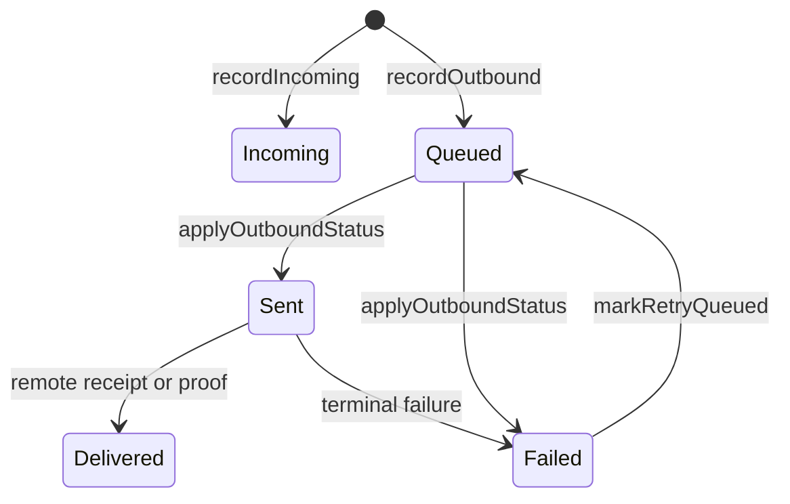

# MessageStatus and Ledger persistence

## Status facts

`MessageStatus` has only five values: `Incoming`, `Queued`, `Sent`, `Failed`, `Delivered`. Draft, TimedOut, and Acknowledged in the original picture do not exist and cannot be used as confirmed status.

## Read separately from the persistence results

The `LedgerPersistence` returned by `recordOutbound` / `recordIncoming` is another dimension:

- `Durable`: This time it has been persisted;
- `Deferred`: has entered a fixed depth of pending write;
- `Rejected`: has not been accepted by the ledger.

Message status and persistence results cannot be combined into a state machine.
