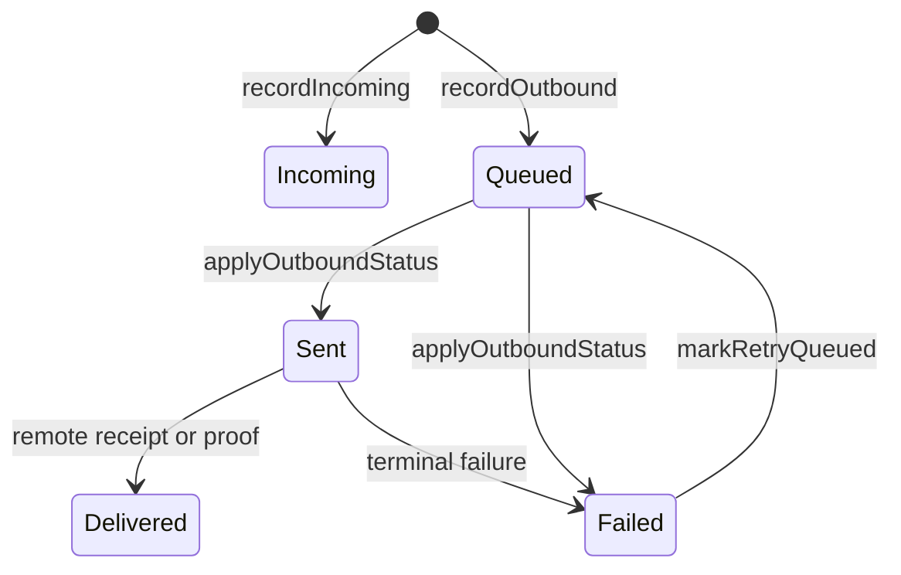

# MessageStatus 与 Ledger 持久化

## 状态事实

`MessageStatus` 只有五个值：`Incoming`、`Queued`、`Sent`、`Failed`、`Delivered`。原图中的 Draft、TimedOut、Acknowledged 并不存在，不能作为 confirmed 状态。

## 与持久化结果分开读

`recordOutbound` / `recordIncoming` 返回的 `LedgerPersistence` 是另一个维度：

- `Durable`：本次已经持久化；
- `Deferred`：已进入固定深度 pending write；
- `Rejected`：没有被账本接受。

消息状态和持久化结果不能合并成一个状态机。

