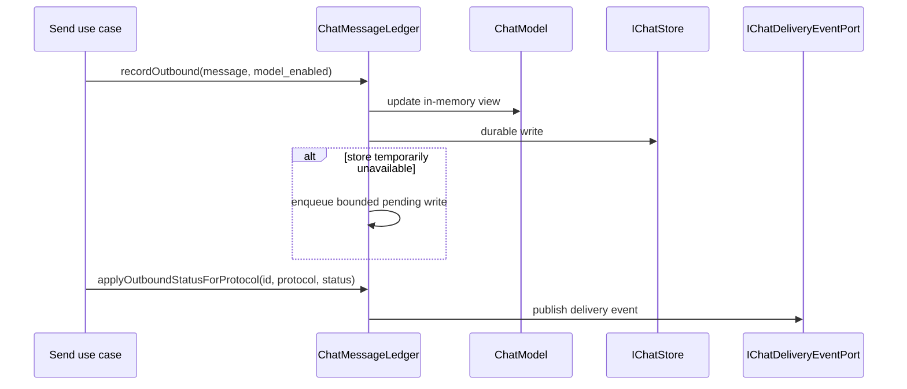

# Communication, Conversation and Delivery

Model status: **confirmed, still gaps in boundaries**

## What this part of the code actually solves

Trail Mate projects text messages from Meshtastic, MeshCore and Reticulum into a common chat record, but the session identity still retains protocol differences. The real model here is not the abstract "Conversation aggregate", but the collaboration of `ConversationId`, `ConversationMeta`, `ChatMessage`, `MessageStatus` and `ChatMessageLedger`.

## Observed Domain Language

| Symbols | Meaning in code | Evidence |
| --- | --- | --- |
| `ConversationId` | Identified by `MeshProtocol + ChannelId + peer`; Reticulum uses destination identity comparison | `chat_types.h:297` |
| `ConversationMeta` | Conversation list projection: name, preview, last timestamp, unread | `chat_types.h:432` |
| `ChatMessage` | Message text, protocol, sender, peer, time, geographical information, source credibility and status | `chat_types.h:377` |
| `MessageStatus` | `Incoming / Queued / Sent / Failed / Delivered` | `chat_types.h:365` |
| `ChatMessageLedger` | Write message, apply state, delayed persistence, paged reading and publish delivery event | `chat_message_ledger.h:22` |

## What happens after a message is sent

There is an important implemented constraint here: state lookup provides a `MessageId + MeshProtocol` version, indicating that `MessageId` alone is not sufficient to uniquely locate a message across protocols.

## Boundaries of the receive path

`ReceivePacketService` belongs to `core_mesh` and is responsible for turning radio/protocol input into verified reception facts; `ChatMessageLedger.recordIncoming` only submits it to the chat storage. Protocol parsing, authentication, and chat persistence are therefore adjacent but distinct responsibilities.

## Resources and failure semantics

- outbound pending write depth is fixed at 8.
- pending status write depth is fixed at 16.
- `LedgerPersistence` clearly differentiates between `Durable / Deferred / Rejected`.
- Delivery failure is entered into the event via `SendFailureKind` instead of just being left with a boolean value.

## Unresolved design issues

- Chat still contains Reticulum-specific identity/hash fields; cross-protocol message abstraction does not completely isolate wire identity.
- `ConversationMeta` is a UI projection and should not be described as an aggregate root.
- The contact and peer directories already have separate models; what is missing is an explicit revocable IdentityLink between it and the Mesh verified key and session participants, see Review Queue.

## Drill down

- [MessageStatus and Ledger status changes](message-delivery-lifecycle.md)
- Source code: `modules/core_chat/include/chat/domain/chat_types.h`
- Source code: `modules/core_chat/include/chat/delivery/chat_message_ledger.h`
- Test: `modules/core_chat/tests/test_chat_message_ledger.cpp`
