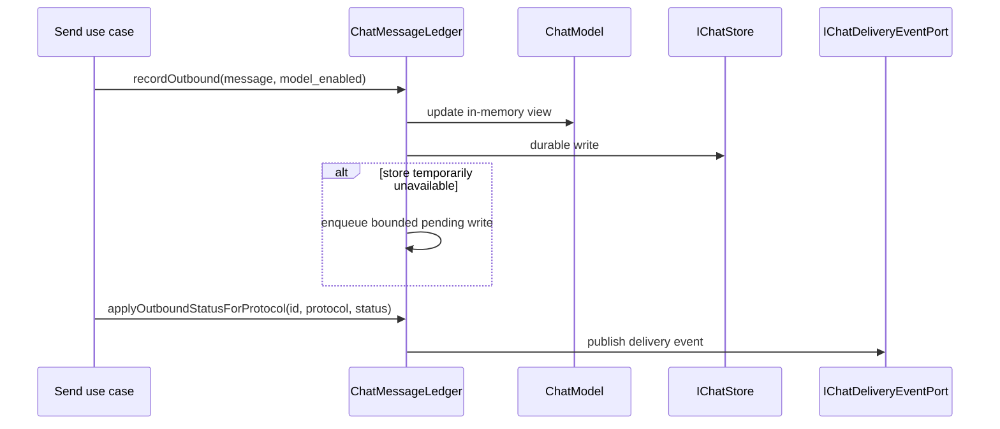

# 通信、会话与投递

模型状态：**confirmed，边界仍有缺口**

## 这部分代码实际解决什么

Trail Mate 把 Meshtastic、MeshCore 和 Reticulum 的文本消息投影为共同的聊天记录，但会话身份仍保留协议差异。这里真正存在的模型不是抽象的“Conversation aggregate”，而是 `ConversationId`、`ConversationMeta`、`ChatMessage`、`MessageStatus` 与 `ChatMessageLedger` 的协作。

## 已观察到的领域语言

| 符号 | 代码中的含义 | 证据 |
| --- | --- | --- |
| `ConversationId` | 由 `MeshProtocol + ChannelId + peer` 标识；Reticulum 使用 destination identity 比较 | `chat_types.h:297` |
| `ConversationMeta` | 会话列表投影：name、preview、last timestamp、unread | `chat_types.h:432` |
| `ChatMessage` | 消息正文、协议、发送者、peer、时间、地理信息、来源可信度与状态 | `chat_types.h:377` |
| `MessageStatus` | `Incoming / Queued / Sent / Failed / Delivered` | `chat_types.h:365` |
| `ChatMessageLedger` | 写入消息、应用状态、延迟持久化、分页读取和发布 delivery event | `chat_message_ledger.h:22` |

## 发出一条消息后发生什么

这里有一个重要的已实现约束：状态查找提供 `MessageId + MeshProtocol` 版本，说明仅靠 `MessageId` 不足以跨协议唯一定位消息。

## 接收路径的边界

`ReceivePacketService` 属于 `core_mesh`，负责把 radio/protocol 输入变成经过验证的接收事实；`ChatMessageLedger.recordIncoming` 才把它提交到聊天存储。协议解析、身份验证和聊天持久化因此是相邻但不同的职责。

## 资源与失败语义

- outbound pending write 深度固定为 8。
- pending status write 深度固定为 16。
- `LedgerPersistence` 明确区分 `Durable / Deferred / Rejected`。
- delivery failure 通过 `SendFailureKind` 进入事件，而不是只剩一个布尔值。

## 仍未解决的设计问题

- Chat 中仍包含 Reticulum 专属 identity/hash 字段；跨协议消息抽象没有完全把 wire identity 隔离出去。
- `ConversationMeta` 是 UI 投影，不应被描述成聚合根。
- 联系人和对端目录已有独立模型；缺失的是它与 Mesh verified key、会话参与者之间显式可撤销的 IdentityLink，见 Review Queue。

## 下钻

- [MessageStatus 与 Ledger 状态变化](message-delivery-lifecycle.md)
- 源码：`modules/core_chat/include/chat/domain/chat_types.h`
- 源码：`modules/core_chat/include/chat/delivery/chat_message_ledger.h`
- 测试：`modules/core_chat/tests/test_chat_message_ledger.cpp`
