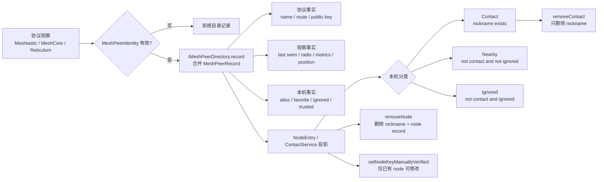

# 对端观察、联系人提升与本地信任

这张图区分协议观察、目录事实和用户事实。无线观察可以更新名称、位置、指标和 last-seen，但不应该静默删除 nickname、ignored 或已确认的信任。

## 读图时必须保留的语义

1. `MeshPeerIdentity` 是协议目录键，不等于业务联系人身份。
2. `Contact` 在当前代码中主要表现为“node id 拥有 nickname”，不是完整的人物聚合。
3. `removeContact` 不是 `removeNode`。
4. `ignored` 和 `trusted` 是本地用户事实，不是无线协议自动证明。
5. 当前 `isNodeVisible()` 总是返回 `true`；图中没有伪造六天过期状态。
6. 新 directory 与旧 stores 的同步边界仍需收敛。

## 相关源码

- `modules/core_chat/include/chat/domain/mesh_peer_directory.h`
- `modules/core_chat/include/chat/ports/i_mesh_peer_directory.h`
- `modules/core_chat/include/chat/domain/contact_types.h`
- `modules/core_chat/src/usecase/contact_service.cpp`
