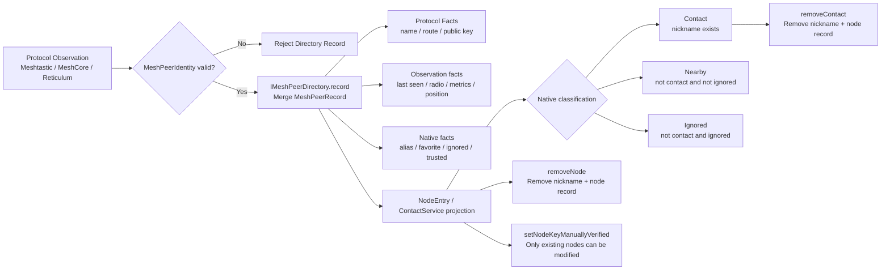

# Peer observation, contact promotion and local trust

This diagram distinguishes between protocol observation, directory facts and user facts. Wireless observations can update names, locations, metrics, and last-seen, but should not silently remove nicknames, ignored, or confirmed trusts.

## Semantics that must be retained when reading images

1. `MeshPeerIdentity` is a protocol directory key and is not equal to the business contact identity.
2. `Contact` in the current code mainly manifests itself as "node id has nickname", not a complete character aggregation.
3. `removeContact` is not `removeNode`.
4. `ignored` and `trusted` are local user facts, not automatic certification by the wireless protocol.
5. Currently `isNodeVisible()` always returns `true`; there is no fake six-day expiration state in the figure.
6. The synchronization boundaries between the new directory and the old stores still need to converge.

## Related source code

- `modules/core_chat/include/chat/domain/mesh_peer_directory.h`
- `modules/core_chat/include/chat/ports/i_mesh_peer_directory.h`
- `modules/core_chat/include/chat/domain/contact_types.h`
- `modules/core_chat/src/usecase/contact_service.cpp`
