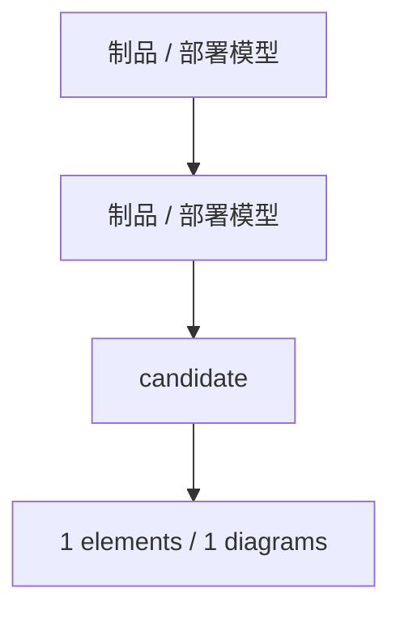

# 制品 / 部署模型

<!-- praxis:uml-model-registry:start -->

## 定位

- Viewpoint：描述 Artifact、Node、Device、ExecutionEnvironment、Deployment 和 CommunicationPath
- Stakeholder：架构师、运维、发布负责人、开发者
- Abstraction Level：artifact / node / execution environment / deployment
- Authority：docs/models/deployment-artifact 与 docs/engineering 的 deployment 投影共同承载。
- 状态：candidate

## 解释目标

解释开发、部署和运行中使用或产生的物理信息项，以及它们被分配到哪些计算资源上执行。

## Package 概览图

## Package / Diagram

### 制品 / 部署模型

Model 根命名空间下组织 0 个直接模型元素，并通过 0 张 UML 图呈现。

| Diagram | Kind | 文档 | 状态 | 置信度 | 代表元素 |
| --- | --- | --- | --- | --- | --- |

### candidate

candidate 命名空间下组织 1 个直接模型元素，并通过 1 张 deployment 图呈现。

#### Elements

- deployment / relationship：尚未生成制品 / 部署模型。尚未生成制品 / 部署模型 表示制品、运行节点或部署关系；它解释 Artifact 如何被分配到 Node 或 ExecutionEnvironment。

| Diagram | Kind | 文档 | 状态 | 置信度 | 代表元素 |
| --- | --- | --- | --- | --- | --- |
| 尚未生成制品 / 部署模型 | deployment | [HTML](deployment-artifact/model.html) / [Markdown](deployment-artifact/model.md) | candidate | low | Artifact、Node、Device、ExecutionEnvironment、Deployment |

## Trace / Refine

- REALIZE：model:software-structure -> model:deployment-artifact。软件结构中的 Component、Interface 和 Classifier 最终应映射到 Artifact、Node 或 ExecutionEnvironment。
- PROJECT：model:deployment-artifact -> projection:engineering-explorer。Engineering Explorer 投影 是 model:deployment-artifact 的展示投影；它可以帮助讨论，但不能覆盖 Model / Package / Element 的权威边界。
- PROJECT：model:deployment-artifact -> projection:architecture-c4。Architecture Explorer / C4 投影 是 model:deployment-artifact 的展示投影；它可以帮助讨论，但不能覆盖 Model / Package / Element 的权威边界。

<!-- praxis:uml-model-registry:end -->
