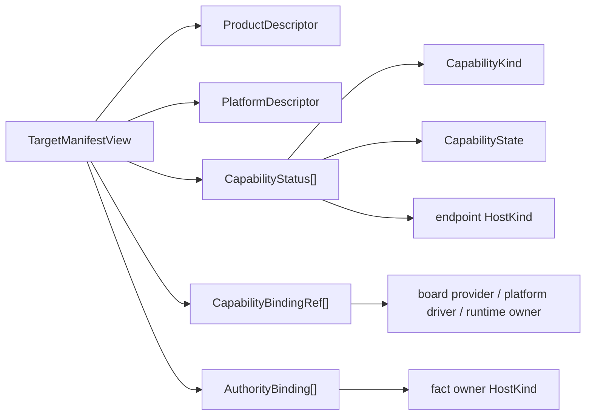

# Target → Capability → Authority

```mermaid
flowchart LR
  Target["TargetManifestView"] --> Product["ProductDescriptor"]
  Target --> Platform["PlatformDescriptor"]
  Target --> Status["CapabilityStatus[]"]
  Target --> Binding["CapabilityBindingRef[]"]
  Target --> Authority["AuthorityBinding[]"]
  Status --> Kind["CapabilityKind"]
  Status --> State["CapabilityState"]
  Status --> Endpoint["endpoint HostKind"]
  Binding --> Provider["board provider / platform driver / runtime owner"]
  Authority --> Owner["fact owner HostKind"]
```

C
