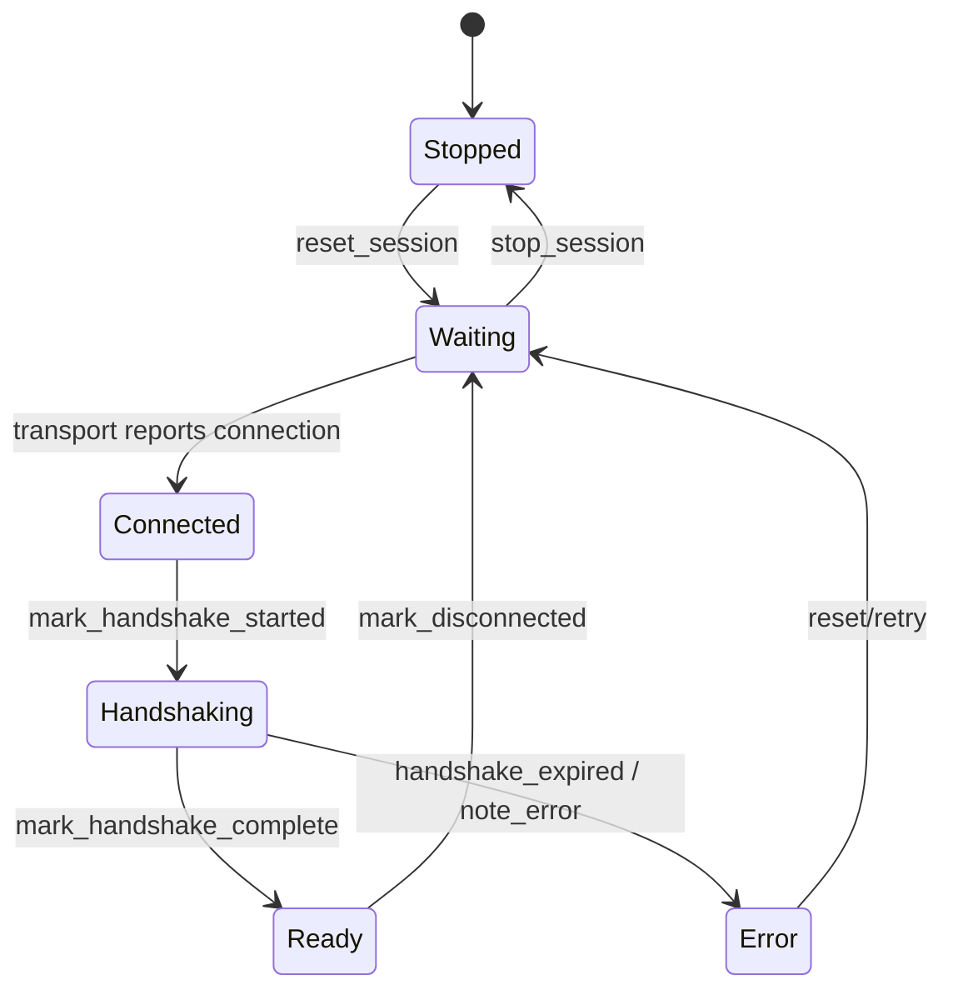

# LinkState 与 handshake 生命周期

```mermaid
stateDiagram-v2
  [*] --> Stopped
  Stopped --> Waiting: reset_session
  Waiting --> Connected: transport reports connection
  Connected --> Handshaking: mark_handshake_started
  Handshaking --> Ready: mark_handshake_complete
  Handshaking --> Error: handshake_expired / note_error
  Ready --> Waiting: mark_disconnected
  Error --> Waiting: reset/retry
  Waiting --> Stopped: stop_session
```

Observed 状态只有 `Stopped / Waiting / Connected / Handshaking / Ready / Error`。原图中的 Offline、Recovering、Incompatible 不在 `LinkState` 中，已经移除。

