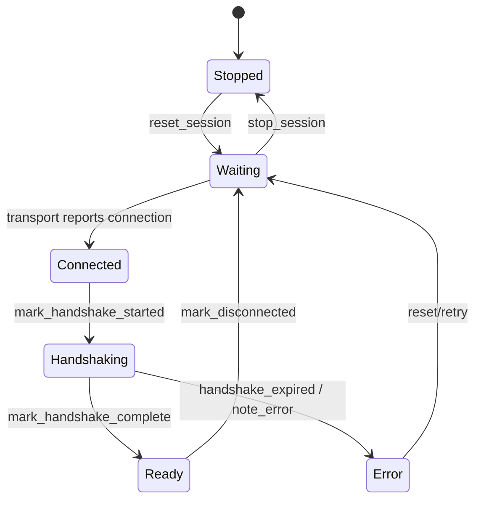

# LinkState and handshake life cycle

Observed status is only `Stopped / Waiting / Connected / Handshaking / Ready / Error`. Offline, Recovering, and Incompatible in the original image are not in `LinkState` and have been removed.
