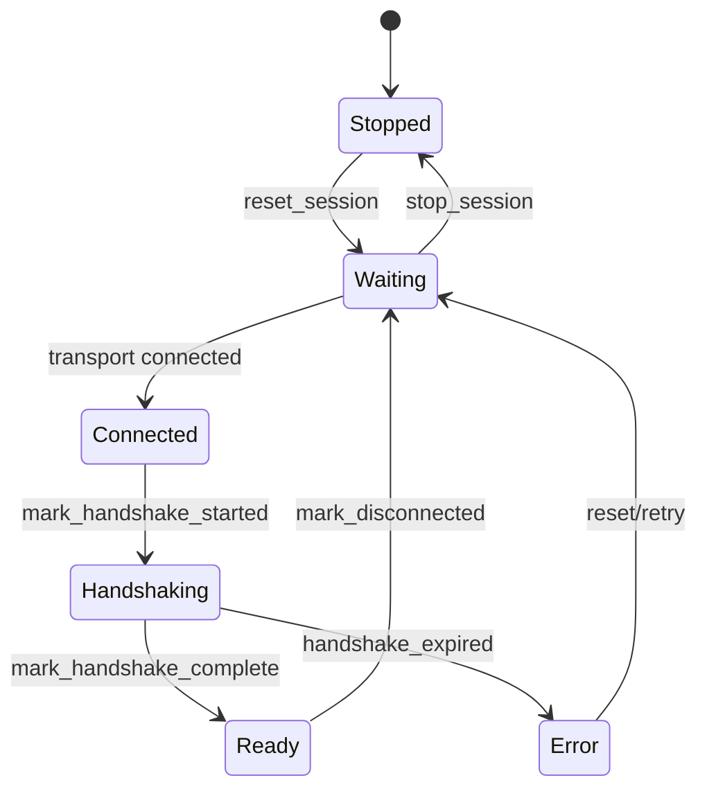

# HostLink session state and frame routing

Model status: **integration · confirmed; belongs to the cross-processor integration model**

## Real representation of the session

There is no `HostlinkSession` class here. A session consists of three explicit structures:

- `LinkState`:`Stopped / Waiting / Connected / Handshaking / Ready / Error`
- `Status`:state、RX/TX count、last error
- `SessionRuntime`:Status、TX sequence、handshake deadline、status/GPS emit timestamps

Behavior is operated by functions such as `reset_session`, `stop_session`, `set_link_state`, `mark_handshake_started`, `mark_handshake_complete`, `mark_disconnected` and `handshake_expired`.

## Handshake and recovery

The external triggering of `Connected` to `Handshaking` is the responsibility of the caller; the description of these calling relationships in the figure belongs to Inferred and should be verified through execution flow.

## Decision before the frame enters the service

`hostlink_frame_router.h` definition:

- `HostlinkCommandId`
- `HostlinkFrameDecisionType`
- `HostlinkFrameDecision`

Frame router first generates a decision, and then the service/config/event/app-data codec translates the payload. The responsibility of Transport is byte transfer; the responsibility of Session is link status and sequence number; the responsibility of Router is frame classification. These three cannot be combined into "C6 service".

## Periodic output

`should_emit_status` / `mark_status_emitted` and `should_emit_gps` / `mark_gps_emitted` indicate that status and GPS push each have a throttling status; they are part of the SessionRuntime, not the UI timer.

## Still needs to be verified

- processing rules for sequence wrap-around and old session responses.
- Whether version/capability negotiation is completed in the codec or upper-layer service.
- retry ownership after `Error`.

## Drilldown and evidence

- [LinkState and handshake life cycle](hostlink-session.md)
- `modules/core_hostlink/include/hostlink/hostlink_session.h`
- `modules/core_hostlink/src/hostlink_session.cpp`
- `modules/core_hostlink/include/hostlink/hostlink_frame_router.h`
