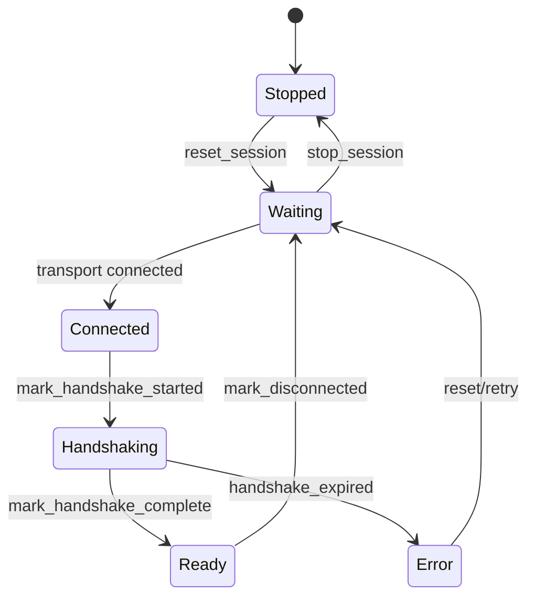

# HostLink 会话状态与帧路由

模型状态：**integration · confirmed；属于跨处理器集成模型**

## 会话的真实表示

这里没有 `HostlinkSession` 类。会话由三个明确结构组成：

- `LinkState`：`Stopped / Waiting / Connected / Handshaking / Ready / Error`
- `Status`：state、RX/TX count、last error
- `SessionRuntime`：Status、TX sequence、handshake deadline、status/GPS emit timestamps

行为由 `reset_session`、`stop_session`、`set_link_state`、`mark_handshake_started`、`mark_handshake_complete`、`mark_disconnected` 和 `handshake_expired` 等函数操作。

## 握手与恢复

`Connected` 到 `Handshaking` 的外部触发由调用方负责；图中对这些调用关系的描述属于 Inferred，应通过 execution flow 验证。

## 帧进入业务前的决定

`hostlink_frame_router.h` 定义：

- `HostlinkCommandId`
- `HostlinkFrameDecisionType`
- `HostlinkFrameDecision`

Frame router 先产生 decision，再由 service/config/event/app-data codec 翻译 payload。Transport 的职责是字节搬运；Session 的职责是链接状态和序号；Router 的职责是 frame 分类。这三者不能合成“C6 service”。

## 周期性输出

`should_emit_status` / `mark_status_emitted` 与 `should_emit_gps` / `mark_gps_emitted` 表示 status 和 GPS push 各自具有节流状态；它们是 SessionRuntime 的组成部分，而不是 UI timer。

## 仍需验证

- sequence wrap-around 和旧 session response 的处理规则。
- version/capability negotiation 是否在 codec 或上层 service 完成。
- `Error` 后的 retry ownership。

## 下钻与证据

- [LinkState 与 handshake 生命周期](hostlink-session.md)
- `modules/core_hostlink/include/hostlink/hostlink_session.h`
- `modules/core_hostlink/src/hostlink_session.cpp`
- `modules/core_hostlink/include/hostlink/hostlink_frame_router.h`
