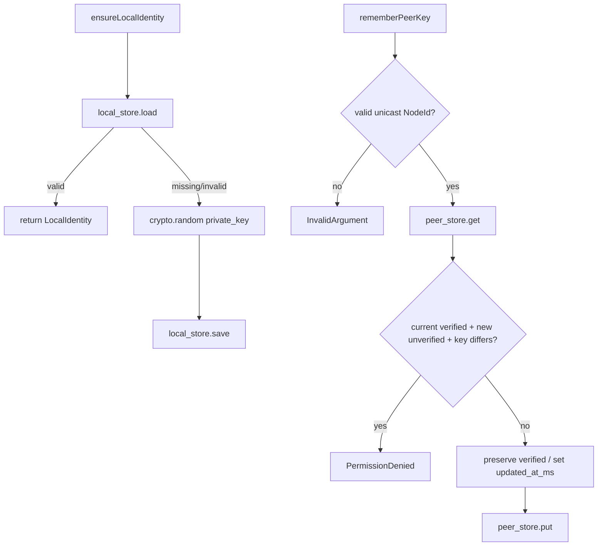

# 本机身份建立与对端公钥保护

```mermaid
flowchart TD
  Ensure["ensureLocalIdentity"] --> Load["local_store.load"]
  Load -->|valid| Existing["return LocalIdentity"]
  Load -->|missing/invalid| Random["crypto.random private_key"]
  Random --> Save["local_store.save"]
  Remember["rememberPeerKey"] --> Node{"valid unicast NodeId?"}
  Node -->|no| Invalid["InvalidArgument"]
  Node -->|yes| Current["peer_store.get"]
  Current --> Guard{"current verified + new unverified + key differs?"}
  Guard -->|yes| Deny["PermissionDenied"]
  Guard -->|no| Stamp["preserve verified / set updated_at_ms"]
  Stamp --> Put["peer_store.put"]
```

图中没有“联系人”或“稳定 PeerIdentity”，因为当前 `core_mesh` 只明确拥有 `LocalIdentity` 和 `PeerPublicKey`。

