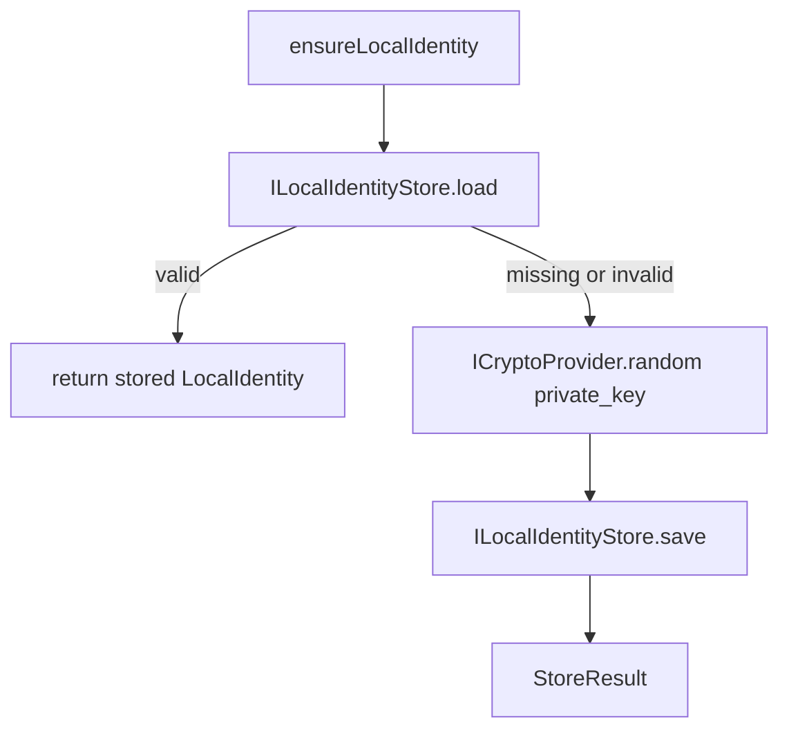
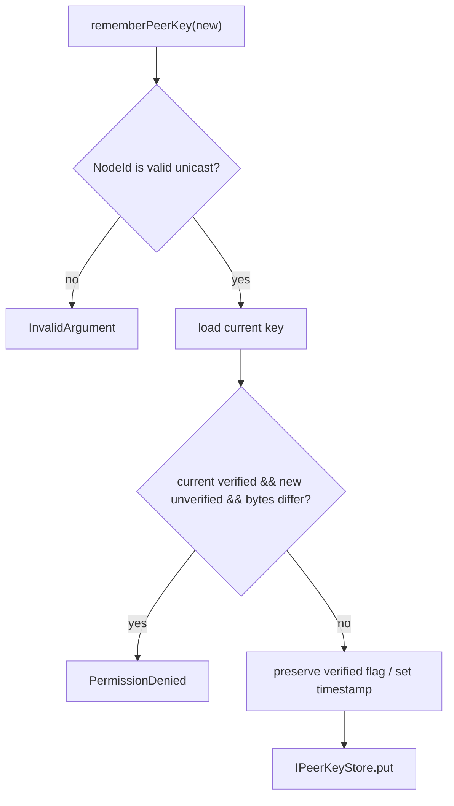

# Mesh native identity and peer public key

Model status: **confirmed, but cross-protocol business identity link is still missing**

## Data that the code really owns

`core_mesh` currently does not have a complete `PeerIdentity` entity. What it owns is the local key pair and the peer public key record:

| Symbol | Field/Behavior | Judgment |
| --- | --- | --- |
| `LocalIdentity` | 32-byte private key、32-byte public key、`valid` | Observed |
| `PeerPublicKey` | `NodeId`、public key、`updated_at_ms`、`verified` | Observed |
| `PeerIdentityService` | ensure local identity、find peer key、remember peer key | Observed |
| `ILocalIdentityStore` / `IPeerKeyStore` | Isolate local and peer key persistence | Observed |

Therefore the more accurate name of this model is "Mesh local identity and peer public key", rather than the completed user identity model.

## Native identity establishment

The implementation will generate the private key and mark it as `valid`, but the public key is not deduced here in the code visible from the current function; this should be used as an implementation checkpoint and should not be assumed to be done in the documentation.

## Verified public key protection rules

 There is an explicit rule in `rememberPeerKey`: if there is already a key with `verified=true` in the store, and the new input is not verified and the key bytes are different, `PermissionDenied` is returned. Unvalidated input cannot silently replace a validated key.

## This model does not claim anything

- `PeerPublicKey` is not a contact and does not contain a display name or cross-protocol person identity.
- The mapping of `NodeId` to Chat contact and Team member is not defined in this model.
- Key rotation, revocation, and association of multiple protocol identities still lack an explicit model.

These deletions should go into Identity ownership finding, rather than renaming `PeerPublicKey` to the non-existent `PeerIdentity`.

## Drilldown and evidence

- [Peer key resolution and replacement rules](identity-resolution.md)
- `modules/core_mesh/include/mesh/domain/local_identity.h`
- `modules/core_mesh/include/mesh/domain/peer_identity.h`
- `modules/core_mesh/src/usecase/peer_identity_service.cpp`
- `modules/core_mesh/tests/test_peer_identity_service.cpp`
