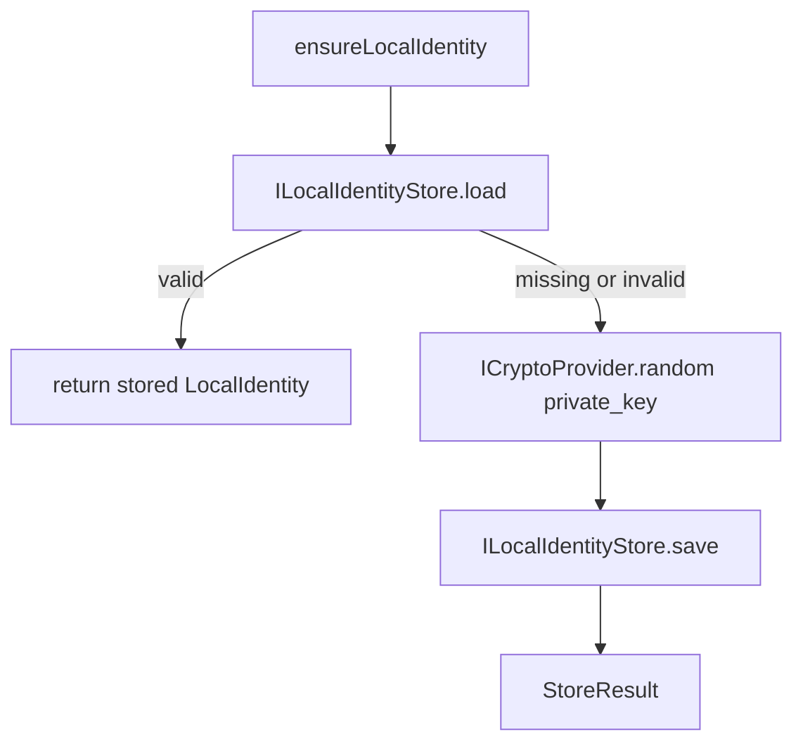
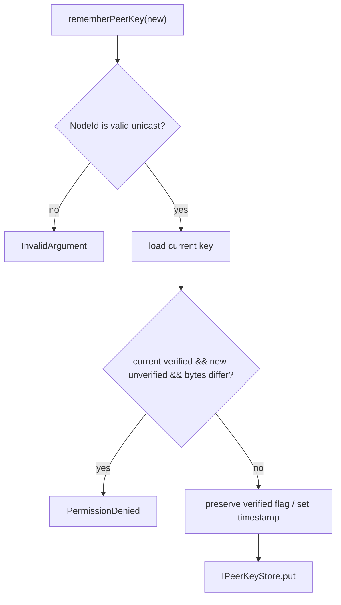

# Mesh 本机身份与对端公钥

模型状态：**confirmed，但跨协议业务身份链接仍缺失**

## 代码真正拥有的数据

`core_mesh` 当前没有完整的 `PeerIdentity` 实体。它拥有的是本机密钥对与对端公钥记录：

| 符号 | 字段 / 行为 | 判断 |
| --- | --- | --- |
| `LocalIdentity` | 32-byte private key、32-byte public key、`valid` | Observed |
| `PeerPublicKey` | `NodeId`、public key、`updated_at_ms`、`verified` | Observed |
| `PeerIdentityService` | ensure local identity、find peer key、remember peer key | Observed |
| `ILocalIdentityStore` / `IPeerKeyStore` | 隔离本机与对端密钥持久化 | Observed |

因此这个模型更准确的名称是“Mesh 本机身份与对端公钥”，而不是已经完成的用户身份模型。

## 本机身份建立

实现会生成 private key 并标记 `valid`，但从当前函数可见代码中没有在这里推导 public key；这应作为实现核对点，而不能在文档里假定已完成。

## 已验证公钥保护规则

`rememberPeerKey` 中存在一条明确规则：如果 store 中已有 `verified=true` 的 key，而新输入未验证并且 key bytes 不同，则返回 `PermissionDenied`。未验证输入不能静默替换已验证密钥。

## 这个模型没有声称什么

- `PeerPublicKey` 不是联系人，也不含显示名或跨协议 person identity。
- `NodeId` 到 Chat contact、Team member 的映射没有在本模型中定义。
- 密钥轮换、撤销、多个协议 identity 的关联仍缺显式模型。

这些缺失应进入 Identity ownership finding，而不是把 `PeerPublicKey` 重新命名成不存在的 `PeerIdentity`。

## 下钻与证据

- [Peer key 解析与替换规则](identity-resolution.md)
- `modules/core_mesh/include/mesh/domain/local_identity.h`
- `modules/core_mesh/include/mesh/domain/peer_identity.h`
- `modules/core_mesh/src/usecase/peer_identity_service.cpp`
- `modules/core_mesh/tests/test_peer_identity_service.cpp`
