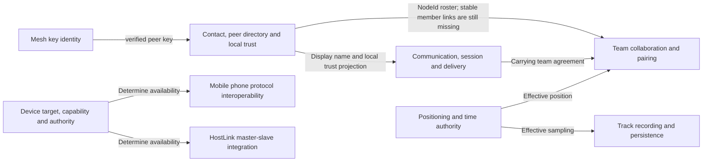

# Trail Mate Model Registry

<!-- praxis:uml-model-registry:start -->

Status: **confirmed**

Model: **9**

Domain Elements: **37**
Cross-model Trace: **8**

## Why not three models

The "organization and process, software structure, deployment and artifacts" originally displayed by Praxis are three reading perspectives, not Trail Mate three realm boundaries. The domain model should answer: who owns the state, which rules must always hold, which concepts use the same business language, and within which boundaries a business change is consistent.

By this standard, Trail Mate's current code recognizes nine model boundaries. Contacts, peer directories and local trusts were originally mistakenly inserted into the Chat/Mesh attachment structure. This time they are filled in according to the actual owner status. Team models can only be marked as candidate: pairing status, credentials, and roster operations are explicitly present, but member aggregation and team lifecycle are not formed. Model Explorer only displays models with source code owners; models that have not yet been formed remain in the Review Queue.

## Confirmed or evidenced model

| Model | Core question | Key owner | Status |
| --- | --- | --- | --- |
| [Communication, conversation and delivery model](communication-conversation/model.md) | How does a message enter a session and undergo a verifiable delivery life cycle? | `ChatMessageLedger` | confirmed |
| [Mesh local identity and peer public key](mesh-network-identity/model.md) | How to create, save and prevent overwriting of local key and verified peer key? | `PeerIdentityService` | confirmed |
| [Contact, Peer Directory and Local Trust](contact-peer-directory/model.md) | How does protocol observation enter the directory, and how does the user save, ignore, name or trust a peer? | `MeshPeerRecord` / `ContactService` | confirmed · boundary split |
| [Team Credentials, Coordination Status, and Coordination Messages](team-coordination/model.md) | How does TeamKeys and Leader/Member pairing work; what is missing from the member model? | `TeamPairingCoordinator` | candidate |
| [GNSS positioning, transition filtering and time updates](positioning-time/model.md) | How does NMEA revision become LocationFix, positioning events and time updates? | `LocationService` | confirmed |
| [Track Recording and Persistence Model](track-recording/model.md) | How can recording sessions reliably save tracks under bounded resources? | `TrackStateMachine` | confirmed |
| [Device target, capability and authority model](device-target-capability/model.md) | What capabilities does a target have and who currently controls it? | `TargetManifestView` / `AuthorityBinding` | confirmed |
| [HostLink Session State and Frame Routing](hostlink-integration/model.md) | `SessionRuntime` How to manage handshakes, sequence numbers, throttling and disconnection? | `SessionRuntime` / frame router | integration · confirmed |
| [Mobile application protocol interoperability](phone-interoperability/model.md) | How does the common application contract connect two different phone protocol cores? | `IPhoneAppFacade` / protocol cores | integration · confirmed |

## Cross-model relationship

## Must be with Model Explorer Separate content

Some important concepts currently do not have a maintainable domain model. The yaw judgment of route navigation exists, but the rules are located in the UI runtime; the configuration lacks unified aggregation and verification owner; TeamService has a roster operation but no TeamMember life cycle; there is no revocable IdentityLink from the agreement identity to the business contact. These are design flaws that have been put into the Review Queue, not fake shell models here.

In addition, stable state language has appeared for Reticulum Call, Package Install, Firmware Update and Wi-Fi Lease, but the Model-or-Projection classification has not yet been completed. They enter the Review Queue as "candidates for decision"; the nine Registry models are therefore just a collection of current source code owners, not the conclusion that "the project only needs nine models".

A different problem is: the model obviously exists, but the tool is not found. This was the discovery flaw in the old fixed three model. It also enters the Review Queue, but cannot be confused with "Model Missing".

## Authority relations

 - `docs/models/model-registry.json`: Handwritten structured index read by Praxis.
- Each `model.md`: domain meaning, boundaries, invariants, elements and source code evidence.
- Review Queue: Discover defects and real design flaws.
- Design / Engineering / C4: Reading projection of the above domain model, does not cover the model itself.

<!-- praxis:uml-model-registry:end -->
