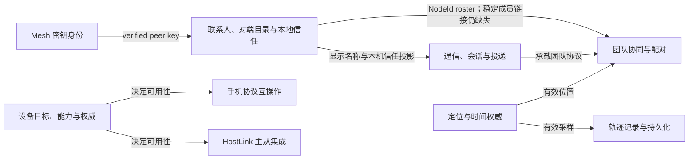

# Trail Mate Model Registry

<!-- praxis:uml-model-registry:start -->

状态：**confirmed**

模型：**9**

领域元素：**37**
跨模型 Trace：**8**

## 为什么不是三个模型

Praxis 原先展示的“组织与过程、软件结构、部署与制品”是三种阅读视角，不是 Trail Mate 的三个领域边界。领域模型应回答：谁拥有状态、哪些规则必须始终成立、哪些概念使用同一种业务语言、一次业务变更在哪个边界内保持一致。

按这个标准，Trail Mate 当前代码中可以识别九个模型边界。联系人、对端目录与本地信任原本被误塞进 Chat/Mesh 附属结构，这次按实际状态 owner 补入。团队模型只能标为 candidate：配对状态、凭据和 roster 操作明确存在，但成员聚合与团队生命周期没有形成。Model Explorer 只展示有源码 owner 的模型；尚未形成的模型留在 Review Queue。

## 已确认或已有证据的模型

| Model | 核心问题 | 关键 owner | 状态 |
| --- | --- | --- | --- |
| [通信、会话与投递模型](communication-conversation/model.md) | 消息如何进入会话并经历可验证的投递生命周期？ | `ChatMessageLedger` | confirmed |
| [Mesh 本机身份与对端公钥](mesh-network-identity/model.md) | 本机密钥和 verified peer key 如何创建、保存与防覆盖？ | `PeerIdentityService` | confirmed |
| [联系人、对端目录与本地信任](contact-peer-directory/model.md) | 协议观察如何进入目录，用户如何保存、忽略、命名或信任一个对端？ | `MeshPeerRecord` / `ContactService` | confirmed · boundary split |
| [团队凭据、配对状态与协同消息](team-coordination/model.md) | TeamKeys 与 Leader/Member 配对如何工作；成员模型缺了什么？ | `TeamPairingCoordinator` | candidate |
| [GNSS 定位、跳变过滤与时间更新](positioning-time/model.md) | NMEA revision 如何变成 LocationFix、位置事件和时间更新？ | `LocationService` | confirmed |
| [轨迹记录与持久化模型](track-recording/model.md) | 记录会话如何在有界资源下可靠保存轨迹？ | `TrackStateMachine` | confirmed |
| [设备目标、能力与权威模型](device-target-capability/model.md) | 某目标到底具备什么能力，当前由谁控制？ | `TargetManifestView` / `AuthorityBinding` | confirmed |
| [HostLink 会话状态与帧路由](hostlink-integration/model.md) | `SessionRuntime` 如何管理握手、序号、节流和断线？ | `SessionRuntime` / frame router | integration · confirmed |
| [手机应用协议互操作](phone-interoperability/model.md) | 共同应用契约如何连接两个不同 phone protocol core？ | `IPhoneAppFacade` / protocol cores | integration · confirmed |

## 跨模型关系

## 必须和 Model Explorer 分开的内容

有些重要概念当前**没有形成可维护的领域模型**。路线导航的偏航判断存在，但规则位于 UI runtime；配置缺少统一聚合和验证 owner；TeamService 有 roster 操作却没有 TeamMember 生命周期；协议身份到业务联系人也没有可撤销 IdentityLink。这些是设计缺陷，已放入 Review Queue，而不是在这里伪造空壳模型。

另外，Reticulum Call、Package Install、Firmware Update 与 Wi-Fi Lease 已出现稳定状态语言，但尚未完成 Model-or-Projection 分类。它们以“候选待裁决”进入 Review Queue；九个 Registry 模型因此只是当前已有源码 owner 的集合，不是“项目只需要九个模型”的结论。

另一个不同的问题是：模型明明已经存在，工具却没有找到。旧版固定三模型就是这种发现缺陷。它同样进入 Review Queue，但不能和“模型缺失”混为一谈。

## 权威关系

- `docs/models/model-registry.json`：Praxis 读取的手写结构化索引。
- 每个 `model.md`：领域含义、边界、不变量、元素与源码证据。
- Review Queue：发现缺陷与真正的设计缺陷。
- Design / Engineering / C4：上述领域模型的阅读投影，不覆盖模型本身。

<!-- praxis:uml-model-registry:end -->
