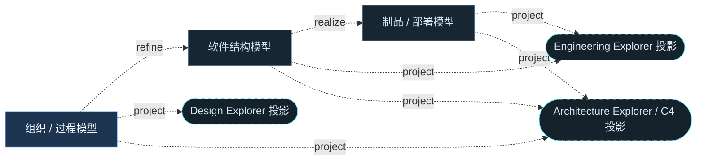

# UML Model Registry

<!-- praxis:uml-model-registry:start -->

## 元数据

项目版本：0.1.30-alpha
Git 分支：main
Git 提交：34aad0bffa2f6450192f655f248a94b6c3cbd767
Git 工作区状态：dirty
更新于：2026-06-25T14:37:21.494Z

## 建模原则

- 业务与技术通过 Model 的 viewpoint、stakeholder 和 abstraction level 区分，而不是通过 UML 图种硬编码分层。
- 整体到局部使用 Model -> Package -> Classifier -> Feature / internal structure / owned Behavior 组织。
- Structure Diagram 与 Behavior Diagram 是正交视角；同一 Package 可以拥有多张互补图。
- C4 只能作为架构视角投影存在，不是 docs 记忆中的独立真相源。
- 内部仓库分析指标、关系计数和工具节点 ID 只是证据与生成过程，不得成为用户可见模型语言。

## Model 概览图

## Model 索引

| Model | Viewpoint | Abstraction Level | Packages | Elements | Diagrams | Authority |
| --- | --- | --- | ---: | ---: | ---: | --- |
| 组织 / 过程模型 | 描述参与者、业务过程、用例目标、可观察结果和业务概念 | system intent / business process / observable behavior | 2 | 1 | 1 | docs/models/organization-process 是归一化模型目录；docs/design 作为组织/过程模型的兼容投影输入共同承载。 |
| 软件结构模型 | 描述 Package、Component、Interface、Port、Class、Connector、结构协作和运行时 Interaction | package / component / classifier / owned behavior | 20 | 68 | 68 | docs/models/software-structure 是归一化模型目录；docs/engineering 作为软件结构模型的兼容投影输入共同承载。 |
| 制品 / 部署模型 | 描述 Artifact、Node、Device、ExecutionEnvironment、Deployment 和 CommunicationPath | artifact / node / execution environment / deployment | 2 | 1 | 1 | docs/models/deployment-artifact 与 docs/engineering 的 deployment 投影共同承载。 |

## Package / Element / Diagram 索引

### 组织 / 过程模型

解释系统要改变或稳定的业务秩序；UseCase 不描述 subject 内部结构，内部结构由 Trace / Refine 连接到软件结构模型。

| Package | Element | Element Kind | Diagram | Diagram Kind | 文档 | 状态 | 置信度 |
| --- | --- | --- | --- | --- | --- | --- | --- |
| candidate | Trail Mate 业务用例集 | use_case | Trail Mate Use Case Diagram Map | use_case | [HTML](docs/design/use-case-diagrams-maps.html) | candidate | high |

### 软件结构模型

解释软件如何被模块化、如何通过接口协作、哪些结构承载业务用例；不把目录、调用密度或工具指标当成模型对象。

| Package | Element | Element Kind | Diagram | Diagram Kind | 文档 | 状态 | 置信度 |
| --- | --- | --- | --- | --- | --- | --- | --- |
| managed_components | 模块边界：managed_components | package | 模块边界：managed_components | package | [HTML](docs/engineering/package-diagrams/managed_components/package-diagram.html) | candidate | high |
| build.t_display_p4_tft | 模块边界：build.t_display_p4_tft | package | 模块边界：build.t_display_p4_tft | package | [HTML](docs/engineering/package-diagrams/build-t_display_p4_tft/package-diagram.html) | candidate | high |
| build.tdisplayp4_tft | 模块边界：build.tdisplayp4_tft | package | 模块边界：build.tdisplayp4_tft | package | [HTML](docs/engineering/package-diagrams/build-tdisplayp4_tft/package-diagram.html) | candidate | high |
| boards | 模块边界：boards | package | 模块边界：boards | package | [HTML](docs/engineering/package-diagrams/boards/package-diagram.html) | candidate | high |
| build.tdisplayp4_amoled | 模块边界：build.tdisplayp4_amoled | package | 模块边界：build.tdisplayp4_amoled | package | [HTML](docs/engineering/package-diagrams/build-tdisplayp4_amoled/package-diagram.html) | candidate | high |
| build.c6_companion | 模块边界：build.c6_companion | package | 模块边界：build.c6_companion | package | [HTML](docs/engineering/package-diagrams/build-c6_companion/package-diagram.html) | candidate | high |
| apps/linux_uconsole_gtk | 模块边界：apps/linux_uconsole_gtk | package | 模块边界：apps/linux_uconsole_gtk | package | [HTML](docs/engineering/package-diagrams/apps-linux_uconsole_gtk/package-diagram.html) | candidate | high |
| apps/esp32_lvgl | 模块边界：apps/esp32_lvgl | package | 模块边界：apps/esp32_lvgl | package | [HTML](docs/engineering/package-diagrams/apps-esp32_lvgl/package-diagram.html) | candidate | high |
| firmware | 模块边界：firmware | package | 模块边界：firmware | package | [HTML](docs/engineering/package-diagrams/firmware/package-diagram.html) | candidate | high |
| apps/nrf52_node | 模块边界：apps/nrf52_node | package | 模块边界：apps/nrf52_node | package | [HTML](docs/engineering/package-diagrams/apps-nrf52_node/package-diagram.html) | candidate | high |
| apps/linux_cardputer_zero | 模块边界：apps/linux_cardputer_zero | package | 模块边界：apps/linux_cardputer_zero | package | [HTML](docs/engineering/package-diagrams/apps-linux_cardputer_zero/package-diagram.html) | candidate | high |
| apps/linux_sim_shell | 模块边界：apps/linux_sim_shell | package | 模块边界：apps/linux_sim_shell | package | [HTML](docs/engineering/package-diagrams/apps-linux_sim_shell/package-diagram.html) | candidate | high |
| builds | 模块边界：builds | package | 模块边界：builds | package | [HTML](docs/engineering/package-diagrams/builds/package-diagram.html) | candidate | high |
| images | 模块边界：images | package | 模块边界：images | package | [HTML](docs/engineering/package-diagrams/images/package-diagram.html) | candidate | high |
| cmake | 模块边界：cmake | package | 模块边界：cmake | package | [HTML](docs/engineering/package-diagrams/cmake/package-diagram.html) | candidate | high |
| apps/README.md | 模块边界：apps/README.md | package | 模块边界：apps/README.md | package | [HTML](docs/engineering/package-diagrams/apps-readme-md/package-diagram.html) | candidate | high |
| COPYRIGHT | 模块边界：COPYRIGHT | package | 模块边界：COPYRIGHT | package | [HTML](docs/engineering/package-diagrams/copyright/package-diagram.html) | candidate | high |
| LICENSE | 模块边界：LICENSE | package | 模块边界：LICENSE | package | [HTML](docs/engineering/package-diagrams/license/package-diagram.html) | candidate | high |
| apps/linux_cardputer_zero | 函数节点：main | component | 函数节点：main | component | [HTML](docs/engineering/component-diagrams/apps-linux_cardputer_zero-main/component-diagram.html) | candidate | high |
| apps/linux_cardputer_zero | 函数节点：contains | component | 函数节点：contains | component | [HTML](docs/engineering/component-diagrams/apps-linux_cardputer_zero-contains/component-diagram.html) | candidate | high |
| apps/linux_uconsole_gtk | 函数节点：launchSettingsLayout | component | 函数节点：launchSettingsLayout | component | [HTML](docs/engineering/component-diagrams/apps-linux_uconsole_gtk-launchsettingslayout/component-diagram.html) | candidate | high |
| apps/linux_uconsole_gtk | 函数节点：makeLabel | component | 函数节点：makeLabel | component | [HTML](docs/engineering/component-diagrams/apps-linux_uconsole_gtk-makelabel/component-diagram.html) | candidate | high |
| apps/linux_uconsole_gtk | 函数节点：makeSettingsRow | component | 函数节点：makeSettingsRow | component | [HTML](docs/engineering/component-diagrams/apps-linux_uconsole_gtk-makesettingsrow/component-diagram.html) | candidate | high |
| apps/esp32_lvgl | 函数节点：main | component | 函数节点：main | component | [HTML](docs/engineering/component-diagrams/apps-esp32_lvgl-main/component-diagram.html) | candidate | high |
| apps/linux_cardputer_zero | 函数节点：not_contains | component | 函数节点：not_contains | component | [HTML](docs/engineering/component-diagrams/apps-linux_cardputer_zero-not_contains/component-diagram.html) | candidate | high |
| firmware | 服务对象：main | component | 服务对象：main | component | [HTML](docs/engineering/component-diagrams/firmware-main/component-diagram.html) | candidate | high |
| apps/esp32_lvgl | 函数节点：contains | component | 函数节点：contains | component | [HTML](docs/engineering/component-diagrams/apps-esp32_lvgl-contains/component-diagram.html) | candidate | high |
| boards | 函数节点：makeBoardProfile | component | 函数节点：makeBoardProfile | component | [HTML](docs/engineering/component-diagrams/boards-makeboardprofile/component-diagram.html) | candidate | high |
| boards | 函数节点：pinNum | component | 函数节点：pinNum | component | [HTML](docs/engineering/component-diagrams/boards-pinnum/component-diagram.html) | candidate | high |
| apps/linux_uconsole_gtk | 函数节点：refreshUi | component | 函数节点：refreshUi | component | [HTML](docs/engineering/component-diagrams/apps-linux_uconsole_gtk-refreshui/component-diagram.html) | candidate | high |
| apps/linux_uconsole_gtk | 函数节点：refreshMap | component | 函数节点：refreshMap | component | [HTML](docs/engineering/component-diagrams/apps-linux_uconsole_gtk-refreshmap/component-diagram.html) | candidate | high |
| apps/linux_cardputer_zero | 函数节点：read_file | component | 函数节点：read_file | component | [HTML](docs/engineering/component-diagrams/apps-linux_cardputer_zero-read_file/component-diagram.html) | candidate | high |
| firmware | 界面组件：tm_services_record_error | component | 界面组件：tm_services_record_error | component | [HTML](docs/engineering/component-diagrams/firmware-tm_services_record_error/component-diagram.html) | candidate | high |
| apps/linux_uconsole_gtk | 函数节点：main | component | 函数节点：main | component | [HTML](docs/engineering/component-diagrams/apps-linux_uconsole_gtk-main/component-diagram.html) | candidate | high |
| apps/linux_uconsole_gtk | 函数节点：launchMapLayout | component | 函数节点：launchMapLayout | component | [HTML](docs/engineering/component-diagrams/apps-linux_uconsole_gtk-launchmaplayout/component-diagram.html) | candidate | high |
| apps/esp32_lvgl | 函数节点：companion_enter | component | 函数节点：companion_enter | component | [HTML](docs/engineering/component-diagrams/apps-esp32_lvgl-companion_enter/component-diagram.html) | candidate | high |
| apps/linux_uconsole_gtk | 函数节点：expect | component | 函数节点：expect | component | [HTML](docs/engineering/component-diagrams/apps-linux_uconsole_gtk-expect/component-diagram.html) | candidate | high |
| apps/linux_uconsole_gtk | 函数节点：makeSwitch | component | 函数节点：makeSwitch | component | [HTML](docs/engineering/component-diagrams/apps-linux_uconsole_gtk-makeswitch/component-diagram.html) | candidate | high |
| apps/linux_uconsole_gtk | 函数节点：setLabel | component | 函数节点：setLabel | component | [HTML](docs/engineering/component-diagrams/apps-linux_uconsole_gtk-setlabel/component-diagram.html) | candidate | high |
| apps/linux_uconsole_gtk | 函数节点：makeSpin | component | 函数节点：makeSpin | component | [HTML](docs/engineering/component-diagrams/apps-linux_uconsole_gtk-makespin/component-diagram.html) | candidate | high |
| boards | 结构切片 boards · gat562_mesh_evb_pro/include/boards | class | 结构协作：结构切片 boards · gat562_mesh_evb_pro/include/boards | class | [HTML](docs/engineering/class-structural-diagrams/boards-gat562_mesh_evb_pro-include-boards/class-structural-diagram.html) | candidate | high |
| boards | 结构切片 boards · t_echo_lite/include/boards | class | 结构协作：结构切片 boards · t_echo_lite/include/boards | class | [HTML](docs/engineering/class-structural-diagrams/boards-t_echo_lite-include-boards/class-structural-diagram.html) | candidate | high |
| boards | 结构切片 boards · tab5/include/boards | class | 结构协作：结构切片 boards · tab5/include/boards | class | [HTML](docs/engineering/class-structural-diagrams/boards-tab5-include-boards/class-structural-diagram.html) | candidate | high |
| boards | 结构切片 boards · t_display_p4/include/boards | class | 结构协作：结构切片 boards · t_display_p4/include/boards | class | [HTML](docs/engineering/class-structural-diagrams/boards-t_display_p4-include-boards/class-structural-diagram.html) | candidate | high |
| boards | 结构切片 boards · tlora_pager/include/boards | class | 结构协作：结构切片 boards · tlora_pager/include/boards | class | [HTML](docs/engineering/class-structural-diagrams/boards-tlora_pager-include-boards/class-structural-diagram.html) | candidate | high |
| boards | 结构切片 boards · tdeck/include/boards | class | 结构协作：结构切片 boards · tdeck/include/boards | class | [HTML](docs/engineering/class-structural-diagrams/boards-tdeck-include-boards/class-structural-diagram.html) | candidate | high |
| boards | 结构切片 boards · tdeck_pro/include/boards | class | 结构协作：结构切片 boards · tdeck_pro/include/boards | class | [HTML](docs/engineering/class-structural-diagrams/boards-tdeck_pro-include-boards/class-structural-diagram.html) | candidate | high |
| boards | 结构切片 boards · twatchs3/include/boards | class | 结构协作：结构切片 boards · twatchs3/include/boards | class | [HTML](docs/engineering/class-structural-diagrams/boards-twatchs3-include-boards/class-structural-diagram.html) | candidate | high |
| boards | 结构切片 gat562_mesh_evb_pro · gat562_mesh_evb_pro | class | 结构协作：结构切片 gat562_mesh_evb_pro · gat562_mesh_evb_pro | class | [HTML](docs/engineering/class-structural-diagrams/boards-gat562_mesh_evb_pro/class-structural-diagram.html) | candidate | high |
| boards | 结构切片 t_echo_lite · t_echo_lite | class | 结构协作：结构切片 t_echo_lite · t_echo_lite | class | [HTML](docs/engineering/class-structural-diagrams/boards-t_echo_lite/class-structural-diagram.html) | candidate | high |
| apps/esp32_lvgl | tick 调用 log_loop_interval | interaction | 动态协作：tick 调用 log_loop_interval | sequence | [HTML](docs/engineering/sequence-diagrams/tick-calls-log_loop_interval/sequence-diagram.html) | candidate | high |
| apps/esp32_lvgl | add_status_line 调用 add_label | interaction | 动态协作：add_status_line 调用 add_label | sequence | [HTML](docs/engineering/sequence-diagrams/add_status_line-calls-add_label/sequence-diagram.html) | candidate | high |
| apps/esp32_lvgl | add_u32_line 调用 add_label | interaction | 动态协作：add_u32_line 调用 add_label | sequence | [HTML](docs/engineering/sequence-diagrams/add_u32_line-calls-add_label/sequence-diagram.html) | candidate | high |
| apps/esp32_lvgl | add_hex_line 调用 add_status_line | interaction | 动态协作：add_hex_line 调用 add_status_line | sequence | [HTML](docs/engineering/sequence-diagrams/add_hex_line-calls-add_status_line/sequence-diagram.html) | candidate | high |
| apps/esp32_lvgl | companion_enter 调用 add_label | interaction | 动态协作：companion_enter 调用 add_label | sequence | [HTML](docs/engineering/sequence-diagrams/companion_enter-calls-add_label/sequence-diagram.html) | candidate | high |
| apps/esp32_lvgl | companion_enter 调用 add_status_line | interaction | 动态协作：companion_enter 调用 add_status_line | sequence | [HTML](docs/engineering/sequence-diagrams/companion_enter-calls-add_status_line/sequence-diagram.html) | candidate | high |
| apps/esp32_lvgl | companion_enter 调用 add_u32_line | interaction | 动态协作：companion_enter 调用 add_u32_line | sequence | [HTML](docs/engineering/sequence-diagrams/companion_enter-calls-add_u32_line/sequence-diagram.html) | candidate | high |
| apps/esp32_lvgl | companion_enter 调用 add_hex_line | interaction | 动态协作：companion_enter 调用 add_hex_line | sequence | [HTML](docs/engineering/sequence-diagrams/companion_enter-calls-add_hex_line/sequence-diagram.html) | candidate | high |
| apps/esp32_lvgl | startEsp32LvglLoopRuntime 调用 canStartEsp32LvglLoopRuntime | interaction | 动态协作：startEsp32LvglLoopRuntime 调用 canStartEsp32LvglLoopRuntime | sequence | [HTML](docs/engineering/sequence-diagrams/startesp32lvglloopruntime-calls-canstartesp32lvglloopruntime/sequence-diagram.html) | candidate | high |
| apps/esp32_lvgl | hasEsp32LvglRuntimeTargetProfile 调用 esp32LvglRuntimeTargetProfile | interaction | 动态协作：hasEsp32LvglRuntimeTargetProfile 调用 esp32LvglRuntimeTargetProfile | sequence | [HTML](docs/engineering/sequence-diagrams/hasesp32lvglruntimetargetprofile-calls-esp32lvglruntimetargetprofile/sequence-diagram.html) | candidate | high |
| apps/esp32_lvgl | showBootUi 调用 lockUi | interaction | 动态协作：showBootUi 调用 lockUi | sequence | [HTML](docs/engineering/sequence-diagrams/showbootui-calls-lockui/sequence-diagram.html) | candidate | high |
| apps/esp32_lvgl | showBootUi 调用 unlockUi | interaction | 动态协作：showBootUi 调用 unlockUi | sequence | [HTML](docs/engineering/sequence-diagrams/showbootui-calls-unlockui/sequence-diagram.html) | candidate | high |
| apps/esp32_lvgl | setBootLog 调用 lockUi | interaction | 动态协作：setBootLog 调用 lockUi | sequence | [HTML](docs/engineering/sequence-diagrams/setbootlog-calls-lockui/sequence-diagram.html) | candidate | high |
| apps/esp32_lvgl | setBootLog 调用 unlockUi | interaction | 动态协作：setBootLog 调用 unlockUi | sequence | [HTML](docs/engineering/sequence-diagrams/setbootlog-calls-unlockui/sequence-diagram.html) | candidate | high |
| apps/esp32_lvgl | canRunEsp32LvglStartupRuntime 调用 canStartEsp32LvglLoopRuntime | interaction | 动态协作：canRunEsp32LvglStartupRuntime 调用 canStartEsp32LvglLoopRuntime | sequence | [HTML](docs/engineering/sequence-diagrams/canrunesp32lvglstartupruntime-calls-canstartesp32lvglloopruntime/sequence-diagram.html) | candidate | high |
| apps/esp32_lvgl | runEsp32LvglStartupRuntime 调用 canRunEsp32LvglStartupRuntime | interaction | 动态协作：runEsp32LvglStartupRuntime 调用 canRunEsp32LvglStartupRuntime | sequence | [HTML](docs/engineering/sequence-diagrams/runesp32lvglstartupruntime-calls-canrunesp32lvglstartupruntime/sequence-diagram.html) | candidate | high |
| apps/esp32_lvgl | runEsp32LvglStartupRuntime 调用 showBootUi | interaction | 动态协作：runEsp32LvglStartupRuntime 调用 showBootUi | sequence | [HTML](docs/engineering/sequence-diagrams/runesp32lvglstartupruntime-calls-showbootui/sequence-diagram.html) | candidate | high |
| apps/esp32_lvgl | runEsp32LvglStartupRuntime 调用 setBootLog | interaction | 动态协作：runEsp32LvglStartupRuntime 调用 setBootLog | sequence | [HTML](docs/engineering/sequence-diagrams/runesp32lvglstartupruntime-calls-setbootlog/sequence-diagram.html) | candidate | high |

### 制品 / 部署模型

解释开发、部署和运行中使用或产生的物理信息项，以及它们被分配到哪些计算资源上执行。

| Package | Element | Element Kind | Diagram | Diagram Kind | 文档 | 状态 | 置信度 |
| --- | --- | --- | --- | --- | --- | --- | --- |
| candidate | 尚未生成制品 / 部署模型 | deployment | 尚未生成制品 / 部署模型 | deployment | [HTML](deployment-artifact/model.html) | candidate | low |

## 投影索引

| Projection | Source | Projection Of | 文档 | 状态 | 说明 |
| --- | --- | --- | --- | --- | --- |
| Design Explorer 投影 | design | model:organization-process | [HTML](docs/design/use-case-diagrams-maps.html) | candidate | 包含 15 个用例图，覆盖 5 个业务模块（设备管理、聊天通信、地图导航、团队协作、诊断工具），版本 0.1.30-alpha。 |
| Engineering Explorer 投影 | engineering | model:software-structure、model:deployment-artifact | [HTML](docs/engineering/engineering-maps.html) | candidate | 从软件结构模型与制品/部署模型投影出工程结构、协作、运行链路和复杂度候选。 |
| Architecture Explorer / C4 投影 | architecture | model:organization-process、model:software-structure、model:deployment-artifact | [HTML](docs/architecture/c4/c4-model-maps.html) | candidate | 把三类 UML Model 投影为 C4 的 System Context、Container、Component 与 Code 缩放层级。 |

## Trace / Refine

- REFINE：model:organization-process -> model:software-structure。组织/过程模型中的 UseCase、Activity 和业务概念需要通过 Trace / Refine 连接到承载它们的软件结构。
- REALIZE：model:software-structure -> model:deployment-artifact。软件结构中的 Component、Interface 和 Classifier 最终应映射到 Artifact、Node 或 ExecutionEnvironment。
- PROJECT：model:organization-process -> projection:design-explorer。Design Explorer 投影 是 model:organization-process 的展示投影；它可以帮助讨论，但不能覆盖 Model / Package / Element 的权威边界。
- PROJECT：model:software-structure -> projection:engineering-explorer。Engineering Explorer 投影 是 model:software-structure 的展示投影；它可以帮助讨论，但不能覆盖 Model / Package / Element 的权威边界。
- PROJECT：model:deployment-artifact -> projection:engineering-explorer。Engineering Explorer 投影 是 model:deployment-artifact 的展示投影；它可以帮助讨论，但不能覆盖 Model / Package / Element 的权威边界。
- PROJECT：model:organization-process -> projection:architecture-c4。Architecture Explorer / C4 投影 是 model:organization-process 的展示投影；它可以帮助讨论，但不能覆盖 Model / Package / Element 的权威边界。
- PROJECT：model:software-structure -> projection:architecture-c4。Architecture Explorer / C4 投影 是 model:software-structure 的展示投影；它可以帮助讨论，但不能覆盖 Model / Package / Element 的权威边界。
- PROJECT：model:deployment-artifact -> projection:architecture-c4。Architecture Explorer / C4 投影 是 model:deployment-artifact 的展示投影；它可以帮助讨论，但不能覆盖 Model / Package / Element 的权威边界。

<!-- praxis:uml-model-registry:end -->
