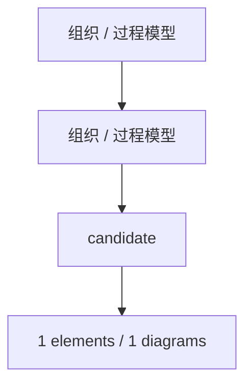

# 组织 / 过程模型

<!-- praxis:uml-model-registry:start -->

## 定位

- Viewpoint：描述参与者、业务过程、用例目标、可观察结果和业务概念
- Stakeholder：业务负责人、产品负责人、领域专家、开发者
- Abstraction Level：system intent / business process / observable behavior
- Authority：docs/models/organization-process 是归一化模型目录；docs/design 作为组织/过程模型的兼容投影输入共同承载。
- 状态：candidate

## 解释目标

解释系统要改变或稳定的业务秩序；UseCase 不描述 subject 内部结构，内部结构由 Trace / Refine 连接到软件结构模型。

## Package 概览图

## Package / Diagram

### 组织 / 过程模型

Model 根命名空间下组织 0 个直接模型元素，并通过 0 张 UML 图呈现。

| Diagram | Kind | 文档 | 状态 | 置信度 | 代表元素 |
| --- | --- | --- | --- | --- | --- |

### candidate

candidate 命名空间下组织 1 个直接模型元素，并通过 1 张 use_case 图呈现。

#### Elements

- use_case / classifier：尚未生成组织/过程模型。尚未生成组织/过程模型 是组织/过程模型中的 UseCase，描述参与者能够观察到的目标和结果；它不定义 subject 的内部结构。

| Diagram | Kind | 文档 | 状态 | 置信度 | 代表元素 |
| --- | --- | --- | --- | --- | --- |
| 尚未生成组织/过程模型 | use_case | [HTML](docs/design/use-case-diagrams-maps.html) / [Markdown](docs/design/use-case-diagrams-maps.md) | candidate | low | UseCase、Actor、Association、Subject |

## Trace / Refine

- REFINE：model:organization-process -> model:software-structure。组织/过程模型中的 UseCase、Activity 和业务概念需要通过 Trace / Refine 连接到承载它们的软件结构。
- PROJECT：model:organization-process -> projection:design-explorer。Design Explorer 投影 是 model:organization-process 的展示投影；它可以帮助讨论，但不能覆盖 Model / Package / Element 的权威边界。
- PROJECT：model:organization-process -> projection:architecture-c4。Architecture Explorer / C4 投影 是 model:organization-process 的展示投影；它可以帮助讨论，但不能覆盖 Model / Package / Element 的权威边界。

<!-- praxis:uml-model-registry:end -->
