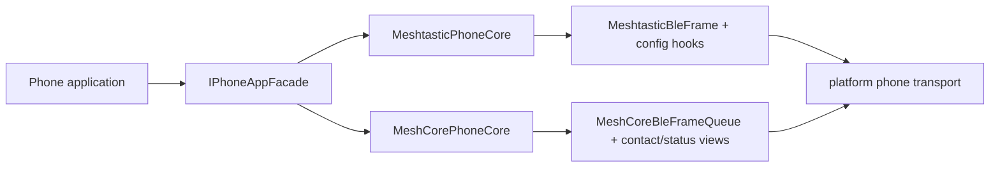

# 手机应用协议互操作

模型状态：**integration · confirmed；协议 core 明确，产品启用边界需由 capability 决定**

## 应用看到的共同契约

代码中的共同入口是 `IPhoneAppFacade`，不是 `PhoneFacade`：

| 方法 | 返回的业务视图 |
| --- | --- |
| `getTime` | `TimeSyncFact` |
| `getLocation` | `LocationFixView` |
| `getDeviceStatus` | `DeviceStatusView` |
| `getConfig` | `ConfigSnapshotView` |
| `applyConfigPatch` | 接受字段级 `ConfigPatchView` |
| `submitCommand` | 接受 `AppCommandView` |

`AppCommandKind` 当前包含 `SendText / ApplyConfig / RequestConfig / RequestNodeInfo`。Facade 提供的是手机应用能够观察和提交的能力，不是 BLE transport API。

## 协议不能被共同 Facade 抹平

`MeshtasticPhoneCore` 暴露 Bluetooth config、module config、MQTT、device runtime 等 hooks；`MeshCorePhoneCore` 有自己的 frame queue、contact view、radio/packet statistics 与 tuning data。共同 Facade 只统一应用意图和结果，不能声称两种 wire protocol 拥有相同配置模型。

## 有界帧与 ESP 约束

Meshtastic 与 MeshCore phone core 都定义自己的 frame/queue 类型。它们位于 BLE 热路径，必须遵守仓库的 fixed-depth / scratch storage 规则；文档不能把大 frame 描述成普通可复制 DTO。

## 产品边界

手机互操作是 capability，不是 Trail Mate 核心通信、定位或轨迹的必需依赖。是否启用、使用何种 transport、由哪个 host 提供，应由 Target Manifest / Capability model 决定。

## 下钻与证据

- [Facade 到协议 core 的会话协作](phone-session.md)
- `modules/core_phone/include/phone/common/phone_facade.h`
- `modules/core_phone/include/phone/meshtastic/meshtastic_phone_core.h`
- `modules/core_phone/include/phone/meshcore/meshcore_phone_core.h`
- legacy 对照：`modules/core_chat/include/chat/ble/`
