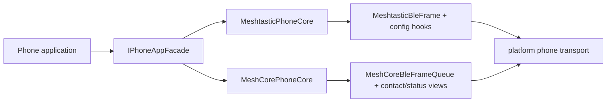

# Mobile application protocol interoperability

Model status: **integration · confirmed; protocol core is clear, product enablement boundaries need to be determined by capability**

## The common contract seen by the application

The common entry in the code is `IPhoneAppFacade`, not `PhoneFacade`:

| Method | Returned business view |
| --- | --- |
| `getTime` | `TimeSyncFact` |
| `getLocation` | `LocationFixView` |
| `getDeviceStatus` | `DeviceStatusView` |
| `getConfig` | `ConfigSnapshotView` |
| `applyConfigPatch` | Accepts field-level `ConfigPatchView` |
| `submitCommand` | Accepts `AppCommandView` |

`AppCommandKind` currently contains `SendText / ApplyConfig / RequestConfig / RequestNodeInfo`. Facade provides the ability for mobile applications to observe and submit, not the BLE transport API.

## The protocol cannot be smoothed by the common Facade

`MeshtasticPhoneCore` exposes Bluetooth config, module config, MQTT, device runtime and other hooks; `MeshCorePhoneCore` has its own frame queue, contact view, radio/packet statistics and tuning data. The common Facade only unifies application intentions and results, and cannot claim that two wire protocols have the same configuration model.

## Bounded frames and ESP constraints

Meshtastic and MeshCore phone core both define their own frame/queue types. They are in the BLE hot path and must comply with the warehouse's fixed-depth / scratch storage rules; the documentation cannot describe large frames as ordinary copyable DTOs.

## Product Boundaries

Mobile interoperability is a capability and is not a required dependency on Trail Mate core communications, positioning or tracking. Whether to enable it, which transport to use, and which host to provide should be determined by the Target Manifest / Capability model.

## Drilldown and evidence

- [Session collaboration from Facade to protocol core](phone-session.md)
- `modules/core_phone/include/phone/common/phone_facade.h`
- `modules/core_phone/include/phone/meshtastic/meshtastic_phone_core.h`
- `modules/core_phone/include/phone/meshcore/meshcore_phone_core.h`
- legacy comparison: `modules/core_chat/include/chat/ble/`
