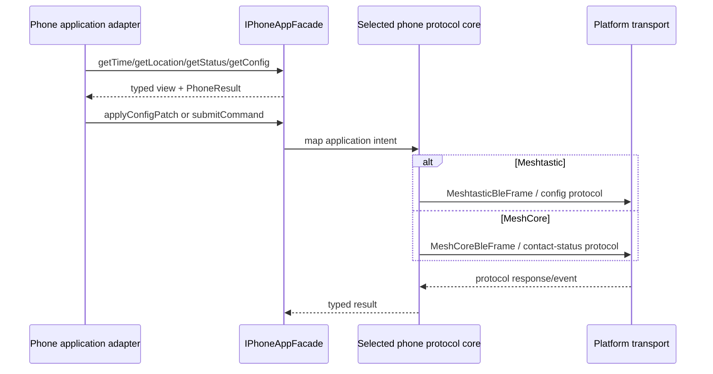

# IPhoneAppFacade 到协议 core

```mermaid
sequenceDiagram
  participant App as Phone application adapter
  participant Facade as IPhoneAppFacade
  participant Core as Selected phone protocol core
  participant Transport as Platform transport
  App->>Facade: getTime/getLocation/getStatus/getConfig
  Facade-->>App: typed view + PhoneResult
  App->>Facade: applyConfigPatch or submitCommand
  Facade->>Core: map application intent
  alt Meshtastic
    Core->>Transport: MeshtasticBleFrame / config protocol
  else MeshCore
    Core->>Transport: MeshCoreBleFrame / contact-status protocol
  end
  Transport-->>Core: protocol response/event
  Core-->>Facade: typed result
```

共同 Facade 不意味着两个 protocol core 拥有相同的 wire commands、queue 或配置字段。
