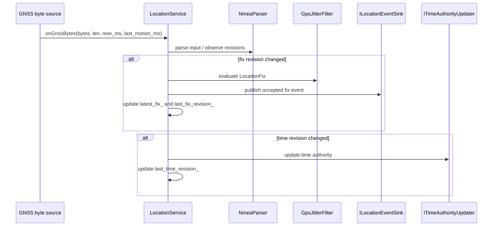

# GNSS revision 处理链

```mermaid
sequenceDiagram
  participant Driver as GNSS byte source
  participant Service as LocationService
  participant Parser as NmeaParser
  participant Filter as GpsJitterFilter
  participant Events as ILocationEventSink
  participant Time as ITimeAuthorityUpdater
  Driver->>Service: onGnssBytes(bytes, len, now_ms, last_motion_ms)
  Service->>Parser: parse input / observe revisions
  alt fix revision changed
    Service->>Filter: evaluate LocationFix
    Service->>Events: publish accepted fix event
    Service->>Service: update latest_fix_ and last_fix_revision_
  end
  alt time revision changed
    Service->>Time: update time authority
    Service->>Service: update last_time_revision_
  end
```

这不是 `NoFix / Valid / Stale` 状态机；当前模型以 revision、filter 与输出端口为事实。

