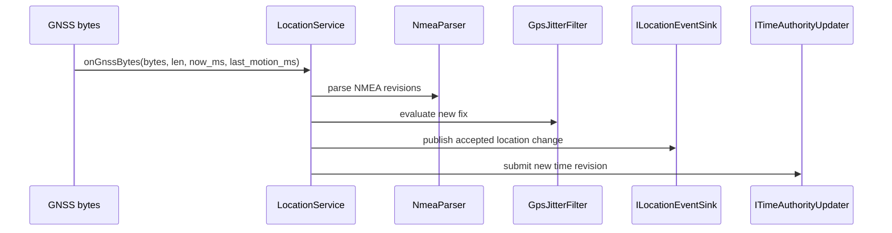

# GNSS positioning, jump filtering and time update

Model status: **confirmed; route navigation does not belong to this model**

## Input and output contract

The structural dependency of `LocationService` directly reveals the processing chain:

```text
NmeaParser
  → GpsJitterFilter
  → LocationFix
  → ILocationEventSink
  → ITimeAuthorityUpdater
```

Only `latestFix(LocationFix&)` is exposed to the outside world. This means that pages, teams, and tracks should each not re-parse NMEA or bypass filters to read driver status.

## Process a GNSS input



## Explicitly existing state

- `latest_fix_`: The last `LocationFix` saved by the service.
- `last_fix_revision_`: Avoid processing the same fix revision repeatedly.
- `last_time_revision_`: Avoid processing the same time revision repeatedly.
- `reset()`: Clear service status.

"Valid/Stale/NoFix" is a useful analysis language, but the current `LocationService` header file does not expose such a set of state machines; the original text writes it as confirmed state machine, which is an over-explanation. Drill-down plots now clearly differentiate between code facts and analysis projections.

## The real boundary of time update

The `ITimeAuthorityUpdater` port clearly exists in the code; the document should read "LocationService submits updates to the time authority", and cannot be used to create a domain entity named `GNSS Time Authority`.

## Content that does not belong here

Route, RouteLeg, along-route progress and yaw policy are not properties of `LocationFix`. The yaw rule currently resides in `gps_page_runtime.cpp`, indicating that the Navigation model is missing; it should remain in the Review Queue.

## Drilldown and Evidence

- [LocationFix Lifecycle: Facts and Inferences](fix-lifecycle.md)
- `modules/core_gps/include/gps/domain/location_fix.h`
- `modules/core_gps/include/gps/usecase/location_service.h`
- `modules/core_gps/src/usecase/location_service.cpp`
- `modules/core_gps/tests/test_location_service.cpp`
