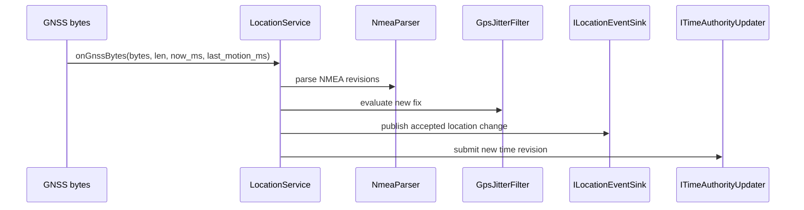

# GNSS 定位、跳变过滤与时间更新

模型状态：**confirmed；路线导航不属于本模型**

## 输入与输出契约

`LocationService` 的构造依赖直接揭示了处理链：

```text
NmeaParser
  → GpsJitterFilter
  → LocationFix
  → ILocationEventSink
  → ITimeAuthorityUpdater
```

对外只暴露 `latestFix(LocationFix&)`。这意味着页面、团队和轨迹不应各自重新解析 NMEA 或绕过过滤器读取 driver 状态。

## 处理一次 GNSS 输入



## 明确存在的状态

- `latest_fix_`：最后一次由 service 保存的 `LocationFix`。
- `last_fix_revision_`：避免重复处理同一 fix revision。
- `last_time_revision_`：避免重复处理同一 time revision。
- `reset()`：清除 service 状态。

“Valid / Stale / NoFix”是有用的分析语言，但当前 `LocationService` 头文件并没有公开这样一套状态机；原文把它写成 confirmed state machine 过度解释。下钻图现在会明确区分代码事实与分析投影。

## 时间更新的真实边界

代码中明确存在 `ITimeAuthorityUpdater` 端口；文档应写“LocationService 向时间权威提交更新”，不能凭此创造一个名为 `GNSS Time Authority` 的领域实体。

## 不属于这里的内容

Route、RouteLeg、沿线进度和偏航策略不是 `LocationFix` 的属性。偏航规则当前落在 `gps_page_runtime.cpp`，说明 Navigation 模型缺失；它应留在 Review Queue。

## 下钻与证据

- [LocationFix 生命周期：事实与推断](fix-lifecycle.md)
- `modules/core_gps/include/gps/domain/location_fix.h`
- `modules/core_gps/include/gps/usecase/location_service.h`
- `modules/core_gps/src/usecase/location_service.cpp`
- `modules/core_gps/tests/test_location_service.cpp`
