# 软件结构模型

<!-- praxis:uml-model-registry:start -->

## 定位

- Viewpoint：描述 Package、Component、Interface、Port、Class、Connector、结构协作和运行时 Interaction
- Stakeholder：架构师、开发者、维护者、评审者
- Abstraction Level：package / component / classifier / owned behavior
- Authority：docs/models/software-structure 是归一化模型目录；docs/engineering 作为软件结构模型的兼容投影输入共同承载。
- 状态：candidate

## 解释目标

解释软件如何被模块化、如何通过接口协作、哪些结构承载业务用例；不把目录、调用密度或工具指标当成模型对象。

## Package 概览图

```mermaid
flowchart TD
  model["软件结构模型"]
  pkg_0["软件结构模型"]
  model --> pkg_0
  pkg_1["apps"]
  pkg_0 --> pkg_1
  pkg_2["boards"]
  pkg_0 --> pkg_2
  pkg_2 --> pkg_2_contents["13 elements / 13 diagrams"]
  pkg_3["build.c6_companion"]
  pkg_0 --> pkg_3
  pkg_3 --> pkg_3_contents["1 elements / 1 diagrams"]
  pkg_4["build.t_display_p4_tft"]
  pkg_0 --> pkg_4
  pkg_4 --> pkg_4_contents["1 elements / 1 diagrams"]
  pkg_5["build.tdisplayp4_amoled"]
  pkg_0 --> pkg_5
  pkg_5 --> pkg_5_contents["1 elements / 1 diagrams"]
  pkg_6["build.tdisplayp4_tft"]
  pkg_0 --> pkg_6
  pkg_6 --> pkg_6_contents["1 elements / 1 diagrams"]
  pkg_7["builds"]
  pkg_0 --> pkg_7
  pkg_7 --> pkg_7_contents["1 elements / 1 diagrams"]
  pkg_8["cmake"]
  pkg_0 --> pkg_8
  pkg_8 --> pkg_8_contents["1 elements / 1 diagrams"]
  pkg_9["COPYRIGHT"]
  pkg_0 --> pkg_9
  pkg_9 --> pkg_9_contents["1 elements / 1 diagrams"]
  pkg_10["firmware"]
  pkg_0 --> pkg_10
  pkg_10 --> pkg_10_contents["3 elements / 3 diagrams"]
  pkg_11["images"]
  pkg_0 --> pkg_11
  pkg_11 --> pkg_11_contents["1 elements / 1 diagrams"]
  pkg_12["LICENSE"]
  pkg_0 --> pkg_12
  pkg_12 --> pkg_12_contents["1 elements / 1 diagrams"]
  pkg_13["managed_components"]
  pkg_0 --> pkg_13
  pkg_13 --> pkg_13_contents["1 elements / 1 diagrams"]
  pkg_14["esp32_lvgl"]
  pkg_1 --> pkg_14
  pkg_14 --> pkg_14_contents["22 elements / 22 diagrams"]
  pkg_15["linux_cardputer_zero"]
  pkg_1 --> pkg_15
  pkg_15 --> pkg_15_contents["5 elements / 5 diagrams"]
  pkg_16["linux_sim_shell"]
  pkg_1 --> pkg_16
  pkg_16 --> pkg_16_contents["1 elements / 1 diagrams"]
  pkg_17["linux_uconsole_gtk"]
  pkg_1 --> pkg_17
  pkg_17 --> pkg_17_contents["12 elements / 12 diagrams"]
  pkg_18["nrf52_node"]
  pkg_1 --> pkg_18
  pkg_18 --> pkg_18_contents["1 elements / 1 diagrams"]
  pkg_19["README.md"]
  pkg_1 --> pkg_19
  pkg_19 --> pkg_19_contents["1 elements / 1 diagrams"]
```

## Package / Diagram

### 软件结构模型

Model 根命名空间下组织 0 个直接模型元素，并通过 0 张 UML 图呈现。

| Diagram | Kind | 文档 | 状态 | 置信度 | 代表元素 |
| --- | --- | --- | --- | --- | --- |

### apps

apps 命名空间下组织 0 个直接模型元素，并通过 0 张 UML 图呈现。

| Diagram | Kind | 文档 | 状态 | 置信度 | 代表元素 |
| --- | --- | --- | --- | --- | --- |

### boards

boards 命名空间下组织 13 个直接模型元素，并通过 13 张 package、component、class 图呈现。

#### Elements

- component / classifier：函数节点：makeBoardProfile。函数节点：makeBoardProfile 表示软件结构模型中的 Component 候选，重点是可替换模块、提供/需要的接口以及连接关系。
- component / classifier：函数节点：pinNum。函数节点：pinNum 表示软件结构模型中的 Component 候选，重点是可替换模块、提供/需要的接口以及连接关系。
- class / classifier：结构切片 boards · gat562_mesh_evb_pro/include/boards。结构协作：结构切片 boards · gat562_mesh_evb_pro/include/boards 表示 软件结构模型 中的 Classifier 候选；它应使用仓库或业务语言中的真实名称，不允许用工具生成的匿名代号替代。
- class / classifier：结构切片 boards · t_display_p4/include/boards。结构协作：结构切片 boards · t_display_p4/include/boards 表示 软件结构模型 中的 Classifier 候选；它应使用仓库或业务语言中的真实名称，不允许用工具生成的匿名代号替代。
- class / classifier：结构切片 boards · t_echo_lite/include/boards。结构协作：结构切片 boards · t_echo_lite/include/boards 表示 软件结构模型 中的 Classifier 候选；它应使用仓库或业务语言中的真实名称，不允许用工具生成的匿名代号替代。
- class / classifier：结构切片 boards · tab5/include/boards。结构协作：结构切片 boards · tab5/include/boards 表示 软件结构模型 中的 Classifier 候选；它应使用仓库或业务语言中的真实名称，不允许用工具生成的匿名代号替代。
- class / classifier：结构切片 boards · tdeck_pro/include/boards。结构协作：结构切片 boards · tdeck_pro/include/boards 表示 软件结构模型 中的 Classifier 候选；它应使用仓库或业务语言中的真实名称，不允许用工具生成的匿名代号替代。
- class / classifier：结构切片 boards · tdeck/include/boards。结构协作：结构切片 boards · tdeck/include/boards 表示 软件结构模型 中的 Classifier 候选；它应使用仓库或业务语言中的真实名称，不允许用工具生成的匿名代号替代。
- class / classifier：结构切片 boards · tlora_pager/include/boards。结构协作：结构切片 boards · tlora_pager/include/boards 表示 软件结构模型 中的 Classifier 候选；它应使用仓库或业务语言中的真实名称，不允许用工具生成的匿名代号替代。
- class / classifier：结构切片 boards · twatchs3/include/boards。结构协作：结构切片 boards · twatchs3/include/boards 表示 软件结构模型 中的 Classifier 候选；它应使用仓库或业务语言中的真实名称，不允许用工具生成的匿名代号替代。
- class / classifier：结构切片 gat562_mesh_evb_pro · gat562_mesh_evb_pro。结构协作：结构切片 gat562_mesh_evb_pro · gat562_mesh_evb_pro 表示 软件结构模型 中的 Classifier 候选；它应使用仓库或业务语言中的真实名称，不允许用工具生成的匿名代号替代。
- class / classifier：结构切片 t_echo_lite · t_echo_lite。结构协作：结构切片 t_echo_lite · t_echo_lite 表示 软件结构模型 中的 Classifier 候选；它应使用仓库或业务语言中的真实名称，不允许用工具生成的匿名代号替代。
- package / namespace：模块边界：boards。模块边界：boards 表示 Package 命名空间或包含关系，用于组织模型元素，不等同于任意文件夹清单。

| Diagram | Kind | 文档 | 状态 | 置信度 | 代表元素 |
| --- | --- | --- | --- | --- | --- |
| 模块边界：boards | package | [HTML](docs/engineering/package-diagrams/boards/package-diagram.html) / [Markdown](docs/engineering/package-diagrams/boards/package-diagram.md) | candidate | high | Package、PackageImport、Dependency |
| 函数节点：makeBoardProfile | component | [HTML](docs/engineering/component-diagrams/boards-makeboardprofile/component-diagram.html) / [Markdown](docs/engineering/component-diagrams/boards-makeboardprofile/component-diagram.md) | candidate | high | Component、Interface、Port、Connector |
| 函数节点：pinNum | component | [HTML](docs/engineering/component-diagrams/boards-pinnum/component-diagram.html) / [Markdown](docs/engineering/component-diagrams/boards-pinnum/component-diagram.md) | candidate | high | Component、Interface、Port、Connector |
| 结构协作：结构切片 boards · gat562_mesh_evb_pro/include/boards | class | [HTML](docs/engineering/class-structural-diagrams/boards-gat562_mesh_evb_pro-include-boards/class-structural-diagram.html) / [Markdown](docs/engineering/class-structural-diagrams/boards-gat562_mesh_evb_pro-include-boards/class-structural-diagram.md) | candidate | high | Class、Interface、Association、Generalization、Realization |
| 结构协作：结构切片 boards · t_echo_lite/include/boards | class | [HTML](docs/engineering/class-structural-diagrams/boards-t_echo_lite-include-boards/class-structural-diagram.html) / [Markdown](docs/engineering/class-structural-diagrams/boards-t_echo_lite-include-boards/class-structural-diagram.md) | candidate | high | Class、Interface、Association、Generalization、Realization |
| 结构协作：结构切片 boards · tab5/include/boards | class | [HTML](docs/engineering/class-structural-diagrams/boards-tab5-include-boards/class-structural-diagram.html) / [Markdown](docs/engineering/class-structural-diagrams/boards-tab5-include-boards/class-structural-diagram.md) | candidate | high | Class、Interface、Association、Generalization、Realization |
| 结构协作：结构切片 boards · t_display_p4/include/boards | class | [HTML](docs/engineering/class-structural-diagrams/boards-t_display_p4-include-boards/class-structural-diagram.html) / [Markdown](docs/engineering/class-structural-diagrams/boards-t_display_p4-include-boards/class-structural-diagram.md) | candidate | high | Class、Interface、Association、Generalization、Realization |
| 结构协作：结构切片 boards · tlora_pager/include/boards | class | [HTML](docs/engineering/class-structural-diagrams/boards-tlora_pager-include-boards/class-structural-diagram.html) / [Markdown](docs/engineering/class-structural-diagrams/boards-tlora_pager-include-boards/class-structural-diagram.md) | candidate | high | Class、Interface、Association、Generalization、Realization |
| 结构协作：结构切片 boards · tdeck/include/boards | class | [HTML](docs/engineering/class-structural-diagrams/boards-tdeck-include-boards/class-structural-diagram.html) / [Markdown](docs/engineering/class-structural-diagrams/boards-tdeck-include-boards/class-structural-diagram.md) | candidate | high | Class、Interface、Association、Generalization、Realization |
| 结构协作：结构切片 boards · tdeck_pro/include/boards | class | [HTML](docs/engineering/class-structural-diagrams/boards-tdeck_pro-include-boards/class-structural-diagram.html) / [Markdown](docs/engineering/class-structural-diagrams/boards-tdeck_pro-include-boards/class-structural-diagram.md) | candidate | high | Class、Interface、Association、Generalization、Realization |
| 结构协作：结构切片 boards · twatchs3/include/boards | class | [HTML](docs/engineering/class-structural-diagrams/boards-twatchs3-include-boards/class-structural-diagram.html) / [Markdown](docs/engineering/class-structural-diagrams/boards-twatchs3-include-boards/class-structural-diagram.md) | candidate | high | Class、Interface、Association、Generalization、Realization |
| 结构协作：结构切片 gat562_mesh_evb_pro · gat562_mesh_evb_pro | class | [HTML](docs/engineering/class-structural-diagrams/boards-gat562_mesh_evb_pro/class-structural-diagram.html) / [Markdown](docs/engineering/class-structural-diagrams/boards-gat562_mesh_evb_pro/class-structural-diagram.md) | candidate | high | Class、Interface、Association、Generalization、Realization |
| 结构协作：结构切片 t_echo_lite · t_echo_lite | class | [HTML](docs/engineering/class-structural-diagrams/boards-t_echo_lite/class-structural-diagram.html) / [Markdown](docs/engineering/class-structural-diagrams/boards-t_echo_lite/class-structural-diagram.md) | candidate | high | Class、Interface、Association、Generalization、Realization |

### build.c6_companion

build.c6_companion 命名空间下组织 1 个直接模型元素，并通过 1 张 package 图呈现。

#### Elements

- package / namespace：模块边界：build.c6_companion。模块边界：build.c6_companion 表示 Package 命名空间或包含关系，用于组织模型元素，不等同于任意文件夹清单。

| Diagram | Kind | 文档 | 状态 | 置信度 | 代表元素 |
| --- | --- | --- | --- | --- | --- |
| 模块边界：build.c6_companion | package | [HTML](docs/engineering/package-diagrams/build-c6_companion/package-diagram.html) / [Markdown](docs/engineering/package-diagrams/build-c6_companion/package-diagram.md) | candidate | high | Package、PackageImport、Dependency |

### build.t_display_p4_tft

build.t_display_p4_tft 命名空间下组织 1 个直接模型元素，并通过 1 张 package 图呈现。

#### Elements

- package / namespace：模块边界：build.t_display_p4_tft。模块边界：build.t_display_p4_tft 表示 Package 命名空间或包含关系，用于组织模型元素，不等同于任意文件夹清单。

| Diagram | Kind | 文档 | 状态 | 置信度 | 代表元素 |
| --- | --- | --- | --- | --- | --- |
| 模块边界：build.t_display_p4_tft | package | [HTML](docs/engineering/package-diagrams/build-t_display_p4_tft/package-diagram.html) / [Markdown](docs/engineering/package-diagrams/build-t_display_p4_tft/package-diagram.md) | candidate | high | Package、PackageImport、Dependency |

### build.tdisplayp4_amoled

build.tdisplayp4_amoled 命名空间下组织 1 个直接模型元素，并通过 1 张 package 图呈现。

#### Elements

- package / namespace：模块边界：build.tdisplayp4_amoled。模块边界：build.tdisplayp4_amoled 表示 Package 命名空间或包含关系，用于组织模型元素，不等同于任意文件夹清单。

| Diagram | Kind | 文档 | 状态 | 置信度 | 代表元素 |
| --- | --- | --- | --- | --- | --- |
| 模块边界：build.tdisplayp4_amoled | package | [HTML](docs/engineering/package-diagrams/build-tdisplayp4_amoled/package-diagram.html) / [Markdown](docs/engineering/package-diagrams/build-tdisplayp4_amoled/package-diagram.md) | candidate | high | Package、PackageImport、Dependency |

### build.tdisplayp4_tft

build.tdisplayp4_tft 命名空间下组织 1 个直接模型元素，并通过 1 张 package 图呈现。

#### Elements

- package / namespace：模块边界：build.tdisplayp4_tft。模块边界：build.tdisplayp4_tft 表示 Package 命名空间或包含关系，用于组织模型元素，不等同于任意文件夹清单。

| Diagram | Kind | 文档 | 状态 | 置信度 | 代表元素 |
| --- | --- | --- | --- | --- | --- |
| 模块边界：build.tdisplayp4_tft | package | [HTML](docs/engineering/package-diagrams/build-tdisplayp4_tft/package-diagram.html) / [Markdown](docs/engineering/package-diagrams/build-tdisplayp4_tft/package-diagram.md) | candidate | high | Package、PackageImport、Dependency |

### builds

builds 命名空间下组织 1 个直接模型元素，并通过 1 张 package 图呈现。

#### Elements

- package / namespace：模块边界：builds。模块边界：builds 表示 Package 命名空间或包含关系，用于组织模型元素，不等同于任意文件夹清单。

| Diagram | Kind | 文档 | 状态 | 置信度 | 代表元素 |
| --- | --- | --- | --- | --- | --- |
| 模块边界：builds | package | [HTML](docs/engineering/package-diagrams/builds/package-diagram.html) / [Markdown](docs/engineering/package-diagrams/builds/package-diagram.md) | candidate | high | Package、PackageImport、Dependency |

### cmake

cmake 命名空间下组织 1 个直接模型元素，并通过 1 张 package 图呈现。

#### Elements

- package / namespace：模块边界：cmake。模块边界：cmake 表示 Package 命名空间或包含关系，用于组织模型元素，不等同于任意文件夹清单。

| Diagram | Kind | 文档 | 状态 | 置信度 | 代表元素 |
| --- | --- | --- | --- | --- | --- |
| 模块边界：cmake | package | [HTML](docs/engineering/package-diagrams/cmake/package-diagram.html) / [Markdown](docs/engineering/package-diagrams/cmake/package-diagram.md) | candidate | high | Package、PackageImport、Dependency |

### COPYRIGHT

COPYRIGHT 命名空间下组织 1 个直接模型元素，并通过 1 张 package 图呈现。

#### Elements

- package / namespace：模块边界：COPYRIGHT。模块边界：COPYRIGHT 表示 Package 命名空间或包含关系，用于组织模型元素，不等同于任意文件夹清单。

| Diagram | Kind | 文档 | 状态 | 置信度 | 代表元素 |
| --- | --- | --- | --- | --- | --- |
| 模块边界：COPYRIGHT | package | [HTML](docs/engineering/package-diagrams/copyright/package-diagram.html) / [Markdown](docs/engineering/package-diagrams/copyright/package-diagram.md) | candidate | high | Package、PackageImport、Dependency |

### firmware

firmware 命名空间下组织 3 个直接模型元素，并通过 3 张 package、component 图呈现。

#### Elements

- component / classifier：服务对象：main。服务对象：main 表示软件结构模型中的 Component 候选，重点是可替换模块、提供/需要的接口以及连接关系。
- component / classifier：界面组件：tm_services_record_error。界面组件：tm_services_record_error 表示软件结构模型中的 Component 候选，重点是可替换模块、提供/需要的接口以及连接关系。
- package / namespace：模块边界：firmware。模块边界：firmware 表示 Package 命名空间或包含关系，用于组织模型元素，不等同于任意文件夹清单。

| Diagram | Kind | 文档 | 状态 | 置信度 | 代表元素 |
| --- | --- | --- | --- | --- | --- |
| 模块边界：firmware | package | [HTML](docs/engineering/package-diagrams/firmware/package-diagram.html) / [Markdown](docs/engineering/package-diagrams/firmware/package-diagram.md) | candidate | high | Package、PackageImport、Dependency |
| 服务对象：main | component | [HTML](docs/engineering/component-diagrams/firmware-main/component-diagram.html) / [Markdown](docs/engineering/component-diagrams/firmware-main/component-diagram.md) | candidate | high | Component、Interface、Port、Connector |
| 界面组件：tm_services_record_error | component | [HTML](docs/engineering/component-diagrams/firmware-tm_services_record_error/component-diagram.html) / [Markdown](docs/engineering/component-diagrams/firmware-tm_services_record_error/component-diagram.md) | candidate | high | Component、Interface、Port、Connector |

### images

images 命名空间下组织 1 个直接模型元素，并通过 1 张 package 图呈现。

#### Elements

- package / namespace：模块边界：images。模块边界：images 表示 Package 命名空间或包含关系，用于组织模型元素，不等同于任意文件夹清单。

| Diagram | Kind | 文档 | 状态 | 置信度 | 代表元素 |
| --- | --- | --- | --- | --- | --- |
| 模块边界：images | package | [HTML](docs/engineering/package-diagrams/images/package-diagram.html) / [Markdown](docs/engineering/package-diagrams/images/package-diagram.md) | candidate | high | Package、PackageImport、Dependency |

### LICENSE

LICENSE 命名空间下组织 1 个直接模型元素，并通过 1 张 package 图呈现。

#### Elements

- package / namespace：模块边界：LICENSE。模块边界：LICENSE 表示 Package 命名空间或包含关系，用于组织模型元素，不等同于任意文件夹清单。

| Diagram | Kind | 文档 | 状态 | 置信度 | 代表元素 |
| --- | --- | --- | --- | --- | --- |
| 模块边界：LICENSE | package | [HTML](docs/engineering/package-diagrams/license/package-diagram.html) / [Markdown](docs/engineering/package-diagrams/license/package-diagram.md) | candidate | high | Package、PackageImport、Dependency |

### managed_components

managed_components 命名空间下组织 1 个直接模型元素，并通过 1 张 package 图呈现。

#### Elements

- package / namespace：模块边界：managed_components。模块边界：managed_components 表示 Package 命名空间或包含关系，用于组织模型元素，不等同于任意文件夹清单。

| Diagram | Kind | 文档 | 状态 | 置信度 | 代表元素 |
| --- | --- | --- | --- | --- | --- |
| 模块边界：managed_components | package | [HTML](docs/engineering/package-diagrams/managed_components/package-diagram.html) / [Markdown](docs/engineering/package-diagrams/managed_components/package-diagram.md) | candidate | high | Package、PackageImport、Dependency |

### esp32_lvgl

apps/esp32_lvgl 命名空间下组织 22 个直接模型元素，并通过 22 张 package、component、sequence 图呈现。

#### Elements

- component / classifier：函数节点：companion_enter。函数节点：companion_enter 表示软件结构模型中的 Component 候选，重点是可替换模块、提供/需要的接口以及连接关系。
- component / classifier：函数节点：contains。函数节点：contains 表示软件结构模型中的 Component 候选，重点是可替换模块、提供/需要的接口以及连接关系。
- component / classifier：函数节点：main。函数节点：main 表示软件结构模型中的 Component 候选，重点是可替换模块、提供/需要的接口以及连接关系。
- package / namespace：模块边界：apps/esp32_lvgl。模块边界：apps/esp32_lvgl 表示 Package 命名空间或包含关系，用于组织模型元素，不等同于任意文件夹清单。
- interaction / owned_behavior：add_hex_line 调用 add_status_line。动态协作：add_hex_line 调用 add_status_line 是 软件结构模型 中的局部行为，用于解释某个 Classifier、UseCase 或 Component 在特定场景下的动作、消息或状态变化。
- interaction / owned_behavior：add_status_line 调用 add_label。动态协作：add_status_line 调用 add_label 是 软件结构模型 中的局部行为，用于解释某个 Classifier、UseCase 或 Component 在特定场景下的动作、消息或状态变化。
- interaction / owned_behavior：add_u32_line 调用 add_label。动态协作：add_u32_line 调用 add_label 是 软件结构模型 中的局部行为，用于解释某个 Classifier、UseCase 或 Component 在特定场景下的动作、消息或状态变化。
- interaction / owned_behavior：canRunEsp32LvglStartupRuntime 调用 canStartEsp32LvglLoopRuntime。动态协作：canRunEsp32LvglStartupRuntime 调用 canStartEsp32LvglLoopRuntime 是 软件结构模型 中的局部行为，用于解释某个 Classifier、UseCase 或 Component 在特定场景下的动作、消息或状态变化。
- interaction / owned_behavior：companion_enter 调用 add_hex_line。动态协作：companion_enter 调用 add_hex_line 是 软件结构模型 中的局部行为，用于解释某个 Classifier、UseCase 或 Component 在特定场景下的动作、消息或状态变化。
- interaction / owned_behavior：companion_enter 调用 add_label。动态协作：companion_enter 调用 add_label 是 软件结构模型 中的局部行为，用于解释某个 Classifier、UseCase 或 Component 在特定场景下的动作、消息或状态变化。
- interaction / owned_behavior：companion_enter 调用 add_status_line。动态协作：companion_enter 调用 add_status_line 是 软件结构模型 中的局部行为，用于解释某个 Classifier、UseCase 或 Component 在特定场景下的动作、消息或状态变化。
- interaction / owned_behavior：companion_enter 调用 add_u32_line。动态协作：companion_enter 调用 add_u32_line 是 软件结构模型 中的局部行为，用于解释某个 Classifier、UseCase 或 Component 在特定场景下的动作、消息或状态变化。
- interaction / owned_behavior：hasEsp32LvglRuntimeTargetProfile 调用 esp32LvglRuntimeTargetProfile。动态协作：hasEsp32LvglRuntimeTargetProfile 调用 esp32LvglRuntimeTargetProfile 是 软件结构模型 中的局部行为，用于解释某个 Classifier、UseCase 或 Component 在特定场景下的动作、消息或状态变化。
- interaction / owned_behavior：runEsp32LvglStartupRuntime 调用 canRunEsp32LvglStartupRuntime。动态协作：runEsp32LvglStartupRuntime 调用 canRunEsp32LvglStartupRuntime 是 软件结构模型 中的局部行为，用于解释某个 Classifier、UseCase 或 Component 在特定场景下的动作、消息或状态变化。
- interaction / owned_behavior：runEsp32LvglStartupRuntime 调用 setBootLog。动态协作：runEsp32LvglStartupRuntime 调用 setBootLog 是 软件结构模型 中的局部行为，用于解释某个 Classifier、UseCase 或 Component 在特定场景下的动作、消息或状态变化。
- interaction / owned_behavior：runEsp32LvglStartupRuntime 调用 showBootUi。动态协作：runEsp32LvglStartupRuntime 调用 showBootUi 是 软件结构模型 中的局部行为，用于解释某个 Classifier、UseCase 或 Component 在特定场景下的动作、消息或状态变化。
- interaction / owned_behavior：setBootLog 调用 lockUi。动态协作：setBootLog 调用 lockUi 是 软件结构模型 中的局部行为，用于解释某个 Classifier、UseCase 或 Component 在特定场景下的动作、消息或状态变化。
- interaction / owned_behavior：setBootLog 调用 unlockUi。动态协作：setBootLog 调用 unlockUi 是 软件结构模型 中的局部行为，用于解释某个 Classifier、UseCase 或 Component 在特定场景下的动作、消息或状态变化。
- interaction / owned_behavior：showBootUi 调用 lockUi。动态协作：showBootUi 调用 lockUi 是 软件结构模型 中的局部行为，用于解释某个 Classifier、UseCase 或 Component 在特定场景下的动作、消息或状态变化。
- interaction / owned_behavior：showBootUi 调用 unlockUi。动态协作：showBootUi 调用 unlockUi 是 软件结构模型 中的局部行为，用于解释某个 Classifier、UseCase 或 Component 在特定场景下的动作、消息或状态变化。
- interaction / owned_behavior：startEsp32LvglLoopRuntime 调用 canStartEsp32LvglLoopRuntime。动态协作：startEsp32LvglLoopRuntime 调用 canStartEsp32LvglLoopRuntime 是 软件结构模型 中的局部行为，用于解释某个 Classifier、UseCase 或 Component 在特定场景下的动作、消息或状态变化。
- interaction / owned_behavior：tick 调用 log_loop_interval。动态协作：tick 调用 log_loop_interval 是 软件结构模型 中的局部行为，用于解释某个 Classifier、UseCase 或 Component 在特定场景下的动作、消息或状态变化。

| Diagram | Kind | 文档 | 状态 | 置信度 | 代表元素 |
| --- | --- | --- | --- | --- | --- |
| 模块边界：apps/esp32_lvgl | package | [HTML](docs/engineering/package-diagrams/apps-esp32_lvgl/package-diagram.html) / [Markdown](docs/engineering/package-diagrams/apps-esp32_lvgl/package-diagram.md) | candidate | high | Package、PackageImport、Dependency |
| 函数节点：main | component | [HTML](docs/engineering/component-diagrams/apps-esp32_lvgl-main/component-diagram.html) / [Markdown](docs/engineering/component-diagrams/apps-esp32_lvgl-main/component-diagram.md) | candidate | high | Component、Interface、Port、Connector |
| 函数节点：contains | component | [HTML](docs/engineering/component-diagrams/apps-esp32_lvgl-contains/component-diagram.html) / [Markdown](docs/engineering/component-diagrams/apps-esp32_lvgl-contains/component-diagram.md) | candidate | high | Component、Interface、Port、Connector |
| 函数节点：companion_enter | component | [HTML](docs/engineering/component-diagrams/apps-esp32_lvgl-companion_enter/component-diagram.html) / [Markdown](docs/engineering/component-diagrams/apps-esp32_lvgl-companion_enter/component-diagram.md) | candidate | high | Component、Interface、Port、Connector |
| 动态协作：tick 调用 log_loop_interval | sequence | [HTML](docs/engineering/sequence-diagrams/tick-calls-log_loop_interval/sequence-diagram.html) / [Markdown](docs/engineering/sequence-diagrams/tick-calls-log_loop_interval/sequence-diagram.md) | candidate | high | Interaction、Lifeline、Message |
| 动态协作：add_status_line 调用 add_label | sequence | [HTML](docs/engineering/sequence-diagrams/add_status_line-calls-add_label/sequence-diagram.html) / [Markdown](docs/engineering/sequence-diagrams/add_status_line-calls-add_label/sequence-diagram.md) | candidate | high | Interaction、Lifeline、Message |
| 动态协作：add_u32_line 调用 add_label | sequence | [HTML](docs/engineering/sequence-diagrams/add_u32_line-calls-add_label/sequence-diagram.html) / [Markdown](docs/engineering/sequence-diagrams/add_u32_line-calls-add_label/sequence-diagram.md) | candidate | high | Interaction、Lifeline、Message |
| 动态协作：add_hex_line 调用 add_status_line | sequence | [HTML](docs/engineering/sequence-diagrams/add_hex_line-calls-add_status_line/sequence-diagram.html) / [Markdown](docs/engineering/sequence-diagrams/add_hex_line-calls-add_status_line/sequence-diagram.md) | candidate | high | Interaction、Lifeline、Message |
| 动态协作：companion_enter 调用 add_label | sequence | [HTML](docs/engineering/sequence-diagrams/companion_enter-calls-add_label/sequence-diagram.html) / [Markdown](docs/engineering/sequence-diagrams/companion_enter-calls-add_label/sequence-diagram.md) | candidate | high | Interaction、Lifeline、Message |
| 动态协作：companion_enter 调用 add_status_line | sequence | [HTML](docs/engineering/sequence-diagrams/companion_enter-calls-add_status_line/sequence-diagram.html) / [Markdown](docs/engineering/sequence-diagrams/companion_enter-calls-add_status_line/sequence-diagram.md) | candidate | high | Interaction、Lifeline、Message |
| 动态协作：companion_enter 调用 add_u32_line | sequence | [HTML](docs/engineering/sequence-diagrams/companion_enter-calls-add_u32_line/sequence-diagram.html) / [Markdown](docs/engineering/sequence-diagrams/companion_enter-calls-add_u32_line/sequence-diagram.md) | candidate | high | Interaction、Lifeline、Message |
| 动态协作：companion_enter 调用 add_hex_line | sequence | [HTML](docs/engineering/sequence-diagrams/companion_enter-calls-add_hex_line/sequence-diagram.html) / [Markdown](docs/engineering/sequence-diagrams/companion_enter-calls-add_hex_line/sequence-diagram.md) | candidate | high | Interaction、Lifeline、Message |
| 动态协作：startEsp32LvglLoopRuntime 调用 canStartEsp32LvglLoopRuntime | sequence | [HTML](docs/engineering/sequence-diagrams/startesp32lvglloopruntime-calls-canstartesp32lvglloopruntime/sequence-diagram.html) / [Markdown](docs/engineering/sequence-diagrams/startesp32lvglloopruntime-calls-canstartesp32lvglloopruntime/sequence-diagram.md) | candidate | high | Interaction、Lifeline、Message |
| 动态协作：hasEsp32LvglRuntimeTargetProfile 调用 esp32LvglRuntimeTargetProfile | sequence | [HTML](docs/engineering/sequence-diagrams/hasesp32lvglruntimetargetprofile-calls-esp32lvglruntimetargetprofile/sequence-diagram.html) / [Markdown](docs/engineering/sequence-diagrams/hasesp32lvglruntimetargetprofile-calls-esp32lvglruntimetargetprofile/sequence-diagram.md) | candidate | high | Interaction、Lifeline、Message |
| 动态协作：showBootUi 调用 lockUi | sequence | [HTML](docs/engineering/sequence-diagrams/showbootui-calls-lockui/sequence-diagram.html) / [Markdown](docs/engineering/sequence-diagrams/showbootui-calls-lockui/sequence-diagram.md) | candidate | high | Interaction、Lifeline、Message |
| 动态协作：showBootUi 调用 unlockUi | sequence | [HTML](docs/engineering/sequence-diagrams/showbootui-calls-unlockui/sequence-diagram.html) / [Markdown](docs/engineering/sequence-diagrams/showbootui-calls-unlockui/sequence-diagram.md) | candidate | high | Interaction、Lifeline、Message |
| 动态协作：setBootLog 调用 lockUi | sequence | [HTML](docs/engineering/sequence-diagrams/setbootlog-calls-lockui/sequence-diagram.html) / [Markdown](docs/engineering/sequence-diagrams/setbootlog-calls-lockui/sequence-diagram.md) | candidate | high | Interaction、Lifeline、Message |
| 动态协作：setBootLog 调用 unlockUi | sequence | [HTML](docs/engineering/sequence-diagrams/setbootlog-calls-unlockui/sequence-diagram.html) / [Markdown](docs/engineering/sequence-diagrams/setbootlog-calls-unlockui/sequence-diagram.md) | candidate | high | Interaction、Lifeline、Message |
| 动态协作：canRunEsp32LvglStartupRuntime 调用 canStartEsp32LvglLoopRuntime | sequence | [HTML](docs/engineering/sequence-diagrams/canrunesp32lvglstartupruntime-calls-canstartesp32lvglloopruntime/sequence-diagram.html) / [Markdown](docs/engineering/sequence-diagrams/canrunesp32lvglstartupruntime-calls-canstartesp32lvglloopruntime/sequence-diagram.md) | candidate | high | Interaction、Lifeline、Message |
| 动态协作：runEsp32LvglStartupRuntime 调用 canRunEsp32LvglStartupRuntime | sequence | [HTML](docs/engineering/sequence-diagrams/runesp32lvglstartupruntime-calls-canrunesp32lvglstartupruntime/sequence-diagram.html) / [Markdown](docs/engineering/sequence-diagrams/runesp32lvglstartupruntime-calls-canrunesp32lvglstartupruntime/sequence-diagram.md) | candidate | high | Interaction、Lifeline、Message |
| 动态协作：runEsp32LvglStartupRuntime 调用 showBootUi | sequence | [HTML](docs/engineering/sequence-diagrams/runesp32lvglstartupruntime-calls-showbootui/sequence-diagram.html) / [Markdown](docs/engineering/sequence-diagrams/runesp32lvglstartupruntime-calls-showbootui/sequence-diagram.md) | candidate | high | Interaction、Lifeline、Message |
| 动态协作：runEsp32LvglStartupRuntime 调用 setBootLog | sequence | [HTML](docs/engineering/sequence-diagrams/runesp32lvglstartupruntime-calls-setbootlog/sequence-diagram.html) / [Markdown](docs/engineering/sequence-diagrams/runesp32lvglstartupruntime-calls-setbootlog/sequence-diagram.md) | candidate | high | Interaction、Lifeline、Message |

### linux_cardputer_zero

apps/linux_cardputer_zero 命名空间下组织 5 个直接模型元素，并通过 5 张 package、component 图呈现。

#### Elements

- component / classifier：函数节点：contains。函数节点：contains 表示软件结构模型中的 Component 候选，重点是可替换模块、提供/需要的接口以及连接关系。
- component / classifier：函数节点：main。函数节点：main 表示软件结构模型中的 Component 候选，重点是可替换模块、提供/需要的接口以及连接关系。
- component / classifier：函数节点：not_contains。函数节点：not_contains 表示软件结构模型中的 Component 候选，重点是可替换模块、提供/需要的接口以及连接关系。
- component / classifier：函数节点：read_file。函数节点：read_file 表示软件结构模型中的 Component 候选，重点是可替换模块、提供/需要的接口以及连接关系。
- package / namespace：模块边界：apps/linux_cardputer_zero。模块边界：apps/linux_cardputer_zero 表示 Package 命名空间或包含关系，用于组织模型元素，不等同于任意文件夹清单。

| Diagram | Kind | 文档 | 状态 | 置信度 | 代表元素 |
| --- | --- | --- | --- | --- | --- |
| 模块边界：apps/linux_cardputer_zero | package | [HTML](docs/engineering/package-diagrams/apps-linux_cardputer_zero/package-diagram.html) / [Markdown](docs/engineering/package-diagrams/apps-linux_cardputer_zero/package-diagram.md) | candidate | high | Package、PackageImport、Dependency |
| 函数节点：main | component | [HTML](docs/engineering/component-diagrams/apps-linux_cardputer_zero-main/component-diagram.html) / [Markdown](docs/engineering/component-diagrams/apps-linux_cardputer_zero-main/component-diagram.md) | candidate | high | Component、Interface、Port、Connector |
| 函数节点：contains | component | [HTML](docs/engineering/component-diagrams/apps-linux_cardputer_zero-contains/component-diagram.html) / [Markdown](docs/engineering/component-diagrams/apps-linux_cardputer_zero-contains/component-diagram.md) | candidate | high | Component、Interface、Port、Connector |
| 函数节点：not_contains | component | [HTML](docs/engineering/component-diagrams/apps-linux_cardputer_zero-not_contains/component-diagram.html) / [Markdown](docs/engineering/component-diagrams/apps-linux_cardputer_zero-not_contains/component-diagram.md) | candidate | high | Component、Interface、Port、Connector |
| 函数节点：read_file | component | [HTML](docs/engineering/component-diagrams/apps-linux_cardputer_zero-read_file/component-diagram.html) / [Markdown](docs/engineering/component-diagrams/apps-linux_cardputer_zero-read_file/component-diagram.md) | candidate | high | Component、Interface、Port、Connector |

### linux_sim_shell

apps/linux_sim_shell 命名空间下组织 1 个直接模型元素，并通过 1 张 package 图呈现。

#### Elements

- package / namespace：模块边界：apps/linux_sim_shell。模块边界：apps/linux_sim_shell 表示 Package 命名空间或包含关系，用于组织模型元素，不等同于任意文件夹清单。

| Diagram | Kind | 文档 | 状态 | 置信度 | 代表元素 |
| --- | --- | --- | --- | --- | --- |
| 模块边界：apps/linux_sim_shell | package | [HTML](docs/engineering/package-diagrams/apps-linux_sim_shell/package-diagram.html) / [Markdown](docs/engineering/package-diagrams/apps-linux_sim_shell/package-diagram.md) | candidate | high | Package、PackageImport、Dependency |

### linux_uconsole_gtk

apps/linux_uconsole_gtk 命名空间下组织 12 个直接模型元素，并通过 12 张 package、component 图呈现。

#### Elements

- component / classifier：函数节点：expect。函数节点：expect 表示软件结构模型中的 Component 候选，重点是可替换模块、提供/需要的接口以及连接关系。
- component / classifier：函数节点：launchMapLayout。函数节点：launchMapLayout 表示软件结构模型中的 Component 候选，重点是可替换模块、提供/需要的接口以及连接关系。
- component / classifier：函数节点：launchSettingsLayout。函数节点：launchSettingsLayout 表示软件结构模型中的 Component 候选，重点是可替换模块、提供/需要的接口以及连接关系。
- component / classifier：函数节点：main。函数节点：main 表示软件结构模型中的 Component 候选，重点是可替换模块、提供/需要的接口以及连接关系。
- component / classifier：函数节点：makeLabel。函数节点：makeLabel 表示软件结构模型中的 Component 候选，重点是可替换模块、提供/需要的接口以及连接关系。
- component / classifier：函数节点：makeSettingsRow。函数节点：makeSettingsRow 表示软件结构模型中的 Component 候选，重点是可替换模块、提供/需要的接口以及连接关系。
- component / classifier：函数节点：makeSpin。函数节点：makeSpin 表示软件结构模型中的 Component 候选，重点是可替换模块、提供/需要的接口以及连接关系。
- component / classifier：函数节点：makeSwitch。函数节点：makeSwitch 表示软件结构模型中的 Component 候选，重点是可替换模块、提供/需要的接口以及连接关系。
- component / classifier：函数节点：refreshMap。函数节点：refreshMap 表示软件结构模型中的 Component 候选，重点是可替换模块、提供/需要的接口以及连接关系。
- component / classifier：函数节点：refreshUi。函数节点：refreshUi 表示软件结构模型中的 Component 候选，重点是可替换模块、提供/需要的接口以及连接关系。
- component / classifier：函数节点：setLabel。函数节点：setLabel 表示软件结构模型中的 Component 候选，重点是可替换模块、提供/需要的接口以及连接关系。
- package / namespace：模块边界：apps/linux_uconsole_gtk。模块边界：apps/linux_uconsole_gtk 表示 Package 命名空间或包含关系，用于组织模型元素，不等同于任意文件夹清单。

| Diagram | Kind | 文档 | 状态 | 置信度 | 代表元素 |
| --- | --- | --- | --- | --- | --- |
| 模块边界：apps/linux_uconsole_gtk | package | [HTML](docs/engineering/package-diagrams/apps-linux_uconsole_gtk/package-diagram.html) / [Markdown](docs/engineering/package-diagrams/apps-linux_uconsole_gtk/package-diagram.md) | candidate | high | Package、PackageImport、Dependency |
| 函数节点：launchSettingsLayout | component | [HTML](docs/engineering/component-diagrams/apps-linux_uconsole_gtk-launchsettingslayout/component-diagram.html) / [Markdown](docs/engineering/component-diagrams/apps-linux_uconsole_gtk-launchsettingslayout/component-diagram.md) | candidate | high | Component、Interface、Port、Connector |
| 函数节点：makeLabel | component | [HTML](docs/engineering/component-diagrams/apps-linux_uconsole_gtk-makelabel/component-diagram.html) / [Markdown](docs/engineering/component-diagrams/apps-linux_uconsole_gtk-makelabel/component-diagram.md) | candidate | high | Component、Interface、Port、Connector |
| 函数节点：makeSettingsRow | component | [HTML](docs/engineering/component-diagrams/apps-linux_uconsole_gtk-makesettingsrow/component-diagram.html) / [Markdown](docs/engineering/component-diagrams/apps-linux_uconsole_gtk-makesettingsrow/component-diagram.md) | candidate | high | Component、Interface、Port、Connector |
| 函数节点：refreshUi | component | [HTML](docs/engineering/component-diagrams/apps-linux_uconsole_gtk-refreshui/component-diagram.html) / [Markdown](docs/engineering/component-diagrams/apps-linux_uconsole_gtk-refreshui/component-diagram.md) | candidate | high | Component、Interface、Port、Connector |
| 函数节点：refreshMap | component | [HTML](docs/engineering/component-diagrams/apps-linux_uconsole_gtk-refreshmap/component-diagram.html) / [Markdown](docs/engineering/component-diagrams/apps-linux_uconsole_gtk-refreshmap/component-diagram.md) | candidate | high | Component、Interface、Port、Connector |
| 函数节点：main | component | [HTML](docs/engineering/component-diagrams/apps-linux_uconsole_gtk-main/component-diagram.html) / [Markdown](docs/engineering/component-diagrams/apps-linux_uconsole_gtk-main/component-diagram.md) | candidate | high | Component、Interface、Port、Connector |
| 函数节点：launchMapLayout | component | [HTML](docs/engineering/component-diagrams/apps-linux_uconsole_gtk-launchmaplayout/component-diagram.html) / [Markdown](docs/engineering/component-diagrams/apps-linux_uconsole_gtk-launchmaplayout/component-diagram.md) | candidate | high | Component、Interface、Port、Connector |
| 函数节点：expect | component | [HTML](docs/engineering/component-diagrams/apps-linux_uconsole_gtk-expect/component-diagram.html) / [Markdown](docs/engineering/component-diagrams/apps-linux_uconsole_gtk-expect/component-diagram.md) | candidate | high | Component、Interface、Port、Connector |
| 函数节点：makeSwitch | component | [HTML](docs/engineering/component-diagrams/apps-linux_uconsole_gtk-makeswitch/component-diagram.html) / [Markdown](docs/engineering/component-diagrams/apps-linux_uconsole_gtk-makeswitch/component-diagram.md) | candidate | high | Component、Interface、Port、Connector |
| 函数节点：setLabel | component | [HTML](docs/engineering/component-diagrams/apps-linux_uconsole_gtk-setlabel/component-diagram.html) / [Markdown](docs/engineering/component-diagrams/apps-linux_uconsole_gtk-setlabel/component-diagram.md) | candidate | high | Component、Interface、Port、Connector |
| 函数节点：makeSpin | component | [HTML](docs/engineering/component-diagrams/apps-linux_uconsole_gtk-makespin/component-diagram.html) / [Markdown](docs/engineering/component-diagrams/apps-linux_uconsole_gtk-makespin/component-diagram.md) | candidate | high | Component、Interface、Port、Connector |

### nrf52_node

apps/nrf52_node 命名空间下组织 1 个直接模型元素，并通过 1 张 package 图呈现。

#### Elements

- package / namespace：模块边界：apps/nrf52_node。模块边界：apps/nrf52_node 表示 Package 命名空间或包含关系，用于组织模型元素，不等同于任意文件夹清单。

| Diagram | Kind | 文档 | 状态 | 置信度 | 代表元素 |
| --- | --- | --- | --- | --- | --- |
| 模块边界：apps/nrf52_node | package | [HTML](docs/engineering/package-diagrams/apps-nrf52_node/package-diagram.html) / [Markdown](docs/engineering/package-diagrams/apps-nrf52_node/package-diagram.md) | candidate | high | Package、PackageImport、Dependency |

### README.md

apps/README.md 命名空间下组织 1 个直接模型元素，并通过 1 张 package 图呈现。

#### Elements

- package / namespace：模块边界：apps/README.md。模块边界：apps/README.md 表示 Package 命名空间或包含关系，用于组织模型元素，不等同于任意文件夹清单。

| Diagram | Kind | 文档 | 状态 | 置信度 | 代表元素 |
| --- | --- | --- | --- | --- | --- |
| 模块边界：apps/README.md | package | [HTML](docs/engineering/package-diagrams/apps-readme-md/package-diagram.html) / [Markdown](docs/engineering/package-diagrams/apps-readme-md/package-diagram.md) | candidate | high | Package、PackageImport、Dependency |

## Trace / Refine

- REFINE：model:organization-process -> model:software-structure。组织/过程模型中的 UseCase、Activity 和业务概念需要通过 Trace / Refine 连接到承载它们的软件结构。
- REALIZE：model:software-structure -> model:deployment-artifact。软件结构中的 Component、Interface 和 Classifier 最终应映射到 Artifact、Node 或 ExecutionEnvironment。
- PROJECT：model:software-structure -> projection:engineering-explorer。Engineering Explorer 投影 是 model:software-structure 的展示投影；它可以帮助讨论，但不能覆盖 Model / Package / Element 的权威边界。
- PROJECT：model:software-structure -> projection:architecture-c4。Architecture Explorer / C4 投影 是 model:software-structure 的展示投影；它可以帮助讨论，但不能覆盖 Model / Package / Element 的权威边界。

<!-- praxis:uml-model-registry:end -->
