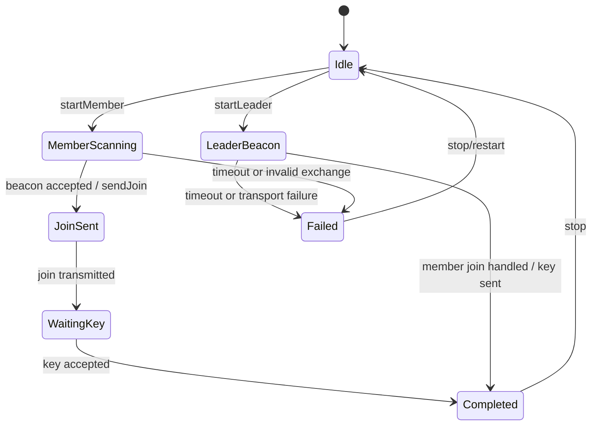

# 团队凭据、配对状态与协同消息

模型状态：**candidate：配对模型明确，成员聚合尚未形成**

## 当前代码的团队核心

代码中没有 `Team` 或 `TeamMember` aggregate。明确存在的是团队 ID、四类用途分离的密钥、配对角色/状态，以及负责 leader/member 握手的 `TeamPairingCoordinator`。

## 团队凭据

`TeamKeys` 包含：

- `TeamId team_id`
- `key_id`
- `mgmt_key`
- `pos_key`
- `wp_key`
- `chat_key`
- `valid`

密钥按管理、位置、路标和聊天用途分开，是当前模型中最重要的授权边界。文档不能把这些 payload 都概括成“团队共享”。

## 配对状态机

真实状态来自 `TeamPairingState`：

上图中 `Idle / LeaderBeacon / MemberScanning / JoinSent / WaitingKey / Completed / Failed` 是 Observed；具体每条触发条件需要以 coordinator 实现和测试逐条核对，不能只凭状态名补全。

## Coordinator 实际协调什么

`TeamPairingCoordinator` 持有：

- `ITeamRuntime`：时间、随机数或团队运行时能力；
- `ITeamPairingEventSink`：发布配对状态；
- `ITeamPairingTransport`：发送 beacon、join 与 key；
- role、state、deadline、重试计数、leader/member ID、nonce 与 leader MAC；
- team ID、PSK、key ID 和 team name。

它是明确的 pairing process manager，不等于 Team aggregate。

## 尚未形成的成员模型

`TeamService` 已经提供 `rememberTeamMember`、`updateTeamMemberRoster`、kick、leader transfer、key distribution、status、PKI verification、位置、路标、轨迹与聊天动作。但当前 roster 只是 `vector<NodeId>`：没有成员资格来源、角色状态、revision、撤销和跨协议稳定身份。

因此“团队已经拥有完整成员聚合”是不成立的。Review Queue 单独记录[团队成员与团队生命周期没有领域 owner](../../review/issues/team-membership-lifecycle-model-missing.md)，而不是在 Model Explorer 中制造 `TeamMember` 元素。

## 当前 Team Model 的边界

- 已存在并可建模：TeamKeys、pairing role/state、pairing coordinator、协议消息和 TeamService 的实际动作。
- 已出现但未闭合：roster 更新、kick、leader transfer、成员身份和密钥撤销规则。
- 不属于当前 confirmed 事实：文档设想的 Team aggregate、TeamMember、MembershipState 和领域事件名称。

## 下钻与证据

- [Leader / Member 配对消息序列](team-pairing.md)
- `modules/core_team/include/team/domain/team_types.h`
- `modules/core_team/include/team/usecase/team_pairing_coordinator.h`
- `modules/core_team/src/usecase/team_pairing_coordinator.cpp`
- `modules/core_team/tests/test_team_mgmt_key_request.cpp`
