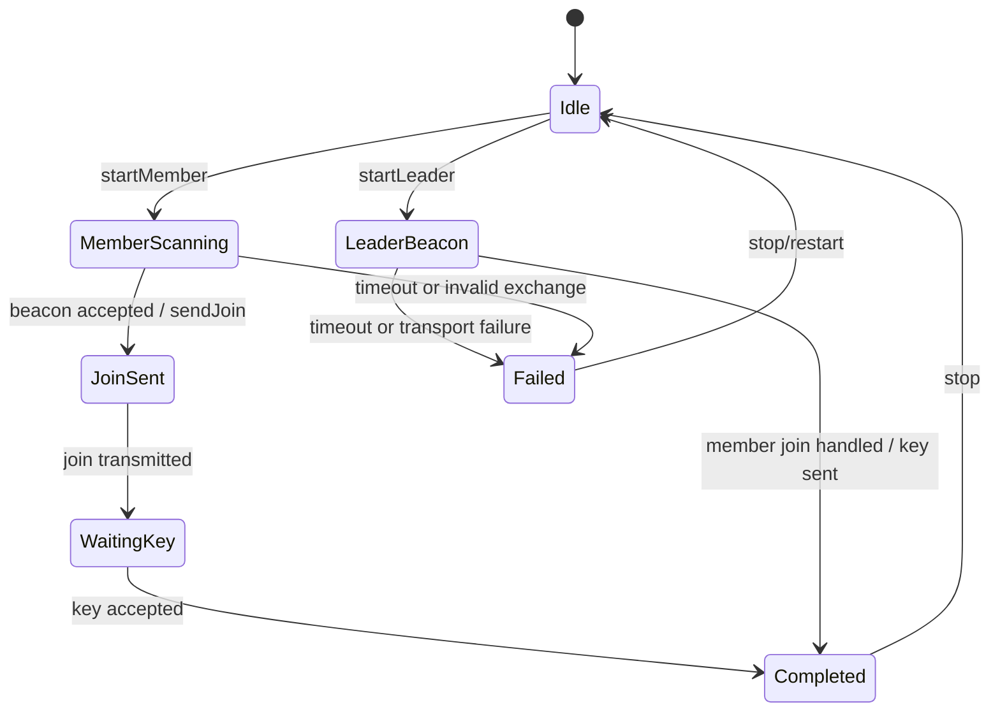

# Team credentials, pairing status and collaboration messages

Model status: **candidate: pairing model is clear, member aggregation has not been formed**

## Team core of the current code

There is no `Team` or `TeamMember` aggregate in the code. Explicitly present are the team ID, four types of purpose-separated keys, pairing roles/status, and the `TeamPairingCoordinator` responsible for the leader/member handshake.

## Team Credentials

`TeamKeys` contains:

- `TeamId team_id`
- `key_id`
- `mgmt_key`
- `pos_key`
- `wp_key`
- `chat_key`
- `valid`

Keys are separated by administrative, location, waypoint, and chat purposes and are the most important authorization boundaries in the current model. The documentation cannot generalize these payloads as "team sharing".

## Pairing state machine

The real state comes from `TeamPairingState`:

 In the above figure, `Idle / LeaderBeacon / MemberScanning / JoinSent / WaitingKey / Completed / Failed` is Observed; each specific trigger condition needs to be implemented and tested by the coordinator to check one by one, and cannot be completed by just the state name.

## What Coordinator actually coordinates

`TeamPairingCoordinator` holds:

- `ITeamRuntime`: time, random number or team runtime capability;
- `ITeamPairingEventSink`: publish pairing status;
- `ITeamPairingTransport`: send beacon, join and key;
- role, state, deadline, retry count, leader/member ID, nonce and key leader MAC;
- team ID, PSK, key ID and team name.

It is a clear pairing process manager, not equal to Team aggregate.

## Not yet formed member model

`TeamService` already provides `rememberTeamMember`, `updateTeamMemberRoster`, kick, leader transfer, key distribution, status, PKI verification, location, waypoint, trajectory and chat actions. But currently the roster is just a `vector<NodeId>`: no membership source, role status, revision, revocation and cross-protocol stable identity.

So "the team already has a complete member aggregation" is not true. Review Queue logs [Team members and Team Lifecycle without field owner](../../review/issues/team-membership-lifecycle-model-missing.md) separately instead of creating a `TeamMember` element in the Model Explorer.

## Boundaries of the current Team Model

 - Exists and can be modeled: TeamKeys, pairing role/state, pairing coordinator, protocol messages and actual actions of TeamService.
- Presented but not closed: roster updates, kick, leader transfer, membership and key revocation rules.
 - Team aggregate, TeamMember, MembershipState, and domain event names not part of the current confirmed fact: documentation envisages them.

## Drilldown and evidence

- [Leader/Member pairing message sequence](team-pairing.md)
- `modules/core_team/include/team/domain/team_types.h`
- `modules/core_team/include/team/usecase/team_pairing_coordinator.h`
- `modules/core_team/src/usecase/team_pairing_coordinator.cpp`
- `modules/core_team/tests/test_team_mgmt_key_request.cpp`
