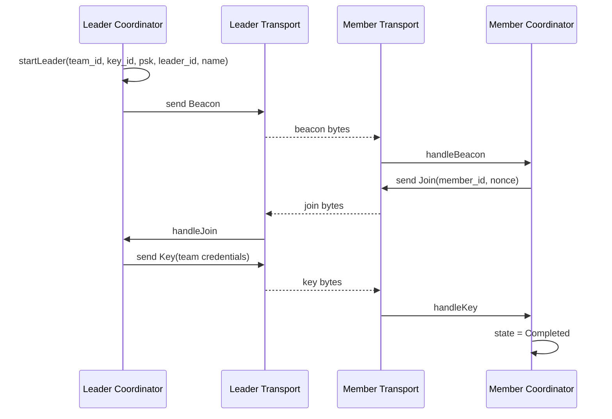

# Leader / Member 配对消息交换

```mermaid
sequenceDiagram
  participant Leader as Leader Coordinator
  participant LTransport as Leader Transport
  participant MTransport as Member Transport
  participant Member as Member Coordinator
  Leader->>Leader: startLeader(team_id, key_id, psk, leader_id, name)
  Leader->>LTransport: send Beacon
  LTransport-->>MTransport: beacon bytes
  MTransport->>Member: handleBeacon
  Member->>MTransport: send Join(member_id, nonce)
  MTransport-->>LTransport: join bytes
  LTransport->>Leader: handleJoin
  Leader->>LTransport: send Key(team credentials)
  LTransport-->>MTransport: key bytes
  MTransport->>Member: handleKey
  Member->>Member: state = Completed
```

这是一条从 coordinator 方法与 handler 名称重建的交互图。消息字段、重试次数和超时必须继续以 `team_pairing_coordinator.cpp` 为准。

