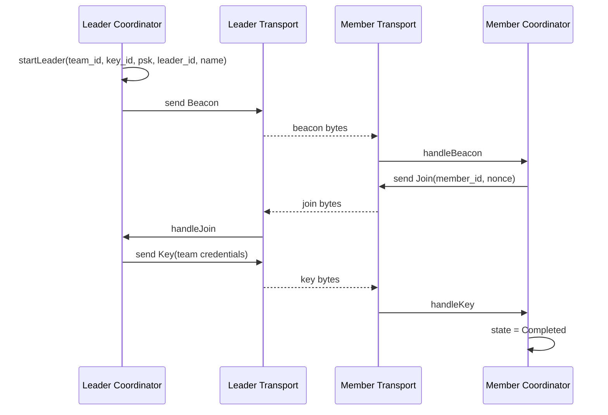

# Leader / Member pairing message exchange

This is an interaction diagram reconstructed from the coordinator method and handler name. Message fields, retries and timeouts must continue to be based on `team_pairing_coordinator.cpp`.
