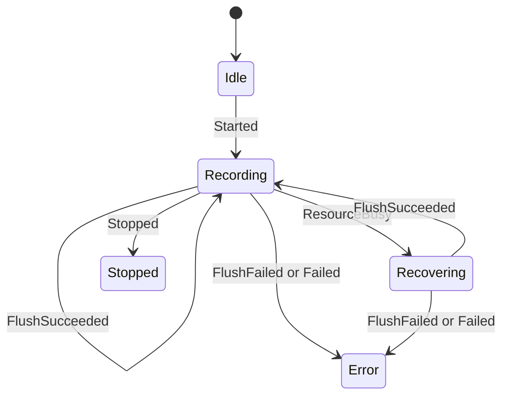

# Track recording commands, events and storage runtime

Model status: **confirmed, complete explicit model already exists in the code**

## Why it is determined to be an existing model

`track_runtime.h` also defines domain data, commands, events, status, flush policy, bounded buffer, file port, event port, storage worker and facade runtime. It is not a module inferred from the directory name, but a clear set of operating protocols.

## Command language

`TrackCommandKind`:

| Command | Purpose |
| --- | --- |
| `StartNewTrack` | Start a new track using `TrackStorageDescriptor` |
| `StopTrack` | flush, close and end the current track |
| `AppendPoint` | Submit `TrackPointBatch` |
| `Flush` | Force commit buffer |
| `ListTracks` | Query stored tracks |

Each command carries `command_id`, deadline and creation time, so the results can be correlated instead of just returning global success/failure.

## Events and Status

`TrackEventKind` contains `Started / Stopped / PointBuffered / ResourceBusy / FlushSucceeded / FlushFailed / ListReady / Failed`.

`TrackStateMachine` currently implemented state changes are:

`Starting / Flushing / Stopping` and other enumeration values ​​are set by the runtime when submitting the command, not all generated by the event branch in `transition()`; the document cannot mix the ideal state machine and the current implementation into one picture.

## Bounded resource design

- `TrackPointBuffer<N>` uses a fixed array, and `append` returns false when full.
- `DefaultTrackFlushPolicy` flushes when buffer size ≥ 8.
- `StopTrack` and `Flush` are considered critical commands.
- `TrackStorageWorker` only holds one `pending_command_` at the same time; `submit` returns false when busy.
- File writing is done via `ITrackFileAdapter`, device availability is returned by semantic results from the file adapter.

This is a direct reflection of Trail Mate ESP stack hygiene in domain runtime, not a general "performance recommendation".

## Storage descriptor determines what

`TrackStorageDescriptor` saves track ID, path, GPX/CSV/Binary format, active-state path, manual/automatic record mark, whether to save active state, and whether to append footer when closing.

## Drilldown and evidence

- [TrackStateMachine and worker collaboration](track-recording-session.md)
- `modules/core_gps/include/gps/track_runtime.h`
- Team consumption of tracks: `modules/core_team/src/usecase/team_track_sampler.cpp`
