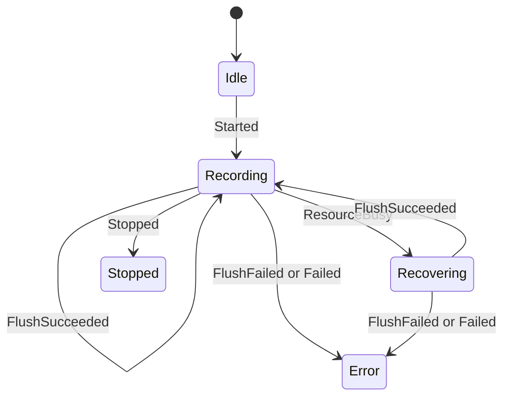

# 轨迹记录命令、事件与存储运行时

模型状态：**confirmed，代码中已有完整显式模型**

## 为什么它确定是一个现有模型

`track_runtime.h` 同时定义了领域数据、命令、事件、状态、flush policy、有界 buffer、文件端口、事件端口、storage worker 和 facade runtime。它不是从目录名推测出的模块，而是一套明确的运行协议。

## 命令语言

`TrackCommandKind`：

| Command | 目的 |
| --- | --- |
| `StartNewTrack` | 使用 `TrackStorageDescriptor` 开始新轨迹 |
| `StopTrack` | flush、close 并结束当前轨迹 |
| `AppendPoint` | 提交 `TrackPointBatch` |
| `Flush` | 强制提交缓冲 |
| `ListTracks` | 查询已存轨迹 |

每条命令携带 `command_id`、deadline 和创建时间，因此结果可以相关联，而不是只返回全局成功/失败。

## 事件与状态

`TrackEventKind` 包含 `Started / Stopped / PointBuffered / ResourceBusy / FlushSucceeded / FlushFailed / ListReady / Failed`。

`TrackStateMachine` 当前实现的状态变化是：

`Starting / Flushing / Stopping` 等枚举值由 runtime 在提交命令时设置，不全由 `transition()` 中的 event 分支产生；文档不能把理想状态机和当前实现混成一张图。

## 有界资源设计

- `TrackPointBuffer<N>` 使用固定数组，满时 `append` 返回 false。
- `DefaultTrackFlushPolicy` 在 buffer size ≥ 8 时 flush。
- `StopTrack` 与 `Flush` 被视为 critical command。
- `TrackStorageWorker` 同时只持有一个 `pending_command_`；忙时 `submit` 返回 false。
- 文件写入通过 `ITrackFileAdapter`，设备可用性由文件适配器返回语义结果。

这是 Trail Mate ESP stack hygiene 在领域运行时中的直接体现，不是一般性的“性能建议”。

## Storage descriptor 决定什么

`TrackStorageDescriptor` 保存 track ID、path、GPX/CSV/Binary 格式、active-state path、手动/自动记录标记、是否保存 active state，以及 close 时是否追加 footer。

## 下钻与证据

- [TrackStateMachine 与 worker 协作](track-recording-session.md)
- `modules/core_gps/include/gps/track_runtime.h`
- Team 对轨迹的消费：`modules/core_team/src/usecase/team_track_sampler.cpp`
