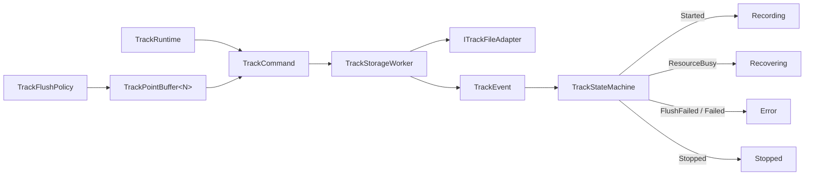

# TrackCommand / TrackEvent / RecorderStatus

```mermaid
flowchart LR
  Runtime["TrackRuntime"] --> Command["TrackCommand"]
  Command --> Worker["TrackStorageWorker"]
  Worker --> Files["ITrackFileAdapter"]
  Worker --> Event["TrackEvent"]
  Event --> State["TrackStateMachine"]
  State -->|Started| Recording
  State -->|ResourceBusy| Recovering
  State -->|FlushFailed / Failed| Error
  State -->|Stopped| Stopped
  Buffer["TrackPointBuffer&lt;N&gt;"] --> Command
  Policy["TrackFlushPolicy"] --> Buffer
```

当前命令没有 Pause/Resume；当前事件也没有 Acknowledge/Reset。任何未来状态图必须以实际 enum 和 runtime 方法为依据。
