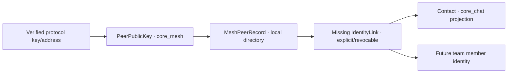

# P1 · 【设计未形成】协议身份到业务联系人的 IdentityLink 缺失

状态：**acknowledged**
类别：**边界缺陷 / 架构与模块边界**

## 结论

Mesh 对端公钥、对端目录记录、业务联系人、会话参与者和团队成员是相关但不同的概念。目前 `core_mesh` 明确定义的是 `PeerPublicKey` 与 `PeerIdentityService`；`core_chat` 已有 `MeshPeerIdentity`、`MeshPeerRecord`、Reticulum identity 和联系人投影。缺失的不是又一个 Peer 类型，而是 verified protocol identity 到业务 identity 的显式、可撤销映射。

## 可能出现的错误

- 节点改名被当作新联系人。
- public key / destination 轮换覆盖错误的用户身份。
- 同一 peer 经不同协议出现时产生重复联系人。
- Chat projection 的旧数据反向覆盖 Mesh 验证结果。

## 目标 ownership

`IdentityLink` 至少应记录协议 namespace、peer identity、目标业务 identity、证明来源、创建时间和撤销状态。同步使用领域事件，不共享可变 struct。

证据：`modules/core_mesh/include/mesh/domain/peer_identity.h`、`modules/core_chat/include/chat/domain/mesh_peer_directory.h`、`modules/core_chat/include/chat/domain/reticulum_identity.h`、`modules/core_chat/include/chat/domain/contact_types.h`。
