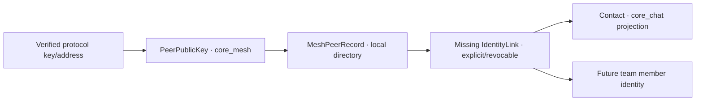

# P1 · [Design not formed] IdentityLink from protocol identity to business contact is missing

Status: **acknowledged**
Category: **Boundary Defect / Architecture and Module Boundary**

## Conclusion

Mesh peer public key, peer directory record, business contact, session participant and team member are related but different concepts. Currently `core_mesh` clearly defines `PeerPublicKey` and `PeerIdentityService`; `core_chat` already has `MeshPeerIdentity`, `MeshPeerRecord`, Reticulum identity and contact projection. What is missing is not another Peer type, but an explicit, revocable mapping of verified protocol identity to business identity.

## Possible errors

- Node renames are treated as new contacts.
- public key / destination rotation overrides wrong user identity.
- Duplicate contacts are generated when the same peer appears through different protocols.
- The old data of Chat projection reversely overwrites the Mesh verification results.

## Target ownership

`IdentityLink` should record at least the protocol namespace, peer identity, target business identity, certification source, creation time and revocation status. Use domain events synchronously and do not share mutable structs.

E
