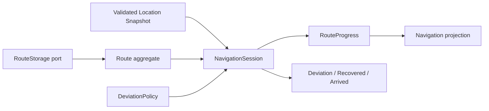

# P1 · 【设计未形成】路线导航规则仍由 UI Runtime 持有

状态：**acknowledged**
类别：**设计缺陷 / 架构边界**

## 结论

路线导航能力已经出现，但没有形成领域模型。项目可读取路线、计算当前位置到路线的距离并更新偏航状态；关键规则 `nearest_route_distance_m` 与 `update_route_deviation_state` 位于 `gps_page_runtime.cpp`。

这不是“工具漏掉了一个现有 Model”：当前确实缺少 Route aggregate、导航会话和策略 owner，因此它应留在 Review Queue，而不是成为 Model Explorer 的空壳模型。

## 缺失的领域词汇

- `Route` / `RouteLeg`：路线及有序段。
- `NavigationSession`：当前路线、开始/停止和重定位状态。
- `RouteProgress`：最近段、沿线距离、完成度和最近有效匹配。
- `DeviationPolicy`：阈值、迟滞、连续样本与恢复规则。
- `NavigationEvent`：偏航、恢复、到达 waypoint / destination。

## 风险

- UI 与其他目标可能实现不同偏航阈值和状态机。
- 无法独立测试迟滞、GPS 跳点、路线回环与重入。
- route storage 的格式细节可能反向主导业务模型。

## 目标边界

建议在 `core_gps` 下独立 navigation package，或建立 `core_navigation`；UI 只提交意图并读取 projection。
