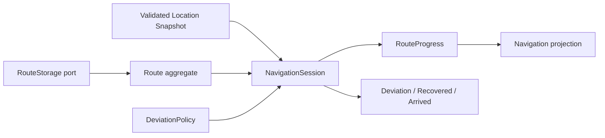

# P1 · [Design not yet formed] Route navigation rules are still held by UI Runtime

Status: **acknowledged**
Category: **Design defect / architectural boundary**

## Conclusion

Route navigation capability has emerged, but no domain model has been formed. The project can read the route, calculate the distance from the current position to the route and update the yaw state; the key rules `nearest_route_distance_m` and `update_route_deviation_state` are located in `gps_page_runtime.cpp`.

This is not "the tool missed an existing Model": the Route aggregate, navigation session, and policy owner are currently missing, so it should stay in the Review Queue rather than become a shell model for the Model Explorer.

## Missing domain vocabulary

- `Route` / `RouteLeg`: routes and ordered segments.
- `NavigationSession`: Current route, start/stop and relocation status.
- `RouteProgress`: the nearest segment, distance along the route, completion degree and the latest effective match.
- `DeviationPolicy`: threshold, hysteresis, continuous samples and recovery rules.
- `NavigationEvent`: yaw, recovery, arrival at waypoint/destination.

## Risk

 - UI may implement different yaw thresholds and state machines than other targets.
- Unable to independently test lag, GPS hops, route loopbacks, and re-entry.
- The format details of route storage may reversely dominate the business model.

## Target boundary

It is recommended to create an independent navigation package under `core_gps`, or build `core_navigation`; the UI only submits the intention and reads the projection.
