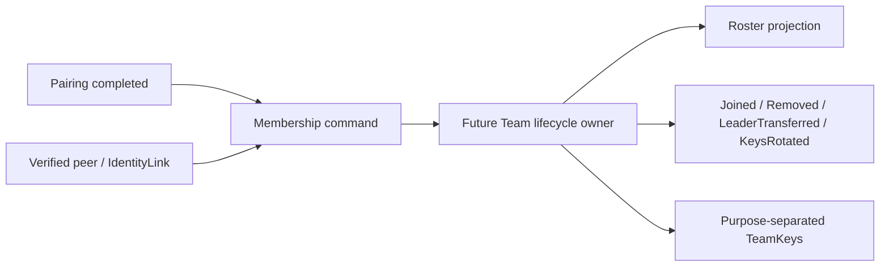

# P1 · 【设计未形成】团队成员与团队生命周期没有领域 owner

状态：**acknowledged**  
类别：**设计缺陷 / 架构边界**

## 结论

`TeamService` 已执行 roster、kick、leader transfer、status、key distribution、PKI verification、位置和 waypoint 等成员相关行为，但 `team/domain` 只有 `TeamId`、`TeamKeys`、配对角色和配对状态。代码没有能保护成员资格与团队生命周期规则的模型。

这不是 Model Explorer 漏掉一个现有 `TeamMember` 类；代码中确实没有该模型。因此 Team 继续标为 candidate，本 finding 留在 Review Queue。

## 已存在的业务动作

- `rememberTeamMember`
- `updateTeamMemberRoster`
- `sendKick`
- `sendTransferLeader`
- `sendStatus`
- `sendKeyDist` / `sendKeyRequest`
- `startPkiVerification` / `submitPkiNumber`
- `sendPosition` / `sendWaypoint` / `sendTrack` / `sendChat`

## 当前缺少的领域语言

- `TeamMemberId`：不能默认等同于某协议的 NodeId。
- `TeamMember`：成员身份、角色、状态、加入证明和最后状态 revision。
- `TeamRoster`：成员集合、leader 唯一性和 roster revision。
- `MembershipState`：Invited、Active、Removed、Revoked 等生命周期需要由设计确认，不能由文档先行虚构为代码事实。
- `TeamLifecycle`：创建、恢复、解散、密钥轮换与 leader transfer。
- `MembershipEvent`：成员加入、移除、leader 转移和凭据撤销。

## 当前风险

1. `team_member_ids_` 只是 `vector<NodeId>`，无法表达成员资格来源和状态。
2. `updateTeamMemberRoster` 可整体替换 roster，但没有 revision、授权来源或冲突规则。
3. kick、leader transfer 和 key distribution 是分散动作，没有共同不变量。
4. NodeId 来自协议目录，跨协议或密钥轮换时缺少稳定成员身份。
5. UI snapshot 可能被误当成团队真相，而它应只是 projection。

## 目标边界

图中的 Future Team、MembershipState 和事件名称是设计目标，不是当前源码实体。

## 验收

只有当代码出现明确 owner、命令、状态变化、不变量和测试后，才能把本 finding 关闭并把 Team 从 candidate 提升为 confirmed。
