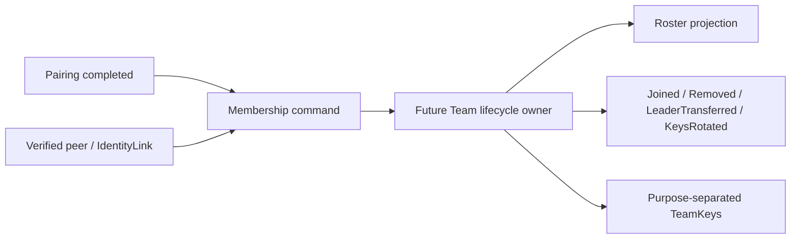

# P1 · [Design is not formed] Team members and team life cycle have no domain owner

Status: **acknowledged**
Category: **Design defect / architectural boundary**

## Conclusion

`TeamService` has executed roster, kick, leader transfer, status, key distribution, PKI verification, location and waypoint and other member-related behaviors, but `team/domain` only has `TeamId`, `TeamKeys`, pairing role and pairing status. The code has no model to protect membership and team lifecycle rules.

This is not Model Explorer missing an existing `TeamMember` class; the model is indeed not present in the code. Therefore, Team continues to be marked as candidate, and this finding remains in the Review Queue.

## Existing business actions

- `rememberTeamMember`
- `updateTeamMemberRoster`
- `sendKick`
- `sendTransferLeader`
- `sendStatus`
- `sendKeyDist` / `sendKeyRequest`
- `startPkiVerification` / `submitPkiNumber`
- `sendPosition` / `sendWaypoint` / `sendTrack` / `sendChat`

## Currently missing domain language

- `TeamMemberId`: cannot default to the NodeId of a certain protocol.
- `TeamMember`: membership, role, status, proof of joining and last status revision.
- `TeamRoster`: member set, leader uniqueness and roster revision.
- `MembershipState`: Life cycles such as Invited, Active, Removed, and Revoked need to be confirmed by the design and cannot be fictionalized into code facts by the document.
- `TeamLifecycle`: creation, recovery, dissolution, key rotation and leader transfer.
- `MembershipEvent`: member joining, removal, leader transfer and credential revocation.

## Current risks

1. `team_member_ids_` is just `vector<NodeId>` and cannot express membership source and status.
2. `updateTeamMemberRoster` can replace the roster as a whole, but without revision, authorization source or conflict rules.
3. Kick, leader transfer and key distribution are decentralized actions and have no common invariants.
4. The NodeId is from the protocol directory and lacks stable membership across protocols or key rotations.
5. UI snapshot may be mistaken for team truth, when it should just be projection.

## Target boundary

The Future Team, MembershipState and event names in the figure are design goals, not the current source code entities.

## Acceptance

Only when the code has a clear owner, command, state change, invariant and test, this finding can be closed and the Team can be promoted from candidate to confirmed.
