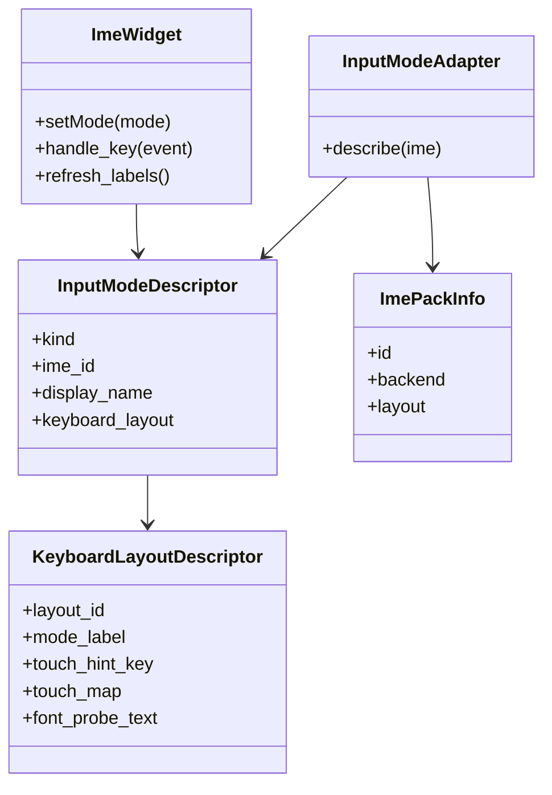
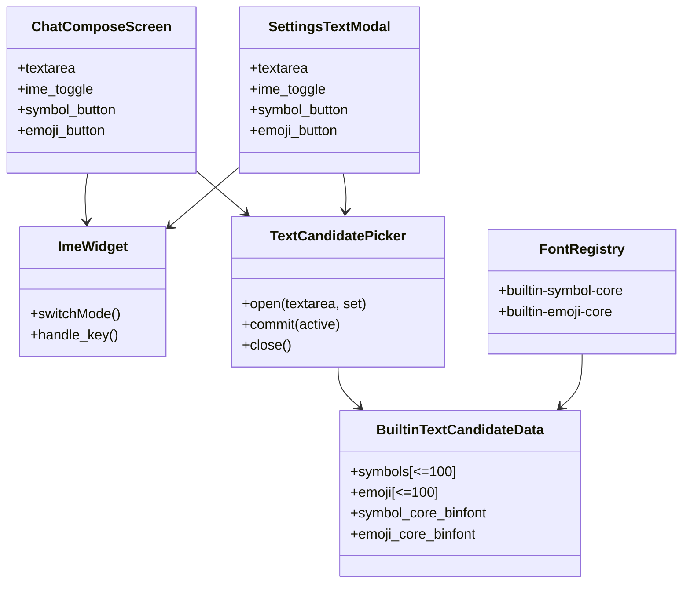
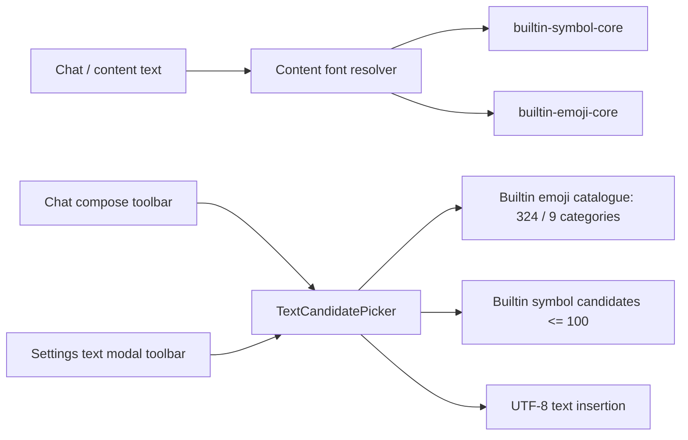

# Localization Specification

## 1. Why This Document Exists

This document is not a translation guide, nor a packaging tutorial.

The goal of this document is to define Trail Mate's "localization system" as a bounded object to prevent subsequent development from mixing the following things together again:

 - i18n runtime in firmware
 - runtime pack payload on SD / Flash
 - `packs/<bundle-id>/` in repository Source package
- zip distribution package released by GitHub Pages
- Remote catalog metadata
- Installed index `installed.json`
- "Change language" user action

If these objects are not distinguished, the system will degenerate into a state of low interpretability of "changing a few lines of English strings and adding a few tsv".

---

## 2. Current Distinctions

### 2.1 Objects that must be cut currently

Trail Mate localization system consists of at least nine types of objects:

1. Firmware localization runtime
2. Runtime pack payload
3. Warehouse source package
4. Distribution package
5. Remote catalog
6. Installed index
7. locale quality status
8. Input method runtime backend
9. Built-in text candidate insertion surface

They are related to each other, but not the same thing.

### 2.2 Illegal obfuscation

The following cutting methods are considered illegal under this specification:

1. Treat `strings.tsv` directly as the "localization system ontology".
2. Treat the zip distribution package as an object for direct consumption at runtime.
3. Mistake "a language pack is installed" as "the font has been loaded into RAM".
4. Bind the firmware version and language pack version to the same version number.
5. Treat the English source string as "just copywriting" rather than a translation search key.
6. Treat the page private string patch as a legal localization implementation.
7. Continue to treat historical plans like `docs/ui_localization_plan.md` as the current contract.
8. Treat traditional to simplified conversion as traditional to Chinese localization.
9. Think of `zh-Hant` as an abstract Traditional Chinese that does not require regional context.
10. Make Pinyin the default input method for all Chinese users.
11. Treat "machine translation has filled TSV" as publishable quality.
12. Copy the English key to the translation column as it is and use it as a legal default translation.
13. Disguise Symbol/Emoji text candidate insertion surface as IME pack or Extensions pack.

---

## 3. Object Model

### 3.1 Firmware localization runtime

The firmware runtime is responsible for:

1. Hold the built-in English baseline.
2. Scan, catalog and parse available locale / font / IME pack manifest.
3. Select the active locale based on `display_locale`.
4. Maintain UI font chain and content font chain.
5. Lazy loading of external `font.bin` when needed.
6. Provide unified entrances such as `tr()`, `format()`, `set_label_text()`, etc.
7. Safe fallback when external pack is missing, unavailable, or exceeds device capabilities.

It is not responsible for:

1. Read the zip distribution package.
2. Directly understand the website catalog.
3. Mix "language pack installation" and "current locale activation" into the same action.

### 3.2 Runtime Pack payload

Runtime pack payload is the unpacked directory tree that is actually scanned and consumed at runtime.

The current form includes:

1. Flash installation root
 - ` /fs/trailmate/packs/... `, used for the installer writing on Arduino/ESP32
2. SD installation root
 - ` /trailmate/packs/... `, used for manual copy or removable media installation

 What is understood at runtime is "unpacked manifest + strings/ranges/font.bin" instead of zip.

### 3.3 Warehouse source package

 `packs/<bundle-id>/` in the warehouse is in source code form, not runtime form.

It can contain:

1. `package.ini`
2. `README.md`
3. `DESCRIPTION.txt`
4. runtime manifests
5. `strings.tsv`
6. `build.ini`
7. `charset.txt`
8. `ranges.txt`
9. Optional local `font.bin`

Among them, files such as `build.ini` and `charset.txt` belong to build-time metadata and are not read at runtime.

### 3.4 Distribution package

The distribution package is a zip product distributed to installers and websites, and is not the object of direct scanning at runtime.

It is currently generated by `scripts/build_pack_repository.py` and contains:

1. Top-level package metadata
2. `payload/fonts/...`
3. `payload/locales/...`
4. `payload/ime/...`

The installer's responsibility is to download the zip, verify SHA-256, extract `payload/`, and then write it to the runtime pack root directory.

### 3.5 Remote Catalog

The remote catalog is an "index of downloadable bundles", not a runtime registry.

It is responsible for providing:

1. package id
2. package version
3. `min_firmware_version`
4. `supported_memory_profiles`
5. What locale/font/IME is provided
6. Archive path, size, SHA-256
7. Display metadata required for Extensions page

It is not responsible for:

1. Font loading
2. Locale activation
3. File parsing in zip

### 3.6 Installed Index

The installed index records "which distribution packages have been installed" rather than "which locales are currently activated".

The responsibility of the current installation index is to record:

1. package id
2. package version
3. archive SHA-256
4. storage
5. install time

In the current Arduino/ESP32 implementation, the main installation index is written to `installed.json` under the Flash installation root by default.
Historical SD paths can exist as migration compatibility sources, but should no longer be used as new specification landing points.

It cannot replace the runtime registry or locale persistence.

### 3.7 Locale quality status

The locale quality status describes "whether this language pack can now appear as a user-selectable language", not whether the font exists, nor whether the package can be discovered by the catalog.

The current status value is fixed to:

1. `release`
 - Can appear in the language selector.
 - A quality review approved by native or the project leader must be completed.
 - English compensation items may not be included unless the item is a technical term, protocol name, unit or format placeholder string that is explicitly allowed to be retained.
2. `review`
 - The string table structure is complete and has usually been batch translated or manually reviewed.
 - Native language review, regional terminology review, and input method semantic review are still required.
 - MUST be skipped at runtime and must not appear in the normal user language selector.
3. `draft`
 - Can be missing key, mixed language, lack of regional terminology review.
 - Must be skipped at runtime.

In order to be compatible with old packages, historical locales that omit `translation_status` are treated as `release`. New packages should no longer omit this field.

### 3.8 Input method runtime backend

IME pack manifest is only a declaration of the input method backend, not the backend itself.

For an input method to become an enableable input method, it must also meet the following requirements:

1. A real backend exists in the firmware.
2. Candidate words, combinatorial logic or direct keyboard layout, and submission behavior match the target language/region habits.
3. The UI widget knows how to display the input mode.
4. When needed as the default input capability of a locale, the locale manifest explicitly relies on it.

The direct keyboard class backend must remove another layer of `KeyboardLayoutDescriptor`. The IME backend only states "This is a keyboard input strategy for directly submitting characters", and the layout descriptor only has:

1. Touch keyboard key table.
2. Touch the font overlay probe required by the keyboard label.
3. Layout id and user-visible input mode label.

 Therefore, the shared `ImeWidget` does not allow writing display branches according to specific IME ids; it can only ask through strategy/descriptor whether the current input mode has a touch keyboard and what font probes are required. Future layouts such as Cyrillic, Greek, Hebrew, Kana, etc. must add layout descriptors instead of continuing to write character tables into widgets.

Symbol/Emoji are not part of the IME pack. They are not locale input conventions, nor enableable input method backends, but built-in text candidate insertion surfaces. The IME mode button is only responsible for switching input modes such as `EN` / `IM` / `123`, and must not open the Symbol / Emoji candidate page.

`translation_status` still independently determines whether the locale enters the normal user language selector.
The `review` locale can rely on the real IME for full runtime verification and installation of the capability, but cannot therefore be treated as a release UI locale.

 Therefore, it is not allowed to use unimplemented names such as `backend=builtin-kana`, `backend=builtin-hangul`, `backend=builtin-arabic` to occupy space in advance. Unimplemented input methods can be written into the planning document, but cannot be entered into the payload as a runtime IME pack.

### 3.9 Built-in text candidate insertion surface

The built-in text candidate insertion surface is responsible for inserting short text symbols for users that are "difficult to input directly on the device keyboard, but do not belong to the locale input method".

Currently there are only two sets of built-in candidates:

1. `Symbols`
 - up to 100 special characters.
 - For common text input such as Wi-Fi password, channel name, PSK, chat text, etc.
 - Requires a small built-in content baseline font: `builtin-symbol-core`, covering only the current 100 Symbol candidates.
2. `Emoji`
 - There are currently 324 reviewed emojis, divided into nine categories: `Common`, `Radio`, `Nav`, `Weather`, `Survive`, `Rescue`, `Camp`, `People`, and `Animals`.
 - Not a full emoji list, nor a downloadable expansion pack.
 - The directory's only source is `tools/emoji_candidates_trailmate.json`; its `expected_total` and `expected_count` for each category must pass generator validation.
 - Requires a small built-in content baseline font: `builtin-emoji-core`, covering only the current 324 Emoji candidates.

The legal entry for these two sets of candidates is the `Sym` / `Emoji` button in the text input toolbar, which is parallel to the IME switch button. Chat compose and Settings text pop-up windows must be connected to the same `TextCandidatePicker` and must not implement private candidate windows respectively.

The interaction rules of the candidate page are fixed as:

1. Click `Sym` or `Emoji` to open the full-screen candidate page.
2. The candidate page is always paginated, prohibiting the creation of a large scrollable grid for all candidates. The UI can create up to 40 candidate buttons and reuse them when changing pages; the T-Deck Pager's 480px widescreen displays 8 columns × 4 rows, that is, 32 items per page.
3. `Symbols` only has paging; `Emoji` displays the first page of the current category when opened, and `C` opens/closes the category page. The category page is 3 columns × 3 rows, displaying all nine categories; the category card only displays category text, and no longer displays emoji icons or second line descriptions.
4. The physical key mapping of T-Deck Pager is fixed as: `WASD` / arrow keys to move the current item, `E` / Enter to submit or select a category, `Q` / Esc / Backspace to close, `C` to switch categories, `B` to previous page, and `N` to next page. The shortcut keys in the title bar and page turning bar must be presented as "keycaps + action text", and the complete shortcut key descriptions cannot be repeatedly spelled into the title, footer and button.
5. The category page title only displays the current context; the footer only displays `WASD Move` and `E Select`. Ordinary candidate page footers display a widened `B Prev`, page number, and `N Next` to avoid text truncation or overlap with the title bar.
6. The candidate panel is a full-screen opaque modal and must be hung on the front sub-layer of the active screen instead of `lv_layer_top()`; in this way, double-clicking Alt's screen snapshot can capture the displayed candidate panel.
7. When you touch and click on the emoji candidate item, the candidate page will be submitted directly and closed; when you touch and click on the category item, you will only enter the first page of the category.
8. The submission action only inserts UTF-8 text into the target textarea and triggers value changed, without changing the current IME mode.
9. Pages must not bypass `TextCandidatePicker` to directly maintain another Symbol / Emoji list.

Illegal practices:

1. Publish `symbol-picker` / `emoji-picker` as IME pack.
2. Publish or parse `candidates.txt` to drive the universal candidate list IME.
3. Put the emoji candidates back into the Extensions catalog and require users to download them before they can input them.
4. Built-in full emoji table.
5. Maintain different candidate sets on Wi-Fi, Chat, Settings and other pages.
6. Make the opening behavior of the candidate page dependent on the current locale or the current IME.

---

## 4. Core Contracts

### 4.1 English Source String Is API

The English source string is not a random copywriting, it is a translation search key.

This means:

1. The input of `ui::i18n::tr(const char* english)` is a stable key, not "default English for display only".
2. Modifying the English source string will directly change the key.
3. Once the key changes, all corresponding entries in the locale pack will be mismatched and fall back to English.
4. The same English key in `strings.tsv` is not allowed to carry two sets of different semantics.
5. The line order of `strings.tsv` does not constitute semantics; it is searched by English key at runtime, not by file order.

Therefore, the following operations are localization contract changes:

1. Modify the existing English source string text
2. Split one English source string into multiple strings
3. Merge one English source string into another
4. Change the format string structure, such as `%s` / `%u` / newline position

They cannot be regarded as low-risk changes of "only changing the UI copy".

### 4.2 Locale / Font / IME Dependency Graph

The dependency graph is fixed to:

1. `Locale Pack -> UI Font Pack`
2. `Locale Pack -> Content Font Pack`
3. `Locale Pack -> Optional IME Pack`
4. `Content Text -> Optional Supplement Font Packs`

Settings selects locale, not font, not IME.

The page or settings page does not allow you to bypass the locale and directly define another set of "select font/select input method" main process.

### 4.2.1 Locale ID must express regional context

Locale ID must express language, script and regional context according to BCP-47 ideas, rather than just expressing glyphs.

Recommended format:

1. `zh-Hans-CN`
 - Simplified Chinese, Mainland China language.
2. `zh-Hant-TW`
 - Traditional Chinese, a term used in Taiwan.
3. `zh-Hant-HK`
 - Traditional Chinese, Hong Kong language.
4. `pt-PT`
 - Portuguese, the regional language of Portugal.
5. `pt-BR`
 - Portuguese, a Brazilian language.

The `zh-Hant` in the current warehouse is a historical compatible id, and the semantics must be processed according to `zh-Hant-TW`; if you introduce Hong Kong, Macau or other traditional and Chinese regional packages in the future, you must add an independent locale instead of continuing to reuse `zh-Hant`.

It is prohibited to directly use OpenCC or other Traditional-Simplified conversion results as `release`-level Traditional-Chinese packages. Conversion is used at most to generate a first draft; regional wording, punctuation, tone, technical terms, and input method conventions must be checked before publishing.

### 4.2.2 Translation quality gate

The locale catalog must execute the quality gate when running:

1. `translation_status=release`
 - Allows access to the runtime locale list.
2. Default `translation_status`
 - For compatibility with old packages, it is temporarily processed as `release`.
3. `translation_status=review`
 - Can be installed, indexed, updated, but must be skipped at runtime.
4. `translation_status=draft`
 - Can exist as development material, but must be skipped at runtime.
5. Other unknown status
 - MUST be treated as unpublishable at runtime and skipped.

A release language pack must not have the following conditions:

1. Empty translation.
2. The key in the current English key collection is missing.
3. `%s`, `%u`, `%ld`, `\\n` and other placeholders or escape characters are inconsistent.
4. A large number of English keys are copied to the translation column as they are.
5. Mix in translated text from another language, for example, Simplified Chinese sentences appear in Japanese packages.
6. There is an obvious mismatch in regional terms. For example, Taiwan Traditional Chinese uses mainland software terms as the main term.

Items allowed to remain in English are limited to clear proper names, protocol names, units, measurement labels, and format skeletons, such as `GPS`, `RSSI`, `dBm`, `RNode`, `LXMF`, `ID: !%08lX`.

### 4.2.3 The input method must be bound to the locale habit

The input method is not as simple as "having a keyboard that can type". It belongs to the locale's language, script, and regional conventions.

The currently enabled input methods only include the locale customary input method:

1. `zh-Hans` / `zh-Hans-CN`
   - `zh-hans-pinyin`
 - Backend: `builtin-pinyin`
 - Scope of application: Simplified Chinese Pinyin input.
2. `ru`
   - `ru-cyrillic-keyboard`
 - Backend: `builtin-keyboard-layout`
 - Layout: `ru-cyrillic`
 - Scope of application: Russian Cyrillic direct keyboard layout; does not include candidate word conversion, nor does it commit to physical QWERTY to Russian hardware remapping.

Input methods that currently cannot be enabled include:

1. `zh-Hant` / `zh-Hant-TW`
 - Pinyin must not be defaulted.
 - Future priority should be Zhuyin (Bopomofo/Zhuyin).
 - Optional extensions can consider Cangjie, Suchen, and Taiwan's common pinyin input, but they must be clearly marked and must not pretend to be the default habit.
2. `ja`
 - Japanese input model that requires Kana/Romaji to Kana and Kanji candidates.
 - Chinese Pinyin candidates must not be reused.
3. `ko`
 - Requires Korean input models such as Korean 벌 and 벌.
 - Do not reuse Chinese or Japanese input models.
4. `ar`
 - Requires Arabic keyboard, RTL editing semantics and font shaping consistency.
5. European Latin languages
 - Typically no IME pack is required; existing `EN` / `123` input paths are sufficient.
6. Symbol / Emoji
 - These are built-in text insertion candidates, not IME packs.

If a locale does not yet have a real input method, it can exist as a display-only review package, but the fake IME must not be written into the manifest, and the settings page must not display a non-working input method option.

### 4.3 Built-In Baseline

Firmware must always retain a minimum built-in baseline:

1. Built-in locale: `en`
2. Built-in font: `builtin-latin-ui`
3. Built-in text candidate insertion capability: `Symbols` and selected `Emoji`
4. Built-in text candidate content font additions: `builtin-symbol-core` and `builtin-emoji-core`

English, basic special character input and selected emoji input must still work without any external pack.

This baseline cannot be destroyed by removable pack.

### 4.4 Installed Is Not Loaded

`Installed` and `Loaded` are two different states:

1. Installed
 - pack manifest exists in Flash/SD
 - runtime registry can find it
2. Loaded
 - external `font.bin` has actually been loaded into RAM
 - will cause immediate memory usage

It is forbidden to change "Installation successful" to "Load all external fonts upon startup".

### 4.5 UI Scope vs Content Scope

Two font chains must be maintained during localization runtime:

1. UI chain
 - Page chrome
 - Menus, buttons, titles, settings, etc.
2. Content chain
 - Contact name
 - Node name
 - Chat content
 - Other external text

These two chains cannot be reduced to a bypass implementation of "uniformly switch a certain CJK font as long as it is non-ASCII".

### 4.5.1 Content Font Load Must Be Owned And User-Visible

 Content text missing word detection and external font loading are two different actions, but missing words cannot be permanently skipped.

1. `ensure_content_font_for_text()` can find that the current content font chain is missing some codepoints.
2. It cannot decide by itself "because it is in the hot path, because the active locale is `en`, and because this is a content supplement, it will not be loaded."
3. It must hand over the missing font fact to `FontRuntimeCoordinator` / `ResourcePackRegistry`, and the unified owner will select the loaded font, schedule foreground loading, delay retry or report failure.
4. The font requirements of content text such as CJK/Japanese/Korean/Arabic are not determined by the display locale; when `active_locale=en`, Chinese chat, contact name, Network/Nomad content can still trigger the loading of installed content supplements such as `zh-hans-core`.
5. Ordinary page rendering, list building, LVGL events or timer paths must not silently block SD-backed `font.bin` reading without an owner.
6. Synchronous external font loading is a legal path, but it must be a user-visible foreground operation: first display the loading/progress/busy modal or page, force flush to the screen, and then enter `lv_binfont_create()` / external `font.bin` to read.
7. If deferred load is selected at runtime, the page can temporarily use the currently loaded font chain and record missing word diagnosis; deferred can only be in the pending/retry state and cannot become a permanent hard skip.
8. Firmware built-in fonts are in the runtime loaded state only when the runtime pack manifest is explicitly declared with `source=builtin`; ESP must not implicitly register CJK built-in fonts to replace the external `zh-hans-core/font.bin`.
9. Whether the loaded font covers a certain codepoint must be based on the actual glyph lookup; manifest/range can only be used to select candidate packs and cannot replace rendering capability judgment.
10. After the external `font.bin` fails to load, it must enter backoff, and the same failed file reading cannot be triggered repeatedly due to multiple contact names, chat messages or node names.
11. Loading UI fonts when explicitly switching locale belongs to the locale activation process; if the content text path is missing characters, the content font owner can be requested, but SD reading cannot be reused privately within the page/widget.
12. External `source=binfont` font pack must verify that the `font.bin` path can be normalized and open during the catalog stage; locales lacking payload cannot enter the optional locale list.
13. The code semantics of "show busy modal" is not to just create the LVGL object, but to force the modal to be flushed to the screen before entering `lv_binfont_create()`/external `font.bin` reading. The current binding point is `ScopedFontLoadOverlay` of `resource_pack_registry.cpp`, which is the only synchronous font loading UI boundary for `load_font_pack()`.
14. All synchronous loads on ESP that read external `font.bin` through LVGL FS must go through the platform font device service; the page and registry do not directly perform storage transactions.
15. When the font device service is temporarily unable to complete reading, the load will enter the `pending` state that can be retried; only when the font file or format itself fails to be confirmed, it will enter a long backoff.

The goal of this rule is to protect the UI real-time domain and content readability at the same time: content pages such as contact pages, chat pages, map overlays, node details pages, etc. must not silently drag in unowned SD to block IO because they encounter Chinese/Japanese/Korean/Arabic text, nor must available fonts never be loaded to avoid blocking.

### 4.5.1.1 External Font Load Transaction

The boundaries of external font loading transactions are as follows:

1. `ScopedFontLoadOverlay` first releases blocking busy modal through foreground operation `I18nFontLoad` slot, and retains the number of forced refresh frames required for font loading.
2. `ScopedExternalFontLoadFs` calls the platform font device service and submits a controlled external font loading request.
3. Only when the device service confirms that loading can begin, `load_font_pack()` can call `lv_binfont_create()`.
4. The LVGL FS callback triggered internally by `lv_binfont_create()` belongs to the platform adapter; the page and registry are not involved in its file access details.
5. After the device service reports completion or failure, the busy modal is then closed and refreshed.

This transaction is the only platform entry for synchronous external font loading. Reintroduction of the following old implementations is prohibited:

 - Only maintains `external_font_load_depth` and bypasses the font device service.
- Increase the wait time in the page or LVGL FS callback to cover up the problem of no device transactions in the outer layer.
- Count failures into the 5-minute font file backoff when the device is temporarily unavailable.
- Page/widget directly bypasses the registry and reads `font.bin`.

#### Registry-time preferred content supplement preload

A very narrow exception is allowed on ESP: if the currently active locale's manifest explicitly declares
`preferred_content_supplement_packs`, the registry can preload these cataloged content supplements during `reload_language()`, recataloging after installation,
 or the locale activation phase and add them to the content font chain.

This exception is only used for cataloged content supplements that are explicitly preferred by the active locale. Whether loading is allowed is determined by the `max_content_supplement_packs` and `max_content_supplement_ram_bytes` of the current
memory profile,
The supplement budget cannot be bypassed. `ranges.txt` / coverage metadata is only used for candidate selection and diagnosis; if coverage
 is missing or empty, whether the loaded font covers a codepoint must still be based on the actual glyph lookup.

The `builtin-symbol-core` and `builtin-emoji-core` built into the current firmware belong to the content font baseline, not the external supplement installed by the user; they do not read the SD/Flash external `font.bin`, only cover the built-in text candidate set, and do not occupy the `max_content_supplement_packs` quota. This exception does not apply to:

1. Large locale fonts.
2. UI font replacement outside of locale activation.
3. Any failed paths that require repeated detection of missing files.
4. Synchronous reading of SD-backed `font.bin` in page rendering, list building, LVGL events or timer paths.

Therefore, content extensions that are installed into the current runtime pack root and are explicitly preferred by the active locale can be found in registry/locale
During the activation phase, the available font chain is entered; later, when the chat content encounters the corresponding character for the first time, the content hot path only selects the loaded font chain, and no longer directly reads the SD for the character. If the preferred supplement is not cataloged, it must be recorded at runtime
The `not_cataloged` diagnostic; if budget is insufficient, the `content_budget` diagnostic must be logged; neither must change the active locale.

### 4.5.2 Text Candidate Built-In Font Boundary

Symbol/Emoji support is not a locale, nor is it a downloadable package in Extensions.

The current firmware only has two types of text candidate fonts built-in:

1. `Symbols` candidate set
 - Up to 100 UTF-8 symbol strings.
 - Displayed and submitted by `TextCandidatePicker`.
 - Not through IME registry, nor through pack manifest.
2. `builtin-symbol-core`
 - Small built-in content baseline font.
 - Only covers the current set of 100 Symbol candidates; must not carry additional symbol glyphs that the user cannot enter.
3. `Emoji` candidate set
 - Currently fixed at 324 UTF-8 emoji strings, the directory is reviewed and generated by `tools/emoji_candidates_trailmate.json`.
 - Divided into nine categories: Common, Radio, Nav, Weather, Survive, Rescue, Camp, People, and Animals; outdoor, radio, and survival semantics are given priority, and People contains `🤖`.
 - Displayed and submitted by `TextCandidatePicker`.
 - Not through IME registry, nor through pack manifest.
4. `builtin-emoji-core`
 - Small built-in content baseline font.
 - Only covers the current set of 324 curated emoji candidates; must not carry additional emoji glyphs that the user cannot enter.
 - Enter the content font chain in the registry phase and do not read `font.bin` from SD/Flash.
- Like `builtin-symbol-core`, it is not counted in the external content supplement quantity budget; external content fonts such as Chinese, Japanese, Korean, etc. must still be able to occupy their own supplement quota.

The legal dependency direction is:

Illegal practices:

1. Hardcode another emoji replacement table on the chat page.
2. Declare emoji as a fake locale.
3. Release `emoji-picker` IME pack or `emoji-core` Extensions pack.
4. Parse `candidates.txt` to drive emoji input.
5. Map all `1Fxxx` characters to the same built-in icon in order to display emoji.
6. Synchronously read the emoji font on SD in the UI hot path.
7. Built-in full emoji table.
8. Implement symbol/emoji picker on Wi-Fi, Chat or Settings pages respectively.

Quantity boundary:

1. The firmware has a maximum of 100 built-in Symbol candidates; the Emoji directory currently has 324 items and 9 categories. Changing the total number of Emoji must simultaneously update the `expected_total` of the manifest, the C++ capacity constant, the generated font library and this specification.
2. The corresponding built-in font can only cover these two sets of candidates; after the candidate set is reduced, the font must also be reduced simultaneously.
3. The candidate panel can create up to 40 reusable buttons, and the LVGL control or UI heap occupation cannot increase linearly with the directory size.
4. The Emoji selection principle is high frequency, universal, cross-language semantic stability, and priority is given to covering outdoor, radio, survival, rescue, and human and animal communication.
5. If you want to expand to the full emoji or large symbol table in the future, you must establish new specifications; you must not quietly expand the current built-in table.

Glyph decision boundary:

1. Font registry's coverage and missing-glyph decisions must ignore Unicode variation selector (such as U+FE0F) and ZWJ (U+200D).
2. These codepoints only change the display form of combined characters and do not require the font to provide an independent glyph.
3. The Emoji manifest generator and content font resolver must use consistent rules; otherwise, the generated candidate font, chat, map or contact content will make inconsistent missing word judgments for the same emoji.

### 4.6 Persistence Contract

The persistence key of the current locale is:

1. namespace:`settings`
2. key:`display_locale`
3. value:locale id string

`display_language` is only a historical migration key and is only allowed to be used for one-time migration and cannot be extended as the current design.

### 4.7 Discovery Contract

The runtime registry only scans "unpacked runtime pack".

It does not scan:

1. zip
2. Remote JSON catalog
3. `build.ini` in the warehouse
4. charset generated metadata during the build period

If a pack only exists in the website zip and has not been extracted to the runtime directory, then it does not exist for the runtime.

### 4.8 Installation Contract

The installer layer and runtime layer must be separated.

The installer is responsible for:

1. Pull catalog
2. Download zip
3. Verify SHA-256
4. Unzip `payload/`
5. Update installed index
6. Trigger `reload_language()`

The runtime is responsible for:

1. Rescan available packs
2. Parse manifest / strings / ranges
3. Re-select active locale
4. Load fonts on demand

The current Arduino/ESP32 installer unpacks the downloaded payload to the pack root defined by the current platform.
The runtime will catalog the currently supported Flash/SD roots at the same time, so manually copying the runtime payload to any supported root is still a legal installation method.

It is forbidden to let the runtime registry directly bear the responsibility of network download or zip interpretation.

### 4.9 Failure And Fallback Contract

When localization fails, it must return to an interpretable state instead of bringing the system into a semi-failure state.

The currently allowed failure behaviors include:

1. The locale is missing the dependency font pack
 - skip the locale
2. The locale is missing the dependency IME pack
 - skip the locale
3. The current device memory profile cannot bear the locale cost
 - skip the locale
4. The persistent locale id is no longer resolvable
 - Fall back to `en`
5. A certain content supplement cannot be loaded
 - The page continues to survive
 - Some text may have missing characters

It is forbidden to cause the entire UI to lose the minimum available English capability due to a corrupted external package.

---

## 5. Versioning And Compatibility Contract

### 5.1 Firmware Version and Package Version must be separated

The firmware version and the language pack version are not in the same version number system.

Their responsibilities are different:

1. Firmware version
 - Describes runtime code capabilities
2. package version
 - Describe bundle payload and metadata version

You cannot mechanically change all language pack versions just because the firmware is upgraded once.
You cannot fake a firmware version upgrade just because the language pack has changed the translation text.

### 5.2 The semantics of `min_firmware_version`

`min_firmware_version` is a lower bound, not a "must be exactly equal" binding version.

It means:

1. Lower than this firmware version, the current bundle semantics may not be understood correctly
2. Higher than or equal to this version, it can be considered that the runtime at least understands this bundle contract

It does not mean:

1. This bundle can only be used for a certain firmware version
2. Every small translation update must be changed `min_firmware_version`

### 5.3 Semantics of `supported_memory_profiles`

`supported_memory_profiles` describes device capability compatibility boundaries, not language preferences.

It affects:

1. Whether the Extensions page shows compatibility
2. Whether a device should be allowed to install/update the bundle

It cannot be used to express:

1. Which language the user prefers
2. Whether the current locale is activated

### 5.4 Update determination

The current "whether there is an update" is determined in package record units, at least compared to:

1. version
2. archive SHA-256

Therefore, even if the version remains unchanged, as long as the archive content changes, it may be regarded as a different package.

This means that secretly changing the zip content without updating the package version is a dangerous publishing behavior.

### 5.5 Compatibility gating attribution

Compatibility gating currently belongs to the "installation/discovery layer" responsibilities, mainly reflected in catalog parsing and Extensions UI.

But the runtime must still be robust to payloads manually copied to Flash/SD:

1. Incompatible packs can be found
2. Can be skipped when dependencies are not met
3. The system still needs to fall back to the English baseline

It is forbidden to completely base system security on "the user will only pass On the assumption that Extensions are properly installed".

### 5.6 The language pack version must express user-visible changes

The language pack version is not a decorative field. You must bump the package version whenever there is a change in the text, available locales, available IMEs, font overlays, or quality status that users see after installation.

Minimum requirements:

1. Only correct a few typos or fill in a few missing translations
 - bump patch, such as `1.0.0 -> 1.0.1`.
2. Complete a large number of strings, rewrite regional terms, change `translation_status`, remove fake IME, and change the default input method dependency
 - bump minor, for example `1.0.0 -> 1.1.0`.
3. Change the payload layout or manifest semantics, which may cause misunderstanding in old runtimes
 - bump `min_firmware_version`, and bump minor or major as appropriate.

When publishing a language pack update, it must be rebuilt at the same time:

1. zip archive.
2. `site/data/packs.json`.
3. archive SHA-256.
4. Package metadata required for installed/update comparison.

Otherwise, users will not be able to see the update, or they will see the update but cannot explain the update content.

---

## 6. Change Classification

### 6.1 Firmware changes but usually do not require language packs to follow the changes

The following changes usually do not require language pack updates:

1. Pure logic fixes, no new user-visible text is introduced
2. Runtime refactoring that does not change the manifest schema
3. Does not change the translation key Internal implementation optimization
4. Layout adjustment without changing font requirements

### 6.2 Firmware changes usually require updating language pack strings

The following changes usually require at least updating one or more locale packs:

1. Add user-visible English source strings
2. Delete old source strings and introduce new source strings
3. Modify old English source string text
4. Modify format string parameter structure
5. Modify the string structure with escaped characters, such as `\n`

### 6.3 After firmware changes, the font pack may be required to be updated

The following changes may not only change `strings.tsv`, but may also require rebuilding the font pack:

1. Newly translated text introduces new glyphs that are not covered by the current font
2. `native_name` changes introduce new glyphs
3. New IME dictionaries or candidate fonts introduce new glyphs
4. Adding locale/self-name/setting item text leads to charset expansion

Once the glyph coverage changes, at least it must be processed synchronously:

1. `charset.txt`
2. `ranges.txt`
3. `font.bin`
4. `estimated_ram_bytes`

### 6.4 `min_firmware_version` must be increased after firmware changes

The following changes are bundle contract changes and must be considered for improvement `min_firmware_version`:

1. Manifest schema adds new runtime required fields
2. Changes in semantics of existing manifest fields
3. The runtime's expectations for bundle layout change
4. The semantics of catalog / archive / installed index change incompatibly
5. The dependency rules of locale/font/IME change incompatibly

### 6.5 You must bump package version even if you only change the language package

Even if you do not change the firmware, you should bump the package version in the following cases version:

1. `strings.tsv` changes
2. Changes in `manifest.ini`
3. Changes in `ranges.txt`
4. Changes in `font.bin`
5. Changes in fields in `package.ini` that affect installation or compatibility

Otherwise, installed index and update check will lose their explanatory power.

---

## 7. Release Obligations

### 7.1 Questions that must be answered before firmware changes are integrated

1. Is a new user-visible English source string added this time?
2. Has the existing English key been changed this time?
3. Has the format string structure been changed this time?
4. Are new glyph requirements introduced this time?
5. Has the manifest / package / catalog contract been changed this time?

As long as the answer to any of the above is "yes", you cannot submit the firmware code without reviewing the language pack.

### 7.2 Questions that must be answered before language pack release

1. Has the `package version` reflected the payload changes?
2. If there is a contract change, has `min_firmware_version` been increased?
3. Is `font.bin` consistent with `charset.txt` / `ranges.txt` / manifest?
4. Does `estimated_ram_bytes` still truly reflect the generated results?
5. Have `site/data/packs.json` and zip products been rebuilt?
6. Does `translation_status` match the real quality?
7. Has the release package passed the consistency check for null values, missing keys, duplicate keys, and placeholders?
8. Has the English compensation item been cleared in the release package?
9. Have the locale's regional terms been explicitly reviewed?
10. Is the locale's IME dependency actually available and not a placeholder backend?

### 7.3 Minimum conditions that must be met before the new locale can be merged

1. English baseline is not destroyed.
2. The locale manifest dependency is complete.
3. The RAM cost corresponding to the font pack can be explained by the current target memory profile.
4. The runtime directory layout, distribution package layout, and catalog metadata are consistent.
5. Neither manual installation nor Extensions installation will take the system out of the English fallback capability.
6. The default `translation_status` must not be disguised as release; unreviewed languages ​​must first enter `review` or `draft`.
7. The input method is either actually available or not included in the locale manifest.
8. If the locale is a region-sensitive language, such as Traditional Chinese or Portuguese, the regional context must be clear.

---

## 8. Prohibited Implementations

The following implementations are expressly prohibited under this specification:

1. Continue to introduce new integer language enumerations as primary persistence keys.
2. The page directly bypasses `ui::i18n` and writes another set of translation logic.
3. Replace the locale/font chain by "cutting a font if non-ASCII is detected".
4. Use zip as the pack root directory when running.
5. The English source string is changed but it is not treated as a key change.
6. The font required for translated text is changed, but the related font package is not rebuilt.
7. The bundle payload is changed, but the package version is not bumped.
8. Changed the bundle contract but did not adjust `min_firmware_version`.
9. Let incompatible or broken packs break the English minimum baseline.
10. Use machine translation or traditional to simplified conversion results to directly publish the release package.
11. Publish IME manifest or locale `ime_pack` dependency when there is no real backend.
12. Enable Pinyin input method for Taiwan Traditional Chinese by default.
13. A large area of ​​English compensation items are retained in the release language pack.

---

## 9. Relationship To Other Documents

This document is a normative document.

If it conflicts with other documents, the priority is as follows:

1. `docs/specification/RUNTIME_OWNERSHIP_BOUNDARY_FREEZE.md`
2. `docs/specification/LOCALIZATION_SPEC.md`
3. `docs/specification/LOCALE_PACK_RELEASE_SPEC.md`
4. `docs/LOCALE_PACKS.md`
5. Each `packs/<bundle-id>/README.md`
6. `docs/ui_localization_plan.md`

Among them:

1. `docs/LOCALE_PACKS.md`
 - Responsible for explaining pack mechanism, layout and fields
2. `docs/specification/LOCALE_PACK_RELEASE_SPEC.md`
 - Responsible for explaining packaging, release, version, catalog, archive and update visibility
3. `docs/ui_localization_plan.md`
 - Only historical evolution value is retained and no longer used as the basis for current design

---

## 10. One-Sentence Baseline

Trail Mate's localization is not "a few translation tables in the firmware", but a complete system that "uses English key as a stable interface, locale/font/IME pack as an explicit dependency, separation of the installation layer and runtime layer as a premise, and allows firmware and language packs to evolve independently but is bound by a compatibility contract."
