# Meshtastic Android BLE Connection Specification

This document solidifies the BLE connection, configuration synchronization, and
NodeDB synchronization, Admin configuration writing, MQTT module config saving, and fault diagnosis boundaries.

The goal is not to interpret the logs of a successful connection, but to specify the main path that subsequent AI and engineers must follow.
Any fix for Android App stuck at `Module config received`, `Nodes(0)`, unable to complete connection, save configuration
If there is a crash or abnormal BLE configuration effect, you must first return to this document to confirm whether the main path is damaged.

## Current Baseline

This specification is based on two sets of facts:

1. PhoneAPI interaction rules for official Meshtastic Android App / firmware.
2. Trail Mate currently shares the implementation of `MeshtasticPhoneCore`, ESP32 BLE transport, and nRF52 BLE transport.

Current official source code anchor:

- Android App: `.tmp/official/Meshtastic-Android` commit `e634e71`
- Firmware: `.tmp/official/firmware` commit `0488a46`

Current Trail Mate source code anchor:

- `platform/esp/arduino_common/src/ble/ble_manager.cpp`
- `platform/esp/arduino_common/src/ble/meshtastic_ble.cpp`
- `platform/esp/arduino_common/src/ble/meshtastic_ble_owner_hooks.cpp`
- `platform/esp/arduino_common/src/ble/app_phone_facade.cpp`
- `platform/nrf52/arduino_common/src/ble/meshtastic_ble.cpp`
- `platform/nrf52/arduino_common/src/ble/app_phone_facade.cpp`
- `modules/core_phone/src/meshtastic/meshtastic_phone_session.cpp`
- `modules/core_phone/src/meshtastic/meshtastic_phone_core.cpp`
- `modules/core_phone/include/phone/meshtastic/meshtastic_phone_core.h`
- `modules/core_phone/tests/test_phone_core_smoke.cpp`

The GitNexus index may lag behind the current HEAD. This document is based on the current workspace source code.

## Core Distinctions

### True Objects

| Object | Meaning | Owner |
| --- | --- | --- |
| Meshtastic Android App | External BLE client, writes `ToRadio`, reads `FromRadio`, and subscribes to `FromNum` according to the official Meshtastic BLE GATT convention. | External system |
| Meshtastic BLE Transport | NimBLE GAP/GATT, advertising, pairing, characteristic callbacks, notify/read/write queue. | `MeshtasticBleService` |
| Phone Protocol Session | The protocol status within a mobile phone connection: PhoneAPI phase, configuration flow, queue status, packet queue, deferred save flag. | `MeshtasticPhoneSession` / `MeshtasticPhoneCore` |
| PhoneAPI Phase | Official `PhoneAPI` semantic states: `SEND_NOTHING`, config snapshot phase, `SEND_PACKETS`. It determines which `ToRadio`/`FromRadio` variants are legal. | `MeshtasticPhoneCore` |
| Meshtastic Phone Protocol Core | `ToRadio`/`FromRadio` protobuf semantics, Admin processing, config snapshot frame sequence, NodeInfo/Channel/Config/ModuleConfig projection. | `MeshtasticPhoneCore` |
| MQTT Client Proxy Queue | device->phone->MQTT message queue to be delivered. It is PhoneAPI steady-state data, not config data. | shared phone core / app facade / radio adapter |
| App Facade | Port between Phone core and Trail Mate App states. | `AppPhoneFacade` |
| App State | Actual Mesh config, node store, contact store, message send, radio adapter, BLE enabled state. | `AppContext` / app services |

### Projection, Not Truth

| Projection | Why it is not truth |
| --- | --- |
| Android UI text such as `Module config received` | It is only displayed on the App side and cannot prove that the firmware has completed the config flow or saved successfully. |
| Android UI text such as `Nodes(0)` | is just the App's current NodeDB view and cannot be used as the source of truth for the firmware node store or BLE queue. |
| `fromNum` characteristic value | is a signal to wake up Android to continue reading `FromRadio`; transport can send a monotonic token or the current pre-framed `from_num`, but it is not an independent business queue. |
| BLE connected flag | Only proves that the GAP connection exists, but does not prove that the Meshtastic config snapshot is completed. |
| Android MQTT connected status | It is just the network status of the Android MQTT client. It does not prove that the firmware has entered `SEND_PACKETS`, nor does it prove that `FromRadio.mqttClientProxyMessage` can be safely delivered. |
| `fromRadio` zero-length read | is a drain end signal, not an error; however, appearing prematurely before the configuration flow is completed will cause the App to stop in an unfinished state. |
| `fromRadioSync` | Currently `kEnableFromRadioSync=false`, not the Android main path. |

### Forbidden Concept Drift

The following methods are illegal:

- Treat `MeshtasticBleService` as the Meshtastic protocol semantic owner.
- Treat the UI copy of Android App as a firmware state machine.
- Treat the notify value of `fromNum` as packet id or config nonce.
- Copy a separate BLE config flow for Pager, TDeck, and a certain version of Android.
- Directly modify App service, save configuration, restart device or call radio adapter in GATT callback.
- Perform blocking save immediately during `set_config` / `set_module_config`, bypassing response drain.
- Bypass fix `Nodes(0)` with `fromRadioSync`, additional notify, forced empty read, forced restart of BLE, etc.
- Let the MeshCore BLE service reuse the protobuf / GATT semantics of the Meshtastic Android App.
- Make `config_flow_active_ == false` directly equivalent to the official `STATE_SEND_PACKETS`.
 - Deliver or consume `FromRadio.mqttClientProxyMessage` while Android is still in `Connecting` / config handshake.
- Handle `ToRadio.mqttClientProxyMessage` and inject mesh when PhoneAPI does not enter `SEND_PACKETS`.
- Treat the internal MQTT queue of the radio adapter as the reliable delivery state of the Android side; the truth of deliverability belongs to the PhoneAPI phase.

## GATT Contract

The Meshtastic Android App is connected to the Meshtastic BLE service, not the MeshCore NUS service.

| Name | UUID | Direction | Role |
| --- | --- | --- | --- |
| Mesh Service | `6ba1b218-15a8-461f-9fa8-5dcae273eafd` | service | Meshtastic Android App discovery portal. |
| `ToRadio` | `f75c76d2-129e-4dad-a1dd-7866124401e7` | phone writes | App writes nanopb-encoded `meshtastic_ToRadio`. |
| `FromRadio` | `2c55e69e-4993-11ed-b878-0242ac120002` | phone reads | App reads nanopb-encoded `meshtastic_FromRadio`. |
| `FromNum` | `ed9da18c-a800-4f66-a670-aa7547e34453` | notify/read | Firmware notifies the App that new `FromRadio` data is available for reading. |
| `LogRadio` | `5a3d6e49-06e6-4423-9944-e9de8cdf9547` | read/notify | Log projection, does not participate in connection completion determination. |
| `FromRadioSync` | `888a50c3-982d-45db-9963-c7923769165d` | notify/indicate | Currently disabled, not the main path. |
| Battery | `0x180F/0x2A19` | read/notify | Android readable power projection, does not participate in Meshtastic config flow. |

Pairing mode:

- When `NO_PIN` is used, the characteristic does not require encryption authentication.
- When `RANDOM_PIN` or `FIXED_PIN` is used, `ToRadio`/`FromRadio`/`FromNum`/`LogRadio` must have corresponding authenticated/encrypted properties.
- Passkey display is generated by `MeshtasticServerCallbacks::onPassKeyDisplay()` and `AppPhoneFacade::loadDeviceConnectionStatus()` can be projected to App.

## Architecture Class Diagram

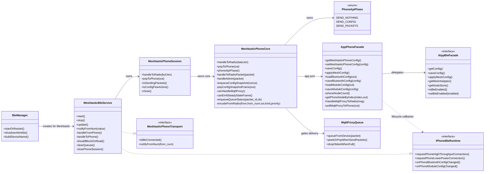
```mermaid
classDiagram
    direction LR

    class BleManager {
        +startOrRestart()
        +shutdownNimble()
        +buildDeviceName()
    }

    class MeshtasticBleService {
        +start()
        +stop()
        +update()
        +notifyFromNum(value)
        -handleFromPhone()
        -handleToPhone()
        -shouldBlockOnRead()
        -clearQueues()
        -closePhoneSession()
    }

    class MeshtasticPhoneSession {
        +handleToRadio(buf,len)
        +popToPhone(out)
        +isSendingPackets()
        +isConfigFlowActive()
        +close()
    }

    class MeshtasticPhoneCore {
        +handleToRadio(data,len)
        +popToPhone(out)
        +phoneApiPhase()
        -handleToRadioPacket(packet)
        -handleAdmin(packet)
        -enqueueConfigSnapshot(nonce)
        -popConfigSnapshotFrame(out)
        -canHandleMqttProxy()
        -canEmitSteadyStateFrame()
        -enqueueQueueStatus(packet_id,ok)
        -encodeFromRadio(from,from_num,out,kind,priority)
    }

    class PhoneApiPhase {
        <<enum>>
        SEND_NOTHING
        SEND_CONFIG
        SEND_PACKETS
    }

    class MqttProxyQueue {
        +queueFromDevice(packet)
        +peekOrPopWhenSendPackets()
        +dropOldestWhenFull()
    }

    class AppPhoneFacade {
        +getMeshtasticPhoneConfig()
        +setMeshtasticPhoneConfig(config)
        +saveConfig()
        +applyMeshConfig()
        +loadBluetoothConfig(out)
        +saveBluetoothConfig(config)
        +loadModuleConfig(out)
        +saveModuleConfig(config)
        +phoneNodeCount()
        +getPhoneNodeByIndex(index,out)
        +handleMqttProxyToRadio(msg)
        +pollMqttProxyToPhone(out)
    }

    class IAppBleFacade {
        <<interface>>
        +getConfig()
        +saveConfig()
        +applyMeshConfig()
        +getMeshAdapter()
        +getNodeStore()
        +isBleEnabled()
        +setBleEnabled(enabled)
    }

    class MeshtasticPhoneTransport {
        <<interface>>
        +isBleConnected()
        +notifyFromNum(from_num)
    }

    class IPhoneBleRuntime {
        <<interface>>
        +requestPhoneHighThroughputConnection()
        +requestPhoneLowerPowerConnection()
        +onPhoneBluetoothConfigChanged()
        +onPhoneModuleConfigChanged()
    }

    BleManager --> MeshtasticBleService : creates for Meshtastic
    MeshtasticBleService --> MeshtasticPhoneSession : owns
    MeshtasticPhoneSession --> MeshtasticPhoneCore : owns core
    MeshtasticPhoneCore --> PhoneApiPhase : owns
    MeshtasticPhoneCore --> AppPhoneFacade : app port
    MeshtasticPhoneCore --> MqttProxyQueue : gates delivery
    AppPhoneFacade --> IAppBleFacade : delegates
    MeshtasticBleService ..|> MeshtasticPhoneTransport
    MeshtasticBleService ..|> IPhoneBleRuntime
    AppPhoneFacade ..> IPhoneBleRuntime : lifecycle callbacks
```

Boundary rule:

```text
NimBLE callback -> MeshtasticBleService queue -> update() -> MeshtasticPhoneSession
               -> MeshtasticPhoneCore -> AppPhoneFacade -> App services
```

Read-authorize rule for BLE transports without a push-style FromRadioSync
characteristic:

```text
FROMRADIO read callback -> record pending read -> return to BLE stack
update() -> process pending ToRadio -> publish FromRadio slot -> authorize read
```

The callback must not call `popToPhone()` or encode protobuf frames directly. If
Android writes a heartbeat and immediately drains FROMRADIO, the transport may
hold the read authorization for a short bounded window so the main loop can turn
the heartbeat into a `queueStatus` frame. If no frame appears before the window
expires, the read is authorized with a zero-length value.

The reverse direction is:

```text
App services / mesh adapter events -> MeshtasticBleService.update()
                                  -> MeshtasticPhoneSession.popToPhone()
                                  -> FromRadio queue / FromNum notify
```

## Connection State Model

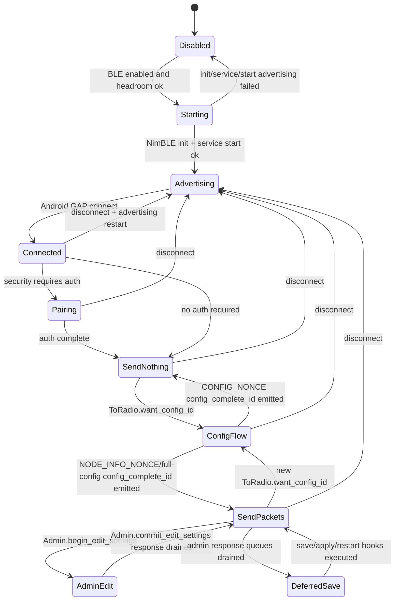
```mermaid
stateDiagram-v2
    [*] --> Disabled
    Disabled --> Starting: BLE enabled and headroom ok
    Starting --> Advertising: NimBLE init + service start ok
    Starting --> Disabled: init/service/start advertising failed
    Advertising --> Connected: Android GAP connect
    Connected --> Pairing: security requires auth
    Pairing --> SendNothing: auth complete
    Connected --> SendNothing: no auth required
    SendNothing --> ConfigFlow: ToRadio.want_config_id
    ConfigFlow --> SendNothing: CONFIG_NONCE config_complete_id emitted
    ConfigFlow --> SendPackets: NODE_INFO_NONCE/full-config config_complete_id emitted
    SendPackets --> AdminEdit: Admin.begin_edit_settings
    AdminEdit --> SendPackets: Admin.commit_edit_settings response drained
    SendPackets --> DeferredSave: admin response queues drained
    DeferredSave --> SendPackets: save/apply/restart hooks executed
    SendPackets --> ConfigFlow: new ToRadio.want_config_id
    Connected --> Advertising: disconnect + advertising restart
    Pairing --> Advertising: disconnect
    SendNothing --> Advertising: disconnect
    ConfigFlow --> Advertising: disconnect
    SendPackets --> Advertising: disconnect
```

State invariants:

- `Advertising` means Meshtastic service UUID is visible, not that Android has completed setup.
- `Connected` means GAP connection exists; it is not a PhoneAPI steady-state.
- `SendNothing` means GATT is connected but the PhoneAPI session has not entered config or packet delivery. Steady-state frames, including MQTT proxy, are forbidden.
- `ConfigFlow` owns `config_nonce_` and snapshot indexes while config frames are being emitted.
- `config_complete_id` is the phase boundary. Stage 1 (`CONFIG_NONCE=69420`) returns immediately to `SendNothing`; Stage 2 (`NODE_INFO_NONCE=69421`) enters `SendPackets` immediately.
- `SendPackets` is the only normal steady-state where `FromRadio.packet`,
  non-liveness `FromRadio.queueStatus`, `FromRadio.mqttClientProxyMessage`, client
  notifications, and normal Admin traffic may be emitted.
- `ToRadio.heartbeat` is the only `SendNothing` exception: firmware may emit its
  `FromRadio.queueStatus` liveness response without entering steady-state packet delivery.
  This does not permit MQTT proxy frames, normal packets, Admin traffic, or config frames in
  `SendNothing`.
- `DeferredSave` must happen after queue status and Admin response frames have been offered to the phone.
- Any implementation that derives `SendPackets` from `!config_flow_active_` alone is wrong because it collapses `SendNothing` and steady-state into one bool.

## Startup And Connect Sequence

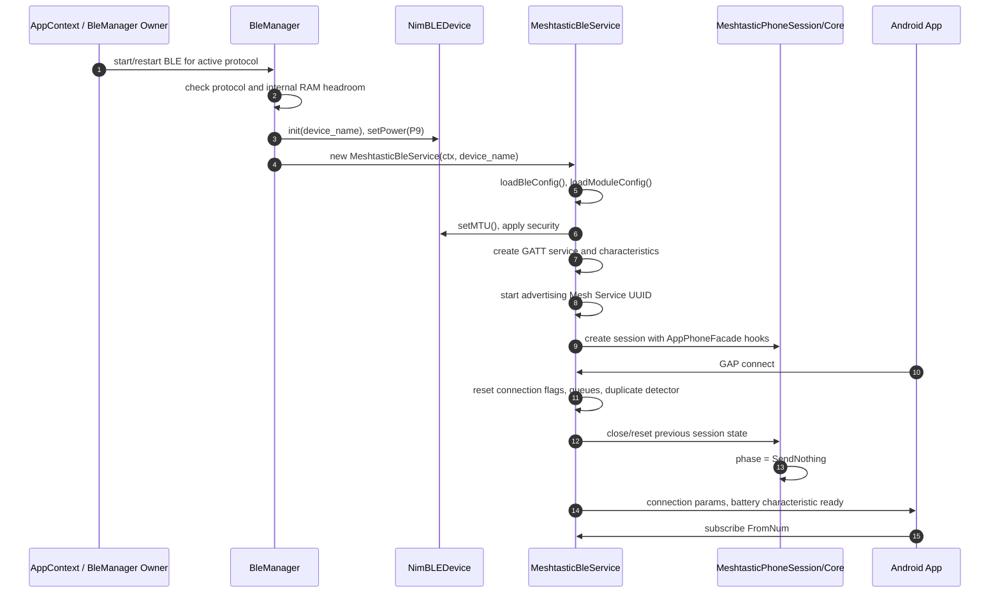
```mermaid
sequenceDiagram
    autonumber
    participant App as AppContext / BleManager Owner
    participant BM as BleManager
    participant NimBLE as NimBLEDevice
    participant Svc as MeshtasticBleService
    participant Core as MeshtasticPhoneSession/Core
    participant Phone as Android App

    App->>BM: start/restart BLE for active protocol
    BM->>BM: check protocol and internal RAM headroom
    BM->>NimBLE: init(device_name), setPower(P9)
    BM->>Svc: new MeshtasticBleService(ctx, device_name)
    Svc->>Svc: loadBleConfig(), loadModuleConfig()
    Svc->>NimBLE: setMTU(), apply security
    Svc->>Svc: create GATT service and characteristics
    Svc->>Svc: start advertising Mesh Service UUID
    Svc->>Core: create session with AppPhoneFacade hooks
    Phone->>Svc: GAP connect
    Svc->>Svc: reset connection flags, queues, duplicate detector
    Svc->>Core: close/reset previous session state
    Core->>Core: phase = SendNothing
    Svc->>Phone: connection params, battery characteristic ready
    Phone->>Svc: subscribe FromNum
```

Important:

- `BleManager` creates `MeshtasticBleService` only for Meshtastic protocol. MeshCore gets `MeshCoreBleService` / NUS.
- BLE start may be skipped if internal RAM headroom is below threshold. That is a startup resource failure, not a Meshtastic protocol state.
- On every connect/disconnect, queues and session state must be reset. Reusing a dirty config flow across Android reconnect is forbidden.

## ToRadio Ingress Activity

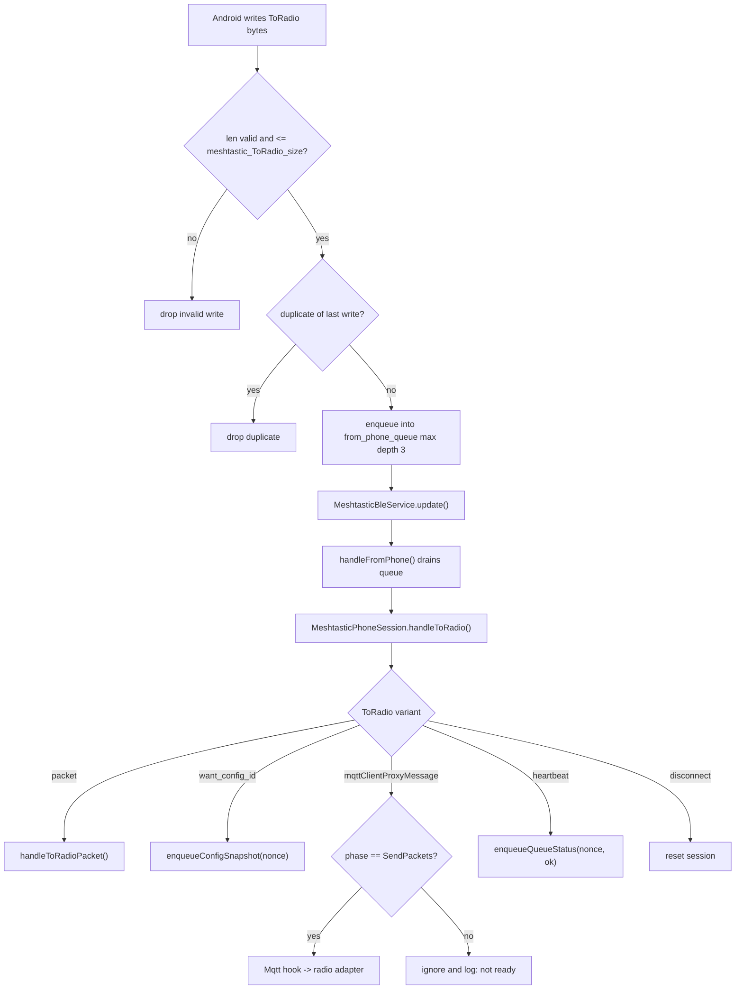
```mermaid
flowchart TD
    A["Android writes ToRadio bytes"] --> B{"len valid and <= meshtastic_ToRadio_size?"}
    B -- no --> B1["drop invalid write"]
    B -- yes --> C{"duplicate of last write?"}
    C -- yes --> C1["drop duplicate"]
    C -- no --> D["enqueue into from_phone_queue max depth 3"]
    D --> E["MeshtasticBleService.update()"]
    E --> F["handleFromPhone() drains queue"]
    F --> G["MeshtasticPhoneSession.handleToRadio()"]
    G --> H{"ToRadio variant"}
    H -->|packet| I["handleToRadioPacket()"]
    H -->|want_config_id| J["enqueueConfigSnapshot(nonce)"]
    H -->|mqttClientProxyMessage| K{"phase == SendPackets?"}
    K -- yes --> K1["Mqtt hook -> radio adapter"]
    K -- no --> K2["ignore and log: not ready"]
    H -->|heartbeat| L["enqueueQueueStatus(nonce, ok)"]
    H -->|disconnect| M["reset session"]
```

Rules:

- GATT callback may validate, dedupe, and enqueue only.
- Protobuf decode and semantic handling happen in `MeshtasticPhoneCore`.
- Queue overflow may drop writes and must be diagnosed through `[BLE] fromPhone drop ...` logs.
- Duplicate suppression belongs to the transport queue only and must not be used to hide semantic retries in core.
- `ToRadio.mqttClientProxyMessage` is a steady-state packet. It must be ignored before `SendPackets`, matching official `PhoneAPI.cpp`.
- Ignoring pre-steady-state MQTT proxy input is not message-loss by firmware; it means Android attempted broker->phone->device delivery before the device had completed PhoneAPI setup.

## FromRadio Egress Activity

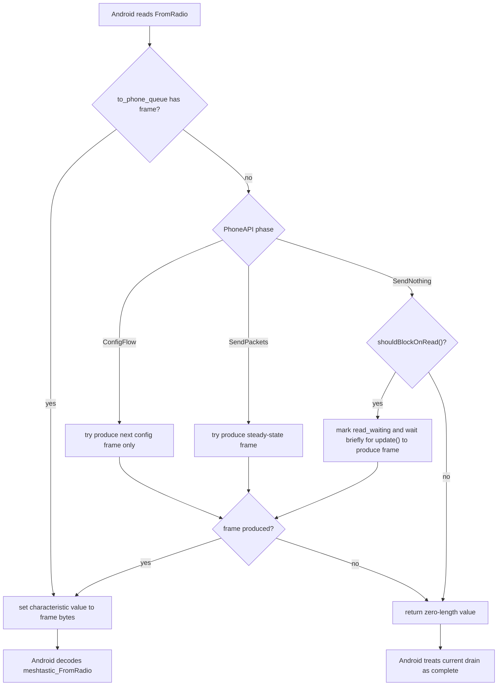
```mermaid
flowchart TD
    A["Android reads FromRadio"] --> B{"to_phone_queue has frame?"}
    B -- yes --> C["set characteristic value to frame bytes"]
    B -- no --> P{"PhoneAPI phase"}
    P -->|ConfigFlow| P1["try produce next config frame only"]
    P -->|SendPackets| P2["try produce steady-state frame"]
    P -->|SendNothing| D{"shouldBlockOnRead()?"}
    P1 --> F{"frame produced?"}
    P2 --> F
    D -- yes --> E["mark read_waiting and wait briefly for update() to produce frame"]
    D -- no --> H["return zero-length value"]
    E --> F{"frame produced?"}
    F -- yes --> C
    F -- no --> H
    C --> G["Android decodes meshtastic_FromRadio"]
    H --> I["Android treats current drain as complete"]
```

Android does not read `FromRadio` only after a `FromNum` notification. The official app also
actively drains `FromRadio` after `ToRadio` writes and during config setup. Therefore a transport
with pre-published slots must treat "frame is encoded in a readable slot" as sufficient for a
non-empty read. `FromNum` is a wakeup/announcement signal; it must not be used as a read-permission
gate.

`shouldBlockOnRead()` must be true when:

- steady-state packet sending is active after a `FromNum` notify;
- config flow is active.

This is not optional. During config/setup, returning zero-length before `config_complete_id`
can make the Android App stop draining `FromRadio`, causing symptoms such as `Nodes(0)` or
stuck setup screens.

On transports that preload `FROMRADIO` outside the GATT read callback, consuming a read frame must atomically
prefer the next available frame over a temporary empty characteristic value. In practice this means:

- after a non-empty read, mark that preloaded frame consumed;
- immediately ask `PhoneAPI`/`MeshtasticPhoneCore` for the next frame in the same main-loop turn;
- write a 0-length `FROMRADIO` value only if there is truly no next frame.

Publishing an empty value between two real config frames is a protocol-visible empty read, even if the gap lasts only
one scheduler slice.

MQTT proxy egress rule:

- `FromRadio.mqttClientProxyMessage` belongs only to `SendPackets`.
- `popToPhone()` must not poll or pop the MQTT proxy queue while phase is `SendNothing` or `ConfigFlow`.
- A pre-handshake read may return config data or no frame, but it must not consume MQTT proxy data.
- This rule is stronger than queue priority. The first decision is phase, then variant priority within that phase.
- Within `SendPackets`, local identity/message projections have priority over MQTT proxy frames:
  `queueStatus -> node_info -> packet -> deferred save/apply/restart -> mqttClientProxyMessage -> empty`.
- MQTT proxy is still a bounded P3 projection, but it must not be starved forever by a continuous P2
  latest-value stream. After a bounded number of P2/P3 deferrals, firmware may emit one pending
  `mqttClientProxyMessage` before more P2/P3 frames. This fairness rule never applies before
  `SendPackets`, never overtakes P0/P1 frames, and never overtakes deferred save/apply/restart side effects.

FromNum/FromRadio binding rule:

- `FromNum` notification must describe a frame that is already queued or preloaded for `FromRadio`.
- `FromRadio` must not return empty solely because the head frame has not yet been notified. Android
  may consume that frame through proactive drain before the wakeup notification is sent.
- Every encoded `FromRadio` projection carries core-produced `kind` and `priority` metadata. The
  transport publishes and sheds by this metadata; it must not parse protobuf payloads, inspect
  payload length, or infer semantics from `from_num` to decide priority.
- A transport must not keep an independent pending `from_num` ring that can drift ahead of the readable frame.
- If a transport uses a monotonic notify token, it must log the semantic `source` separately.
- If a transport uses the frame `from_num` as the notify value, that value must be read from the same preloaded frame.
- After Android reads a frame, the consumed slot is released. The next frame may then be preloaded and
  notified; unread frames must not be overtaken by later notifications.
- If proactive drain consumes a not-yet-notified head frame, the transport must skip/cancel the
  wakeup for that consumed slot and bind any later notification to the new head frame.
- A transport may keep a smaller steady-state published window than its physical slot capacity
  so ordinary packet projections cannot build a long unread FIFO in front of later liveness/control
  frames. Config flow may use the full published capacity because config snapshot ordering is the
  connection-completion boundary.

## Android App And Firmware Interaction Contract

This section is normative. It describes the official Android App / firmware behavior that Trail Mate must mirror unless
we intentionally document a product-level divergence.

### App-Level Connection Is Not GATT Connection

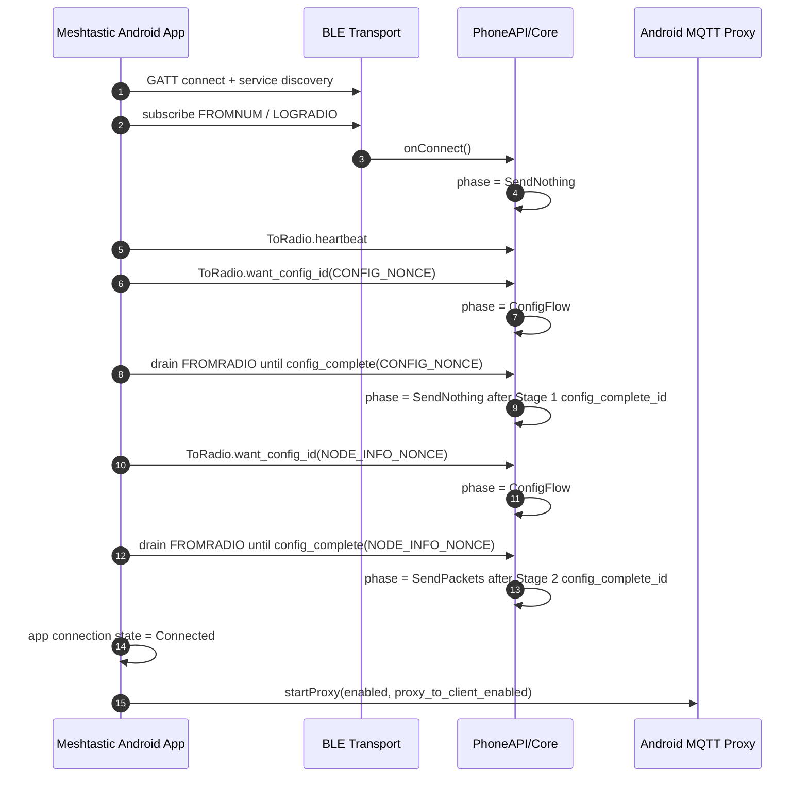
```mermaid
sequenceDiagram
    autonumber
    participant Android as Meshtastic Android App
    participant BLE as BLE Transport
    participant Core as PhoneAPI/Core
    participant MQTT as Android MQTT Proxy

    Android->>BLE: GATT connect + service discovery
    Android->>BLE: subscribe FROMNUM / LOGRADIO
    BLE->>Core: onConnect()
    Core->>Core: phase = SendNothing
    Android->>Core: ToRadio.heartbeat
    Android->>Core: ToRadio.want_config_id(CONFIG_NONCE)
    Core->>Core: phase = ConfigFlow
    Android->>Core: drain FROMRADIO until config_complete(CONFIG_NONCE)
    Core->>Core: phase = SendNothing after Stage 1 config_complete_id
    Android->>Core: ToRadio.want_config_id(NODE_INFO_NONCE)
    Core->>Core: phase = ConfigFlow
    Android->>Core: drain FROMRADIO until config_complete(NODE_INFO_NONCE)
    Core->>Core: phase = SendPackets after Stage 2 config_complete_id
    Android->>Android: app connection state = Connected
    Android->>MQTT: startProxy(enabled, proxy_to_client_enabled)
```

Rules:

- Android may show `Connecting` while GATT is already connected. Firmware must treat this as pre-steady-state.
- Android starts MQTT proxy from synchronized module config after node DB readiness. Firmware must not assume Android MQTT is ready during `SendNothing` or `ConfigFlow`.
- `FromNum` can wake reads, but Android also proactively drains after writes. Early `FromRadio` contents are therefore observable even without a notify.

### BLE Session Liveness Observation

`App connected/online` is a UI state projected by Android/iOS based on multiple facts, not a single BLE field. When making a diagnosis, you must also observe:

- BLE transport session: GAP connected、secured、bonded、MTU、connection interval、supervision timeout.
- Notification readiness: `FromNum` CCCD whether to subscribe, the latest `FromNum` notify, the latest `FromRadio` read.
- PhoneAPI phase: `SendNothing`、`ConfigFlow`、`SendPackets`.
- App liveness traffic: the latest `ToRadio.heartbeat`, `ToRadio.want_config_id`, `FromRadio.queueStatus`.

Trail Mate nRF Meshtastic BLE implementation must emit a low-rate session trace using one `session_seq` per transport session:

```text
[BLE][nrf52][mt][session] seq=... tag=... detail=... age_ms=... connected=... gap=...
```

Required tags:

| Tag | Meaning |
| --- | --- |
| `link_up` | GAP connected; previous PhoneAPI session and unread `FromRadio` slots have been closed/reset. |
| `secured` | The BLE link completed security. This does not by itself mean Android completed PhoneAPI config sync. |
| `from_num_cccd_on` / `from_num_cccd_off` | Android subscribed/unsubscribed `FromNum`; without subscription, `FromRadio` data may still be read proactively but wakeup semantics are weaker. |
| `want_config` | Android wrote `ToRadio.want_config_id`; this starts/restarts PhoneAPI config snapshot. |
| `heartbeat` | Android wrote `ToRadio.heartbeat`; firmware must enqueue a non-empty `FromRadio.queueStatus` for liveness when phase allows it. |
| `phase_change` | PhoneAPI phase changed while handling a `ToRadio` write. |
| `phone_disconnect` | Android wrote `ToRadio.disconnect`; firmware must request a real GAP/GATT disconnect, not only reset PhoneAPI state. |
| `periodic` | Low-rate snapshot while connected, used to diagnose stale app UI state when no edge event occurs. |
| `link_down` | GAP disconnected; PhoneAPI session and unread published slots must be closed/reset. |

Important distinction:

- If logs show `connected=1`, `gap=1`, `notify=1`, `send=1`, and heartbeat/read ages are fresh, firmware should treat BLE transport as alive even if the app UI temporarily says offline.
- If app UI says offline while `FromRadio` messages still drain, the suspect boundary is app-level connection projection or config freshness, not immediate packet transport.
- Do not fix this symptom by forcing a fake online state or by emitting out-of-phase config frames. The proper fix is to align transport session lifecycle, `want_config` handling, heartbeat response, and `FromRadio` drain ordering with official firmware.

Transport lifecycle rules:

- `ToRadio.disconnect` is a phone transport lifecycle command. Handling it is not complete until the platform BLE runtime requests a real link disconnect.
- `PhoneCore` may reset PhoneAPI state, but it must delegate physical disconnect to the transport/runtime owner.
- Platform runtimes must route the resulting GAP/GATT disconnect through the same `link_down` cleanup path used by remote disconnects: close PhoneAPI session, release published `FromRadio` slots, clear pending reads/notifies, clear pairing UI state, then restart advertising as appropriate.
- nRF runtimes must also defend against half-open sessions: if GAP still reports connected but no phone-side liveness traffic is observed for the stale-session window, the runtime should proactively disconnect the old link so Android can perform a fresh connection handshake.

### MQTT Proxy Reliability Window

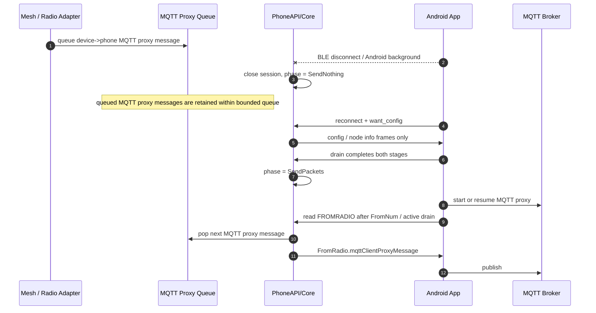
```mermaid
sequenceDiagram
    autonumber
    participant Mesh as Mesh / Radio Adapter
    participant Queue as MQTT Proxy Queue
    participant Core as PhoneAPI/Core
    participant Android as Android App
    participant Broker as MQTT Broker

    Mesh->>Queue: queue device->phone MQTT proxy message
    Android--xCore: BLE disconnect / Android background
    Core->>Core: close session, phase = SendNothing
    Note over Queue: queued MQTT proxy messages are retained within bounded queue
    Android->>Core: reconnect + want_config
    Core->>Android: config / node info frames only
    Android->>Core: drain completes both stages
    Core->>Core: phase = SendPackets
    Android->>Broker: start or resume MQTT proxy
    Android->>Core: read FROMRADIO after FromNum / active drain
    Core->>Queue: pop next MQTT proxy message
    Core->>Android: FromRadio.mqttClientProxyMessage
    Android->>Broker: publish
```

Rules:

- Firmware only guarantees a bounded in-memory window, not infinite offline MQTT history.
- The bounded queue should use drop-oldest behavior when full, matching official firmware's MQTT proxy queue semantics.
- Session close may release the current in-flight `mqttClientProxyMessage`, but it must not clear the queue of messages not yet handed to the phone.
- The queue is consumed only after `SendPackets`. This prevents Android from dropping device->broker proxy messages while MQTT proxy is not active.
- Broker->phone->device messages received by Android before firmware reaches `SendPackets` must be ignored by firmware, matching official `PhoneAPI`.

### Phase-Gated Variant Matrix

| Variant | SendNothing | ConfigFlow | SendPackets |
| --- | --- | --- | --- |
| `ToRadio.want_config_id` | Start config snapshot. | Restart config snapshot only if official behavior allows same-session request; otherwise prefer transport restart recovery. | Start requested config snapshot. |
| `ToRadio.heartbeat` | May enqueue queue status for liveness if transport requires it. | Must not interrupt config snapshot ordering. | May enqueue queue status. |
| `ToRadio.packet` | Reject or ignore except explicitly supported local setup traffic. | Reject or ignore except official passphrase/admin exceptions. | Handle packet / Admin / app data. |
| `ToRadio.mqttClientProxyMessage` | Ignore and log. | Ignore and log. | Validate and inject MQTT downlink. |
| `FromRadio.config*` variants | Not emitted until `want_config_id`. | Allowed, ordered by config snapshot rules. | Only emitted for explicit config snapshot request. |
| `FromRadio.node_info` | Not emitted until `want_config_id`. | Allowed in node snapshot. | Allowed only for explicit steady-state projection events. |
| `FromRadio.queueStatus` | Avoid unless required for heartbeat liveness. | Must not overtake config frames. | Allowed before MQTT proxy. |
| `FromRadio.mqttClientProxyMessage` | Forbidden and must not consume queue. | Forbidden and must not consume queue. | Allowed after local status, identity, packet, and deferred-save drain. |
| `FromRadio.packet` | Forbidden. | Forbidden except explicitly allowed setup/admin responses. | Allowed. |

Implementation consequence:

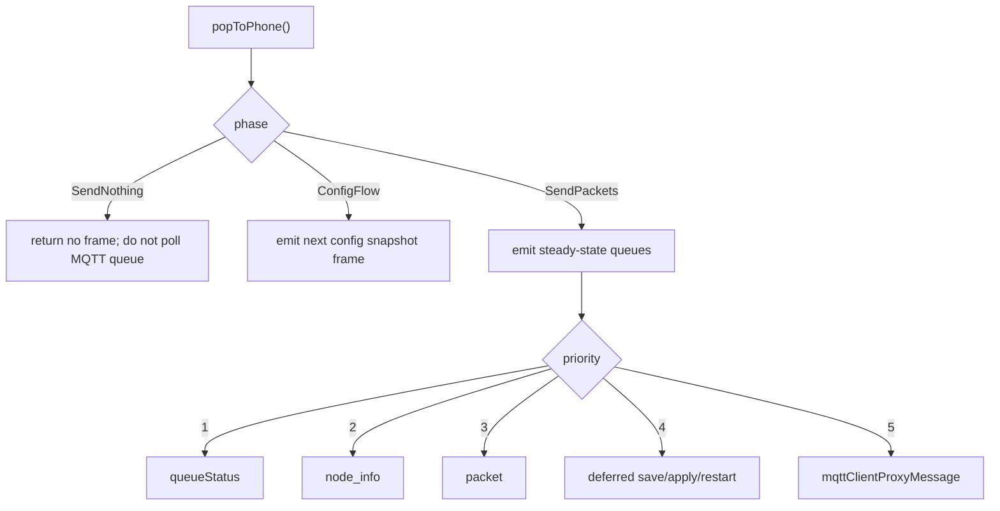
```mermaid
flowchart TD
    A["popToPhone()"] --> B{"phase"}
    B -->|SendNothing| C["return no frame; do not poll MQTT queue"]
    B -->|ConfigFlow| D["emit next config snapshot frame"]
    B -->|SendPackets| F["emit steady-state queues"]
    F --> G{"priority"}
    G -->|1| H["queueStatus"]
    G -->|2| I["node_info"]
    G -->|3| J["packet"]
    G -->|4| K["deferred save/apply/restart"]
    G -->|5| L["mqttClientProxyMessage"]
```

## Config Snapshot Flow

Android requests configuration by writing `ToRadio.want_config_id`. The firmware must respond with a deterministic
sequence of `FromRadio` frames and finish with `config_complete_id`.

Known special nonces:

| Nonce | Name | Meaning |
| --- | --- | --- |
| `69420` | `stage1_config` | Config-focused snapshot. Sends `my_info`, `deviceuiConfig`, metadata, channels, config, module configs, then complete. Must not send node_info. |
| `69421` | `stage2_nodes` | Node-focused snapshot. Sends self node and peer nodes, then complete. Must not send metadata/channels/config/module configs. |
| Other | `stage_unknown` | Full compatibility snapshot. Sends all supported sections in order. |

### Stage 1 Config Sequence

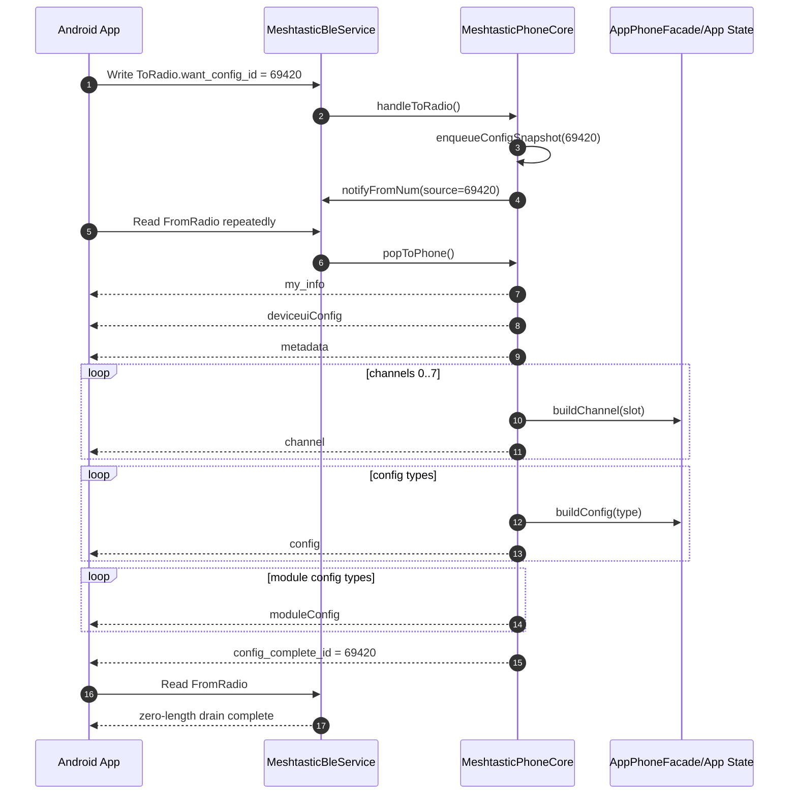
```mermaid
sequenceDiagram
    autonumber
    participant Phone as Android App
    participant BLE as MeshtasticBleService
    participant Core as MeshtasticPhoneCore
    participant App as AppPhoneFacade/App State

    Phone->>BLE: Write ToRadio.want_config_id = 69420
    BLE->>Core: handleToRadio()
    Core->>Core: enqueueConfigSnapshot(69420)
    Core->>BLE: notifyFromNum(source=69420)
    Phone->>BLE: Read FromRadio repeatedly
    BLE->>Core: popToPhone()
    Core-->>Phone: my_info
    Core-->>Phone: deviceuiConfig
    Core-->>Phone: metadata
    loop channels 0..7
        Core->>App: buildChannel(slot)
        Core-->>Phone: channel
    end
    loop config types
        Core->>App: buildConfig(type)
        Core-->>Phone: config
    end
    loop module config types
        Core-->>Phone: moduleConfig
    end
    Core-->>Phone: config_complete_id = 69420
    Phone->>BLE: Read FromRadio
    BLE-->>Phone: zero-length drain complete
```

### Stage 2 Nodes Sequence

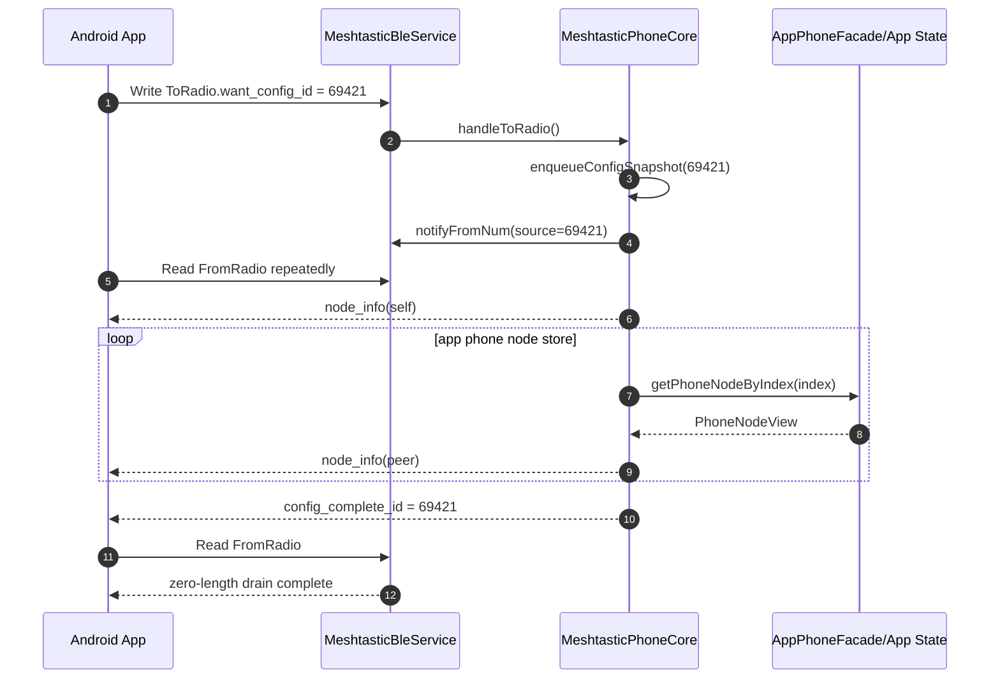
```mermaid
sequenceDiagram
    autonumber
    participant Phone as Android App
    participant BLE as MeshtasticBleService
    participant Core as MeshtasticPhoneCore
    participant App as AppPhoneFacade/App State

    Phone->>BLE: Write ToRadio.want_config_id = 69421
    BLE->>Core: handleToRadio()
    Core->>Core: enqueueConfigSnapshot(69421)
    Core->>BLE: notifyFromNum(source=69421)
    Phone->>BLE: Read FromRadio repeatedly
    Core-->>Phone: node_info(self)
    loop app phone node store
        Core->>App: getPhoneNodeByIndex(index)
        App-->>Core: PhoneNodeView
        Core-->>Phone: node_info(peer)
    end
    Core-->>Phone: config_complete_id = 69421
    Phone->>BLE: Read FromRadio
    BLE-->>Phone: zero-length drain complete
```

Invariants:

- Every encoded `FromRadio` gets a strictly increasing `FromRadio.id`.
- `MeshtasticBleFrame.from_num` for config snapshot frames is the config nonce, except peer `node_info`
  frames may use the peer node id as `from_num`.
- `config_complete_id` must be emitted exactly once per config snapshot flow.
- After `config_complete_id`, the PhoneAPI phase changes immediately: `CONFIG_NONCE=69420` returns to `SendNothing`; `NODE_INFO_NONCE=69421` and normal full config enter `SendPackets`.
- The next `popToPhone()` after completion may return false only because no steady-state frame is available. It must not be used as a deliberate phase-transition sentinel.
- Peer `node_info` frames must only be emitted for nodes with visible identity facts
  (`short_name` or `long_name`). Observation-only entries must not be projected as
  empty users because Android/iOS can keep the empty fallback name in their node database.
- MQTT `MAP_REPORT_APP` is a valid upstream source of peer identity facts. Radio
  adapters must decode it into the shared node store before the phone node snapshot
  can project names such as `Haibara.Ai (MQTT)` and emoji short names.

### Peer Identity Sources

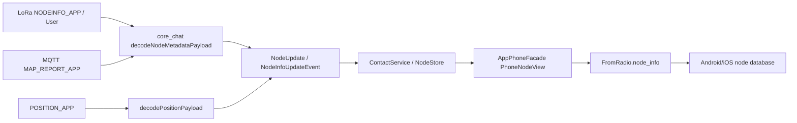
```mermaid
flowchart LR
    A["LoRa NODEINFO_APP / User"] --> D["core_chat decodeNodeMetadataPayload"]
    B["MQTT MAP_REPORT_APP"] --> D
    C["POSITION_APP"] --> E["decodePositionPayload"]
    D --> F["NodeUpdate / NodeInfoUpdateEvent"]
    E --> F
    F --> G["ContactService / NodeStore"]
    G --> H["AppPhoneFacade PhoneNodeView"]
    H --> I["FromRadio.node_info"]
    I --> J["Android/iOS node database"]
```

Rules:

- Node identity parsing belongs to `modules/core_chat`; platform adapters must
  not separately decode `NodeInfo`, legacy `User`, or `MapReport`.
- `MAP_REPORT_APP` is public MQTT metadata. It may update local node identity and
  may be forwarded to the phone as packet data, but it must not be LoRa-transmitted
  as a normal MQTT downlink.
- Public-key state is separate from public-key value. Metadata that lacks a key
  field must leave the existing key state untouched.

## Pop Order

`MeshtasticPhoneCore::popToPhone()` must follow this rule:

```text
Phase first. Priority second. Never consume a queue that is not legal in the current phase.
```

### Phase 1: SendNothing

Allowed output:

1. No frame.

Forbidden:

- `FromRadio.mqttClientProxyMessage`
- `FromRadio.packet`
- normal `FromRadio.queueStatus`
- deferred save/apply/restart side effects

### Phase 2: ConfigFlow

Allowed output:

1. Active config snapshot frame.
2. No frame only when no config frame is currently available.

Forbidden:

- MQTT proxy egress.
- Steady-state packet egress.
- Popping MQTT proxy data from the queue.
- Deferred save/apply/restart side effects before config flow is done.

### Phase 3: SendPackets

Within `SendPackets`, preserve this priority:

1. Queue status frames.
2. Node info projection frames queued outside config flow.
3. Mesh packet frames.
4. Deferred app config save.
5. Deferred module config save.
6. Deferred Bluetooth config save and enabled-state apply.
7. Deferred restart after module config change.
8. MQTT proxy message from radio/backend to phone.
9. No frame.

Do not reorder this casually. In particular, MQTT proxy must not overtake active config frames, node identity projection,
mesh packet projection, or deferred saves. Deferred save must not overtake phone-visible Admin responses.
The exception is the bounded P2/P3 fairness window: a continuous low-priority packet stream must not prevent a
pending MQTT proxy frame from ever reaching Android. This exception does not apply to P0/P1 frames or deferred side
effects.

The response-drain-before-save rule exists because Android expects queue status and Admin response frames promptly.
Blocking flash/NVS writes or restart before those frames are observable can make the App appear connected but stuck.

## Admin Packet Handling

Android sends Admin operations as `ToRadio.packet` where:

```text
MeshPacket.decoded.portnum == ADMIN_APP
packet.to == 0 or packet.to == self node id
```

Core behavior:

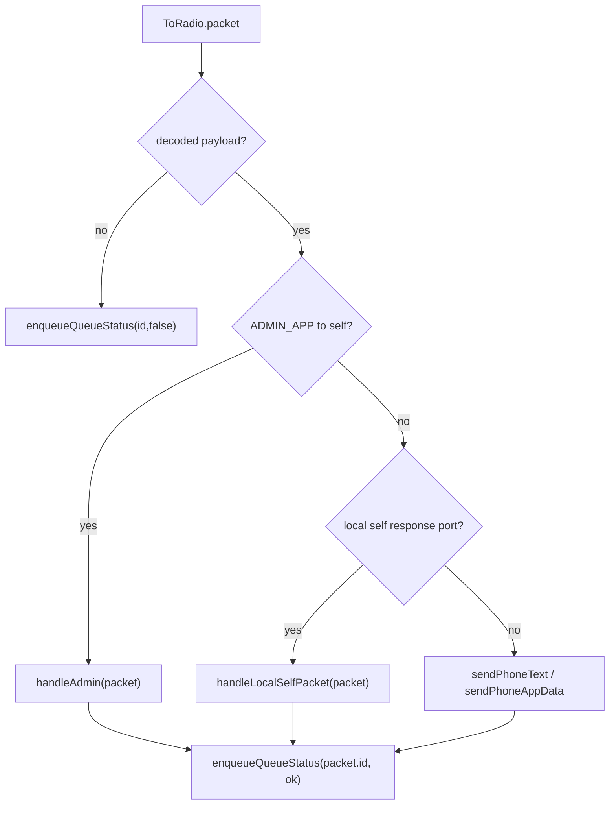
```mermaid
flowchart TD
    A["ToRadio.packet"] --> B{"decoded payload?"}
    B -- no --> B1["enqueueQueueStatus(id,false)"]
    B -- yes --> C{"ADMIN_APP to self?"}
    C -- yes --> D["handleAdmin(packet)"]
    C -- no --> E{"local self response port?"}
    E -- yes --> F["handleLocalSelfPacket(packet)"]
    E -- no --> G["sendPhoneText / sendPhoneAppData"]
    D --> H["enqueueQueueStatus(packet.id, ok)"]
    F --> H
    G --> H
```

Admin response order:

```text
set_* request
  -> mutate in-memory config snapshot / module config
  -> apply immediate runtime effect when safe
  -> enqueue queueStatus(packet.id, ok)
  -> enqueue Admin response packet if required
  -> after both are drained, perform durable save/apply/restart hooks
```

### Lora Config Save

`AdminMessage.set_config.lora` must:

- update `MeshtasticPhoneConfigSnapshot.mesh`;
- call `setMeshtasticPhoneConfig(cfg)`;
- mark config save as deferred unless inside edit transaction;
- call `applyMeshConfig()` so radio runtime sees new LoRa settings;
- return `get_config_response(LORA_CONFIG)`;
- save durable config only after response drain.

This sequence protects the Android App from blocking on storage during the Admin response path.

### MQTT Module Config Save

`AdminMessage.set_module_config.mqtt` must:

- update `module_config_.mqtt`;
- normalize legacy/default MQTT fields;
- mark module config save as deferred unless inside edit transaction;
- mark restart pending because MQTT module changes may require device restart;
- return `get_module_config_response(MQTT_CONFIG)`;
- save module config only after response drain;
- restart only after module config save has been offered.

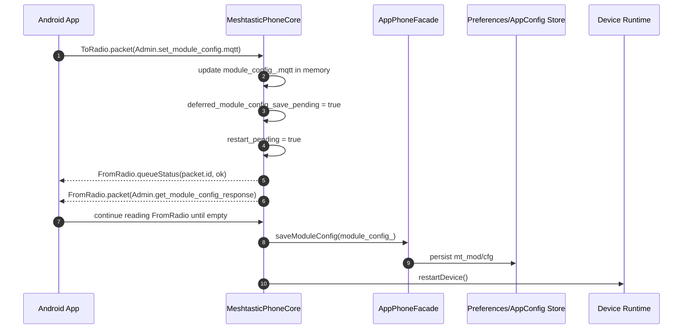
```mermaid
sequenceDiagram
    autonumber
    participant Phone as Android App
    participant Core as MeshtasticPhoneCore
    participant Facade as AppPhoneFacade
    participant Storage as Preferences/AppConfig Store
    participant Device as Device Runtime

    Phone->>Core: ToRadio.packet(Admin.set_module_config.mqtt)
    Core->>Core: update module_config_.mqtt in memory
    Core->>Core: deferred_module_config_save_pending = true
    Core->>Core: restart_pending = true
    Core-->>Phone: FromRadio.queueStatus(packet.id, ok)
    Core-->>Phone: FromRadio.packet(Admin.get_module_config_response)
    Phone->>Core: continue reading FromRadio until empty
    Core->>Facade: saveModuleConfig(module_config_)
    Facade->>Storage: persist mt_mod/cfg
    Core->>Device: restartDevice()
```

### Bluetooth Config Apply

`AdminMessage.set_config.bluetooth` must:

- update `bluetooth_config_`;
- normalize fixed pin when `NO_PIN`;
- defer `saveBluetoothConfig()` and `setBleEnabled()` until response drain;
- return `get_config_response(BLUETOOTH_CONFIG)` before applying the enabled-state change.

If enabling BLE requires a reboot or service restart, that is a BLE manager/runtime lifecycle bug.
The Admin path must not hide it by returning success before the requested runtime effect is possible.

### Edit Transaction

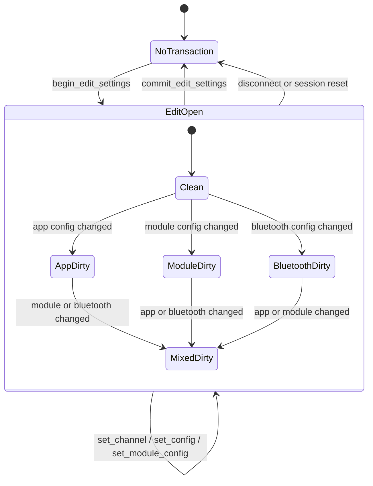
```mermaid
stateDiagram-v2
    [*] --> NoTransaction
    NoTransaction --> EditOpen: begin_edit_settings
    EditOpen --> EditOpen: set_channel / set_config / set_module_config
    EditOpen --> NoTransaction: commit_edit_settings
    EditOpen --> NoTransaction: disconnect or session reset

    state EditOpen {
        [*] --> Clean
        Clean --> AppDirty: app config changed
        Clean --> ModuleDirty: module config changed
        Clean --> BluetoothDirty: bluetooth config changed
        AppDirty --> MixedDirty: module or bluetooth changed
        ModuleDirty --> MixedDirty: app or bluetooth changed
        BluetoothDirty --> MixedDirty: app or module changed
    }
```

Rules:

- `begin_edit_settings` opens a transaction and itself only needs queue status.
- Set operations inside a transaction must not save immediately.
- `commit_edit_settings` converts dirty flags into deferred save/apply/restart flags.
- Durable save still happens after the commit response drain, not during commit handling.

## Steady-State Packet Delivery

After config flow completes, normal phone traffic enters `STATE_SEND_PACKETS` equivalent behavior:

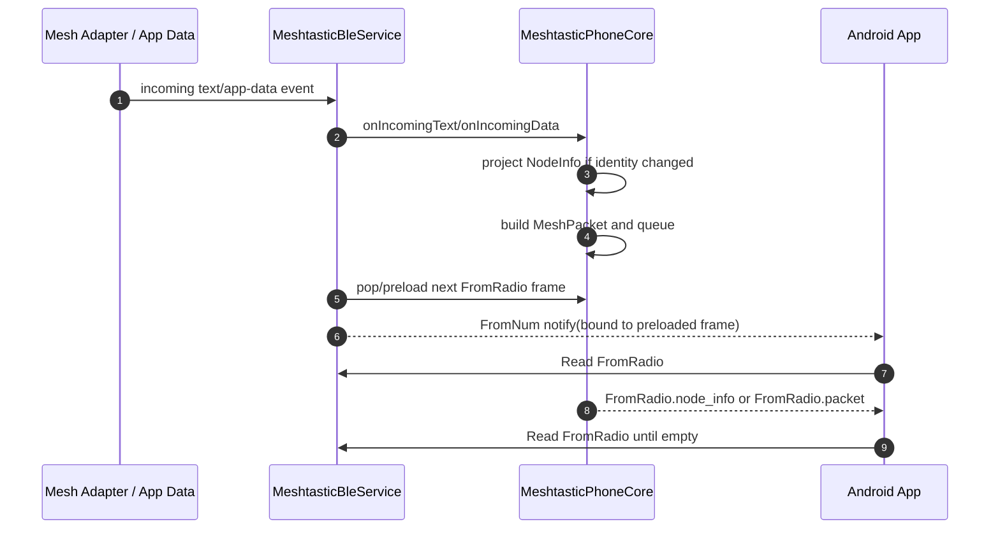
```mermaid
sequenceDiagram
    autonumber
    participant Radio as Mesh Adapter / App Data
    participant Svc as MeshtasticBleService
    participant Core as MeshtasticPhoneCore
    participant Phone as Android App

    Radio->>Svc: incoming text/app-data event
    Svc->>Core: onIncomingText/onIncomingData
    Core->>Core: project NodeInfo if identity changed
    Core->>Core: build MeshPacket and queue
    Svc->>Core: pop/preload next FromRadio frame
    Svc-->>Phone: FromNum notify(bound to preloaded frame)
    Phone->>Svc: Read FromRadio
    Core-->>Phone: FromRadio.node_info or FromRadio.packet
    Phone->>Svc: Read FromRadio until empty
```

When App sends:

- `TEXT_MESSAGE_APP`: route through `sendPhoneText()`.
- Other app-data: route through `sendPhoneAppData()`.
- self telemetry/position/nodeinfo request: may be answered locally by `handleLocalSelfPacket()`.
- unsupported self loopback ports without response: suppress and report queue success.

### MQTT Proxy In Steady State

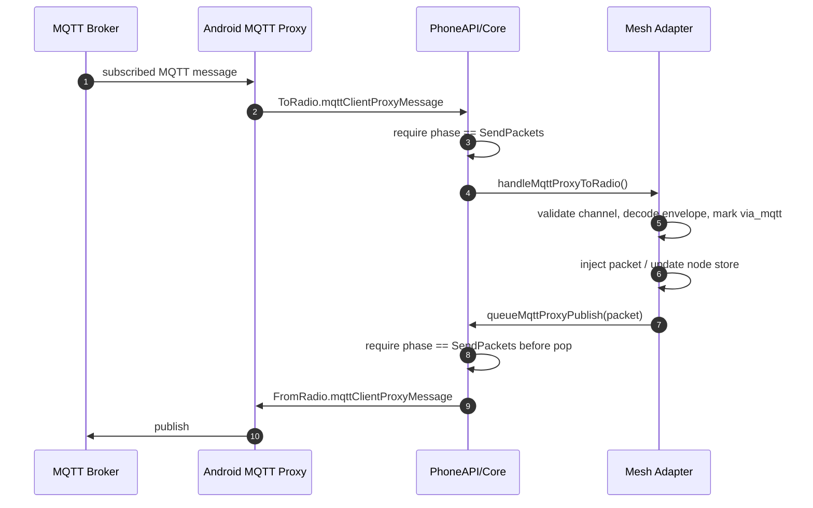
```mermaid
sequenceDiagram
    autonumber
    participant Broker as MQTT Broker
    participant Android as Android MQTT Proxy
    participant Core as PhoneAPI/Core
    participant Radio as Mesh Adapter

    Broker->>Android: subscribed MQTT message
    Android->>Core: ToRadio.mqttClientProxyMessage
    Core->>Core: require phase == SendPackets
    Core->>Radio: handleMqttProxyToRadio()
    Radio->>Radio: validate channel, decode envelope, mark via_mqtt
    Radio->>Radio: inject packet / update node store

    Radio->>Core: queueMqttProxyPublish(packet)
    Core->>Core: require phase == SendPackets before pop
    Core->>Android: FromRadio.mqttClientProxyMessage
    Android->>Broker: publish
```

Rules:

- MQTT downlink into the device is legal only after `SendPackets`.
- MQTT uplink out of the device may be queued before Android reconnects, but may be consumed only after `SendPackets`.
- The bounded MQTT proxy queue is a loss boundary. If it fills, drop-oldest is acceptable and must be logged; silent early consumption is not acceptable.
- MQTT proxy egress is lower priority than local `NodeInfo`/`MeshPacket` projection. A broker burst must not delay the identity frames Android needs to render sender name, emoji, `(MQTT)`, and cloud state.

## Runtime Concurrency Rules

This BLE path must satisfy `RUNTIME_CONCURRENCY_SPEC.md`:

```text
BLE callback owns transport timing only.
BLE callback must not directly mutate app services.
Mutable app-service state must have a single owner context.
Storage work must not run inside BLE stack callback.
```

Allowed in GATT callback:

- validate length;
- copy bytes;
- queue frame;
- update connection flags;
- set characteristic value for read response.

Forbidden in GATT callback:

- call `AppContext::saveConfig()`;
- call `applyMeshConfig()`;
- call radio send;
- restart device;
- perform protobuf business decisions;
- walk node store;
- mutate UI directly.

## ChannelSettings Contract

`meshtastic_ChannelSettings` is the protocol object. Local app config and phone snapshots are projections of it, not definitions of it.

Current required round-trip fields:

| Protocol field | Local projection | Notes |
| --- | --- | --- |
| `settings.name` | `MeshConfig.primary_channel_name` / `secondary_channel_name` | Keep bounded string semantics. |
| `settings.id` | `MeshConfig.primary_channel_id` / `secondary_channel_id` | Preserve numeric channel identity. |
| `settings.psk` | `MeshConfig.primary_key` / `secondary_key` plus key length | Shorthand PSK may expand internally but must be preserved in Admin response where applicable. |
| `settings.uplink_enabled` | `primary_uplink_enabled` / `secondary_uplink_enabled` | MQTT gateway direction flag. |
| `settings.downlink_enabled` | `primary_downlink_enabled` / `secondary_downlink_enabled` | MQTT gateway direction flag. |
| `settings.has_module_settings` | `primary_channel_has_module_settings` / `secondary_channel_has_module_settings` | Presence is part of protocol state and must not be inferred away. |
| `settings.module_settings.position_precision` | `primary_channel_position_precision` / `secondary_channel_position_precision` | Android location/precise-location channel setting. |
| `settings.module_settings.is_muted` | `primary_channel_is_muted` / `secondary_channel_is_muted` | Per-channel muted state. |

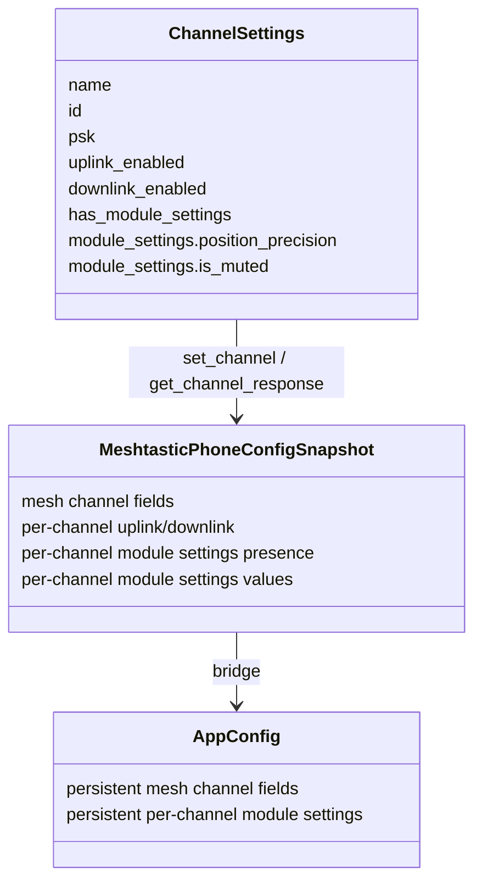
```mermaid
classDiagram
    class ChannelSettings {
        name
        id
        psk
        uplink_enabled
        downlink_enabled
        has_module_settings
        module_settings.position_precision
        module_settings.is_muted
    }
    class MeshtasticPhoneConfigSnapshot {
        mesh channel fields
        per-channel uplink/downlink
        per-channel module settings presence
        per-channel module settings values
    }
    class AppConfig {
        persistent mesh channel fields
        persistent per-channel module settings
    }
    ChannelSettings --> MeshtasticPhoneConfigSnapshot : set_channel / get_channel_response
    MeshtasticPhoneConfigSnapshot --> AppConfig : bridge
```

Rules:

- Do not treat `ChannelSettings` as only name/id/psk/uplink/downlink.
- Do not collapse `has_module_settings=false` and `has_module_settings=true` with default values; protobuf presence must round-trip.
- `set_channel` must write the complete supported `ChannelSettings` projection before `applyMeshConfig()`.
- `get_channel_response` and config snapshots must return the same supported `ChannelSettings` projection Android just saved.
- Durable storage must persist the supported `ChannelSettings` projection across restart.
- New generated `ChannelSettings` fields must be classified here before they are ignored, persisted, or intentionally rejected.

## Bypass Cleanup Rules

Any future change touching this area must remove or reject these bypasses:

| Bypass | Why forbidden | Correct path |
| --- | --- | --- |
| Direct App mutation from `NimBLECharacteristicCallbacks::onWrite()` | Violates runtime ownership and makes callback timing define protocol semantics. | Enqueue bytes, drain in `MeshtasticBleService.update()`, interpret in `MeshtasticPhoneCore`. |
| Immediate config save inside `handleAdmin()` | Can stall Android before queueStatus/Admin response drain; previously led to visible stuck states and stack pressure. | Mark deferred flag, save after `popToPhone()` has no response frames left. |
| Extra Android-specific `Nodes(0)` workaround | Treats App UI symptom as firmware state and risks breaking iOS/official BLE drain semantics. | Fix config snapshot ordering, blocking read semantics, `config_complete_id`, or node projection. |
| Forcing empty `FromRadio` reads to unblock UI | Premature empty read terminates Android drain early. | Return empty only after config complete or when steady-state queue is actually empty. |
| Creating Pager/TDeck-specific phone core variants | Board resource issues are real, but phone protocol semantics are not board facts. | Keep protocol in shared phone core; board/platform only adapt IO, memory placement, and capabilities. |
| Using MeshCore BLE code for Meshtastic App compatibility | MeshCore NUS and Meshtastic BLE protobuf are different protocols. | Keep `MeshCoreBleService` separate from `MeshtasticBleService`. |
| Enabling `FromRadioSync` without spec/test coverage | Android currently follows legacy `FromRadio` read drain. | Add explicit spec and tests before enabling sync path. |
| Emitting MQTT proxy before `SendPackets` | Android starts MQTT proxy only after config/node readiness; early proxy frames can be consumed and dropped during `Connecting`. | Gate MQTT proxy egress behind PhoneAPI phase and do not poll the queue before `SendPackets`. |
| Treating `!config_flow_active_` as steady-state | Collapses `SendNothing` and `SendPackets`, allowing data before Android handshake completion. | Add/maintain explicit PhoneAPI phase and make all variant gates use it. |

## Diagnostic Log Contract

Useful logs and what they mean:

| Log prefix | Meaning |
| --- | --- |
| `[BLE] starting protocol=meshtastic uuid=...` | BLE manager selected Meshtastic BLE service and attempted start. |
| `[BLE] connected; uuid=...` | GAP connection established; config flow not necessarily done. |
| `[BLE] fromNum subscribe sub=...` | Android subscribed to notification trigger. |
| `[BLE] fromPhone write len=...` | Android wrote `ToRadio`; callback queued it. |
| `[BLE][mtcore] to_radio variant=...` | Phone core decoded `ToRadio`. |
| `[BLE][mtcore][flow] want_config ...` | Android requested config snapshot. |
| `[BLE][mtcore][phase] ...` | PhoneAPI phase changed. This is the authority for whether steady-state data can flow. |
| `[BLE][mtcore][mqtt] skip reason=not-send-packets ...` | MQTT proxy was intentionally not consumed or not injected because Android/firmware handshake is not complete. |
| `[BLE][mtcore][mqtt] pop ...` | MQTT proxy message was consumed for Android delivery; this must only appear in `SendPackets`. |
| `[BLE][mtcore][channel] ... module=... pos_prec=... muted=...` | Admin channel request/response/snapshot includes the supported module-settings projection. |
| `[BLE][mtcore][cfg#...] start ...` | Config flow became active. |
| `[BLE] toPhone enqueue from_num=... len=...` | A `FromRadio` frame was queued for Android read. |
| `[BLE] fromRadio read len=...` | Android read a non-empty `FromRadio` frame. |
| `[BLE][mtcore][flow] cfg_complete ...` | `config_complete_id` was encoded. |
| `[BLE][mtcore][phase] SendPackets reason=config_complete_send_packets` | Stage 2/full config completed and steady-state is active. |
| `[BLE] fromRadio read empty` | Current drain round is complete. Before `config_complete_id` this is suspicious. |
| `[BLE][mtcore] admin handled variant=...` | Admin request produced a response or was accepted. |
| `[BLE][mtcore] queue status mesh_packet_id=... ok=...` | QueueStatus frame queued and `FromNum` notified. |
| `[BLE][mtcore] deferred config save after response drain` | Durable config save starts only after phone-visible responses are drained. |

Symptom mapping:

| Symptom | Most likely violated rule |
| --- | --- |
| Android stuck at `Module config received` | Admin response or module config response did not drain; save/restart happened too early; `FromRadio` empty arrived before expected response. |
| Android stuck at `Nodes(0)` | Stage 2 nodes snapshot missing self/peer `node_info`; premature empty read; `config_complete_id` missing; `fromNum` notify/read loop broken. |
| App connects but never finishes setup | `want_config_id` not handled; config flow inactive; `shouldBlockOnRead()` false during config; queue full/drop. |
| App UI says offline / `Not yet online`, but peer messages still appear | GATT and data-plane are alive, but Android app-level connection projection did not complete or was reset. Check config/node handshake completion, heartbeat response freshness, and whether proactive `FromRadio` drain was prematurely ended by an empty read such as an unread-but-not-notified frame. |

`get_device_connection_status_response.bluetooth` is part of the app-level
connection projection. ESP and nRF transports must compute it from the same
rule: `is_connected` comes from the active BLE runtime, while `pin` is resolved
from the persisted Bluetooth config plus any currently pending pairing
passkey. A connected session must not report a zero PIN solely because there is
no active pairing prompt when the configured mode is fixed PIN.
| MQTT messages are lost throughout Android `Connecting` | `FromRadio.mqttClientProxyMessage` was emitted before `SendPackets`, or `ToRadio.mqttClientProxyMessage` was accepted before config/node handshake completed. |
| Save config causes reboot | Save path stack/heap/storage bug after response drain; not a BLE protocol success/failure by itself. |
| BLE setting says enabled but not visible until reboot | BLE manager/runtime lifecycle failed to start or restart advertising at runtime; do not hide with Admin response bypass. |

## Acceptance Tests

Shared phone core tests must continue to assert:

- invalid Meshtastic bytes are rejected;
- `set_channel` updates in-memory config, applies mesh runtime, sends queue status, sends Admin response, and saves only after response drain;
- `set_channel.settings.module_settings` presence, `position_precision`, and `is_muted` are preserved in config, response, and storage projection;
- primary channel shorthand PSK is preserved in response while expanded in internal config;
- manual LoRa config updates all expected fields and saves only after response drain;
- Bluetooth config disables runtime only after response drain;
- edit transaction defers saves until commit and then still saves only after commit response drain;
- MQTT module config responds before module save and restart;
- `want_config_id=69420` sends config-only frames and complete, without node_info;
- `want_config_id=69421` sends self/peer node_info and complete, without config/module frames.
- `config_complete_id=69421` enters `SendPackets` immediately, without a one-shot drain-empty transition state.
- `ToRadio.heartbeat` in `SendPackets` emits a non-empty `QueueStatus` and notifies the same nonce through `FROMNUM`.
- `popToPhone()` does not poll or consume MQTT proxy messages in `SendNothing` or `ConfigFlow`.
- queued MQTT proxy messages survive a phone session close unless already handed to the phone.
- `ToRadio.mqttClientProxyMessage` is ignored before `SendPackets`.
- after the stage 2 node handshake completes and the phase enters `SendPackets`, queued MQTT proxy messages become drainable.

Device-level verification should capture:

```text
[BLE] connected
[BLE] fromNum subscribe
[BLE][mtcore][flow] want_config nonce=00010F2C stage=stage1_config
[BLE][mtcore][flow] cfg_complete stage=stage1_config nonce=00010F2C
[BLE][mtcore][flow] want_config nonce=00010F2D stage=stage2_nodes
[BLE][mtcore][flow] cfg_complete stage=stage2_nodes nonce=00010F2D
[BLE][mtcore][phase] SendPackets
[BLE] fromRadio read empty
```

For MQTT reconnect-window verification:

```text
[BLE][mtcore][mqtt] skip reason=not-send-packets ...
[BLE][mtcore][flow] cfg_complete stage=stage2_nodes ...
[BLE][mtcore][phase] SendPackets
[BLE][mtcore][mqtt] pop ...
```

The `pop` log must not appear before `SendPackets`.

For Admin save verification:

```text
[BLE][mtcore] admin handled ...
[BLE][mtcore] queue status ...
[BLE] fromRadio read len=...
[BLE][mtcore] deferred config save after response drain
[AppCfg][SAVE_ASYNC] flush begin ...
```

The save log must come after phone-visible response frames have been drained.

## Future Change Checklist

Before modifying this path, answer these questions:

1. Is this change in transport, protocol core, app facade, or app service?
2. Does it add a second interpretation of Meshtastic phone protocol outside `MeshtasticPhoneCore`?
3. Can Android observe queue status, Admin response, config frames, and `config_complete_id` in the expected order?
4. Can `FromRadio` return zero-length before `config_complete_id`?
5. Does any BLE callback directly save config, apply mesh config, restart, or send radio data?
6. Does the change treat `Nodes(0)` or `Module config received` as truth instead of symptoms?
7. Does the change preserve response-drain-before-save?
8. Does MQTT proxy delivery happen only in `SendPackets`?
9. Does any queue get consumed before its variant is legal for the current PhoneAPI phase?
10. Does the change accidentally route MeshCore through Meshtastic BLE semantics?
11. Are Pager/TDeck differences limited to resource, memory placement, board capability, or BLE manager lifecycle?
12. Are smoke tests updated when behavior changes?

If any answer indicates a bypass, fix the main path first. Do not add another branch around Android.
