# Meshtastic Android BLE Connection Specification

本文档固化 Trail Mate 与 Meshtastic Android App 之间的 BLE 连接、配置同步、
NodeDB 同步、Admin 配置写入、MQTT module config 保存、以及故障诊断边界。

目标不是解释一次成功连接的日志，而是把后续 AI 和工程师必须遵守的主路径写成规格。
任何修复 Android App 卡在 `Module config received`、`Nodes(0)`、无法完成连接、保存配置
后 crash、或 BLE 配置生效异常的问题，都必须先回到本文档确认有没有破坏主路径。

## Current Baseline

本规格基于当前 ESP32 Arduino Meshtastic BLE 实现：

- `platform/esp/arduino_common/src/ble/ble_manager.cpp`
- `platform/esp/arduino_common/src/ble/meshtastic_ble.cpp`
- `platform/esp/arduino_common/src/ble/meshtastic_ble_owner_hooks.cpp`
- `platform/esp/arduino_common/src/ble/app_phone_facade.cpp`
- `modules/core_phone/src/meshtastic/meshtastic_phone_session.cpp`
- `modules/core_phone/src/meshtastic/meshtastic_phone_core.cpp`
- `modules/core_phone/include/phone/meshtastic/meshtastic_phone_core.h`
- `modules/core_phone/tests/test_phone_core_smoke.cpp`

GitNexus 索引可能落后当前 HEAD。本文档以当前工作区源码为准。

## Core Distinctions

### True Objects

| Object | Meaning | Owner |
| --- | --- | --- |
| Meshtastic Android App | 外部 BLE client，按官方 Meshtastic BLE GATT 约定写 `ToRadio`、读 `FromRadio`、订阅 `FromNum`。 | 外部系统 |
| Meshtastic BLE Transport | NimBLE GAP/GATT、advertising、pairing、characteristic callbacks、notify/read/write 队列。 | `MeshtasticBleService` |
| Phone Protocol Session | 一次手机连接内的协议状态：配置流、队列状态、packet 队列、deferred save 标志。 | `MeshtasticPhoneSession` / `MeshtasticPhoneCore` |
| Meshtastic Phone Protocol Core | `ToRadio`/`FromRadio` protobuf 语义、Admin 处理、config snapshot 帧序列、NodeInfo/Channel/Config/ModuleConfig 投影。 | `MeshtasticPhoneCore` |
| App Facade | Phone core 和 Trail Mate App 状态之间的端口。 | `AppPhoneFacade` |
| App State | 实际 Mesh config、node store、contact store、message send、radio adapter、BLE enabled state。 | `AppContext` / app services |

### Projection, Not Truth

| Projection | Why it is not truth |
| --- | --- |
| Android UI text such as `Module config received` | 只是 App 侧阶段显示，不能证明 firmware 已完成 config flow 或保存成功。 |
| Android UI text such as `Nodes(0)` | 只是 App 当前 NodeDB 视图，不能作为 firmware node store 或 BLE queue 的事实来源。 |
| `fromNum` characteristic value | 是唤醒 Android 继续读取 `FromRadio` 的单调 notify token，不是业务 packet id。日志里的 `source` 才是 firmware 侧语义来源。 |
| BLE connected flag | 只证明 GAP 连接存在，不证明 Meshtastic config snapshot 完成。 |
| `fromRadio` zero-length read | 是 drain 结束信号，不是错误；但在配置流完成前过早出现会导致 App 停在未完成状态。 |
| `fromRadioSync` | 当前 `kEnableFromRadioSync=false`，不是 Android 主路径。 |

### Forbidden Concept Drift

以下切法都是非法的：

- 把 `MeshtasticBleService` 当作 Meshtastic 协议语义 owner。
- 把 Android App 的 UI 文案当作 firmware 状态机。
- 把 `fromNum` 的 notify value 当作 packet id 或 config nonce。
- 为 Pager、TDeck、Android 某个版本单独复制一条 BLE config flow。
- 在 GATT callback 里直接修改 App service、保存配置、重启设备或调用 radio adapter。
- 在 `set_config` / `set_module_config` 时立即执行阻塞保存，绕过 response drain。
- 用 `fromRadioSync`、额外 notify、强制空读、强制重启 BLE 等旁路修 `Nodes(0)`。
- 让 MeshCore BLE 服务复用 Meshtastic Android App 的 protobuf / GATT 语义。

## GATT Contract

Meshtastic Android App 连接的是 Meshtastic BLE service，不是 MeshCore NUS service。

| Name | UUID | Direction | Role |
| --- | --- | --- | --- |
| Mesh Service | `6ba1b218-15a8-461f-9fa8-5dcae273eafd` | service | Meshtastic Android App 发现入口。 |
| `ToRadio` | `f75c76d2-129e-4dad-a1dd-7866124401e7` | phone writes | App 写入 nanopb-encoded `meshtastic_ToRadio`。 |
| `FromRadio` | `2c55e69e-4993-11ed-b878-0242ac120002` | phone reads | App 读取 nanopb-encoded `meshtastic_FromRadio`。 |
| `FromNum` | `ed9da18c-a800-4f66-a670-aa7547e34453` | notify/read | Firmware 通知 App 有新 `FromRadio` 数据可读。 |
| `LogRadio` | `5a3d6e49-06e6-4423-9944-e9de8cdf9547` | read/notify | 日志投影，不参与连接完成判定。 |
| `FromRadioSync` | `888a50c3-982d-45db-9963-c7923769165d` | notify/indicate | 当前禁用，不是主路径。 |
| Battery | `0x180F/0x2A19` | read/notify | Android 可读电量投影，不参与 Meshtastic config flow。 |

Pairing mode:

- `NO_PIN` 时 characteristic 不要求加密认证。
- `RANDOM_PIN` 或 `FIXED_PIN` 时 `ToRadio`/`FromRadio`/`FromNum`/`LogRadio` 必须带相应 authenticated/encrypted property。
- passkey 显示由 `MeshtasticServerCallbacks::onPassKeyDisplay()` 产生，`AppPhoneFacade::loadDeviceConnectionStatus()` 可以投影给 App。

## Architecture Class Diagram

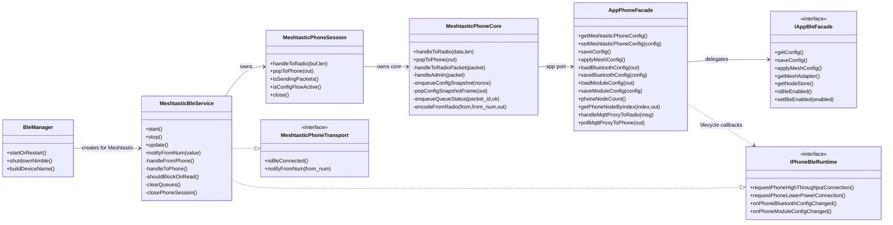

Boundary rule:

```text
NimBLE callback -> MeshtasticBleService queue -> update() -> MeshtasticPhoneSession
               -> MeshtasticPhoneCore -> AppPhoneFacade -> App services
```

The reverse direction is:

```text
App services / mesh adapter events -> MeshtasticBleService.update()
                                  -> MeshtasticPhoneSession.popToPhone()
                                  -> FromRadio queue / FromNum notify
```

## Connection State Model

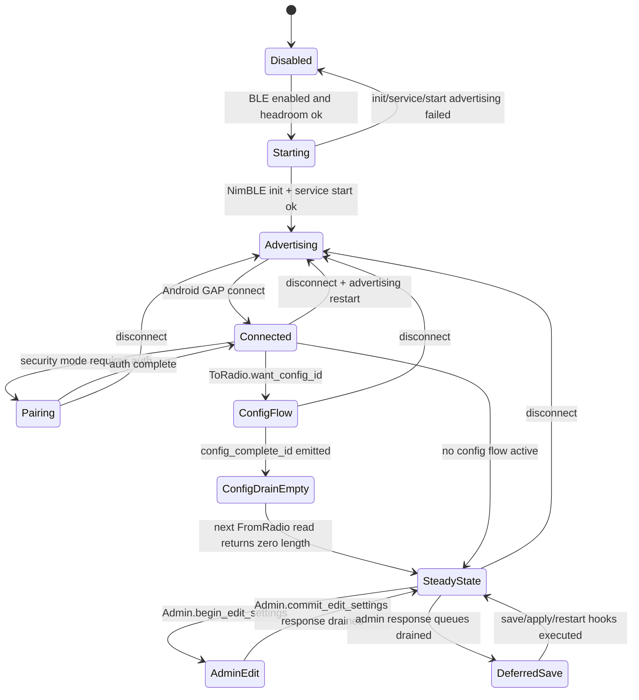

State invariants:

- `Advertising` means Meshtastic service UUID is visible, not that Android has completed setup.
- `Connected` means GAP connection exists; queues and `phone_session_` must be reset for this connection.
- `ConfigFlow` owns `config_nonce_`, snapshot indexes, and `config_flow_active_`.
- `ConfigDrainEmpty` is a deliberate one-shot zero-length read after `config_complete_id`.
- `DeferredSave` must happen after queue status and Admin response frames have been offered to the phone.

## Startup And Connect Sequence

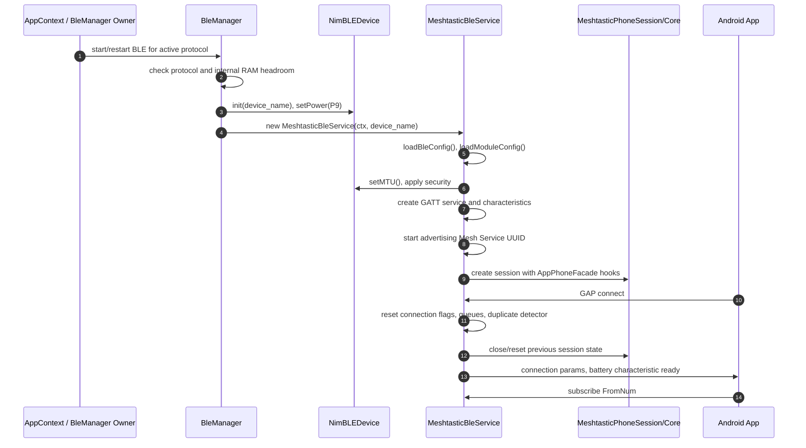

Important:

- `BleManager` creates `MeshtasticBleService` only for Meshtastic protocol. MeshCore gets `MeshCoreBleService` / NUS.
- BLE start may be skipped if internal RAM headroom is below threshold. That is a startup resource failure, not a Meshtastic protocol state.
- On every connect/disconnect, queues and session state must be reset. Reusing a dirty config flow across Android reconnect is forbidden.

## ToRadio Ingress Activity

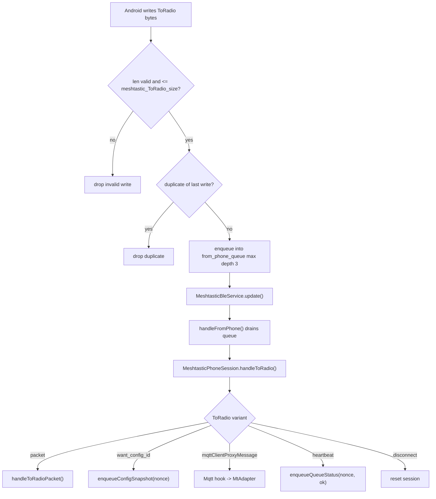

Rules:

- GATT callback may validate, dedupe, and enqueue only.
- Protobuf decode and semantic handling happen in `MeshtasticPhoneCore`.
- Queue overflow may drop writes and must be diagnosed through `[BLE] fromPhone drop ...` logs.
- Duplicate suppression belongs to the transport queue only and must not be used to hide semantic retries in core.

## FromRadio Egress Activity

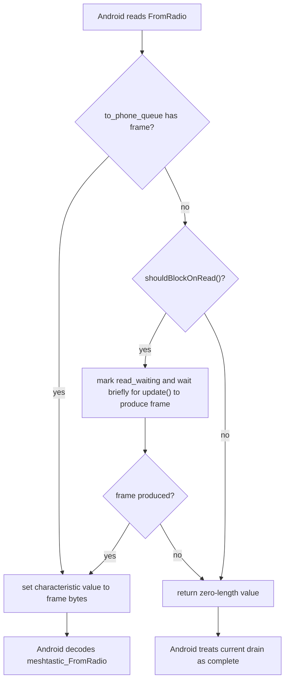

`shouldBlockOnRead()` must be true when:

- steady-state packet sending is active after a `FromNum` notify;
- config flow is active.

This is not optional. During config/setup, returning zero-length before `config_complete_id`
can make the Android App stop draining `FromRadio`, causing symptoms such as `Nodes(0)` or
stuck setup screens.

## Config Snapshot Flow

Android requests configuration by writing `ToRadio.want_config_id`. The firmware must respond with a deterministic
sequence of `FromRadio` frames and finish with `config_complete_id`.

Known special nonces:

| Nonce | Name | Meaning |
| --- | --- | --- |
| `69420` | `stage1_config` | Config-focused snapshot. Sends `my_info`, `deviceuiConfig`, metadata, channels, config, module configs, then complete. Must not send node_info. |
| `69421` | `stage2_nodes` | Node-focused snapshot. Sends self node and peer nodes, then complete. Must not send metadata/channels/config/module configs. |
| Other | `stage_unknown` | Full compatibility snapshot. Sends all supported sections in order. |

### Stage 1 Config Sequence

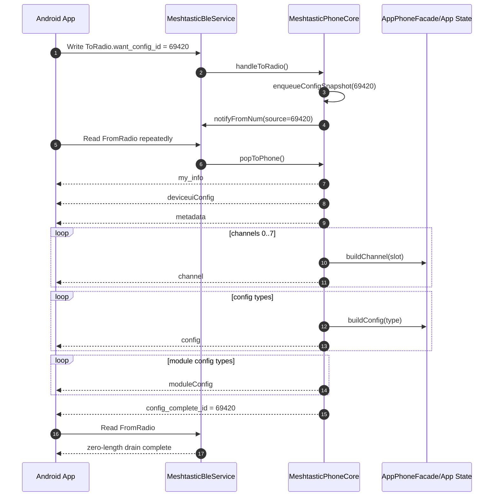

### Stage 2 Nodes Sequence

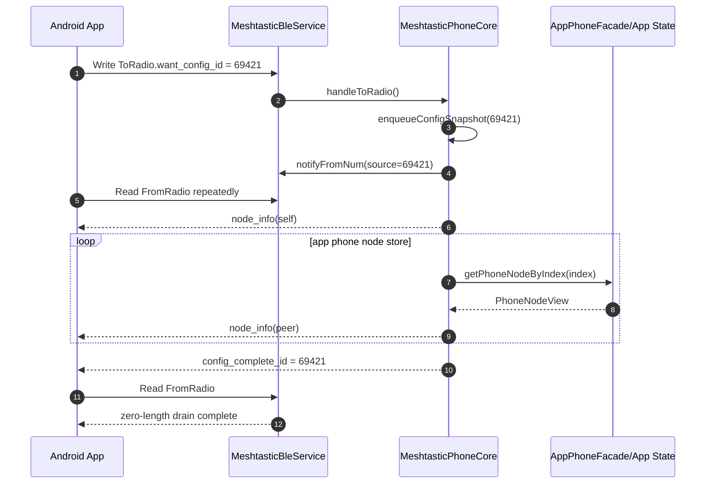

Invariants:

- Every encoded `FromRadio` gets a strictly increasing `FromRadio.id`.
- `MeshtasticBleFrame.from_num` for config snapshot frames is the config nonce, except peer `node_info`
  frames may use the peer node id as `from_num`.
- `config_complete_id` must be emitted exactly once per config snapshot flow.
- After `config_complete_id`, `config_flow_active_` becomes false and `config_drain_empty_pending_` becomes true.
- The next `popToPhone()` after completion must return false once, allowing `FromRadio` to expose zero-length drain completion.

## Pop Order

`MeshtasticPhoneCore::popToPhone()` must preserve this priority:

1. MQTT proxy message from radio/backend to phone.
2. Explicit pre-encoded frame queue.
3. Active config snapshot frame.
4. One-shot config drain-empty signal.
5. Queue status frames.
6. Packet frames.
7. Deferred app config save.
8. Deferred module config save.
9. Deferred Bluetooth config save and enabled-state apply.
10. Deferred restart after module config change.
11. No frame.

Do not reorder this casually.

The response-drain-before-save rule exists because Android expects queue status and Admin response frames promptly.
Blocking flash/NVS writes or restart before those frames are observable can make the App appear connected but stuck.

## Admin Packet Handling

Android sends Admin operations as `ToRadio.packet` where:

```text
MeshPacket.decoded.portnum == ADMIN_APP
packet.to == 0 or packet.to == self node id
```

Core behavior:

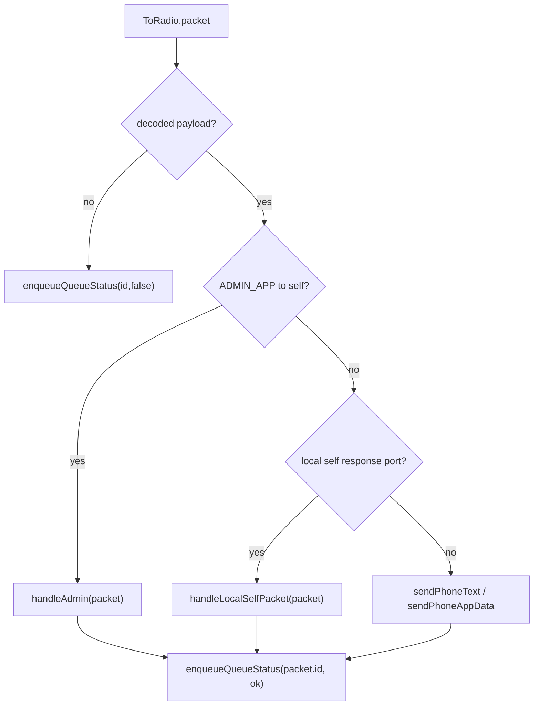

Admin response order:

```text
set_* request
  -> mutate in-memory config snapshot / module config
  -> apply immediate runtime effect when safe
  -> enqueue queueStatus(packet.id, ok)
  -> enqueue Admin response packet if required
  -> after both are drained, perform durable save/apply/restart hooks
```

### Lora Config Save

`AdminMessage.set_config.lora` must:

- update `MeshtasticPhoneConfigSnapshot.mesh`;
- call `setMeshtasticPhoneConfig(cfg)`;
- mark config save as deferred unless inside edit transaction;
- call `applyMeshConfig()` so radio runtime sees new LoRa settings;
- return `get_config_response(LORA_CONFIG)`;
- save durable config only after response drain.

This sequence protects the Android App from blocking on storage during the Admin response path.

### MQTT Module Config Save

`AdminMessage.set_module_config.mqtt` must:

- update `module_config_.mqtt`;
- normalize legacy/default MQTT fields;
- mark module config save as deferred unless inside edit transaction;
- mark restart pending because MQTT module changes may require device restart;
- return `get_module_config_response(MQTT_CONFIG)`;
- save module config only after response drain;
- restart only after module config save has been offered.

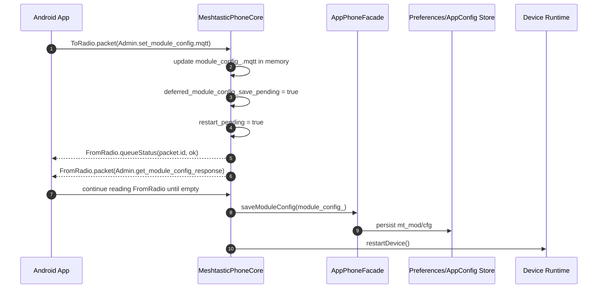

### Bluetooth Config Apply

`AdminMessage.set_config.bluetooth` must:

- update `bluetooth_config_`;
- normalize fixed pin when `NO_PIN`;
- defer `saveBluetoothConfig()` and `setBleEnabled()` until response drain;
- return `get_config_response(BLUETOOTH_CONFIG)` before applying the enabled-state change.

If enabling BLE requires a reboot or service restart, that is a BLE manager/runtime lifecycle bug.
The Admin path must not hide it by returning success before the requested runtime effect is possible.

### Edit Transaction

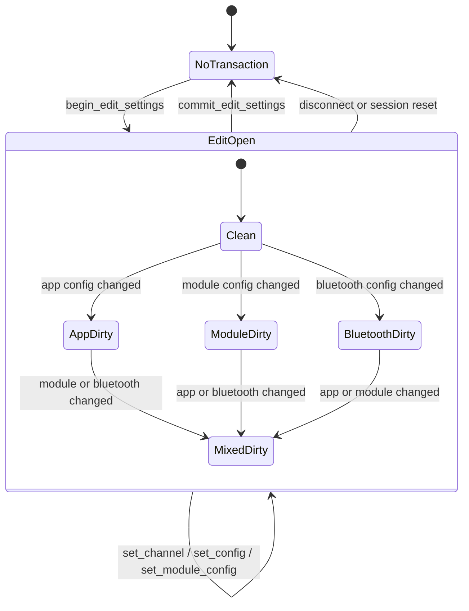

Rules:

- `begin_edit_settings` opens a transaction and itself only needs queue status.
- Set operations inside a transaction must not save immediately.
- `commit_edit_settings` converts dirty flags into deferred save/apply/restart flags.
- Durable save still happens after the commit response drain, not during commit handling.

## Steady-State Packet Delivery

After config flow completes, normal phone traffic enters `STATE_SEND_PACKETS` equivalent behavior:

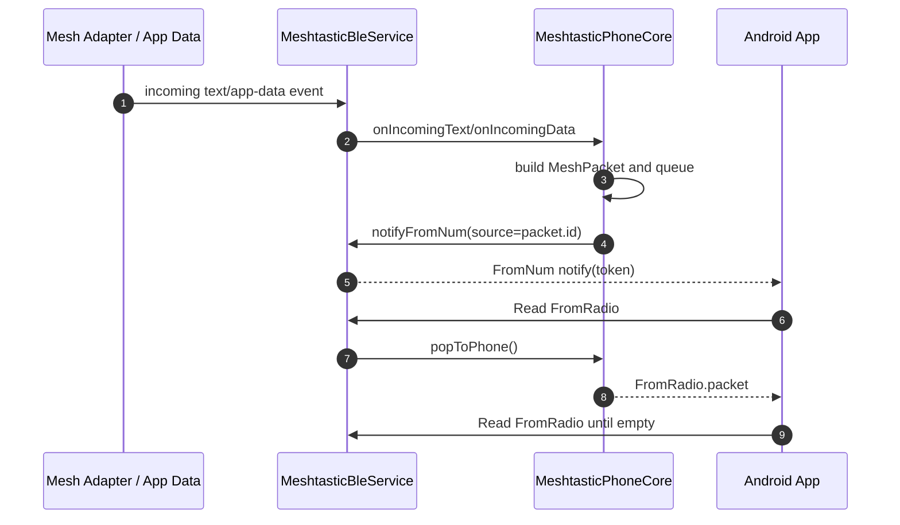

When App sends:

- `TEXT_MESSAGE_APP`: route through `sendPhoneText()`.
- Other app-data: route through `sendPhoneAppData()`.
- self telemetry/position/nodeinfo request: may be answered locally by `handleLocalSelfPacket()`.
- unsupported self loopback ports without response: suppress and report queue success.

## Runtime Concurrency Rules

This BLE path must satisfy `RUNTIME_CONCURRENCY_SPEC.md`:

```text
BLE callback owns transport timing only.
BLE callback must not directly mutate app services.
Mutable app-service state must have a single owner context.
Storage work must not run inside BLE stack callback.
```

Allowed in GATT callback:

- validate length;
- copy bytes;
- queue frame;
- update connection flags;
- set characteristic value for read response.

Forbidden in GATT callback:

- call `AppContext::saveConfig()`;
- call `applyMeshConfig()`;
- call radio send;
- restart device;
- perform protobuf business decisions;
- walk node store;
- mutate UI directly.

## ChannelSettings Contract

`meshtastic_ChannelSettings` is the protocol object. Local app config and phone snapshots are projections of it, not definitions of it.

Current required round-trip fields:

| Protocol field | Local projection | Notes |
| --- | --- | --- |
| `settings.name` | `MeshConfig.primary_channel_name` / `secondary_channel_name` | Keep bounded string semantics. |
| `settings.id` | `MeshConfig.primary_channel_id` / `secondary_channel_id` | Preserve numeric channel identity. |
| `settings.psk` | `MeshConfig.primary_key` / `secondary_key` plus key length | Shorthand PSK may expand internally but must be preserved in Admin response where applicable. |
| `settings.uplink_enabled` | `primary_uplink_enabled` / `secondary_uplink_enabled` | MQTT gateway direction flag. |
| `settings.downlink_enabled` | `primary_downlink_enabled` / `secondary_downlink_enabled` | MQTT gateway direction flag. |
| `settings.has_module_settings` | `primary_channel_has_module_settings` / `secondary_channel_has_module_settings` | Presence is part of protocol state and must not be inferred away. |
| `settings.module_settings.position_precision` | `primary_channel_position_precision` / `secondary_channel_position_precision` | Android location/precise-location channel setting. |
| `settings.module_settings.is_muted` | `primary_channel_is_muted` / `secondary_channel_is_muted` | Per-channel muted state. |

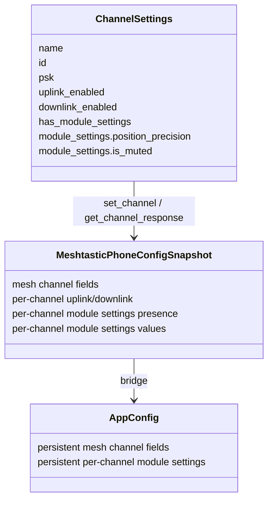

Rules:

- Do not treat `ChannelSettings` as only name/id/psk/uplink/downlink.
- Do not collapse `has_module_settings=false` and `has_module_settings=true` with default values; protobuf presence must round-trip.
- `set_channel` must write the complete supported `ChannelSettings` projection before `applyMeshConfig()`.
- `get_channel_response` and config snapshots must return the same supported `ChannelSettings` projection Android just saved.
- Durable storage must persist the supported `ChannelSettings` projection across restart.
- New generated `ChannelSettings` fields must be classified here before they are ignored, persisted, or intentionally rejected.

## Bypass Cleanup Rules

Any future change touching this area must remove or reject these bypasses:

| Bypass | Why forbidden | Correct path |
| --- | --- | --- |
| Direct App mutation from `NimBLECharacteristicCallbacks::onWrite()` | Violates runtime ownership and makes callback timing define protocol semantics. | Enqueue bytes, drain in `MeshtasticBleService.update()`, interpret in `MeshtasticPhoneCore`. |
| Immediate config save inside `handleAdmin()` | Can stall Android before queueStatus/Admin response drain; previously led to visible stuck states and stack pressure. | Mark deferred flag, save after `popToPhone()` has no response frames left. |
| Extra Android-specific `Nodes(0)` workaround | Treats App UI symptom as firmware state and risks breaking iOS/official BLE drain semantics. | Fix config snapshot ordering, blocking read semantics, `config_complete_id`, or node projection. |
| Forcing empty `FromRadio` reads to unblock UI | Premature empty read terminates Android drain early. | Return empty only after config complete or when steady-state queue is actually empty. |
| Creating Pager/TDeck-specific phone core variants | Board resource issues are real, but phone protocol semantics are not board facts. | Keep protocol in shared phone core; board/platform only adapt IO, memory placement, and capabilities. |
| Using MeshCore BLE code for Meshtastic App compatibility | MeshCore NUS and Meshtastic BLE protobuf are different protocols. | Keep `MeshCoreBleService` separate from `MeshtasticBleService`. |
| Enabling `FromRadioSync` without spec/test coverage | Android currently follows legacy `FromRadio` read drain. | Add explicit spec and tests before enabling sync path. |

## Diagnostic Log Contract

Useful logs and what they mean:

| Log prefix | Meaning |
| --- | --- |
| `[BLE] starting protocol=meshtastic uuid=...` | BLE manager selected Meshtastic BLE service and attempted start. |
| `[BLE] connected; uuid=...` | GAP connection established; config flow not necessarily done. |
| `[BLE] fromNum subscribe sub=...` | Android subscribed to notification trigger. |
| `[BLE] fromPhone write len=...` | Android wrote `ToRadio`; callback queued it. |
| `[BLE][mtcore] to_radio variant=...` | Phone core decoded `ToRadio`. |
| `[BLE][mtcore][flow] want_config ...` | Android requested config snapshot. |
| `[BLE][mtcore][channel] ... module=... pos_prec=... muted=...` | Admin channel request/response/snapshot includes the supported module-settings projection. |
| `[BLE][mtcore][cfg#...] start ...` | Config flow became active. |
| `[BLE] toPhone enqueue from_num=... len=...` | A `FromRadio` frame was queued for Android read. |
| `[BLE] fromRadio read len=...` | Android read a non-empty `FromRadio` frame. |
| `[BLE][mtcore][flow] cfg_complete ...` | `config_complete_id` was encoded. |
| `[BLE][mtcore] config snapshot drain-empty` | Next read may observe zero-length drain completion. |
| `[BLE] fromRadio read empty` | Current drain round is complete. During active config flow this is suspicious. |
| `[BLE][mtcore] admin handled variant=...` | Admin request produced a response or was accepted. |
| `[BLE][mtcore] queue status mesh_packet_id=... ok=...` | QueueStatus frame queued and `FromNum` notified. |
| `[BLE][mtcore] deferred config save after response drain` | Durable config save starts only after phone-visible responses are drained. |

Symptom mapping:

| Symptom | Most likely violated rule |
| --- | --- |
| Android stuck at `Module config received` | Admin response or module config response did not drain; save/restart happened too early; `FromRadio` empty arrived before expected response. |
| Android stuck at `Nodes(0)` | Stage 2 nodes snapshot missing self/peer `node_info`; premature empty read; `config_complete_id` missing; `fromNum` notify/read loop broken. |
| App connects but never finishes setup | `want_config_id` not handled; config flow inactive; `shouldBlockOnRead()` false during config; queue full/drop. |
| Save config causes reboot | Save path stack/heap/storage bug after response drain; not a BLE protocol success/failure by itself. |
| BLE setting says enabled but not visible until reboot | BLE manager/runtime lifecycle failed to start or restart advertising at runtime; do not hide with Admin response bypass. |

## Acceptance Tests

Shared phone core tests must continue to assert:

- invalid Meshtastic bytes are rejected;
- `set_channel` updates in-memory config, applies mesh runtime, sends queue status, sends Admin response, and saves only after response drain;
- `set_channel.settings.module_settings` presence, `position_precision`, and `is_muted` are preserved in config, response, and storage projection;
- primary channel shorthand PSK is preserved in response while expanded in internal config;
- manual LoRa config updates all expected fields and saves only after response drain;
- Bluetooth config disables runtime only after response drain;
- edit transaction defers saves until commit and then still saves only after commit response drain;
- MQTT module config responds before module save and restart;
- `want_config_id=69420` sends config-only frames and complete, without node_info;
- `want_config_id=69421` sends self/peer node_info and complete, without config/module frames.

Device-level verification should capture:

```text
[BLE] connected
[BLE] fromNum subscribe
[BLE][mtcore][flow] want_config nonce=00010F2C stage=stage1_config
[BLE][mtcore][flow] cfg_complete stage=stage1_config nonce=00010F2C
[BLE][mtcore][flow] want_config nonce=00010F2D stage=stage2_nodes
[BLE][mtcore][flow] cfg_complete stage=stage2_nodes nonce=00010F2D
[BLE] fromRadio read empty
```

For Admin save verification:

```text
[BLE][mtcore] admin handled ...
[BLE][mtcore] queue status ...
[BLE] fromRadio read len=...
[BLE][mtcore] deferred config save after response drain
[AppCfg][SAVE_ASYNC] flush begin ...
```

The save log must come after phone-visible response frames have been drained.

## Future Change Checklist

Before modifying this path, answer these questions:

1. Is this change in transport, protocol core, app facade, or app service?
2. Does it add a second interpretation of Meshtastic phone protocol outside `MeshtasticPhoneCore`?
3. Can Android observe queue status, Admin response, config frames, and `config_complete_id` in the expected order?
4. Can `FromRadio` return zero-length before `config_complete_id`?
5. Does any BLE callback directly save config, apply mesh config, restart, or send radio data?
6. Does the change treat `Nodes(0)` or `Module config received` as truth instead of symptoms?
7. Does the change preserve response-drain-before-save?
8. Does the change accidentally route MeshCore through Meshtastic BLE semantics?
9. Are Pager/TDeck differences limited to resource, memory placement, board capability, or BLE manager lifecycle?
10. Are smoke tests updated when behavior changes?

If any answer indicates a bypass, fix the main path first. Do not add another branch around Android.
