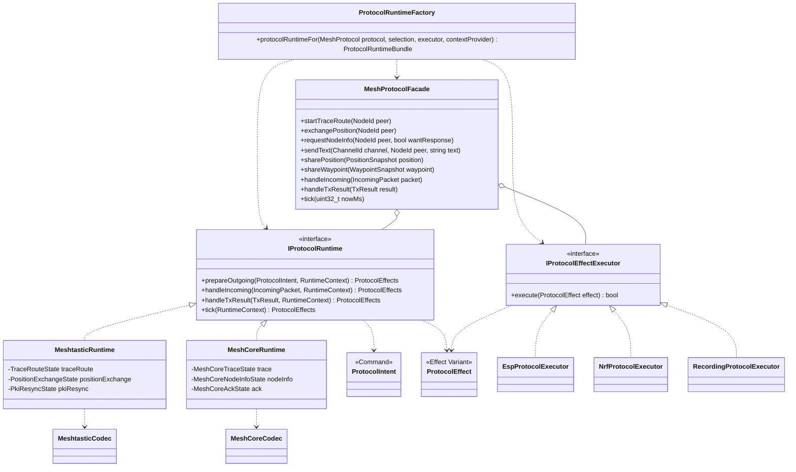
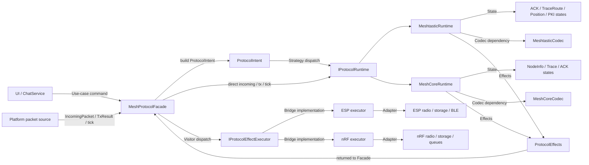
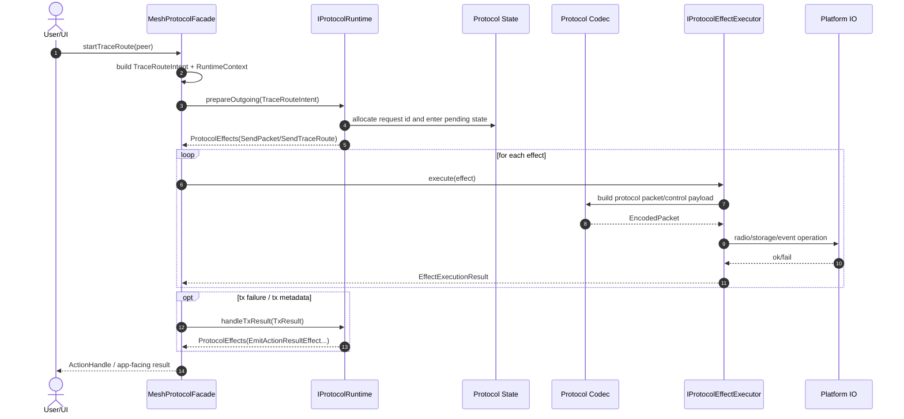
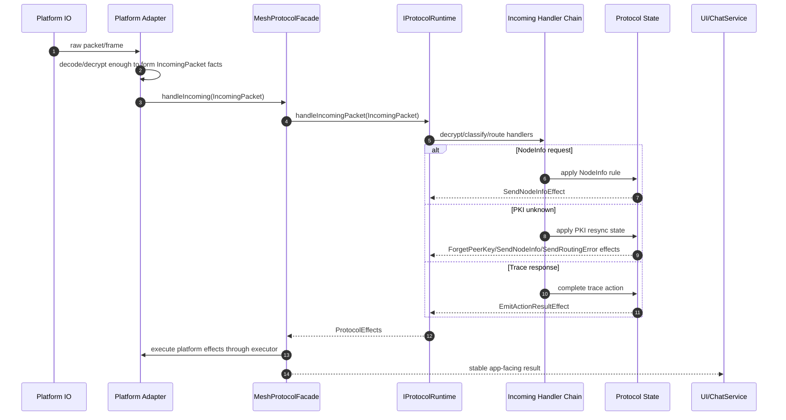
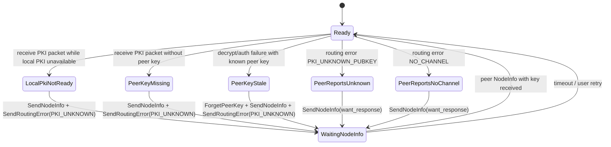
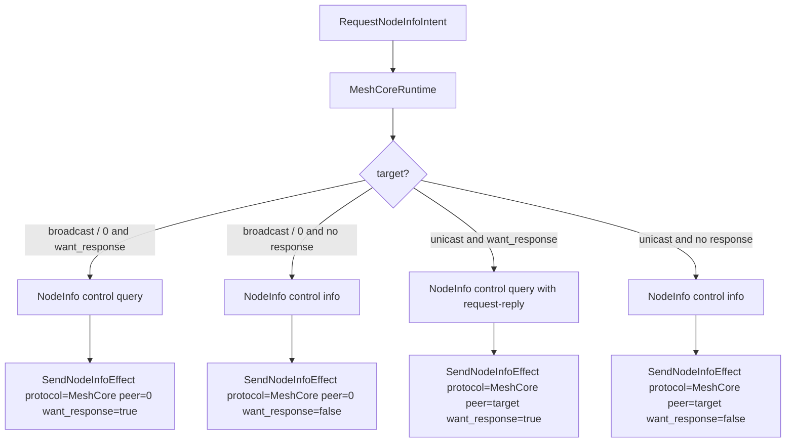

# Protocol Runtime Design Specification

Status date: 2026-06-14

This document defines Trail Mate's design for sharing protocol details in a multi-platform, multi-protocol environment. It supplements
`PROTOCOL_ADAPTER_PARITY_SPEC.md`: the latter explains "which protocol behavior must be consistent", and this article explains "what
 structures are used to ensure consistency".

This article uses Mermaid diagrams to express UML semantics. The reference expression convention comes from the sequence diagram document in
`C:\Users\vicliu\Projects\etc-business\ui-layer\app-backend\docs`: first explain the
 legend, and then put the class, relationship and sequence into Markdown to facilitate the evolution with the code.

## Problem Statement

The current ESP32 and nRF protocol adapters mix four types of things:

-Protocol semantics: when NodeInfo replies, how TraceRoute is completed, how to resync PKI key missing;
-Protocol codec: Meshtastic protobuf/wire packet, MeshCore frame/control payload;
- Platform execution: radio IO, BLE, storage, clock, queue, board power;
- Product projection: UI pop-up window, chat list, node list, diagnostic log.

This mixing results in ESP32 and nRF each developing "similar but not identical" protocol implementations. The risk is not code duplication itself,
 Instead, the protocol truth is dispersed into multiple platform adapters, and any subsequent bugfixes rely on manual synchronization.

The target structure must allow:

- User actions are expressed in `ProtocolIntent`;
- Protocol truth is interpreted by the shared `IProtocolRuntime`;
- The runtime only outputs `ProtocolEffect` and does not access the hardware directly;
- Platform differences are represented by `IProtocolEffectExecutor` execution;
- UI/ChatService no longer knows protocol portnum, payload type, request id, routing error details;
- ESP32/nRF adapter no longer independently determines protocol business rules.

## UML Notation

| Writing in the figure | UML meaning | Explanation in this specification |
| --- | --- | --- |
| `classDiagram` | Class diagram | Expressing interface, implementation, composition, dependency and pattern structure |
| `<|..` | Realization | Class implementation interface, such as `MeshtasticRuntime` implements `IProtocolRuntime` |
| `*--` | Composition | Strong ownership relationship, for example, runtime owns internal state machine |
| `o--` | Aggregation | Aggregation or injection of relationships, such as facade holding runtime reference |
| `..>` | Dependency | Dependence on a certain type, such as runtime returns effects |
| `flowchart` | Relationship/pipeline diagram | Expression Intent -> Runtime -> Effects -> Executor spindle |
| `sequenceDiagram` | Sequence diagram | Express the calling sequence of a user action or an incoming packet |
| `alt / opt / loop` | UML combination fragment | Express mutually exclusive branches, optional actions and repeated ticks |

## Pattern Decision

This article uses only a few GoF 23 design patterns as the main axis to avoid "pattern stacking".

### Design Verdict

This specification accepts the original transformation idea as the constraint baseline: Trail Mate's protocol layer transformation is not to extract several helpers
 to the shared directory, but to establish a clear use case entry to the platform execution link:

```text
UI / ChatService
  -> MeshProtocolFacade
  -> ProtocolIntent
  -> IProtocolRuntime strategy
  -> Protocol State
  -> ProtocolEffects
  -> IProtocolEffectExecutor bridge
  -> Platform adapters
```

 Among them, `Strategy + Command + State + Bridge + Adapter` is the main axis. If these five are not established,
`Visitor / Chain of Responsibility / Facade / Factory / Builder` can only be regarded as partial tools and cannot claim that
 the protocol runtime transformation is completed.

Although `Facade` is not one of the first five main axes, it is the entry boundary of the upper use case and cannot only exist in the diagram. Appears in specifications
`MeshProtocolFacade` means that there must be a code-level object or an equivalently named concrete boundary. This object is responsible for
UI/ChatService exposes stable use case API and hides runtime selection, effect execution, TX failure feedback and action
result The arrangement details of the projection. If you decide not to use the name `MeshProtocolFacade` in the future, you must first modify this specification.
Clarify new equivalent code objects and acceptance criteria.

### Language Baseline

The target direction is modern C++, which can be upgraded to C++20 in the long term; but the current PlatformIO of ESP32 / nRF52
The toolchain does not reliably accept `-std=gnu++20` at the same time:

- ESP32S3 currently xtensa GCC 8.4 only supports early `gnu++2a`;
- nRF52 Currently arm-none-eabi GCC 7.2 does not support `gnu++20`.

Therefore, the current minimum implementation baseline of the shared protocol runtime is set to **C++17**. Build system must remove Arduino
`-std=gnu++11` appended by default, ensuring `std::variant`, `std::visit`, `if constexpr`, etc. C++17
Capabilities are available in both ESP32 and nRF52 compilation units. After the nRF tool chain is upgraded, upgrade baseline to
C++20, and consider introducing concepts / `std::span` / stronger type constraints.

### Primary Patterns

| Pattern | Where used | Problems solved | Invariants |
| --- | --- | --- | --- |
| Strategy | `MeshtasticRuntime` / `MeshCoreRuntime` of `IProtocolRuntime` | The same Intent has different interpretations under different protocols | UI and platform adapter must not use `if protocol == ...` to interpret the protocol by themselves |
| Command | `ProtocolIntent` | UI/usecase issues user intent instead of portnum/payload | Intent represents "what to do", not "how long is the wireless packet" |
| State | ACK, TraceRoute, Position, PKI resync, etc. runtime internal state machine | Cross-time protocol sessions are no longer scattered in the if branches of UI and adapter | State migration must be unifiedly owned by the runtime |
| Bridge | `IProtocolRuntime` outputs `ProtocolEffect`, platform `IProtocolEffectExecutor` executes | Protocol semantics and platform execution are separated to avoid `protocol x platform` explosion | runtime does not call radio/storage/BLE; executor does not determine protocol semantics |
| Adapter | radio IO, storage, BLE, legacy `IMeshAdapter` compatibility layer | Connect to existing platform API and SDK | Adapter can only adapt to technical interfaces and cannot carry protocol business rules |

### Supporting Patterns

| Pattern | Where to use | Use boundaries |
| --- | --- | --- |
| Visitor | `std::variant<ProtocolEffect...>` + `std::visit` effect dispatch | Only used for executor/test processing effects, not spread to UI |
| Chain of Responsibility | incoming packet classification pipeline: decrypt -> routing -> nodeinfo -> position -> trace -> text/appdata | The handler sequence must be written into the runtime or spec, and cannot form an implicit packet swallowing black hole |
| Facade | `MeshProtocolFacade` entrance to UI/ChatService | Real code boundaries must be implemented; only use case facade, no protocol semantics |
| Abstract Factory / Factory Method | Product composition Select facade + runtime + executor + codec | You can also use static objects/references, dynamic allocation is not forced |
| Builder | packet/control payload construction | Partially used for codec/build request, cannot replace runtime |

### Patterns To Avoid As Main Axis

| Pattern | Reasons not to be used as the main axis |
| --- | --- |
| Singleton | Protocol runtime / executor should be injected through combination to avoid global state pollution testing and multiple instances |
| Template Method | It is easy to stuff platform differences back into the base class mud ball, not suitable as the main axis of protocol-platform separation |
| Mediator | If it is made into a "big coordinator", it will replace the runtime and become the new God Object |
| Decorator / Proxy / Flyweight / Composite / Prototype | The current problem is not object packaging, proxy, shared small object, tree structure or prototype copy |
| Interpreter | There is currently no need for scripted protocol rules |
| Memento | Only considered when persisting pending action / retransmit state in the future |
| Iterator | Ordinary container traversal is enough |
| Observer | Can continue to be used for event notification, but it cannot solve the protocol rule split |

## Core Distinctions

### Intent

Intent is the action that the user or use case layer wants to complete:

- `SendTextIntent`
- `RequestNodeInfoIntent`
- `TraceRouteIntent`
- `ExchangePositionIntent`
- `StartKeyVerificationIntent`
- `SendSelfAnnouncementIntent`

Intent does not contain Meshtastic portnum, MeshCore payload type, wire channel hash, protobuf bytes or request id
allocation rules.

### Runtime

Runtime is the truth of the protocol:

- `MeshtasticRuntime` explains Meshtastic Intent, incoming packet, routing result, tick;
- `MeshCoreRuntime` explains MeshCore Intent, incoming frame, trace path, NodeInfo control, tick;
- runtime Can have State, but not platform IO.

Runtime can have a protocol state machine, but it cannot bypass the product business ledger. Text message, delivery status,
read/unread, conversation badge, retry eligibility must enter the shared Chat/Message owner,
Rather than staying in the private state of a protocol adapter. This boundary is given by
`RUNTIME_OWNERSHIP_BOUNDARY_FREEZE.md` freezes.

### Facade

Facade is a stable use case entrance for UI/ChatService facing the protocol system. It is not an alias for protocol runtime, nor is it
The package name of the adapter.

`MeshProtocolFacade` must own or aggregate:

- `IProtocolRuntime` strategy of the current protocol;
- `IProtocolEffectExecutor` bridge corresponding to the platform;
- Construct the clock / self node / protocol facts provider required for `RuntimeContext`;
- The orchestration logic of executing, recording, and feeding back `TxResult` to `ProtocolEffects`, and returning app-facing result to the upper layer.

Facade must expose use case actions, not wire details:

- `startTraceRoute(peer)`
- `exchangePosition(peer)`
- `requestNodeInfo(peer, wantResponse)`
- `sendText(channel, peer, text)`
- `sharePosition(...)`
- `shareWaypoint(...)`
- `handleIncoming(packet)`
- `handleTxResult(result)`
- `tick(nowMs)`

Facade must not:

- Directly select Meshtastic portnum or MeshCore payload type;
- Encoding protobuf / MeshCore frame;
- Determine protocol semantics such as PKI resync, NodeInfo reply, TraceRoute completion, ACK timeout, etc.;
- Execute radio/storage/BLE details;
- Become a new God Object or Mediator.

Facade's responsibility is to isolate the upper layer from protocol orchestration. The upper layer should not directly spell `ProtocolIntent` and then call the runtime.
Nor should you call the executor directly after iterating through `ProtocolEffects`. The active UI / ChatService entrance must be moved in
`MeshProtocolFacade` or an equivalent boundary explicitly named by this specification.

The app-facing result returned by Facade must maintain protocol-aware identity. For chat send/read/retry
 related results, the facade or adapter must not be downgraded to bare `msg_id + bool`. The protocol runtime can output protocol facts,
but the message business state must be uniformly projected by `MessageLedger`, `ChatDeliveryEventProjector` and `ReadStateLedger`
.

`MeshProtocolFacade` captures `EmitActionResultEffect`, `PublishIncomingTextEffect`,
`PublishIncomingDataEffect`, `PublishNodeInfoEffect` and other app-facing projections allow the UI to read results from
`MeshProtocolFacadeResult` without executing the projection as platform IO. When the platform adapter needs to write these
projections into the platform queue, routing table or contact projection, it must explicitly select
`ProtocolProjectionPolicy::ExecuteAppFacing` so that the projection processing strategy is a combined configuration rather than scattered
if branches.

### Effect

Effect is an action that the runtime requires the external world to take place:

- `SendPacketEffect`
- `SendNodeInfoEffect`
- `SendRoutingErrorEffect`
- `SendTraceRouteEffect`
- `ForgetPeerKeyEffect`
- `RequestPeerNodeInfoEffect`
- `PublishIncomingTextEffect`
- `PublishIncomingDataEffect`
- `PublishNodeInfoEffect`
- `EmitActionResultEffect`
- `UpdatePeerRouteEffect`

Effect is a bridge between runtime and executor. Effects can be recorded, tested, replayed or executed by different platforms.

### Executor

Executor is the platform executor:

- ESP32 executor calls ESP radio/storage/BLE/event bus;
- nRF executor calls nRF radio/storage/mono UI app queues;
- test executor records effects.

Executor shall not decide "should reply NodeInfo" or "should forget PKI key". It only performs the effects given by the runtime.

### Codec

Codec is only responsible for encoding and decoding:

- `MeshtasticCodec`:protobuf/wire packet/Data/Routing/RouteDiscovery;
- `MeshCoreCodec`:frame/header/direct data/group data/control/trace;
- The codec can use Builder style build requests, but it must not save business status.

### Product Composition / Factory

The product combination phase is responsible for connecting `MeshProtocolFacade`, `IProtocolRuntime`, `IProtocolEffectExecutor`, codec and platform
facts provider. The intention of using Abstract Factory / Factory Method here is to avoid manually assembling protocol objects for each UI or adapter
.

Embedded platforms do not require dynamic allocation. Allows the use of static objects and factories that return references:

```cpp
struct ProtocolRuntimeBundle
{
    MeshProtocol protocol;
    IProtocolRuntime* runtime;
    IProtocolEffectExecutor* executor;
    const IProtocolRuntimeContextProvider* contextProvider;

    MeshProtocolFacade createFacade(ProtocolProjectionPolicy policy);
};

ProtocolRuntimeBundle protocolRuntimeFor(MeshProtocol protocol,
                                         const ProtocolRuntimeSelection& selection,
                                         IProtocolEffectExecutor& executor,
                                         const IProtocolRuntimeContextProvider& contextProvider);
```

Factory may know product/platform capabilities but may not determine protocol semantics. It chooses "which set of runtime/executor to use" and does not decide
"whether NodeInfo should be replied to" or "when TraceRoute is completed".

### Incoming Handler Chain

Incoming packet classification can use Chain of Responsibility locally, but the order must be explicit, and implicit packet swallowing cannot be formed.
Handler can decrypt, classify, update status, and generate effects, but must use unified return semantics:

```cpp
enum class PacketHandling
{
    NotHandled,
    HandledContinue,
    HandledStop,
    DropWithEffects,
};
```

The code-level boundary is `IProtocolRuntime::handleIncomingPacket(...) -> IncomingPacketHandlingResult`.
The old `handleIncoming(...) -> ProtocolEffects` can be retained as a compatible entry, but the active facade path must be called
`handleIncomingPacket(...)`, and shared tests must assert `PacketHandling`.

The conceptual order of Meshtastic incoming chain must be:

1. wire/Data decoding and channel/PKI decryption fact establishment;
2. routing app / routing error;
3. NodeInfo;
4. Position;
5. TraceRoute;
6. KeyVerification;
7. text / generic app-data projection.

The conceptual order of MeshCore incoming chain must be:

1. frame/header/direct/group decoding and peer identity facts Create;
2. ACK;
3. control: discover / NodeInfo;
4. trace;
5. text / app-data projection.

These handlers can first exist as functions, or can be split into objects later; but the order and packet swallowing semantics must belong to runtime/codec
Boundaries cannot be scattered in any if branches of the platform adapter.

## Primary Class Model



## Pattern Relationship Map



## Runtime Call Flow

### Outgoing User Action



### Incoming Packet



## Meshtastic Runtime Responsibilities

`MeshtasticRuntime` owns:

- app-data destination / ACK / response intent;
- NodeInfo request/reply/reannounce;
- Position request/reply/correlation;
- TraceRoute request/reply/result state;
- routing ACK/error interpretation;
- PKI unknown / stale-key / decrypt-fail resync state;
- duplicate-sensitive packet handling order.

It does not own:

- radio TX/RX calls;
- platform key-value storage;
- OLED/e-paper UI;
- BLE phone protocol transport;
- memory placement or ISR details.

Current C++17 migration state:

- Meshtastic TraceRoute and Position Exchange outgoing user actions can now enter
  `MeshtasticRuntime::prepareOutgoing(...)` as `TraceRouteIntent` / `ExchangePositionIntent`.
  The runtime chooses Meshtastic portnum, request id fallback, ACK/response flags, and protobuf payload shape,
  then emits `SendPacketEffect`.
- Meshtastic direct position sharing can enter the runtime as `SharePositionIntent`; the runtime delegates
  payload construction to `MeshtasticPositionCore`, selects `POSITION_APP`, and emits `SendPacketEffect`.
- nRF mono UI keeps a long-lived `MeshtasticRuntime`, executes `SendPacketEffect`s through
  `MeshAdapterProtocolEffectExecutor`, and feeds incoming packet / TX failure / tick events back into
  the runtime. TraceRoute and Position Exchange lifecycle state is owned by the runtime; UI only projects
  `EmitActionResultEffect` into logs/popups and no longer constructs `TRACEROUTE_APP` / `POSITION_APP`
  packets directly.
- Linux uConsole chat position sharing also uses `SharePositionIntent` and no longer constructs
  Meshtastic Position protobuf or portnum directly.
- Linux uConsole POI sharing uses `ShareWaypointIntent`; the runtime delegates payload construction to
  `MeshtasticWaypointCore`, selects `WAYPOINT_APP`, and emits `SendPacketEffect`.
- Linux uConsole also executes runtime packet effects through `MeshAdapterProtocolEffectExecutor`, so the
  workspace model no longer reads protocol portnum fields directly.
- Platform adapters still own physical radio send, local GPS source selection, BLE projection, queueing, and
  adapter-side incoming packet execution until those can be represented as runtime effects/state.

### Meshtastic PKI Resync State

PKI resync must be a State object, not scattered if branches.



Required effects:

| Input | Effects |
| --- | --- |
| Local PKI not ready | `SendNodeInfo(peer, wantResponse=true)`, `SendRoutingError(peer, request, PKI_UNKNOWN_PUBKEY)` |
| Peer key missing | `SendNodeInfo(peer, wantResponse=true)`, `SendRoutingError(peer, request, PKI_UNKNOWN_PUBKEY)` |
| Peer key stale/decrypt fail | `ForgetPeerKey(peer)`, `SendNodeInfo(peer, wantResponse=true)`, `SendRoutingError(peer, request, PKI_UNKNOWN_PUBKEY)` |
| Peer routing error `PKI_UNKNOWN_PUBKEY` | `SendNodeInfo(peer, wantResponse=true)` |
| Peer routing error `NO_CHANNEL` | `SendNodeInfo(peer, wantResponse=true)` |

The executor chooses how to perform those effects on ESP32/nRF. Runtime decides that they must happen.

## MeshCore Runtime Responsibilities

`MeshCoreRuntime` owns:

- MeshCore NodeInfo query/info control frame semantics;
- MeshCore discover request/response rules;
- MeshCore trace action lifecycle: pending -> delivered -> completed / failed / timed out;
- MeshCore app ACK lifecycle: pending -> completed / failed / timed out;
- route/identity policy when the platform declares support.

Current C++17 migration state:

- Direct-route send decision for ESP32 MeshCore direct text/app-data now uses shared
  `MeshCoreDirectRoutePolicy`: missing peer pubkey triggers discover/failure, selected routes use direct path,
  and route/channel fallback remains explicit without redefining direct-secret material.
- ESP32 MeshCore direct text/app-data no longer fires missing-key discover through an adapter-local send shortcut;
  it enters `DiscoverIntent -> MeshCoreRuntime -> SendDiscoverRequestEffect`, then the adapter executes the effect.
- ESP32 MeshCore receive-side missing-peer auto-discover now asks `MeshCoreRuntime` to apply the peer-hash
  validity and cooldown decision table. The adapter executes the emitted `SendDiscoverRequestEffect` and reports
  TX success back so runtime updates cooldown only after a successful discover request.
- Incoming MeshCore discover request/response control payloads now flow through `MeshCoreRuntime`: filter/since
  matching emits `SendDiscoverResponseEffect`, and discover responses emit `PublishNodeInfoEffect` plus
  `UpdatePeerRouteEffect`.
- MeshCore identity shared-secret expansion and nRF peer-key derivation now use shared
  `MeshCoreDirectSecretCore`; ESP32 still owns private-key storage and route pubkey lookup before delegating
  key expansion to the runtime helper.
- ESP32 no longer falls back to the historical group-secret-derived direct key; MeshCore direct secrets are
  identity/pubkey-derived only.
- Peer route storage, pubkey persistence, private identity storage, response scheduling, and frame transmission
  are still platform adapter responsibilities until they can be represented as runtime state/effects.

It does not pretend MeshCore is Meshtastic:

- no Meshtastic `TRACEROUTE_APP` for MeshCore trace;
- no Meshtastic `NODEINFO_APP` for MeshCore NodeInfo;
- no Meshtastic PKI assumptions for MeshCore identity/direct secrets.

### MeshCore NodeInfo Command Mapping



nRF must not silently degrade `requestNodeInfo(dest, want_response)` into `sendAdvert(true)` once it claims
NodeInfo support. If nRF lacks a required route/identity capability, it must return unsupported or emit a
capability failure effect.

MeshCore NodeInfo control payload layout is shared codec territory, not platform adapter territory:

- portnum: `4`;
- prefix: `TM`;
- kind: `0x01`;
- query type: `0x01`, optional request-reply flag `0x01`;
- info type: `0x02`, followed by role, hops, node id, timestamp, 10-byte short name, 32-byte long name.

ESP32 and nRF may differ in how they route the resulting `SendNodeInfoEffect`, but they must use the same
codec and the same query/info decision table.

### MeshCore Trace

MeshCore trace must be represented as native MeshCore trace:

- outgoing: `TraceRouteIntent(peer)` -> MeshCore trace state -> `SendTraceRouteEffect`;
- executor resolves the platform route into MeshCore path-hash bytes and sends native `PAYLOAD_TYPE_TRACE`;
- incoming: trace packet handler accumulates path/SNR at the MeshCore frame layer, then reports terminal trace
  payloads back into runtime;
- UI consumes `EmitActionResultEffect`, not raw trace payloads.

Current C++17 migration state:

- trace base payload (`tag`, `auth`, `flags`) is built by shared MeshCore codec;
- target route hashes are appended after the 9-byte base payload. The frame `path` field is not the target route;
  it is the SNR/path trail accumulated while the trace packet is forwarded;
- trace payload decode decides `terminal`, `path_hash_size`, `offset`, `next_hash`, and trace hash slice in
  shared MeshCore codec;
- runtime decides whether the local pending trace is delivered, completed, failed, or timed out;
- ESP32 still owns the concrete relay scheduling and BLE `TraceData` event projection;
- nRF may use a minimal one-hop hash route when no route table exists, but it may not redefine completion policy.

### MeshCore App ACK

MeshCore app ACK has two different responsibilities:

- runtime responsibility: remember pending ACK signatures, bind an ACK signature to a local chat message id, match an
  incoming ACK, evict/timeout pending ACKs, and emit `EmitActionResultEffect`;
- adapter responsibility: compute the on-air packet signature from the encoded frame, transmit ACK frames, project
  completed ACKs into ESP BLE / EventBus events, and apply platform route penalties after timeout.

This split intentionally leaves direct ACK burst scheduling and multi-ACK frame construction in the adapter. Those are
radio execution details. The question "is this local send still pending, completed, failed, or timed out" belongs to
`MeshCoreRuntime`.

## Spec Conformance Criteria

Just because the runtime helper has been extracted doesn't mean the transformation is complete. To meet this specification, the following conditions must be met:

1. `IProtocolRuntime`, `MeshtasticRuntime`, `MeshCoreRuntime` are real code objects and are covered by shared tests
   outgoing / incoming / tx result / tick.
2. `ProtocolIntent` is the command model for UI/usecase to enter the protocol system; active UI/ChatService entrance must not be made directly
portnum, payload type, protobuf bytes or MeshCore control frame.
3. Cross-time protocol sessions must be owned by runtime state. UI and adapter must not maintain TraceRoute / Position independently
State transfer of exchange / PKI resync / ACK completion.
4. `IProtocolEffectExecutor` or equivalent executor bridge is a real code object; the platform only executes `ProtocolEffect` and does not decide
Protocol semantics.
5. `MeshProtocolFacade` or an explicitly named equivalent facade is a real code object. It must be UI/ChatService oriented protocol system
Stable use case entry, responsible for selecting runtime, constructing intent, executing effects, reinjecting tx result, and returning app-facing result.
6. Product factory / composition cannot be scattered in the UI. The platform can use static objects, but object selection must be focused on the product portfolio layer.
7. The order and packet swallowing semantics of the incoming handler chain must be written into the runtime/codec boundary and cannot be maintained solely by the giant if
 branch of the platform adapter.
8. If the core class name in the specification only exists in the Mermaid diagram and there is no real object or equivalent declaration in the code, the item is incomplete.

## Implementation Status

As of 2026-06-14, the core runtime architecture in this specification has been implemented as code objects and covered by shared smoke /
platform build:

1. `IProtocolRuntime`, `MeshtasticRuntime`, `MeshCoreRuntime` are real code objects;
 `trailmate_meshtastic_runtime_smoke` and `trailmate_meshcore_runtime_smoke` override outgoing /
   incoming / tx result / tick.
2. `MeshProtocolFacade` is the real code object; `trailmate_mesh_protocol_facade_smoke` overrides send text,
 trace, NodeInfo, position, incoming, tx result, tick, and UI capture / platform execute two kinds
   projection policy.
3. `ProtocolRuntimeBundle`, `ProtocolRuntimeSelection`, `protocolRuntimeFor(...)` are real product
 composition boundaries; `trailmate_protocol_runtime_factory_smoke` covers protocol selection,
 invalid protocol, context provider updates, and platform-style projection execution.
4. The active protocol use-case path of nRF mono UI and Linux uConsole has entered the runtime through facade/factory
; the standard NodeInfo, discover, incoming, tx result, and tick paths of ESP32 and nRF MeshCore adapter
 have also entered the runtime through facade/factory.
5. The Incoming handler chain has been made explicit with `PacketHandling` / `IncomingPacketHandlingResult`;
 `MeshtasticRuntime` and `MeshCoreRuntime` are organized by `handleIncomingPacket(...)` to organize the handler order,
 shared tests are directly asserted `HandledStop` / `NotHandled`.
6. `MeshAdapterProtocolEffectExecutor` and platform adapters only execute `ProtocolEffect`. The execution layer may choose a
 projection policy but may not re-determine the protocol semantics.

### Accepted Runtime Extensions

The following reserved items are not legacy adapter logic, but MeshCore runtime extensions that have not yet been incorporated into the common facade API:

- MeshCore app ACK registration / binding / incoming ACK completion still passes
 `MeshCoreRuntime::trackAppAck(...)`, `bindAppAckToMessage(...)`, `handleAppAck(...)` expressions. ACK burst
 frame scheduling and multi-ACK frame construction are still adapter IO.
- The cooldown state of ESP32 receive-side missing-peer auto-discover is still expressed via
  `prepareAutoDiscoverMissingPeer(...)`、`markAutoDiscoverMissingPeerTxResult(...)`、
 `resetAutoDiscoverState()`. Protocol decisions are made at runtime, route cache and radio scheduling are still in the adapter.
- ESP32 detailed discovery result (`MeshActionResult`) still uses runtime effects and is mapped to
 platform-specific detailed result by the adapter; the generic `MeshProtocolFacadeResult` currently does not promise to replace this product-level result type.

These extensions can be promoted to facade use-case API in the future, but the protocol decision table must not be copied in the adapter before promotion.

## Migration Rules

1. Add shared contracts first: Intent, Effect, Runtime, Executor.
2. Add a real Facade boundary before claiming UI / ChatService decoupling:
   - first create `MeshProtocolFacade` or update this spec with the exact equivalent code object;
   - facade must hide runtime selection and effect execution from active UI / ChatService paths;
   - add smoke tests that fail if the facade object disappears.
3. Add test-only `RecordingProtocolExecutor` to prove effects are inspectable.
4. Move one state machine at a time:
   - Meshtastic PKI resync;
   - Meshtastic TraceRoute/Position action lifecycle;
   - Meshtastic NodeInfo/Position reply packet construction;
   - MeshCore NodeInfo control payload build/parse;
   - MeshCore trace action lifecycle.
5. Replace adapter logic with `executeEffect(...)` calls only after the shared state test exists.
6. Update `MeshCapabilities` when a protocol action becomes truly shared and executable.
7. Keep existing helper functions only as codec/building utilities, not as orchestration owners.

## Review Checklist

Before changing protocol code:

1. Identify whether the change is Intent, Runtime, Effect, Executor, Codec, or UI projection.
2. Name the GoF pattern involved and why it is being used.
3. If changing a platform adapter, verify the change is only executor/adapter work.
4. If changing protocol semantics, put the rule in shared runtime and add a shared test.
5. If the spec names a core class or boundary, verify the code contains that object or an explicitly documented
   equivalent. Mermaid-only architecture does not count as implementation.
6. Update this spec when the pattern boundary changes.
7. Update `PROTOCOL_ADAPTER_DRIFT_AUDIT.md` when a drift item is resolved or accepted.
8. Run GitNexus impact analysis before edits and `detect-changes` before commit.
9. Verify message, delivery, read/unread, Contacts, Network, and call resources
   still obey `RUNTIME_OWNERSHIP_BOUNDARY_FREEZE.md`.

## Relationship To Other Specs

- `PROTOCOL_ADAPTER_PARITY_SPEC.md` defines required cross-platform protocol behavior.
- `PROTOCOL_ADAPTER_DRIFT_AUDIT.md` records current drift and migration status.
- `NODE_ACTION_PROTOCOL_SPEC.md` defines user-facing legality of node actions.
- This document defines the design-pattern architecture used to remove drift.
